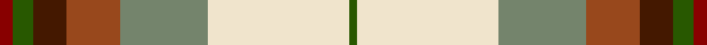
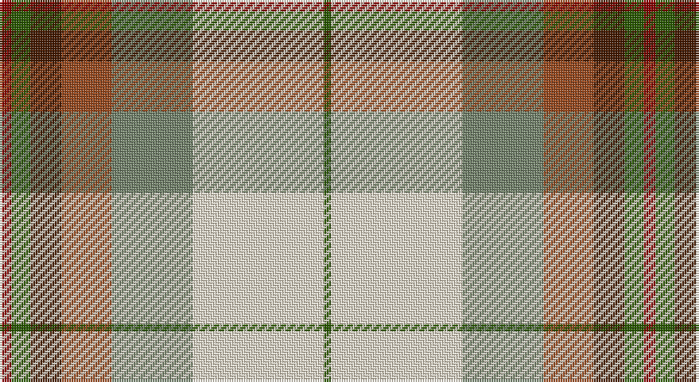

This page is one **sett** — a single exact thread-count. It belongs to the [tartan](/setts/r5dg8do13o21y34w55dg3/)
(the same proportion at any scale), whose colour order is pattern [GWGRBGR](/stripes/gwgrbgr/).

Sourced from tartans-authority.  It is a [7 stripe tartan](/stripes/stripes7/).

Original link http://www.tartansauthority.com/tartan-ferret/display/7886/

## Register references

External register numbers recorded for this tartan.

- Scottish Register of Tartans: [7886](https://www.tartanregister.gov.uk/tartanDetails?ref=7886)
- Scottish Tartans Authority (ITI): 7886

## Thread count
DRa/5 G8 DR13 T21 N34 W55 G/3

One full sett is **270 threads**.

## Palette

Palette: <strong>Tartan Register</strong> <small style="color:#888">(4 of 6 colours)</small>
<table><thead><tr><th>Colour</th><th>Threads</th><th>Shade</th><th>Base</th><th>OKLCh</th></tr></thead><tbody><tr><td>DRa/</td><td style="text-align:right;font-variant-numeric:tabular-nums">5</td><td><code style="background-color:#880000;">#880000</code> <small style="color:#888">#880000</small></td><td>R <code style="background-color:#CC0000;">#CC0000</code></td><td><small style="color:#888">oklch(39.4% 0.162 29.2)</small></td></tr><tr><td>G</td><td style="text-align:right;font-variant-numeric:tabular-nums">8</td><td><code style="background-color:#285800;">#285800</code> <small style="color:#888">#285800</small></td><td>G <code style="background-color:#006100;">#006100</code></td><td><small style="color:#888">oklch(41.0% 0.122 135.8)</small></td></tr><tr><td>DR</td><td style="text-align:right;font-variant-numeric:tabular-nums">13</td><td><code style="background-color:#441800;">#441800</code> <small style="color:#888">#441800</small></td><td>B <code style="background-color:#2A418A;">#2A418A</code></td><td><small style="color:#888">oklch(27.3% 0.076 46.3)</small></td></tr><tr><td>T</td><td style="text-align:right;font-variant-numeric:tabular-nums">21</td><td><code style="background-color:#98481C;">#98481C</code> <small style="color:#888">#98481C</small></td><td>R <code style="background-color:#CC0000;">#CC0000</code></td><td><small style="color:#888">oklch(49.6% 0.121 46.1)</small></td></tr><tr><td>N</td><td style="text-align:right;font-variant-numeric:tabular-nums">34</td><td><code style="background-color:#74846C;">#74846C</code> <small style="color:#888">#74846C</small></td><td>G <code style="background-color:#006100;">#006100</code></td><td><small style="color:#888">oklch(59.3% 0.040 135.2)</small></td></tr><tr><td>W</td><td style="text-align:right;font-variant-numeric:tabular-nums">55</td><td><code style="background-color:#F0E4CC;">#F0E4CC</code> <small style="color:#888">#F0E4CC</small></td><td>W <code style="background-color:#F7F7F7;">#F7F7F7</code></td><td><small style="color:#888">oklch(92.2% 0.034 84.6)</small></td></tr><tr><td>G/</td><td style="text-align:right;font-variant-numeric:tabular-nums">3</td><td><code style="background-color:#285800;">#285800</code> <small style="color:#888">#285800</small></td><td>G <code style="background-color:#006100;">#006100</code></td><td><small style="color:#888">oklch(41.0% 0.122 135.8)</small></td></tr></tbody></table>

# Sample pattern

## Nearest tartans

The nearest existing variants by ΔTartan distance, with this tartan at the top so the swatches line up against it.

ΔTartan

Tartan

Sett

—

<a href="/ttd/edit/#slug=r5dg8do13o21y34w55dg3">Canadian Shield (Personal)</a> <a class="nn-out" href="/variants/s7/r5dg8do13o21y34w55dg3/" title="open its dictionary page">↗</a>

0.88

<a href="/ttd/edit/#slug=lo13g8k5lb3w2r1~x4&amp;base=r5dg8do13o21y34w55dg3">Ball Hunting</a> <a class="nn-out" href="/variants/s6/lo13g8k5lb3w2r1~x4/" title="open its dictionary page">↗</a>

1.01

<a href="/ttd/edit/#slug=lo13b8r5k3w2g1~x4&amp;base=r5dg8do13o21y34w55dg3">Ball</a> <a class="nn-out" href="/variants/s6/lo13b8r5k3w2g1~x4/" title="open its dictionary page">↗</a>

1.21

<a href="/ttd/edit/#slug=r34w3gi4g23w24k3gi4~x2&amp;base=r5dg8do13o21y34w55dg3">MacLachlan Dress Clan Tartan</a> <a class="nn-out" href="/variants/s7/r34w3gi4g23w24k3gi4~x2/" title="open its dictionary page">↗</a>

1.25

<a href="/ttd/edit/#slug=r1w12g6r8t3ly1~x4&amp;base=r5dg8do13o21y34w55dg3">MacLean, dress</a> <a class="nn-out" href="/variants/s6/r1w12g6r8t3ly1~x4/" title="open its dictionary page">↗</a>

1.26

<a href="/ttd/edit/#slug=r34w3dg4g23w24k3dg4~x2&amp;base=r5dg8do13o21y34w55dg3">MacLachlan, dress</a> <a class="nn-out" href="/variants/s7/r34w3dg4g23w24k3dg4~x2/" title="open its dictionary page">↗</a>

1.27

<a href="/ttd/edit/#slug=m50ly4w16db2w4db2w15g27r4~x2&amp;base=r5dg8do13o21y34w55dg3">Rosevear</a> <a class="nn-out" href="/variants/s9/m50ly4w16db2w4db2w15g27r4~x2/" title="open its dictionary page">↗</a>

1.30

<a href="/ttd/edit/#slug=lb16dg5lo20o3dg3o3lo4g14lo2o2r1~x2&amp;base=r5dg8do13o21y34w55dg3">Bouguet, Adrian Dress (Personal)</a> <a class="nn-out" href="/variants/s11/lb16dg5lo20o3dg3o3lo4g14lo2o2r1~x2/" title="open its dictionary page">↗</a>

1.30

<a href="/ttd/edit/#slug=ly8r3b2db1w6g12db2~x2&amp;base=r5dg8do13o21y34w55dg3">Carmen Lau (Hong Kong) (Personal)</a> <a class="nn-out" href="/variants/s7/ly8r3b2db1w6g12db2~x2/" title="open its dictionary page">↗</a>

1.32

<a href="/ttd/edit/#slug=r1w12g6r8lb3lo1~x4&amp;base=r5dg8do13o21y34w55dg3">MacLean Dress (Lumsden)</a> <a class="nn-out" href="/variants/s6/r1w12g6r8lb3lo1~x4/" title="open its dictionary page">↗</a>

1.37

<a href="/ttd/edit/#slug=dp6t2w24r15g12t4w4t4w4t4g34ly4&amp;base=r5dg8do13o21y34w55dg3">Fredericton (District)</a> <a class="nn-out" href="/variants/s12/dp6t2w24r15g12t4w4t4w4t4g34ly4/" title="open its dictionary page">↗</a>

## Neighbour map

Every grey dot is one of 14360 variants placed by the first two principal components of the ΔTartan feature space (44% of its variance). Red is this tartan; blue dots are its nearest — click one to open its page.

<svg viewBox="0 0 640 380" role="img" style="max-width:100%;height:auto;border:1px solid #e0e0e0;border-radius:4px;display:block" xmlns="http://www.w3.org/2000/svg"><image href="/nn/cloud.v1.png" width="640" height="380"/><a href="/variants/s6/lo13g8k5lb3w2r1~x4/"><circle cx="140.7" cy="153.5" r="4" fill="#3465a4"><title>Ball Hunting</title></circle></a><a href="/variants/s6/lo13b8r5k3w2g1~x4/"><circle cx="150.2" cy="152.2" r="4" fill="#3465a4"><title>Ball</title></circle></a><a href="/variants/s7/r34w3gi4g23w24k3gi4~x2/"><circle cx="153.8" cy="156.0" r="4" fill="#3465a4"><title>MacLachlan Dress Clan Tartan</title></circle></a><a href="/variants/s6/r1w12g6r8t3ly1~x4/"><circle cx="157.9" cy="165.6" r="4" fill="#3465a4"><title>MacLean, dress</title></circle></a><a href="/variants/s7/r34w3dg4g23w24k3dg4~x2/"><circle cx="148.0" cy="151.7" r="4" fill="#3465a4"><title>MacLachlan, dress</title></circle></a><a href="/variants/s9/m50ly4w16db2w4db2w15g27r4~x2/"><circle cx="191.4" cy="85.8" r="4" fill="#3465a4"><title>Rosevear</title></circle></a><a href="/variants/s11/lb16dg5lo20o3dg3o3lo4g14lo2o2r1~x2/"><circle cx="153.6" cy="106.5" r="4" fill="#3465a4"><title>Bouguet, Adrian Dress (Personal)</title></circle></a><a href="/variants/s7/ly8r3b2db1w6g12db2~x2/"><circle cx="88.9" cy="145.2" r="4" fill="#3465a4"><title>Carmen Lau (Hong Kong) (Personal)</title></circle></a><a href="/variants/s6/r1w12g6r8lb3lo1~x4/"><circle cx="148.4" cy="159.7" r="4" fill="#3465a4"><title>MacLean Dress (Lumsden)</title></circle></a><a href="/variants/s12/dp6t2w24r15g12t4w4t4w4t4g34ly4/"><circle cx="136.4" cy="94.2" r="4" fill="#3465a4"><title>Fredericton (District)</title></circle></a><circle cx="152.5" cy="121.3" r="5" fill="#c00000"/></svg>

ID: /variants/s7/r5dg8do13o21y34w55dg3/
