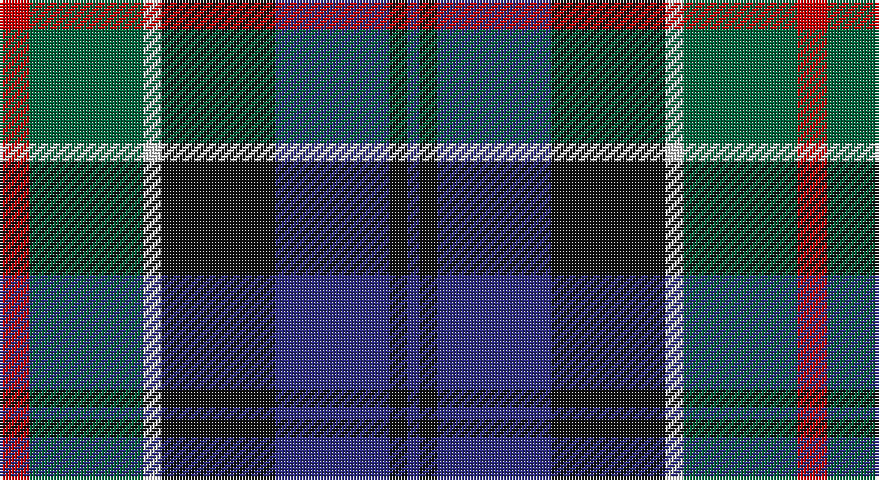

This page is one **sett** — a single exact thread-count. It belongs to the [tartan](/setts/r5g19w3k19db19k3db2/)
(the same proportion at any scale), whose colour order is pattern [BKBKWGR](/stripes/bkbkwgr/).

Part of the [Fruin Colquhoun](/tartans/fruin-colquhoun/) tartan — the named design grouping this sett with its other cloths.

Sourced from tartans-authority.  It is a [7 stripe tartan](/stripes/stripes7/).

Original link http://www.tartansauthority.com/tartan-ferret/display/4054/

## Register references

External register numbers recorded for this tartan.

- Scottish Tartans Authority (ITI): 4054

## Thread count
R/10 G38 LN6 K38 DB38 K6 DB/4

One full sett is **266 threads**.

## Palette

Palette: <strong>Tartan Register</strong>
<table><thead><tr><th>Colour</th><th>Threads</th><th>Shade</th><th>Base</th><th>OKLCh</th></tr></thead><tbody><tr><td>R/</td><td style="text-align:right;font-variant-numeric:tabular-nums">10</td><td><code style="background-color:#C80000;">#C80000</code> <small style="color:#888">#C80000</small></td><td>R <code style="background-color:#CC0000;">#CC0000</code></td><td><small style="color:#888">oklch(52.3% 0.215 29.2)</small></td></tr><tr><td>G</td><td style="text-align:right;font-variant-numeric:tabular-nums">38</td><td><code style="background-color:#00643C;">#00643C</code> <small style="color:#888">#00643C</small></td><td>G <code style="background-color:#006100;">#006100</code></td><td><small style="color:#888">oklch(44.3% 0.104 157.7)</small></td></tr><tr><td>LN</td><td style="text-align:right;font-variant-numeric:tabular-nums">6</td><td><code style="background-color:#E0E0E0;">#E0E0E0</code> <small style="color:#888">#E0E0E0</small></td><td>W <code style="background-color:#F7F7F7;">#F7F7F7</code></td><td><small style="color:#888">oklch(90.7% 0.000 89.9)</small></td></tr><tr><td>K</td><td style="text-align:right;font-variant-numeric:tabular-nums">38</td><td><code style="background-color:#101010;">#101010</code> <small style="color:#888">#101010</small></td><td>K <code style="background-color:#000000;">#000000</code></td><td><small style="color:#888">oklch(17.3% 0.000 89.9)</small></td></tr><tr><td>DB</td><td style="text-align:right;font-variant-numeric:tabular-nums">38</td><td><code style="background-color:#2C2C80;">#2C2C80</code> <small style="color:#888">#2C2C80</small></td><td>B <code style="background-color:#2A418A;">#2A418A</code></td><td><small style="color:#888">oklch(35.0% 0.138 276.6)</small></td></tr><tr><td>K</td><td style="text-align:right;font-variant-numeric:tabular-nums">6</td><td><code style="background-color:#101010;">#101010</code> <small style="color:#888">#101010</small></td><td>K <code style="background-color:#000000;">#000000</code></td><td><small style="color:#888">oklch(17.3% 0.000 89.9)</small></td></tr><tr><td>DB/</td><td style="text-align:right;font-variant-numeric:tabular-nums">4</td><td><code style="background-color:#2C2C80;">#2C2C80</code> <small style="color:#888">#2C2C80</small></td><td>B <code style="background-color:#2A418A;">#2A418A</code></td><td><small style="color:#888">oklch(35.0% 0.138 276.6)</small></td></tr></tbody></table>

# Sample pattern

## Compared to the master

This cloth is one sett of its design; the master sett (the exemplar the design is anchored on) is below for comparison.

<figure style="margin:0"><figcaption style="color:#888;font-size:smaller">this sett</figcaption></figure>
<figure style="margin:0"><figcaption style="color:#888;font-size:smaller"><a href="/setts/k19w3g19r5g19w3k19db19k3db2k3db19/">master sett →</a></figcaption></figure>

## Nearest tartans

The nearest existing variants by ΔTartan distance, with this tartan at the top so the swatches line up against it.

ΔTartan

Tartan

Sett

—

<a href="/ttd/edit/#slug=r5g19w3k19db19k3db2~x2">Fruin Colquhoun (Commemorative?)</a> <a class="nn-out" href="/variants/s7/r5g19w3k19db19k3db2~x2/" title="open its dictionary page">↗</a>

0.44

<a href="/ttd/edit/#slug=r3g16w2k16db16k2db2~x2&amp;base=r5g19w3k19db19k3db2~x2">Colquhoun Clan Tartan</a> <a class="nn-out" href="/variants/s7/r3g16w2k16db16k2db2~x2/" title="open its dictionary page">↗</a>

0.54

<a href="/ttd/edit/#slug=r2k1db8k8g8k1t2~x2&amp;base=r5g19w3k19db19k3db2~x2">Argyll</a> <a class="nn-out" href="/variants/s7/r2k1db8k8g8k1t2~x2/" title="open its dictionary page">↗</a>

0.54

<a href="/ttd/edit/#slug=r2k1db8k8g8k1t2~x4&amp;base=r5g19w3k19db19k3db2~x2">Campbell of Cawdor</a> <a class="nn-out" href="/variants/s7/r2k1db8k8g8k1t2~x4/" title="open its dictionary page">↗</a>

0.56

<a href="/ttd/edit/#slug=r2k1db8k8g8k1y2~x2&amp;base=r5g19w3k19db19k3db2~x2">Campbell of Cawdor Clan Tartan</a> <a class="nn-out" href="/variants/s7/r2k1db8k8g8k1y2~x2/" title="open its dictionary page">↗</a>

0.59

<a href="/ttd/edit/#slug=k2g17k16r2db17w2~x2&amp;base=r5g19w3k19db19k3db2~x2">Galbraith</a> <a class="nn-out" href="/variants/s6/k2g17k16r2db17w2~x2/" title="open its dictionary page">↗</a>

0.65

<a href="/ttd/edit/#slug=r3g2r6g20k15g3db18w2~x2&amp;base=r5g19w3k19db19k3db2~x2">Curry (Personal)</a> <a class="nn-out" href="/variants/s8/r3g2r6g20k15g3db18w2~x2/" title="open its dictionary page">↗</a>

0.67

<a href="/ttd/edit/#slug=dg17ly2k14r2db9r2db10~x2&amp;base=r5g19w3k19db19k3db2~x2">MacDonald (Flora.. )</a> <a class="nn-out" href="/variants/s7/dg17ly2k14r2db9r2db10~x2/" title="open its dictionary page">↗</a>

0.67

<a href="/ttd/edit/#slug=t4g14ly2k14db14k2db3~x2&amp;base=r5g19w3k19db19k3db2~x2">Hogarth of Firhill (Clan)</a> <a class="nn-out" href="/variants/s7/t4g14ly2k14db14k2db3~x2/" title="open its dictionary page">↗</a>

0.67

<a href="/ttd/edit/#slug=k2g17k16r2db17lr2~x2&amp;base=r5g19w3k19db19k3db2~x2">Mitchell (Clan)</a> <a class="nn-out" href="/variants/s6/k2g17k16r2db17lr2~x2/" title="open its dictionary page">↗</a>

0.68

<a href="/ttd/edit/#slug=db20k6o4db3k16g20w2~x2&amp;base=r5g19w3k19db19k3db2~x2">Deloughery, Paul</a> <a class="nn-out" href="/variants/s7/db20k6o4db3k16g20w2~x2/" title="open its dictionary page">↗</a>

## Neighbour map

Every grey dot is one of 14360 variants placed by the first two principal components of the ΔTartan feature space (44% of its variance). Red is this tartan; blue dots are its nearest — click one to open its page.

<svg viewBox="0 0 640 380" role="img" style="max-width:100%;height:auto;border:1px solid #e0e0e0;border-radius:4px;display:block" xmlns="http://www.w3.org/2000/svg"><image href="/nn/cloud.v1.png" width="640" height="380"/><a href="/variants/s7/r3g16w2k16db16k2db2~x2/"><circle cx="150.2" cy="206.9" r="4" fill="#3465a4"><title>Colquhoun Clan Tartan</title></circle></a><a href="/variants/s7/r2k1db8k8g8k1t2~x2/"><circle cx="151.0" cy="217.9" r="4" fill="#3465a4"><title>Argyll</title></circle></a><a href="/variants/s7/r2k1db8k8g8k1t2~x4/"><circle cx="151.0" cy="217.9" r="4" fill="#3465a4"><title>Campbell of Cawdor</title></circle></a><a href="/variants/s7/r2k1db8k8g8k1y2~x2/"><circle cx="149.5" cy="216.9" r="4" fill="#3465a4"><title>Campbell of Cawdor Clan Tartan</title></circle></a><a href="/variants/s6/k2g17k16r2db17w2~x2/"><circle cx="151.3" cy="214.4" r="4" fill="#3465a4"><title>Galbraith</title></circle></a><a href="/variants/s8/r3g2r6g20k15g3db18w2~x2/"><circle cx="163.4" cy="188.8" r="4" fill="#3465a4"><title>Curry (Personal)</title></circle></a><a href="/variants/s7/dg17ly2k14r2db9r2db10~x2/"><circle cx="160.9" cy="221.6" r="4" fill="#3465a4"><title>MacDonald (Flora.. )</title></circle></a><a href="/variants/s7/t4g14ly2k14db14k2db3~x2/"><circle cx="134.9" cy="222.1" r="4" fill="#3465a4"><title>Hogarth of Firhill (Clan)</title></circle></a><a href="/variants/s6/k2g17k16r2db17lr2~x2/"><circle cx="163.2" cy="222.5" r="4" fill="#3465a4"><title>Mitchell (Clan)</title></circle></a><a href="/variants/s7/db20k6o4db3k16g20w2~x2/"><circle cx="167.3" cy="216.9" r="4" fill="#3465a4"><title>Deloughery, Paul</title></circle></a><circle cx="148.1" cy="204.2" r="5" fill="#c00000"/></svg>

ID: /variants/s7/r5g19w3k19db19k3db2~x2/
