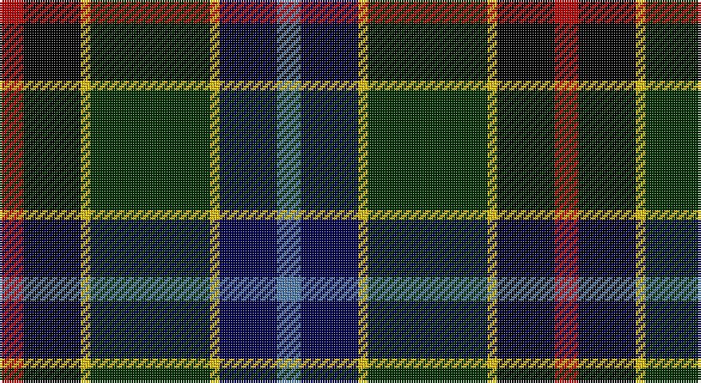

This page is one **sett** — a single exact thread-count. It belongs to the [tartan](/setts/r5k12ly2dg25ly2db12t5/)
(the same proportion at any scale), whose colour order is pattern [BBYGYKR](/stripes/bbygykr/).

Part of the [James](/tartans/james/) tartan — the named design grouping this sett with its other cloths.

Sourced from weddslist.  It is a [7 stripe tartan](/stripes/stripes7/).

Original link http://www.weddslist.com/cgi-bin/tartans/pg.pl?source=sts

## Thread count
R/10 K24 Y4 DG50 Y4 DB24 B/10

One full sett is **232 threads**.

## Palette

Palette: <strong>Ingles Buchan</strong> <small style="color:#888">(1 of 6 colours)</small>
<table><thead><tr><th>Colour</th><th>Threads</th><th>Shade</th><th>Base</th><th>OKLCh</th></tr></thead><tbody><tr><td>R/</td><td style="text-align:right;font-variant-numeric:tabular-nums">10</td><td><code style="background-color:#C00000;">#C00000</code> <small style="color:#888">#C00000</small></td><td>R <code style="background-color:#CC0000;">#CC0000</code></td><td><small style="color:#888">oklch(50.7% 0.208 29.2)</small></td></tr><tr><td>K</td><td style="text-align:right;font-variant-numeric:tabular-nums">24</td><td><code style="background-color:#000000;">#000000</code> <small style="color:#888">#000000</small></td><td>K <code style="background-color:#000000;">#000000</code></td><td><small style="color:#888">oklch(0.0% 0.000 0.0)</small></td></tr><tr><td>Y</td><td style="text-align:right;font-variant-numeric:tabular-nums">4</td><td><code style="background-color:#F0C000;">#F0C000</code> <small style="color:#888">#F0C000</small></td><td>Y <code style="background-color:#F2BF00;">#F2BF00</code></td><td><small style="color:#888">oklch(82.7% 0.169 90.5)</small></td></tr><tr><td>DG</td><td style="text-align:right;font-variant-numeric:tabular-nums">50</td><td><code style="background-color:#003000;">#003000</code> <small style="color:#888">#003000</small></td><td>G <code style="background-color:#006100;">#006100</code></td><td><small style="color:#888">oklch(26.8% 0.091 142.5)</small></td></tr><tr><td>Y</td><td style="text-align:right;font-variant-numeric:tabular-nums">4</td><td><code style="background-color:#F0C000;">#F0C000</code> <small style="color:#888">#F0C000</small></td><td>Y <code style="background-color:#F2BF00;">#F2BF00</code></td><td><small style="color:#888">oklch(82.7% 0.169 90.5)</small></td></tr><tr><td>DB</td><td style="text-align:right;font-variant-numeric:tabular-nums">24</td><td><code style="background-color:#000050;">#000050</code> <small style="color:#888">#000050</small></td><td>B <code style="background-color:#2A418A;">#2A418A</code></td><td><small style="color:#888">oklch(19.5% 0.135 264.1)</small></td></tr><tr><td>B/</td><td style="text-align:right;font-variant-numeric:tabular-nums">10</td><td><code style="background-color:#5480B0;">#5480B0</code> <small style="color:#888">#5480B0</small></td><td>B <code style="background-color:#2A418A;">#2A418A</code></td><td><small style="color:#888">oklch(58.8% 0.089 251.5)</small></td></tr></tbody></table>

# Sample pattern

## Compared to the master

This cloth is one sett of its design; the master sett (the exemplar the design is anchored on) is below for comparison.

<figure style="margin:0"><figcaption style="color:#888;font-size:smaller">this sett</figcaption></figure>
<figure style="margin:0"><figcaption style="color:#888;font-size:smaller"><a href="/setts/r2k6ly1dg12ly1db6lr2/">master sett →</a></figcaption></figure>

## Nearest tartans

The nearest existing variants by ΔTartan distance, with this tartan at the top so the swatches line up against it.

ΔTartan

Tartan

Sett

—

<a href="/ttd/edit/#slug=r5k12ly2dg25ly2db12t5~x2">James</a> <a class="nn-out" href="/variants/s7/r5k12ly2dg25ly2db12t5~x2/" title="open its dictionary page">↗</a>

0.81

<a href="/variants/s6/g36ly3dy5db18ki10k18~x2/">Dobson Name Tartan</a>

0.84

<a href="/ttd/edit/#slug=w5k26ly2dg24db8k4r3~x2&amp;base=r5k12ly2dg25ly2db12t5~x2">Cornish Htg (District)</a> <a class="nn-out" href="/variants/s7/w5k26ly2dg24db8k4r3~x2/" title="open its dictionary page">↗</a>

0.97

<a href="/ttd/edit/#slug=w5k26ly2dg24dt7k3r3~x2&amp;base=r5k12ly2dg25ly2db12t5~x2">Cornish Hunting District Tartan</a> <a class="nn-out" href="/variants/s7/w5k26ly2dg24dt7k3r3~x2/" title="open its dictionary page">↗</a>

0.98

<a href="/variants/s7/w5k26ly2dg24ki7k3r3~x2/">Cornish, hunting</a>

0.99

<a href="/ttd/edit/#slug=w1r2db16k14g15k3ly1~x2&amp;base=r5k12ly2dg25ly2db12t5~x2">MacNeil 7</a> <a class="nn-out" href="/variants/s7/w1r2db16k14g15k3ly1~x2/" title="open its dictionary page">↗</a>

1.02

<a href="/ttd/edit/#slug=r3w2dy10dg37k12db21w2~x2&amp;base=r5k12ly2dg25ly2db12t5~x2">Jones, The</a> <a class="nn-out" href="/variants/s7/r3w2dy10dg37k12db21w2~x2/" title="open its dictionary page">↗</a>

1.07

<a href="/ttd/edit/#slug=ly1k3dg15k14db16r2lb1~x2&amp;base=r5k12ly2dg25ly2db12t5~x2">MacNeil</a> <a class="nn-out" href="/variants/s7/ly1k3dg15k14db16r2lb1~x2/" title="open its dictionary page">↗</a>

1.08

<a href="/ttd/edit/#slug=r2k6ly1dg12ly1db6lr2~x4&amp;base=r5k12ly2dg25ly2db12t5~x2">James (Personal)</a> <a class="nn-out" href="/variants/s7/r2k6ly1dg12ly1db6lr2~x4/" title="open its dictionary page">↗</a>

1.12

<a href="/ttd/edit/#slug=w3dp22r3k22g22ly2~x2&amp;base=r5k12ly2dg25ly2db12t5~x2">Morris of Balgonie</a> <a class="nn-out" href="/variants/s6/w3dp22r3k22g22ly2~x2/" title="open its dictionary page">↗</a>

1.12

<a href="/ttd/edit/#slug=w10k52db52dg24ly10dg5r5&amp;base=r5k12ly2dg25ly2db12t5~x2">Harvey of Cornwall (Personal)</a> <a class="nn-out" href="/variants/s7/w10k52db52dg24ly10dg5r5/" title="open its dictionary page">↗</a>

## Neighbour map

Every grey dot is one of 14360 variants placed by the first two principal components of the ΔTartan feature space (44% of its variance). Red is this tartan; blue dots are its nearest — click one to open its page.

<svg viewBox="0 0 640 380" role="img" style="max-width:100%;height:auto;border:1px solid #e0e0e0;border-radius:4px;display:block" xmlns="http://www.w3.org/2000/svg"><image href="/nn/cloud.v1.png" width="640" height="380"/><a href="/variants/s6/g36ly3dy5db18ki10k18~x2/"><circle cx="148.6" cy="191.5" r="4" fill="#3465a4"><title>Dobson Name Tartan</title></circle></a><a href="/variants/s7/w5k26ly2dg24db8k4r3~x2/"><circle cx="165.7" cy="156.6" r="4" fill="#3465a4"><title>Cornish Htg (District)</title></circle></a><a href="/variants/s7/w5k26ly2dg24dt7k3r3~x2/"><circle cx="196.0" cy="164.1" r="4" fill="#3465a4"><title>Cornish Hunting District Tartan</title></circle></a><a href="/variants/s7/w5k26ly2dg24ki7k3r3~x2/"><circle cx="175.7" cy="156.8" r="4" fill="#3465a4"><title>Cornish, hunting</title></circle></a><a href="/variants/s7/w1r2db16k14g15k3ly1~x2/"><circle cx="134.8" cy="149.0" r="4" fill="#3465a4"><title>MacNeil 7</title></circle></a><a href="/variants/s7/r3w2dy10dg37k12db21w2~x2/"><circle cx="199.2" cy="154.6" r="4" fill="#3465a4"><title>Jones, The</title></circle></a><a href="/variants/s7/ly1k3dg15k14db16r2lb1~x2/"><circle cx="150.7" cy="161.3" r="4" fill="#3465a4"><title>MacNeil</title></circle></a><a href="/variants/s7/r2k6ly1dg12ly1db6lr2~x4/"><circle cx="163.3" cy="170.6" r="4" fill="#3465a4"><title>James (Personal)</title></circle></a><a href="/variants/s6/w3dp22r3k22g22ly2~x2/"><circle cx="101.0" cy="173.3" r="4" fill="#3465a4"><title>Morris of Balgonie</title></circle></a><a href="/variants/s7/w10k52db52dg24ly10dg5r5/"><circle cx="123.4" cy="168.4" r="4" fill="#3465a4"><title>Harvey of Cornwall (Personal)</title></circle></a><circle cx="143.2" cy="166.2" r="5" fill="#c00000"/></svg>

ID: /variants/s7/r5k12ly2dg25ly2db12t5~x2/
