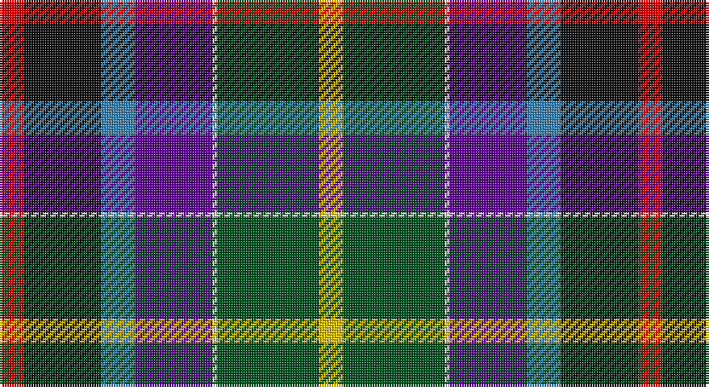

This page is one **sett** — a single exact thread-count. It belongs to the [tartan](/setts/r5k16t7dp16w1dg21ly5/)
(the same proportion at any scale), whose colour order is pattern [RKBBWGY](/stripes/rkbbwgy/).

Sourced from register-of-tartans.  It is a [7 stripe tartan](/stripes/stripes7/).

Original link https://www.tartanregister.gov.uk/tartanDetails.aspx?ref=1296

## Also known as

This cloth is also recorded under:

- Gallowater New

## Register references

External register numbers recorded for this tartan.

- Scottish Register of Tartans: [1296](https://www.tartanregister.gov.uk/tartanDetails.aspx?ref=1296)
- Scottish Tartans World Register: 1571

## Thread count
R/10 K32 B14 P32 LN2 G42 Y/10

One full sett is **264 threads**.

## Palette

Palette: <strong>Tartan Register</strong>
<table><thead><tr><th>Colour</th><th>Threads</th><th>Shade</th><th>Base</th><th>OKLCh</th></tr></thead><tbody><tr><td>R/</td><td style="text-align:right;font-variant-numeric:tabular-nums">10</td><td><code style="background-color:#DC0000;">#DC0000</code> <small style="color:#888">#DC0000</small></td><td>R <code style="background-color:#CC0000;">#CC0000</code></td><td><small style="color:#888">oklch(56.2% 0.230 29.2)</small></td></tr><tr><td>K</td><td style="text-align:right;font-variant-numeric:tabular-nums">32</td><td><code style="background-color:#101010;">#101010</code> <small style="color:#888">#101010</small></td><td>K <code style="background-color:#000000;">#000000</code></td><td><small style="color:#888">oklch(17.3% 0.000 89.9)</small></td></tr><tr><td>B</td><td style="text-align:right;font-variant-numeric:tabular-nums">14</td><td><code style="background-color:#3C82AF;">#3C82AF</code> <small style="color:#888">#3C82AF</small></td><td>B <code style="background-color:#2A418A;">#2A418A</code></td><td><small style="color:#888">oklch(58.1% 0.099 239.8)</small></td></tr><tr><td>P</td><td style="text-align:right;font-variant-numeric:tabular-nums">32</td><td><code style="background-color:#5A008C;">#5A008C</code> <small style="color:#888">#5A008C</small></td><td>B <code style="background-color:#2A418A;">#2A418A</code></td><td><small style="color:#888">oklch(37.0% 0.191 306.3)</small></td></tr><tr><td>LN</td><td style="text-align:right;font-variant-numeric:tabular-nums">2</td><td><code style="background-color:#E0E0E0;">#E0E0E0</code> <small style="color:#888">#E0E0E0</small></td><td>W <code style="background-color:#F7F7F7;">#F7F7F7</code></td><td><small style="color:#888">oklch(90.7% 0.000 89.9)</small></td></tr><tr><td>G</td><td style="text-align:right;font-variant-numeric:tabular-nums">42</td><td><code style="background-color:#005020;">#005020</code> <small style="color:#888">#005020</small></td><td>G <code style="background-color:#006100;">#006100</code></td><td><small style="color:#888">oklch(37.7% 0.105 149.6)</small></td></tr><tr><td>Y/</td><td style="text-align:right;font-variant-numeric:tabular-nums">10</td><td><code style="background-color:#E8C000;">#E8C000</code> <small style="color:#888">#E8C000</small></td><td>Y <code style="background-color:#F2BF00;">#F2BF00</code></td><td><small style="color:#888">oklch(81.9% 0.168 93.7)</small></td></tr></tbody></table>

# Sample pattern

## Nearest tartans

The nearest existing variants by ΔTartan distance, with this tartan at the top so the swatches line up against it.

ΔTartan

Tartan

Sett

—

<a href="/ttd/edit/#slug=r5k16t7dp16w1dg21ly5~x2">Gala Water New</a> <a class="nn-out" href="/variants/s7/r5k16t7dp16w1dg21ly5~x2/" title="open its dictionary page">↗</a>

0.55

<a href="/ttd/edit/#slug=r5k16t7dp16w1g21ly5~x2&amp;base=r5k16t7dp16w1dg21ly5~x2">Gallowater New District Tartan</a> <a class="nn-out" href="/variants/s7/r5k16t7dp16w1g21ly5~x2/" title="open its dictionary page">↗</a>

0.71

<a href="/ttd/edit/#slug=r11k33t14dp32w2g42ly10&amp;base=r5k16t7dp16w1dg21ly5~x2">Gallowater, New (District)</a> <a class="nn-out" href="/variants/s7/r11k33t14dp32w2g42ly10/" title="open its dictionary page">↗</a>

0.96

<a href="/ttd/edit/#slug=r5k16t7p16w1g21ly5~x2&amp;base=r5k16t7dp16w1dg21ly5~x2">Gallowater, New</a> <a class="nn-out" href="/variants/s7/r5k16t7p16w1g21ly5~x2/" title="open its dictionary page">↗</a>

1.21

<a href="/ttd/edit/#slug=k2t6k1db7dg13w1k11r14ly2~x2&amp;base=r5k16t7dp16w1dg21ly5~x2">Teall of Teallach</a> <a class="nn-out" href="/variants/s9/k2t6k1db7dg13w1k11r14ly2~x2/" title="open its dictionary page">↗</a>

1.22

<a href="/ttd/edit/#slug=k3dbi3g15db15m5lo3ly2m1~x2&amp;base=r5k16t7dp16w1dg21ly5~x2">Young Family Tartan</a> <a class="nn-out" href="/variants/s8/k3dbi3g15db15m5lo3ly2m1~x2/" title="open its dictionary page">↗</a>

1.25

<a href="/ttd/edit/#slug=k2t6k1db7g13w1k11r14ly2~x2&amp;base=r5k16t7dp16w1dg21ly5~x2">Teall of Teallach (Personal)</a> <a class="nn-out" href="/variants/s9/k2t6k1db7g13w1k11r14ly2~x2/" title="open its dictionary page">↗</a>

1.27

<a href="/ttd/edit/#slug=k3db3g15dbi15dp5o3y2dp1~x2&amp;base=r5k16t7dp16w1dg21ly5~x2">Young</a> <a class="nn-out" href="/variants/s8/k3db3g15dbi15dp5o3y2dp1~x2/" title="open its dictionary page">↗</a>

1.28

<a href="/ttd/edit/#slug=r4ly3g12k16dy5db20k4w2~x2&amp;base=r5k16t7dp16w1dg21ly5~x2">Iowa (District)</a> <a class="nn-out" href="/variants/s8/r4ly3g12k16dy5db20k4w2~x2/" title="open its dictionary page">↗</a>

1.34

<a href="/ttd/edit/#slug=k40n15o10ly3t5w5db10t20&amp;base=r5k16t7dp16w1dg21ly5~x2">Julien Pigeut Tartan</a> <a class="nn-out" href="/variants/s8/k40n15o10ly3t5w5db10t20/" title="open its dictionary page">↗</a>

1.36

<a href="/ttd/edit/#slug=k7r22t9dp20lb2g28ly7~x2&amp;base=r5k16t7dp16w1dg21ly5~x2">Jefferson (Personal)</a> <a class="nn-out" href="/variants/s7/k7r22t9dp20lb2g28ly7~x2/" title="open its dictionary page">↗</a>

## Neighbour map

Every grey dot is one of 14360 variants placed by the first two principal components of the ΔTartan feature space (44% of its variance). Red is this tartan; blue dots are its nearest — click one to open its page.

<svg viewBox="0 0 640 380" role="img" style="max-width:100%;height:auto;border:1px solid #e0e0e0;border-radius:4px;display:block" xmlns="http://www.w3.org/2000/svg"><image href="/nn/cloud.v1.png" width="640" height="380"/><a href="/variants/s7/r5k16t7dp16w1g21ly5~x2/"><circle cx="87.9" cy="135.9" r="4" fill="#3465a4"><title>Gallowater New District Tartan</title></circle></a><a href="/variants/s7/r11k33t14dp32w2g42ly10/"><circle cx="76.7" cy="133.6" r="4" fill="#3465a4"><title>Gallowater, New (District)</title></circle></a><a href="/variants/s7/r5k16t7p16w1g21ly5~x2/"><circle cx="67.6" cy="127.0" r="4" fill="#3465a4"><title>Gallowater, New</title></circle></a><a href="/variants/s9/k2t6k1db7dg13w1k11r14ly2~x2/"><circle cx="61.9" cy="129.6" r="4" fill="#3465a4"><title>Teall of Teallach</title></circle></a><a href="/variants/s8/k3dbi3g15db15m5lo3ly2m1~x2/"><circle cx="118.4" cy="132.8" r="4" fill="#3465a4"><title>Young Family Tartan</title></circle></a><a href="/variants/s9/k2t6k1db7g13w1k11r14ly2~x2/"><circle cx="60.9" cy="129.6" r="4" fill="#3465a4"><title>Teall of Teallach (Personal)</title></circle></a><a href="/variants/s8/k3db3g15dbi15dp5o3y2dp1~x2/"><circle cx="102.3" cy="128.1" r="4" fill="#3465a4"><title>Young</title></circle></a><a href="/variants/s8/r4ly3g12k16dy5db20k4w2~x2/"><circle cx="81.8" cy="157.7" r="4" fill="#3465a4"><title>Iowa (District)</title></circle></a><a href="/variants/s8/k40n15o10ly3t5w5db10t20/"><circle cx="108.2" cy="136.6" r="4" fill="#3465a4"><title>Julien Pigeut Tartan</title></circle></a><a href="/variants/s7/k7r22t9dp20lb2g28ly7~x2/"><circle cx="74.3" cy="148.8" r="4" fill="#3465a4"><title>Jefferson (Personal)</title></circle></a><circle cx="89.8" cy="140.0" r="5" fill="#c00000"/></svg>

ID: /variants/s7/r5k16t7dp16w1dg21ly5~x2/
