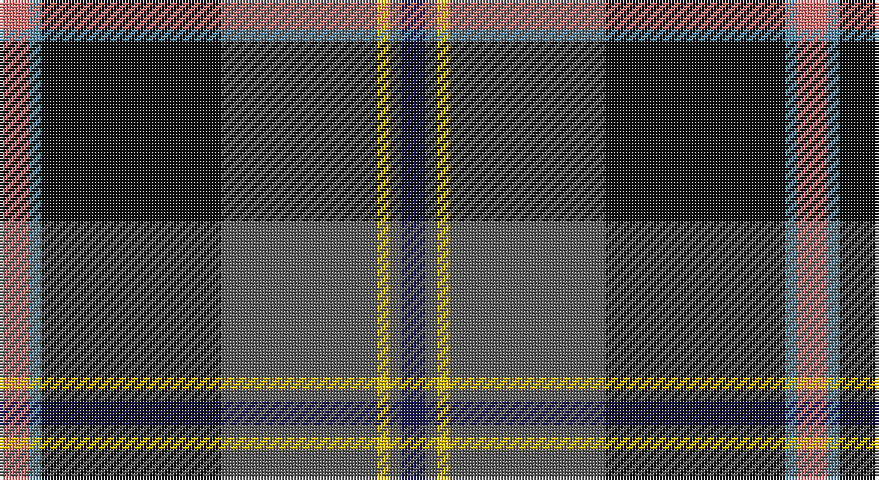

This page is one **sett** — a single exact thread-count. It belongs to the [tartan](/setts/r5t2k30n26ly2n2db4/)
(the same proportion at any scale), whose colour order is pattern [BBYBKBR](/stripes/bbybkbr/).

Sourced from tartans-authority.  It is a [7 stripe tartan](/stripes/stripes7/).

Original link http://www.tartansauthority.com/tartan-ferret/display/10066/

## Register references

External register numbers recorded for this tartan.

- Scottish Register of Tartans: [10066](https://www.tartanregister.gov.uk/tartanDetails?ref=10066)
- Scottish Tartans Authority (ITI): 10066

## Thread count
LR/10 B4 K60 N52 Y4 N4 DB/8

One full sett is **266 threads**.

## Palette

Palette: <strong>Tartan Register</strong> <small style="color:#888">(5 of 6 colours)</small>
<table><thead><tr><th>Colour</th><th>Threads</th><th>Shade</th><th>Base</th><th>OKLCh</th></tr></thead><tbody><tr><td>LR/</td><td style="text-align:right;font-variant-numeric:tabular-nums">10</td><td><code style="background-color:#E87878;">#E87878</code> <small style="color:#888">#E87878</small></td><td>R <code style="background-color:#CC0000;">#CC0000</code></td><td><small style="color:#888">oklch(70.0% 0.139 21.2)</small></td></tr><tr><td>B</td><td style="text-align:right;font-variant-numeric:tabular-nums">4</td><td><code style="background-color:#5C8CA8;">#5C8CA8</code> <small style="color:#888">#5C8CA8</small></td><td>B <code style="background-color:#2A418A;">#2A418A</code></td><td><small style="color:#888">oklch(61.7% 0.067 235.0)</small></td></tr><tr><td>K</td><td style="text-align:right;font-variant-numeric:tabular-nums">60</td><td><code style="background-color:#101010;">#101010</code> <small style="color:#888">#101010</small></td><td>K <code style="background-color:#000000;">#000000</code></td><td><small style="color:#888">oklch(17.3% 0.000 89.9)</small></td></tr><tr><td>N</td><td style="text-align:right;font-variant-numeric:tabular-nums">52</td><td><code style="background-color:#5C5C5C;">#5C5C5C</code> <small style="color:#888">#5C5C5C</small></td><td>B <code style="background-color:#2A418A;">#2A418A</code></td><td><small style="color:#888">oklch(47.5% 0.000 89.9)</small></td></tr><tr><td>Y</td><td style="text-align:right;font-variant-numeric:tabular-nums">4</td><td><code style="background-color:#E8C000;">#E8C000</code> <small style="color:#888">#E8C000</small></td><td>Y <code style="background-color:#F2BF00;">#F2BF00</code></td><td><small style="color:#888">oklch(81.9% 0.168 93.7)</small></td></tr><tr><td>N</td><td style="text-align:right;font-variant-numeric:tabular-nums">4</td><td><code style="background-color:#5C5C5C;">#5C5C5C</code> <small style="color:#888">#5C5C5C</small></td><td>B <code style="background-color:#2A418A;">#2A418A</code></td><td><small style="color:#888">oklch(47.5% 0.000 89.9)</small></td></tr><tr><td>DB/</td><td style="text-align:right;font-variant-numeric:tabular-nums">8</td><td><code style="background-color:#1C1C50;">#1C1C50</code> <small style="color:#888">#1C1C50</small></td><td>B <code style="background-color:#2A418A;">#2A418A</code></td><td><small style="color:#888">oklch(26.2% 0.093 277.9)</small></td></tr></tbody></table>

# Sample pattern

## Nearest tartans

The nearest existing variants by ΔTartan distance, with this tartan at the top so the swatches line up against it.

ΔTartan

Tartan

Sett

—

<a href="/ttd/edit/#slug=r5t2k30n26ly2n2db4~x2">Milne-Murtaugh (Personal)</a> <a class="nn-out" href="/variants/s7/r5t2k30n26ly2n2db4~x2/" title="open its dictionary page">↗</a>

0.30

<a href="/variants/s7/m5yii2k30yi26y2yi2ki4~x2/">Milne-Murtagh (2009)</a>

0.60

<a href="/ttd/edit/#slug=o11k66y32dg11y10db6y10r4&amp;base=r5t2k30n26ly2n2db4~x2">Turnbull, Dress Bruce (Personal)</a> <a class="nn-out" href="/variants/s8/o11k66y32dg11y10db6y10r4/" title="open its dictionary page">↗</a>

0.85

<a href="/ttd/edit/#slug=db46ly4db4ly4db6k16n66lb11r6&amp;base=r5t2k30n26ly2n2db4~x2">Scottish Association for Neurological Sciences</a> <a class="nn-out" href="/variants/s9/db46ly4db4ly4db6k16n66lb11r6/" title="open its dictionary page">↗</a>

0.96

<a href="/ttd/edit/#slug=lo11k66o32dg11o10db6o10loi4&amp;base=r5t2k30n26ly2n2db4~x2">Royal College of General Practitioners</a> <a class="nn-out" href="/variants/s8/lo11k66o32dg11o10db6o10loi4/" title="open its dictionary page">↗</a>

0.99

<a href="/ttd/edit/#slug=r3w6r2dg32db36k2db4lo2~x2&amp;base=r5t2k30n26ly2n2db4~x2">Canadian Centennial</a> <a class="nn-out" href="/variants/s8/r3w6r2dg32db36k2db4lo2~x2/" title="open its dictionary page">↗</a>

1.01

<a href="/ttd/edit/#slug=w5k26ly2dg24dt7k3r3~x2&amp;base=r5t2k30n26ly2n2db4~x2">Cornish Hunting District Tartan</a> <a class="nn-out" href="/variants/s7/w5k26ly2dg24dt7k3r3~x2/" title="open its dictionary page">↗</a>

1.04

<a href="/ttd/edit/#slug=lo2dg20db8dp3db2dp2db16w1lg2~x2&amp;base=r5t2k30n26ly2n2db4~x2">Scotland’s Golf Coast</a> <a class="nn-out" href="/variants/s9/lo2dg20db8dp3db2dp2db16w1lg2~x2/" title="open its dictionary page">↗</a>

1.05

<a href="/ttd/edit/#slug=w4dt38g6dr2g6dr36lo2dr3~x2&amp;base=r5t2k30n26ly2n2db4~x2">Scotland 2000</a> <a class="nn-out" href="/variants/s8/w4dt38g6dr2g6dr36lo2dr3~x2/" title="open its dictionary page">↗</a>

1.09

<a href="/ttd/edit/#slug=lo3k2o15k10dt23r2dt1w2~x2&amp;base=r5t2k30n26ly2n2db4~x2">Vienna Highlander (Fashion)</a> <a class="nn-out" href="/variants/s8/lo3k2o15k10dt23r2dt1w2~x2/" title="open its dictionary page">↗</a>

1.11

<a href="/ttd/edit/#slug=ly4g22r3k17r3db37w3~x2&amp;base=r5t2k30n26ly2n2db4~x2">Souza Nery (Personal)</a> <a class="nn-out" href="/variants/s7/ly4g22r3k17r3db37w3~x2/" title="open its dictionary page">↗</a>

## Neighbour map

Every grey dot is one of 14360 variants placed by the first two principal components of the ΔTartan feature space (44% of its variance). Red is this tartan; blue dots are its nearest — click one to open its page.

<svg viewBox="0 0 640 380" role="img" style="max-width:100%;height:auto;border:1px solid #e0e0e0;border-radius:4px;display:block" xmlns="http://www.w3.org/2000/svg"><image href="/nn/cloud.v1.png" width="640" height="380"/><a href="/variants/s7/m5yii2k30yi26y2yi2ki4~x2/"><circle cx="243.1" cy="148.9" r="4" fill="#3465a4"><title>Milne-Murtagh (2009)</title></circle></a><a href="/variants/s8/o11k66y32dg11y10db6y10r4/"><circle cx="218.5" cy="134.3" r="4" fill="#3465a4"><title>Turnbull, Dress Bruce (Personal)</title></circle></a><a href="/variants/s9/db46ly4db4ly4db6k16n66lb11r6/"><circle cx="215.7" cy="128.5" r="4" fill="#3465a4"><title>Scottish Association for Neurological Sciences</title></circle></a><a href="/variants/s8/lo11k66o32dg11o10db6o10loi4/"><circle cx="205.6" cy="127.1" r="4" fill="#3465a4"><title>Royal College of General Practitioners</title></circle></a><a href="/variants/s8/r3w6r2dg32db36k2db4lo2~x2/"><circle cx="263.3" cy="133.1" r="4" fill="#3465a4"><title>Canadian Centennial</title></circle></a><a href="/variants/s7/w5k26ly2dg24dt7k3r3~x2/"><circle cx="196.0" cy="164.1" r="4" fill="#3465a4"><title>Cornish Hunting District Tartan</title></circle></a><a href="/variants/s9/lo2dg20db8dp3db2dp2db16w1lg2~x2/"><circle cx="258.4" cy="136.2" r="4" fill="#3465a4"><title>Scotland’s Golf Coast</title></circle></a><a href="/variants/s8/w4dt38g6dr2g6dr36lo2dr3~x2/"><circle cx="274.2" cy="147.9" r="4" fill="#3465a4"><title>Scotland 2000</title></circle></a><a href="/variants/s8/lo3k2o15k10dt23r2dt1w2~x2/"><circle cx="201.4" cy="119.9" r="4" fill="#3465a4"><title>Vienna Highlander (Fashion)</title></circle></a><a href="/variants/s7/ly4g22r3k17r3db37w3~x2/"><circle cx="176.0" cy="156.3" r="4" fill="#3465a4"><title>Souza Nery (Personal)</title></circle></a><circle cx="235.0" cy="144.9" r="5" fill="#c00000"/></svg>

ID: /variants/s7/r5t2k30n26ly2n2db4~x2/
