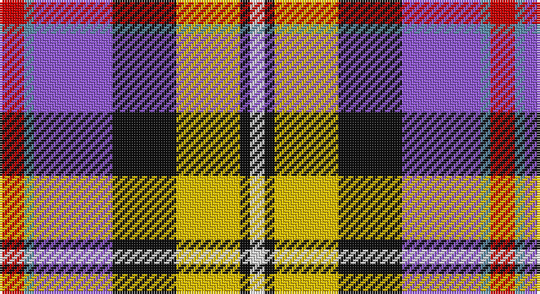

This page is one **sett** — a single exact thread-count. It belongs to the [tartan](/setts/r5t2p16k13ly13k2w3/)
(the same proportion at any scale), whose colour order is pattern [RBBKYKW](/stripes/rbbkykw/).

Sourced from register-of-tartans.  It is a [7 stripe tartan](/stripes/stripes7/).

Original link https://www.tartanregister.gov.uk/tartanDetails.aspx?ref=588

2 attestations — the source records this cloth was collapsed from (oldest owns this page)

<ul>
<li>01/01/2002 — Casey (Personal) (register-of-tartans, <a href="https://www.tartanregister.gov.uk/tartanDetails.aspx?ref=588">record</a>)</li>
<li>2002 — Casey (Personal) (tartans-authority, <a href="http://www.tartansauthority.com/tartan-ferret/display/6914/">record</a>)</li>
</ul>

## Register references

External register numbers recorded for this tartan.

- Scottish Register of Tartans: [588](https://www.tartanregister.gov.uk/tartanDetails.aspx?ref=588)
- Scottish Tartans Authority (ITI): 6914

## Thread count
R/10 B4 P32 K26 Y26 K4 LN/6

One full sett is **200 threads**.

## Palette

Palette: <strong>Tartan Register</strong>
<table><thead><tr><th>Colour</th><th>Threads</th><th>Shade</th><th>Base</th><th>OKLCh</th></tr></thead><tbody><tr><td>R/</td><td style="text-align:right;font-variant-numeric:tabular-nums">10</td><td><code style="background-color:#C80000;">#C80000</code> <small style="color:#888">#C80000</small></td><td>R <code style="background-color:#CC0000;">#CC0000</code></td><td><small style="color:#888">oklch(52.3% 0.215 29.2)</small></td></tr><tr><td>B</td><td style="text-align:right;font-variant-numeric:tabular-nums">4</td><td><code style="background-color:#5C8CA8;">#5C8CA8</code> <small style="color:#888">#5C8CA8</small></td><td>B <code style="background-color:#2A418A;">#2A418A</code></td><td><small style="color:#888">oklch(61.7% 0.067 235.0)</small></td></tr><tr><td>P</td><td style="text-align:right;font-variant-numeric:tabular-nums">32</td><td><code style="background-color:#9058D8;">#9058D8</code> <small style="color:#888">#9058D8</small></td><td>B <code style="background-color:#2A418A;">#2A418A</code></td><td><small style="color:#888">oklch(58.4% 0.190 300.8)</small></td></tr><tr><td>K</td><td style="text-align:right;font-variant-numeric:tabular-nums">26</td><td><code style="background-color:#101010;">#101010</code> <small style="color:#888">#101010</small></td><td>K <code style="background-color:#000000;">#000000</code></td><td><small style="color:#888">oklch(17.3% 0.000 89.9)</small></td></tr><tr><td>Y</td><td style="text-align:right;font-variant-numeric:tabular-nums">26</td><td><code style="background-color:#E8C000;">#E8C000</code> <small style="color:#888">#E8C000</small></td><td>Y <code style="background-color:#F2BF00;">#F2BF00</code></td><td><small style="color:#888">oklch(81.9% 0.168 93.7)</small></td></tr><tr><td>K</td><td style="text-align:right;font-variant-numeric:tabular-nums">4</td><td><code style="background-color:#101010;">#101010</code> <small style="color:#888">#101010</small></td><td>K <code style="background-color:#000000;">#000000</code></td><td><small style="color:#888">oklch(17.3% 0.000 89.9)</small></td></tr><tr><td>LN/</td><td style="text-align:right;font-variant-numeric:tabular-nums">6</td><td><code style="background-color:#E0E0E0;">#E0E0E0</code> <small style="color:#888">#E0E0E0</small></td><td>W <code style="background-color:#F7F7F7;">#F7F7F7</code></td><td><small style="color:#888">oklch(90.7% 0.000 89.9)</small></td></tr></tbody></table>

# Sample pattern

## Nearest tartans

The nearest existing variants by ΔTartan distance, with this tartan at the top so the swatches line up against it.

ΔTartan

Tartan

Sett

—

<a href="/ttd/edit/#slug=r5t2p16k13ly13k2w3~x2">Casey (Personal)</a> <a class="nn-out" href="/variants/s7/r5t2p16k13ly13k2w3~x2/" title="open its dictionary page">↗</a>

0.76

<a href="/ttd/edit/#slug=r6t3m20ly2k20w20k2w5~x2&amp;base=r5t2p16k13ly13k2w3~x2">Humming Bird (Fashion)</a> <a class="nn-out" href="/variants/s8/r6t3m20ly2k20w20k2w5~x2/" title="open its dictionary page">↗</a>

0.84

<a href="/ttd/edit/#slug=r4o2b15ly2k14w14k2w4~x2&amp;base=r5t2p16k13ly13k2w3~x2">Culloden, Stirling</a> <a class="nn-out" href="/variants/s8/r4o2b15ly2k14w14k2w4~x2/" title="open its dictionary page">↗</a>

1.05

<a href="/ttd/edit/#slug=r6t3dp24ly2k23w23k2w6~x2&amp;base=r5t2p16k13ly13k2w3~x2">Culloden Dress</a> <a class="nn-out" href="/variants/s8/r6t3dp24ly2k23w23k2w6~x2/" title="open its dictionary page">↗</a>

1.13

<a href="/ttd/edit/#slug=w6gi10r22db16g2k4k5~x2&amp;base=r5t2p16k13ly13k2w3~x2">Nicolson of Taransay (Personal)</a> <a class="nn-out" href="/variants/s7/w6gi10r22db16g2k4k5~x2/" title="open its dictionary page">↗</a>

1.14

<a href="/ttd/edit/#slug=w4dbi8w1db1lo6db3r6db1w4~x2&amp;base=r5t2p16k13ly13k2w3~x2">Womble</a> <a class="nn-out" href="/variants/s9/w4dbi8w1db1lo6db3r6db1w4~x2/" title="open its dictionary page">↗</a>

1.14

<a href="/ttd/edit/#slug=w4dbi8w1db1r6db3lo6db1w4~x2&amp;base=r5t2p16k13ly13k2w3~x2">Womble</a> <a class="nn-out" href="/variants/s9/w4dbi8w1db1r6db3lo6db1w4~x2/" title="open its dictionary page">↗</a>

1.14

<a href="/ttd/edit/#slug=w4dbi8w1lo1db6lo3r6lo1w4~x2&amp;base=r5t2p16k13ly13k2w3~x2">Womble</a> <a class="nn-out" href="/variants/s9/w4dbi8w1lo1db6lo3r6lo1w4~x2/" title="open its dictionary page">↗</a>

1.15

<a href="/ttd/edit/#slug=w5k26ly4lb24dp8k3r4~x2&amp;base=r5t2p16k13ly13k2w3~x2">Pengelly, The Cornish</a> <a class="nn-out" href="/variants/s7/w5k26ly4lb24dp8k3r4~x2/" title="open its dictionary page">↗</a>

1.15

<a href="/ttd/edit/#slug=dt36lo5ri12r9dp5w12lo7~x2&amp;base=r5t2p16k13ly13k2w3~x2">Galvez-Brown (Personal)</a> <a class="nn-out" href="/variants/s7/dt36lo5ri12r9dp5w12lo7~x2/" title="open its dictionary page">↗</a>

1.16

<a href="/ttd/edit/#slug=db36ly5r12ri9dp5w12ly7~x2&amp;base=r5t2p16k13ly13k2w3~x2">Galvez-Brown</a> <a class="nn-out" href="/variants/s7/db36ly5r12ri9dp5w12ly7~x2/" title="open its dictionary page">↗</a>

## Neighbour map

Every grey dot is one of 14360 variants placed by the first two principal components of the ΔTartan feature space (44% of its variance). Red is this tartan; blue dots are its nearest — click one to open its page.

<svg viewBox="0 0 640 380" role="img" style="max-width:100%;height:auto;border:1px solid #e0e0e0;border-radius:4px;display:block" xmlns="http://www.w3.org/2000/svg"><image href="/nn/cloud.v1.png" width="640" height="380"/><a href="/variants/s8/r6t3m20ly2k20w20k2w5~x2/"><circle cx="90.2" cy="134.3" r="4" fill="#3465a4"><title>Humming Bird (Fashion)</title></circle></a><a href="/variants/s8/r4o2b15ly2k14w14k2w4~x2/"><circle cx="61.4" cy="149.4" r="4" fill="#3465a4"><title>Culloden, Stirling</title></circle></a><a href="/variants/s8/r6t3dp24ly2k23w23k2w6~x2/"><circle cx="96.7" cy="123.4" r="4" fill="#3465a4"><title>Culloden Dress</title></circle></a><a href="/variants/s7/w6gi10r22db16g2k4k5~x2/"><circle cx="104.3" cy="161.2" r="4" fill="#3465a4"><title>Nicolson of Taransay (Personal)</title></circle></a><a href="/variants/s9/w4dbi8w1db1lo6db3r6db1w4~x2/"><circle cx="42.5" cy="170.5" r="4" fill="#3465a4"><title>Womble</title></circle></a><a href="/variants/s9/w4dbi8w1db1r6db3lo6db1w4~x2/"><circle cx="42.5" cy="170.5" r="4" fill="#3465a4"><title>Womble</title></circle></a><a href="/variants/s9/w4dbi8w1lo1db6lo3r6lo1w4~x2/"><circle cx="42.6" cy="172.0" r="4" fill="#3465a4"><title>Womble</title></circle></a><a href="/variants/s7/w5k26ly4lb24dp8k3r4~x2/"><circle cx="117.9" cy="147.7" r="4" fill="#3465a4"><title>Pengelly, The Cornish</title></circle></a><a href="/variants/s7/dt36lo5ri12r9dp5w12lo7~x2/"><circle cx="119.6" cy="164.5" r="4" fill="#3465a4"><title>Galvez-Brown (Personal)</title></circle></a><a href="/variants/s7/db36ly5r12ri9dp5w12ly7~x2/"><circle cx="110.5" cy="151.7" r="4" fill="#3465a4"><title>Galvez-Brown</title></circle></a><circle cx="62.0" cy="160.3" r="5" fill="#c00000"/></svg>

ID: /variants/s7/r5t2p16k13ly13k2w3~x2/
