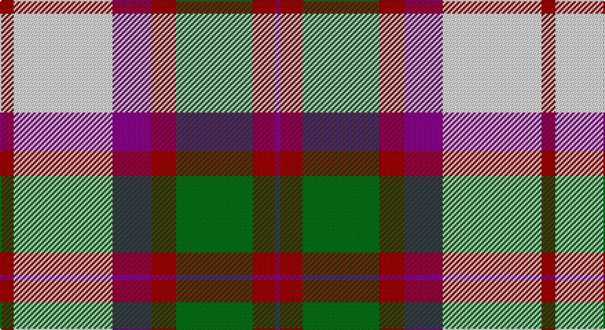

This page is one **sett** — a single exact thread-count. It belongs to the [tartan](/setts/r5w36dp14r9g28r8dp2/)
(the same proportion at any scale), whose colour order is pattern [BRGRBWR](/stripes/brgrbwr/).

Part of the [MacKintosh](/tartans/mackintosh/) tartan — the named design grouping this sett with its other cloths.

Sourced from register-of-tartans.  It is a [7 stripe tartan](/stripes/stripes7/).

Original link https://www.tartanregister.gov.uk/tartanDetails.aspx?ref=2568

## Also known as

This cloth is also recorded under:

- MacKintosh #4
- MacKintosh #5
- MacKintosh #6
- MacKintosh #8
- MacKintosh 4
- MacKintosh 7
- MacKintosh Plaid
- MacKintosh, Arisaid
- MacKintosh, Plaid
- MacKintosh, Red
- MacKintosh, Red Clan/Family
- Mackintosh #7

## Register references

External register numbers recorded for this tartan.

- Scottish Register of Tartans: [2568](https://www.tartanregister.gov.uk/tartanDetails.aspx?ref=2568)
- Scottish Tartans Authority (ITI): 537
- Scottish Tartans World Register: 537

## Thread count
DR/10 LN72 P28 DR18 G56 DR16 P/4

One full sett is **394 threads**.

## Palette

Palette: <strong>Tartan Register</strong>
<table><thead><tr><th>Colour</th><th>Threads</th><th>Shade</th><th>Base</th><th>OKLCh</th></tr></thead><tbody><tr><td>DR/</td><td style="text-align:right;font-variant-numeric:tabular-nums">10</td><td><code style="background-color:#880000;">#880000</code> <small style="color:#888">#880000</small></td><td>R <code style="background-color:#CC0000;">#CC0000</code></td><td><small style="color:#888">oklch(39.4% 0.162 29.2)</small></td></tr><tr><td>LN</td><td style="text-align:right;font-variant-numeric:tabular-nums">72</td><td><code style="background-color:#E0E0E0;">#E0E0E0</code> <small style="color:#888">#E0E0E0</small></td><td>W <code style="background-color:#F7F7F7;">#F7F7F7</code></td><td><small style="color:#888">oklch(90.7% 0.000 89.9)</small></td></tr><tr><td>P</td><td style="text-align:right;font-variant-numeric:tabular-nums">28</td><td><code style="background-color:#780078;">#780078</code> <small style="color:#888">#780078</small></td><td>B <code style="background-color:#2A418A;">#2A418A</code></td><td><small style="color:#888">oklch(40.2% 0.185 328.4)</small></td></tr><tr><td>DR</td><td style="text-align:right;font-variant-numeric:tabular-nums">18</td><td><code style="background-color:#880000;">#880000</code> <small style="color:#888">#880000</small></td><td>R <code style="background-color:#CC0000;">#CC0000</code></td><td><small style="color:#888">oklch(39.4% 0.162 29.2)</small></td></tr><tr><td>G</td><td style="text-align:right;font-variant-numeric:tabular-nums">56</td><td><code style="background-color:#006818;">#006818</code> <small style="color:#888">#006818</small></td><td>G <code style="background-color:#006100;">#006100</code></td><td><small style="color:#888">oklch(45.0% 0.142 145.0)</small></td></tr><tr><td>DR</td><td style="text-align:right;font-variant-numeric:tabular-nums">16</td><td><code style="background-color:#880000;">#880000</code> <small style="color:#888">#880000</small></td><td>R <code style="background-color:#CC0000;">#CC0000</code></td><td><small style="color:#888">oklch(39.4% 0.162 29.2)</small></td></tr><tr><td>P/</td><td style="text-align:right;font-variant-numeric:tabular-nums">4</td><td><code style="background-color:#780078;">#780078</code> <small style="color:#888">#780078</small></td><td>B <code style="background-color:#2A418A;">#2A418A</code></td><td><small style="color:#888">oklch(40.2% 0.185 328.4)</small></td></tr></tbody></table>

# Sample pattern

## Compared to the master

This cloth is one sett of its design; the master sett (the exemplar the design is anchored on) is below for comparison.

<figure style="margin:0"><figcaption style="color:#888;font-size:smaller">this sett</figcaption></figure>
<figure style="margin:0"><figcaption style="color:#888;font-size:smaller"><a href="/setts/r16db6r2dg6r2db1/">master sett →</a></figcaption></figure>

## Nearest tartans

The nearest existing variants by ΔTartan distance, with this tartan at the top so the swatches line up against it.

ΔTartan

Tartan

Sett

—

<a href="/ttd/edit/#slug=r5w36dp14r9g28r8dp2~x2">MacKintosh (Artefact)</a> <a class="nn-out" href="/variants/s7/r5w36dp14r9g28r8dp2~x2/" title="open its dictionary page">↗</a>

0.49

<a href="/ttd/edit/#slug=r5w36p14r9g28r8p2~x2&amp;base=r5w36dp14r9g28r8dp2~x2">MacKintosh, Arisaid</a> <a class="nn-out" href="/variants/s7/r5w36p14r9g28r8p2~x2/" title="open its dictionary page">↗</a>

0.87

<a href="/ttd/edit/#slug=dr4ly2dr13ly1w8t13ly2t4~x2&amp;base=r5w36dp14r9g28r8dp2~x2">Bannockbane, Dark Tan</a> <a class="nn-out" href="/variants/s8/dr4ly2dr13ly1w8t13ly2t4~x2/" title="open its dictionary page">↗</a>

0.91

<a href="/ttd/edit/#slug=r6dg3w22r5w5k9dg16r4k1r4~x2&amp;base=r5w36dp14r9g28r8dp2~x2">MacDuff Dress #3</a> <a class="nn-out" href="/variants/s10/r6dg3w22r5w5k9dg16r4k1r4~x2/" title="open its dictionary page">↗</a>

1.00

<a href="/ttd/edit/#slug=do4ly2do13ly1w13t13ly2t4~x2&amp;base=r5w36dp14r9g28r8dp2~x2">Bannockbane Tan</a> <a class="nn-out" href="/variants/s8/do4ly2do13ly1w13t13ly2t4~x2/" title="open its dictionary page">↗</a>

1.00

<a href="/ttd/edit/#slug=k4ly2k13ly1w8o13ly2o4~x2&amp;base=r5w36dp14r9g28r8dp2~x2">Bannockbane Grey #1</a> <a class="nn-out" href="/variants/s8/k4ly2k13ly1w8o13ly2o4~x2/" title="open its dictionary page">↗</a>

1.00

<a href="/ttd/edit/#slug=do2lo2do15lo1w10loi15lo2loi2~x2&amp;base=r5w36dp14r9g28r8dp2~x2">Bannockbane Orange Stripes</a> <a class="nn-out" href="/variants/s8/do2lo2do15lo1w10loi15lo2loi2~x2/" title="open its dictionary page">↗</a>

1.04

<a href="/ttd/edit/#slug=k4ly2k13ly1w8lo13ly2lo4~x2&amp;base=r5w36dp14r9g28r8dp2~x2">Bannockbane Light Tan</a> <a class="nn-out" href="/variants/s8/k4ly2k13ly1w8lo13ly2lo4~x2/" title="open its dictionary page">↗</a>

1.06

<a href="/ttd/edit/#slug=dg3o2dg14o1w10y14o2y3~x2&amp;base=r5w36dp14r9g28r8dp2~x2">Bannockbane Hunting (MacBean and Bishop)</a> <a class="nn-out" href="/variants/s8/dg3o2dg14o1w10y14o2y3~x2/" title="open its dictionary page">↗</a>

1.07

<a href="/ttd/edit/#slug=dp9ri4dp1ri4g15r4dp1~x2&amp;base=r5w36dp14r9g28r8dp2~x2">Logan Light</a> <a class="nn-out" href="/variants/s7/dp9ri4dp1ri4g15r4dp1~x2/" title="open its dictionary page">↗</a>

1.11

<a href="/ttd/edit/#slug=r6g3w22r5w5k9g16r4k1r4~x2&amp;base=r5w36dp14r9g28r8dp2~x2">MacDuff, dress</a> <a class="nn-out" href="/variants/s10/r6g3w22r5w5k9g16r4k1r4~x2/" title="open its dictionary page">↗</a>

## Neighbour map

Every grey dot is one of 14360 variants placed by the first two principal components of the ΔTartan feature space (44% of its variance). Red is this tartan; blue dots are its nearest — click one to open its page.

<svg viewBox="0 0 640 380" role="img" style="max-width:100%;height:auto;border:1px solid #e0e0e0;border-radius:4px;display:block" xmlns="http://www.w3.org/2000/svg"><image href="/nn/cloud.v1.png" width="640" height="380"/><a href="/variants/s7/r5w36p14r9g28r8p2~x2/"><circle cx="169.1" cy="155.6" r="4" fill="#3465a4"><title>MacKintosh, Arisaid</title></circle></a><a href="/variants/s8/dr4ly2dr13ly1w8t13ly2t4~x2/"><circle cx="163.3" cy="171.8" r="4" fill="#3465a4"><title>Bannockbane, Dark Tan</title></circle></a><a href="/variants/s10/r6dg3w22r5w5k9dg16r4k1r4~x2/"><circle cx="166.6" cy="129.2" r="4" fill="#3465a4"><title>MacDuff Dress #3</title></circle></a><a href="/variants/s8/do4ly2do13ly1w13t13ly2t4~x2/"><circle cx="141.7" cy="168.9" r="4" fill="#3465a4"><title>Bannockbane Tan</title></circle></a><a href="/variants/s8/k4ly2k13ly1w8o13ly2o4~x2/"><circle cx="151.5" cy="167.9" r="4" fill="#3465a4"><title>Bannockbane Grey #1</title></circle></a><a href="/variants/s8/do2lo2do15lo1w10loi15lo2loi2~x2/"><circle cx="184.8" cy="151.9" r="4" fill="#3465a4"><title>Bannockbane Orange Stripes</title></circle></a><a href="/variants/s8/k4ly2k13ly1w8lo13ly2lo4~x2/"><circle cx="156.6" cy="169.1" r="4" fill="#3465a4"><title>Bannockbane Light Tan</title></circle></a><a href="/variants/s8/dg3o2dg14o1w10y14o2y3~x2/"><circle cx="167.2" cy="168.1" r="4" fill="#3465a4"><title>Bannockbane Hunting (MacBean and Bishop)</title></circle></a><a href="/variants/s7/dp9ri4dp1ri4g15r4dp1~x2/"><circle cx="209.9" cy="173.7" r="4" fill="#3465a4"><title>Logan Light</title></circle></a><a href="/variants/s10/r6g3w22r5w5k9g16r4k1r4~x2/"><circle cx="159.5" cy="128.6" r="4" fill="#3465a4"><title>MacDuff, dress</title></circle></a><circle cx="166.1" cy="157.4" r="5" fill="#c00000"/></svg>

ID: /variants/s7/r5w36dp14r9g28r8dp2~x2/
