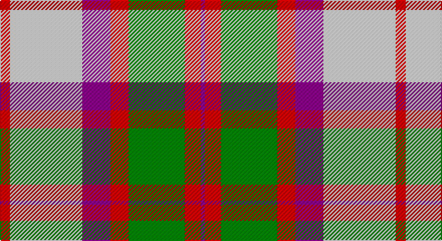

This page is one **sett** — a single exact thread-count. It belongs to the [tartan](/setts/r5w36p14r9g28r8p2/)
(the same proportion at any scale), whose colour order is pattern [BRGRBWR](/stripes/brgrbwr/).

Sourced from weddslist.  It is a [7 stripe tartan](/stripes/stripes7/).

Original link http://www.weddslist.com/cgi-bin/tartans/pg.pl?source=sts

## Thread count
R/10 LN72 P28 R18 G56 R16 P/4

One full sett is **394 threads**.

## Palette

Palette: <strong>Tartan Dictionary</strong> <small style="color:#888">(1 of 4 colours)</small>
<table><thead><tr><th>Colour</th><th>Threads</th><th>Shade</th><th>Base</th><th>OKLCh</th></tr></thead><tbody><tr><td>R/</td><td style="text-align:right;font-variant-numeric:tabular-nums">10</td><td><code style="background-color:#C00000;">#C00000</code> <small style="color:#888">#C00000</small></td><td>R <code style="background-color:#CC0000;">#CC0000</code></td><td><small style="color:#888">oklch(50.7% 0.208 29.2)</small></td></tr><tr><td>LN</td><td style="text-align:right;font-variant-numeric:tabular-nums">72</td><td><code style="background-color:#E0E0E0;">#E0E0E0</code> <small style="color:#888">#E0E0E0</small></td><td>W <code style="background-color:#F7F7F7;">#F7F7F7</code></td><td><small style="color:#888">oklch(90.7% 0.000 89.9)</small></td></tr><tr><td>P</td><td style="text-align:right;font-variant-numeric:tabular-nums">28</td><td><code style="background-color:#800080;">#800080</code> <small style="color:#888">#800080</small></td><td>B <code style="background-color:#2A418A;">#2A418A</code></td><td><small style="color:#888">oklch(42.1% 0.193 328.4)</small></td></tr><tr><td>R</td><td style="text-align:right;font-variant-numeric:tabular-nums">18</td><td><code style="background-color:#C00000;">#C00000</code> <small style="color:#888">#C00000</small></td><td>R <code style="background-color:#CC0000;">#CC0000</code></td><td><small style="color:#888">oklch(50.7% 0.208 29.2)</small></td></tr><tr><td>G</td><td style="text-align:right;font-variant-numeric:tabular-nums">56</td><td><code style="background-color:#008000;">#008000</code> <small style="color:#888">#008000</small></td><td>G <code style="background-color:#006100;">#006100</code></td><td><small style="color:#888">oklch(52.0% 0.177 142.5)</small></td></tr><tr><td>R</td><td style="text-align:right;font-variant-numeric:tabular-nums">16</td><td><code style="background-color:#C00000;">#C00000</code> <small style="color:#888">#C00000</small></td><td>R <code style="background-color:#CC0000;">#CC0000</code></td><td><small style="color:#888">oklch(50.7% 0.208 29.2)</small></td></tr><tr><td>P/</td><td style="text-align:right;font-variant-numeric:tabular-nums">4</td><td><code style="background-color:#800080;">#800080</code> <small style="color:#888">#800080</small></td><td>B <code style="background-color:#2A418A;">#2A418A</code></td><td><small style="color:#888">oklch(42.1% 0.193 328.4)</small></td></tr></tbody></table>

# Sample pattern

## Nearest tartans

The nearest existing variants by ΔTartan distance, with this tartan at the top so the swatches line up against it.

ΔTartan

Tartan

Sett

—

<a href="/ttd/edit/#slug=r5w36p14r9g28r8p2~x2">MacKintosh, Arisaid</a> <a class="nn-out" href="/variants/s7/r5w36p14r9g28r8p2~x2/" title="open its dictionary page">↗</a>

0.49

<a href="/ttd/edit/#slug=r5w36dp14r9g28r8dp2~x2&amp;base=r5w36p14r9g28r8p2~x2">MacKintosh (Artefact)</a> <a class="nn-out" href="/variants/s7/r5w36dp14r9g28r8dp2~x2/" title="open its dictionary page">↗</a>

0.98

<a href="/ttd/edit/#slug=do2lo2do15lo1w10loi15lo2loi2~x2&amp;base=r5w36p14r9g28r8p2~x2">Bannockbane Orange Stripes</a> <a class="nn-out" href="/variants/s8/do2lo2do15lo1w10loi15lo2loi2~x2/" title="open its dictionary page">↗</a>

0.99

<a href="/ttd/edit/#slug=r6dg3w22r5w5k9dg16r4k1r4~x2&amp;base=r5w36p14r9g28r8p2~x2">MacDuff Dress #3</a> <a class="nn-out" href="/variants/s10/r6dg3w22r5w5k9dg16r4k1r4~x2/" title="open its dictionary page">↗</a>

1.17

<a href="/ttd/edit/#slug=r6g3w22r5w5k9g16r4k1r4~x2&amp;base=r5w36p14r9g28r8p2~x2">MacDuff, dress</a> <a class="nn-out" href="/variants/s10/r6g3w22r5w5k9g16r4k1r4~x2/" title="open its dictionary page">↗</a>

1.20

<a href="/ttd/edit/#slug=g3r12g12lo5r1w25g2r1~x2&amp;base=r5w36p14r9g28r8p2~x2">Dogwood Trade Tartan</a> <a class="nn-out" href="/variants/s8/g3r12g12lo5r1w25g2r1~x2/" title="open its dictionary page">↗</a>

1.21

<a href="/ttd/edit/#slug=ly6r6ly6r6ly6k1db18w2db1w4~x2&amp;base=r5w36p14r9g28r8p2~x2">Catalunya Escocia</a> <a class="nn-out" href="/variants/s10/ly6r6ly6r6ly6k1db18w2db1w4~x2/" title="open its dictionary page">↗</a>

1.21

<a href="/ttd/edit/#slug=do4r3do21r2w14o22r3o4~x2&amp;base=r5w36p14r9g28r8p2~x2">Bannock Bane M.405</a> <a class="nn-out" href="/variants/s8/do4r3do21r2w14o22r3o4~x2/" title="open its dictionary page">↗</a>

1.21

<a href="/ttd/edit/#slug=r1w12g6r8lb3lo1~x4&amp;base=r5w36p14r9g28r8p2~x2">MacLean Dress (Lumsden)</a> <a class="nn-out" href="/variants/s6/r1w12g6r8lb3lo1~x4/" title="open its dictionary page">↗</a>

1.22

<a href="/ttd/edit/#slug=r34w3gi4g23w24k3gi4~x2&amp;base=r5w36p14r9g28r8p2~x2">MacLachlan Dress Clan Tartan</a> <a class="nn-out" href="/variants/s7/r34w3gi4g23w24k3gi4~x2/" title="open its dictionary page">↗</a>

1.23

<a href="/ttd/edit/#slug=dr4ly2dr13ly1w8t13ly2t4~x2&amp;base=r5w36p14r9g28r8p2~x2">Bannockbane, Dark Tan</a> <a class="nn-out" href="/variants/s8/dr4ly2dr13ly1w8t13ly2t4~x2/" title="open its dictionary page">↗</a>

## Neighbour map

Every grey dot is one of 14360 variants placed by the first two principal components of the ΔTartan feature space (44% of its variance). Red is this tartan; blue dots are its nearest — click one to open its page.

<svg viewBox="0 0 640 380" role="img" style="max-width:100%;height:auto;border:1px solid #e0e0e0;border-radius:4px;display:block" xmlns="http://www.w3.org/2000/svg"><image href="/nn/cloud.v1.png" width="640" height="380"/><a href="/variants/s7/r5w36dp14r9g28r8dp2~x2/"><circle cx="166.1" cy="157.4" r="4" fill="#3465a4"><title>MacKintosh (Artefact)</title></circle></a><a href="/variants/s8/do2lo2do15lo1w10loi15lo2loi2~x2/"><circle cx="184.8" cy="151.9" r="4" fill="#3465a4"><title>Bannockbane Orange Stripes</title></circle></a><a href="/variants/s10/r6dg3w22r5w5k9dg16r4k1r4~x2/"><circle cx="166.6" cy="129.2" r="4" fill="#3465a4"><title>MacDuff Dress #3</title></circle></a><a href="/variants/s10/r6g3w22r5w5k9g16r4k1r4~x2/"><circle cx="159.5" cy="128.6" r="4" fill="#3465a4"><title>MacDuff, dress</title></circle></a><a href="/variants/s8/g3r12g12lo5r1w25g2r1~x2/"><circle cx="222.1" cy="125.2" r="4" fill="#3465a4"><title>Dogwood Trade Tartan</title></circle></a><a href="/variants/s10/ly6r6ly6r6ly6k1db18w2db1w4~x2/"><circle cx="134.7" cy="116.9" r="4" fill="#3465a4"><title>Catalunya Escocia</title></circle></a><a href="/variants/s8/do4r3do21r2w14o22r3o4~x2/"><circle cx="184.6" cy="172.0" r="4" fill="#3465a4"><title>Bannock Bane M.405</title></circle></a><a href="/variants/s6/r1w12g6r8lb3lo1~x4/"><circle cx="148.4" cy="159.7" r="4" fill="#3465a4"><title>MacLean Dress (Lumsden)</title></circle></a><a href="/variants/s7/r34w3gi4g23w24k3gi4~x2/"><circle cx="153.8" cy="156.0" r="4" fill="#3465a4"><title>MacLachlan Dress Clan Tartan</title></circle></a><a href="/variants/s8/dr4ly2dr13ly1w8t13ly2t4~x2/"><circle cx="163.3" cy="171.8" r="4" fill="#3465a4"><title>Bannockbane, Dark Tan</title></circle></a><circle cx="169.1" cy="155.6" r="5" fill="#c00000"/></svg>

ID: /variants/s7/r5w36p14r9g28r8p2~x2/
