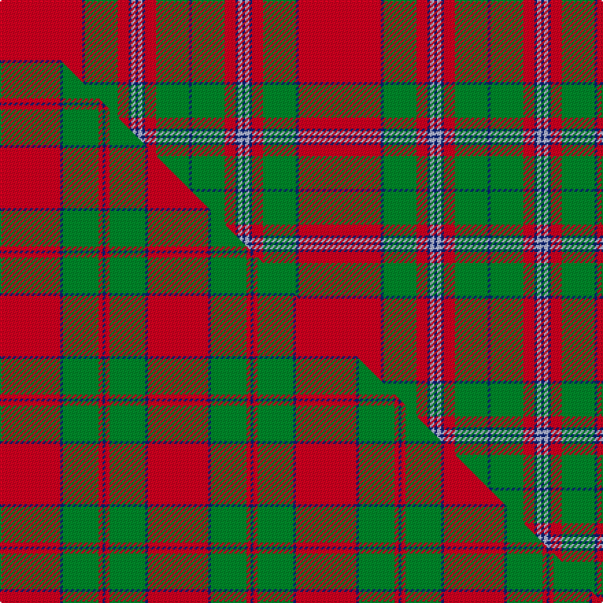

This is one **variant** — a specific cloth: this exact thread count and colourway, with its own
provenance below. It is one weaving of the [sett](/setts/r60db2g24r8db2lb3db2/) (the scale-free proportion — the
same cloth at any scale or shade), whose colour order is pattern [BGRBWBWBRGBR](/stripes/bgrbwbwbrgbr/).

Part of the [Unidentified Cant](/tartans/u/un/unidentified-cant-2/) tartan — the named design grouping this sett with its other cloths.

Sourced from register-of-tartans.  It is a [12 stripe tartan](/stripes/stripes12/).

Original link [https://www.tartanregister.gov.uk/tartanDetails.aspx?ref=4907](https://www.tartanregister.gov.uk/tartanDetails.aspx?ref=4907)

Dataset <small>— provenance for this record, inherited from the source manifest</small>

<dl class="dataset-prov">
<dt>source</dt><dd><a href="/sources/register-of-tartans/">Scottish Register of Tartans</a></dd>
<dt>data captured from</dt><dd><a href="https://github.com/thetartan/tartan-database/blob/master/data/register-of-tartans/data.csv">https://github.com/thetartan/tartan-database/blob/master/data/register-of-tartans/data.csv</a></dd>
<dt>data date</dt><dd>2017-01-06 <small>(dataset default)</small></dd>
<dt>licence</dt><dd><a href="https://www.tartanregister.gov.uk/copyright">Crown copyright</a></dd>
</dl>

Capture chain <small>— the hands this data passed through, oldest first; each capture carries its own licence</small>

<ol class="capture-chain">
<li><a href="https://www.tartanregister.gov.uk/">Scottish Register of Tartans</a> · <a href="https://www.tartanregister.gov.uk/copyright">Crown copyright</a> <small>the living register — still published by National Records of Scotland</small></li>
<li><a href="https://github.com/thetartan/tartan-database">thetartan/tartan-database</a> <small>2016-2017</small> · <a href="https://creativecommons.org/licenses/by-nc-nd/4.0/">CC BY-NC-ND 4.0</a> <small>Levko Kravets's frozen compilation — the capture we vendored, and where its CC licence text came from</small></li>
<li>this dictionary <small>captured 2026-06-10 · commit 5bf86c7566</small> <small>each re-capture is a git commit to data/sources</small></li>
</ol>

## Register references

External register numbers recorded for this tartan.

- Scottish Register of Tartans: [4907](https://www.tartanregister.gov.uk/tartanDetails.aspx?ref=4907)
- Scottish Tartans Authority (ITI): 3967

## Thread count
R/60 DB2 G24 R8 DB2 LB3 DB2 LB3 DB2 R8 G24 DB/2

One full sett is **218 threads**.

## Palette
<table><thead><tr><th>Colour</th><th>Shade</th><th>OKLCh</th></tr></thead><tbody><tr><td>LB</td><td><code style="background-color:#B5BBDE;">#B5BBDE</code> <small style="color:#888">#B5BBDE</small></td><td><small style="color:#888">oklch(79.9% 0.050 277.6)</small></td></tr><tr><td>DB</td><td><code style="background-color:#082077;">#082077</code> <small style="color:#888">#082077</small></td><td><small style="color:#888">oklch(30.0% 0.149 265.1)</small></td></tr><tr><td>DR</td><td><code style="background-color:#55120C;">#55120C</code> <small style="color:#888">#55120C</small></td><td><small style="color:#888">oklch(30.0% 0.099 29.3)</small></td></tr><tr><td>DG</td><td><code style="background-color:#053819;">#053819</code> <small style="color:#888">#053819</small></td><td><small style="color:#888">oklch(30.0% 0.075 151.3)</small></td></tr><tr><td>G</td><td><code style="background-color:#008B2A;">#008B2A</code> <small style="color:#888">#008B2A</small></td><td><small style="color:#888">oklch(55.4% 0.170 145.9)</small></td></tr><tr><td>R</td><td><code style="background-color:#D60020;">#D60020</code> <small style="color:#888">#D60020</small></td><td><small style="color:#888">oklch(55.2% 0.224 25.5)</small></td></tr></tbody></table>

# Sample pattern

## Compared to the master

This cloth is one sett of its design; the master sett (the exemplar the design is anchored on) is below for comparison.

Its **ΔTartan distance** from the master is **1.12** — the same measure the nearest-tartans table ranks by (0 is identical; a re-scale of the same cloth is near 0, a recolour or a different proportion further).

<figure class="master-compare" style="margin:0">

this sett
master sett ★

<figcaption style="color:#888;font-size:smaller">One weave of this sett against the <a href="/setts/r44db2g26r3db2/">master sett ★</a>, split on the diagonal: a shared proportion runs seamlessly across it with only the shades shifting; a different proportion breaks on it.</figcaption>
</figure>

## Nearest tartan variants

The nearest existing variants by ΔTartan distance, with this cloth at the top so the swatches line up against it.

ΔTartan

Threads

Variant

Sett

—

218

<a href="/variants/s7/r60db2g24r8db2lb3db2/">Unidentified Cant #12</a>

<a href="/ttd/edit/#slug=r6db1r1g28r4db8w1r32g1r4g2~x2&amp;base=r60db2g24r8db2lb3db2" title="compare in the TTD">1.00</a>

336

<a href="/variants/s11/r6db1r1g28r4db8w1r32g1r4g2~x2/">MacDonell of Keppoch (artefact)</a>

<a href="/ttd/edit/#slug=r6db2r2g24r2g2r2db8r2lb2r32db2r2db1r6~x2&amp;base=r60db2g24r8db2lb3db2" title="compare in the TTD">1.50</a>

356

<a href="/variants/s15/r6db2r2g24r2g2r2db8r2lb2r32db2r2db1r6~x2/">Grant or Drummond Clan Tartan</a>

<a href="/ttd/edit/#slug=r6db2r2g24r2g2r2db8r2lb1r32db2r2db1r6~x2&amp;base=r60db2g24r8db2lb3db2" title="compare in the TTD">1.53</a>

352

<a href="/variants/s15/r6db2r2g24r2g2r2db8r2lb1r32db2r2db1r6~x2/">Grant, or Drummond</a>

<a href="/ttd/edit/#slug=g36r3g3r3db9r3lb2r40db3r3db2r6~x2&amp;base=r60db2g24r8db2lb3db2" title="compare in the TTD">1.61</a>

368

<a href="/variants/s12/g36r3g3r3db9r3lb2r40db3r3db2r6~x2/">MacLintock Clan Tartan</a>

<a href="/ttd/edit/#slug=r56w2db6w2g32r11db6w5&amp;base=r60db2g24r8db2lb3db2" title="compare in the TTD">1.61</a>

179

<a href="/variants/s8/r56w2db6w2g32r11db6w5/">Spens Family Tartan</a>

<a href="/ttd/edit/#slug=g38r3g3r3db9r3lb2r40db3r3db2r6~x2&amp;base=r60db2g24r8db2lb3db2" title="compare in the TTD">1.69</a>

372

<a href="/variants/s12/g38r3g3r3db9r3lb2r40db3r3db2r6~x2/">MacLintock</a>

<a href="/ttd/edit/#slug=r6w1r24db6g2db1g2db1g12r1~x2&amp;base=r60db2g24r8db2lb3db2" title="compare in the TTD">1.71</a>

210

<a href="/variants/s10/r6w1r24db6g2db1g2db1g12r1~x2/">Chisholm</a>

<a href="/ttd/edit/#slug=r6w1r24db6g2db1g2db1g12r1&amp;base=r60db2g24r8db2lb3db2" title="compare in the TTD">1.71</a>

105

<a href="/variants/s10/r6w1r24db6g2db1g2db1g12r1/">Chisholm D</a>

<a href="/ttd/edit/#slug=r6db2r2g24r2db2r2db8r2w1r32db2r2db1r6~x2&amp;base=r60db2g24r8db2lb3db2" title="compare in the TTD">1.72</a>

352

<a href="/variants/s15/r6db2r2g24r2db2r2db8r2w1r32db2r2db1r6~x2/">Grant</a>

<a href="/ttd/edit/#slug=r7b2db2r2g32r6db12r41g2r5b2g5~x2&amp;base=r60db2g24r8db2lb3db2" title="compare in the TTD">1.74</a>

448

<a href="/variants/s12/r7b2db2r2g32r6db12r41g2r5b2g5~x2/">MacDonald of Glenaladale</a>

## Neighbour map

Every grey dot is one of 13621 variants placed by the first two principal components of the ΔTartan feature space (42% of its variance). Red is this tartan; blue dots are its nearest — click one to open its page. The map is a flat projection of a many-dimensional space — [how to read it](/posts/neighbourhood-maps/).

<svg viewBox="0 0 640 380" role="img" style="max-width:100%;height:auto;border:1px solid #e0e0e0;border-radius:4px;display:block" xmlns="http://www.w3.org/2000/svg"><image href="/nn/cloud.v1.png" width="640" height="380"/><a href="/variants/s11/r6db1r1g28r4db8w1r32g1r4g2~x2/"><circle cx="361.6" cy="111.0" r="4" fill="#3465a4"><title>MacDonell of Keppoch (artefact)</title></circle></a><a href="/variants/s15/r6db2r2g24r2g2r2db8r2lb2r32db2r2db1r6~x2/"><circle cx="364.8" cy="91.2" r="4" fill="#3465a4"><title>Grant or Drummond Clan Tartan</title></circle></a><a href="/variants/s15/r6db2r2g24r2g2r2db8r2lb1r32db2r2db1r6~x2/"><circle cx="371.3" cy="90.2" r="4" fill="#3465a4"><title>Grant, or Drummond</title></circle></a><a href="/variants/s12/g36r3g3r3db9r3lb2r40db3r3db2r6~x2/"><circle cx="332.3" cy="123.1" r="4" fill="#3465a4"><title>MacLintock Clan Tartan</title></circle></a><a href="/variants/s8/r56w2db6w2g32r11db6w5/"><circle cx="348.5" cy="130.8" r="4" fill="#3465a4"><title>Spens Family Tartan</title></circle></a><a href="/variants/s12/g38r3g3r3db9r3lb2r40db3r3db2r6~x2/"><circle cx="329.4" cy="123.0" r="4" fill="#3465a4"><title>MacLintock</title></circle></a><a href="/variants/s10/r6w1r24db6g2db1g2db1g12r1~x2/"><circle cx="346.5" cy="124.4" r="4" fill="#3465a4"><title>Chisholm</title></circle></a><a href="/variants/s10/r6w1r24db6g2db1g2db1g12r1/"><circle cx="346.5" cy="124.4" r="4" fill="#3465a4"><title>Chisholm D</title></circle></a><a href="/variants/s15/r6db2r2g24r2db2r2db8r2w1r32db2r2db1r6~x2/"><circle cx="365.5" cy="88.6" r="4" fill="#3465a4"><title>Grant</title></circle></a><a href="/variants/s12/r7b2db2r2g32r6db12r41g2r5b2g5~x2/"><circle cx="329.6" cy="128.9" r="4" fill="#3465a4"><title>MacDonald of Glenaladale</title></circle></a><circle cx="369.4" cy="107.2" r="5" fill="#c00000"/><text x="320" y="376" text-anchor="middle" font-size="11" fill="#999">ground</text><text x="11" y="190" text-anchor="middle" font-size="11" fill="#999" transform="rotate(-90 11 190)">complexity</text></svg>

ID: /variants/s7/r60db2g24r8db2lb3db2/
