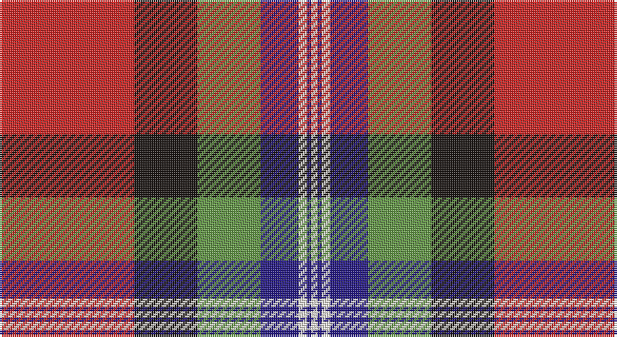

This page is one **sett** — a single exact thread-count. It belongs to the [tartan](/setts/r64k30g30db18w4db2w3/)
(the same proportion at any scale), whose colour order is pattern [RKGBWBW](/stripes/rkgbwbw/).

Part of the [Clyde](/tartans/clyde/) tartan — the named design grouping this sett with its other cloths.

Sourced from register-of-tartans.  It is a [7 stripe tartan](/stripes/stripes7/).

Original link https://www.tartanregister.gov.uk/tartanDetails.aspx?ref=10532

## Also known as

This cloth is also recorded under:

- Clyde Family

## Register references

External register numbers recorded for this tartan.

- Scottish Register of Tartans: [10532](https://www.tartanregister.gov.uk/tartanDetails.aspx?ref=10532)

## Thread count
R/64 K30 LG30 DB18 W4 DB2 W/3

One full sett is **235 threads**.

## Palette

Palette: <strong>Tartan Register</strong> <small style="color:#888">(2 of 5 colours)</small>
<table><thead><tr><th>Colour</th><th>Threads</th><th>Shade</th><th>Base</th><th>OKLCh</th></tr></thead><tbody><tr><td>R/</td><td style="text-align:right;font-variant-numeric:tabular-nums">64</td><td><code style="background-color:#CA2625;">#CA2625</code> <small style="color:#888">#CA2625</small></td><td>R <code style="background-color:#CC0000;">#CC0000</code></td><td><small style="color:#888">oklch(54.4% 0.199 27.2)</small></td></tr><tr><td>K</td><td style="text-align:right;font-variant-numeric:tabular-nums">30</td><td><code style="background-color:#1C1714;">#1C1714</code> <small style="color:#888">#1C1714</small></td><td>K <code style="background-color:#000000;">#000000</code></td><td><small style="color:#888">oklch(20.9% 0.010 52.9)</small></td></tr><tr><td>LG</td><td style="text-align:right;font-variant-numeric:tabular-nums">30</td><td><code style="background-color:#649848;">#649848</code> <small style="color:#888">#649848</small></td><td>G <code style="background-color:#006100;">#006100</code></td><td><small style="color:#888">oklch(62.4% 0.125 135.7)</small></td></tr><tr><td>DB</td><td style="text-align:right;font-variant-numeric:tabular-nums">18</td><td><code style="background-color:#271B86;">#271B86</code> <small style="color:#888">#271B86</small></td><td>B <code style="background-color:#2A418A;">#2A418A</code></td><td><small style="color:#888">oklch(32.6% 0.166 276.9)</small></td></tr><tr><td>W</td><td style="text-align:right;font-variant-numeric:tabular-nums">4</td><td><code style="background-color:#F7F1E8;">#F7F1E8</code> <small style="color:#888">#F7F1E8</small></td><td>W <code style="background-color:#F7F7F7;">#F7F7F7</code></td><td><small style="color:#888">oklch(96.0% 0.014 78.3)</small></td></tr><tr><td>DB</td><td style="text-align:right;font-variant-numeric:tabular-nums">2</td><td><code style="background-color:#271B86;">#271B86</code> <small style="color:#888">#271B86</small></td><td>B <code style="background-color:#2A418A;">#2A418A</code></td><td><small style="color:#888">oklch(32.6% 0.166 276.9)</small></td></tr><tr><td>W/</td><td style="text-align:right;font-variant-numeric:tabular-nums">3</td><td><code style="background-color:#F7F1E8;">#F7F1E8</code> <small style="color:#888">#F7F1E8</small></td><td>W <code style="background-color:#F7F7F7;">#F7F7F7</code></td><td><small style="color:#888">oklch(96.0% 0.014 78.3)</small></td></tr></tbody></table>

# Sample pattern

## Compared to the master

This cloth is one sett of its design; the master sett (the exemplar the design is anchored on) is below for comparison.

<figure style="margin:0"><figcaption style="color:#888;font-size:smaller">this sett</figcaption></figure>
<figure style="margin:0"><figcaption style="color:#888;font-size:smaller"><a href="/setts/o5n3o22r3n6ni17r2ni4r2ni4/">master sett →</a></figcaption></figure>

## Nearest tartans

The nearest existing variants by ΔTartan distance, with this tartan at the top so the swatches line up against it.

ΔTartan

Tartan

Sett

—

<a href="/ttd/edit/#slug=r64k30g30db18w4db2w3">Clyde Family (Hurleford) (Personal)</a> <a class="nn-out" href="/variants/s7/r64k30g30db18w4db2w3/" title="open its dictionary page">↗</a>

0.25

<a href="/ttd/edit/#slug=r64k30g30b18w4b2w3&amp;base=r64k30g30db18w4db2w3">Clyde (Personal)</a> <a class="nn-out" href="/variants/s7/r64k30g30b18w4b2w3/" title="open its dictionary page">↗</a>

0.60

<a href="/ttd/edit/#slug=lo1dg14r1y14r28db14lo1~x2&amp;base=r64k30g30db18w4db2w3">Abernethy (Colerain, USA)</a> <a class="nn-out" href="/variants/s7/lo1dg14r1y14r28db14lo1~x2/" title="open its dictionary page">↗</a>

1.00

<a href="/ttd/edit/#slug=lb5k1r30dp15r8dg30r8dp2&amp;base=r64k30g30db18w4db2w3">Shaw</a> <a class="nn-out" href="/variants/s8/lb5k1r30dp15r8dg30r8dp2/" title="open its dictionary page">↗</a>

1.01

<a href="/ttd/edit/#slug=ly3g9db9k1ly2k15r37g2~x2&amp;base=r64k30g30db18w4db2w3">Mensah</a> <a class="nn-out" href="/variants/s8/ly3g9db9k1ly2k15r37g2~x2/" title="open its dictionary page">↗</a>

1.06

<a href="/ttd/edit/#slug=db26g11r8k2r2w2r4w1r15~x2&amp;base=r64k30g30db18w4db2w3">Royal Scottish Assurance (Corporate)</a> <a class="nn-out" href="/variants/s9/db26g11r8k2r2w2r4w1r15~x2/" title="open its dictionary page">↗</a>

1.16

<a href="/ttd/edit/#slug=db26dg11r8k2r2w2r4w1r15~x2&amp;base=r64k30g30db18w4db2w3">Royal Scottish Assurance</a> <a class="nn-out" href="/variants/s9/db26dg11r8k2r2w2r4w1r15~x2/" title="open its dictionary page">↗</a>

1.21

<a href="/ttd/edit/#slug=o4dt36r35g2r2g8w4~x2&amp;base=r64k30g30db18w4db2w3">Cherry, John S. (Personal)</a> <a class="nn-out" href="/variants/s7/o4dt36r35g2r2g8w4~x2/" title="open its dictionary page">↗</a>

1.22

<a href="/ttd/edit/#slug=w3dt4w1dt15r24dg15ly1dg4ly3~x4&amp;base=r64k30g30db18w4db2w3">Forrester (Clan)</a> <a class="nn-out" href="/variants/s9/w3dt4w1dt15r24dg15ly1dg4ly3~x4/" title="open its dictionary page">↗</a>

1.25

<a href="/ttd/edit/#slug=r8lo44k32w2o52k7o7w3&amp;base=r64k30g30db18w4db2w3">Golden Wedding (Fashion)</a> <a class="nn-out" href="/variants/s8/r8lo44k32w2o52k7o7w3/" title="open its dictionary page">↗</a>

1.25

<a href="/ttd/edit/#slug=k2ly1k2ly8r29o9db24w2db2~x2&amp;base=r64k30g30db18w4db2w3">Lermontov</a> <a class="nn-out" href="/variants/s9/k2ly1k2ly8r29o9db24w2db2~x2/" title="open its dictionary page">↗</a>

## Neighbour map

Every grey dot is one of 14360 variants placed by the first two principal components of the ΔTartan feature space (44% of its variance). Red is this tartan; blue dots are its nearest — click one to open its page.

<svg viewBox="0 0 640 380" role="img" style="max-width:100%;height:auto;border:1px solid #e0e0e0;border-radius:4px;display:block" xmlns="http://www.w3.org/2000/svg"><image href="/nn/cloud.v1.png" width="640" height="380"/><a href="/variants/s7/r64k30g30b18w4b2w3/"><circle cx="229.1" cy="120.1" r="4" fill="#3465a4"><title>Clyde (Personal)</title></circle></a><a href="/variants/s7/lo1dg14r1y14r28db14lo1~x2/"><circle cx="220.6" cy="134.2" r="4" fill="#3465a4"><title>Abernethy (Colerain, USA)</title></circle></a><a href="/variants/s8/lb5k1r30dp15r8dg30r8dp2/"><circle cx="274.6" cy="130.4" r="4" fill="#3465a4"><title>Shaw</title></circle></a><a href="/variants/s8/ly3g9db9k1ly2k15r37g2~x2/"><circle cx="279.4" cy="97.6" r="4" fill="#3465a4"><title>Mensah</title></circle></a><a href="/variants/s9/db26g11r8k2r2w2r4w1r15~x2/"><circle cx="242.2" cy="120.3" r="4" fill="#3465a4"><title>Royal Scottish Assurance (Corporate)</title></circle></a><a href="/variants/s9/db26dg11r8k2r2w2r4w1r15~x2/"><circle cx="251.6" cy="126.3" r="4" fill="#3465a4"><title>Royal Scottish Assurance</title></circle></a><a href="/variants/s7/o4dt36r35g2r2g8w4~x2/"><circle cx="246.2" cy="138.1" r="4" fill="#3465a4"><title>Cherry, John S. (Personal)</title></circle></a><a href="/variants/s9/w3dt4w1dt15r24dg15ly1dg4ly3~x4/"><circle cx="199.4" cy="124.8" r="4" fill="#3465a4"><title>Forrester (Clan)</title></circle></a><a href="/variants/s8/r8lo44k32w2o52k7o7w3/"><circle cx="207.6" cy="124.2" r="4" fill="#3465a4"><title>Golden Wedding (Fashion)</title></circle></a><a href="/variants/s9/k2ly1k2ly8r29o9db24w2db2~x2/"><circle cx="193.9" cy="82.0" r="4" fill="#3465a4"><title>Lermontov</title></circle></a><circle cx="229.9" cy="118.0" r="5" fill="#c00000"/></svg>

ID: /variants/s7/r64k30g30db18w4db2w3/
