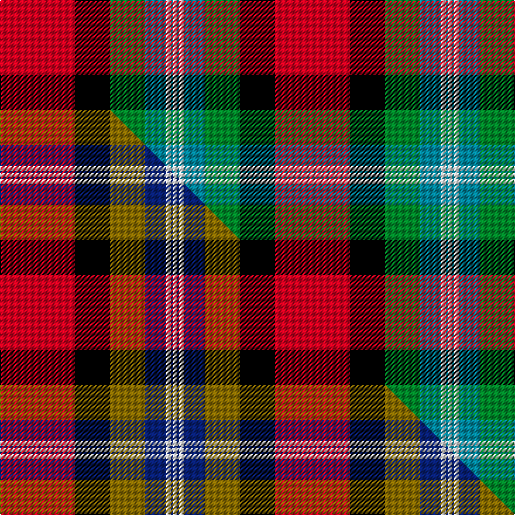

This is one **variant** — a specific cloth: this exact thread count and colourway, with its own
provenance below. It is one weaving of the [sett](/setts/r64k30g30t18w4t2w3/) (the scale-free proportion — the
same cloth at any scale or shade), whose colour order is pattern [RKGBWBW](/stripes/rkgbwbw/).

Part of the [Clyde](/tartans/clyde/) tartan — the named design grouping this sett with its other cloths.

Sourced from tartans-authority.  It is a [7 stripe tartan](/stripes/stripes7/).

Original link [https://www.tartanregister.gov.uk/tartanDetails.aspx?ref=10532](https://www.tartanregister.gov.uk/tartanDetails.aspx?ref=10532)

Dataset <small>— provenance for this record, inherited from the source manifest</small>

<dl class="dataset-prov">
<dt>source</dt><dd><a href="/sources/tartans-authority/">Scottish Tartans Authority</a></dd>
<dt>data captured from</dt><dd><a href="https://github.com/thetartan/tartan-database/blob/master/data/tartans-authority/data.csv">https://github.com/thetartan/tartan-database/blob/master/data/tartans-authority/data.csv</a></dd>
<dt>data date</dt><dd>15th Nov. 2011 <small>(this record)</small></dd>
<dt>licence</dt><dd><a href="https://creativecommons.org/licenses/by-nc-nd/4.0/">CC BY-NC-ND 4.0</a></dd>
</dl>

Capture chain <small>— the hands this data passed through, oldest first; each capture carries its own licence</small>

<ol class="capture-chain">
<li><a href="https://www.tartansauthority.com/">Scottish Tartans Authority</a> <small>the heritage body's archive — its tartan-ferret record browser is retired (links repaired to the SRT, above)</small></li>
<li><a href="https://github.com/thetartan/tartan-database">thetartan/tartan-database</a> <small>2016-2017</small> · <a href="https://creativecommons.org/licenses/by-nc-nd/4.0/">CC BY-NC-ND 4.0</a> <small>Levko Kravets's frozen compilation — the capture we vendored, and where its CC licence text came from</small></li>
<li>this dictionary <small>captured 2026-06-10 · commit 5bf86c7566</small> <small>each re-capture is a git commit to data/sources</small></li>
</ol>

## Register references

External register numbers recorded for this tartan.

- Scottish Register of Tartans: [10532](https://www.tartanregister.gov.uk/tartanDetails?ref=10532)
- Scottish Tartans Authority (ITI): 10532

## Thread count
R/64 K30 G30 T18 W4 T2 W/3

One full sett is **235 threads**.

## Palette
<table><thead><tr><th>Colour</th><th>Shade</th><th>OKLCh</th></tr></thead><tbody><tr><td>T</td><td><code style="background-color:#00879F;">#00879F</code> <small style="color:#888">#00879F</small></td><td><small style="color:#888">oklch(57.4% 0.102 216.1)</small></td></tr><tr><td>G</td><td><code style="background-color:#008B2A;">#008B2A</code> <small style="color:#888">#008B2A</small></td><td><small style="color:#888">oklch(55.4% 0.170 145.9)</small></td></tr><tr><td>K</td><td><code style="background-color:#000000;">#000000</code> <small style="color:#888">#000000</small></td><td><small style="color:#888">oklch(0.0% 0.000 0.0)</small></td></tr><tr><td>R</td><td><code style="background-color:#D60020;">#D60020</code> <small style="color:#888">#D60020</small></td><td><small style="color:#888">oklch(55.2% 0.224 25.5)</small></td></tr><tr><td>W</td><td><code style="background-color:#F7F7F7;">#F7F7F7</code> <small style="color:#888">#F7F7F7</small></td><td><small style="color:#888">oklch(97.6% 0.000 89.9)</small></td></tr></tbody></table>

# Sample pattern

## Compared to the master

This cloth is one sett of its design; the master sett (the exemplar the design is anchored on) is below for comparison.

Its **ΔTartan distance** from the master is **1.00** — the same measure the nearest-tartans table ranks by (0 is identical; a re-scale of the same cloth is near 0, a recolour or a different proportion further).

<figure class="master-compare" style="margin:0">

this sett
master sett ★

<figcaption style="color:#888;font-size:smaller">One weave of this sett against the <a href="/setts/r64k30y30db18w4db2w3/">master sett ★</a>, split on the diagonal: a shared proportion runs seamlessly across it with only the shades shifting; a different proportion breaks on it.</figcaption>
</figure>

## Nearest tartan variants

The nearest existing variants by ΔTartan distance, with this cloth at the top so the swatches line up against it.

ΔTartan

Threads

Variant

Sett

—

235

<a href="/variants/s7/r64k30g30t18w4t2w3/">Clyde (Personal)</a>

<a href="/ttd/edit/#slug=r64k30y30db18w4db2w3&amp;base=r64k30g30t18w4t2w3" title="compare in the TTD">1.00</a>

235

<a href="/variants/s7/r64k30y30db18w4db2w3/">Clyde Family (Hurleford) (Personal)</a>

<a href="/ttd/edit/#slug=r48db16y5g17w8k3~x2&amp;base=r64k30g30t18w4t2w3" title="compare in the TTD">2.03</a>

286

<a href="/variants/s6/r48db16y5g17w8k3~x2/">Scottish American Society of Michigan (Official)</a>

<a href="/ttd/edit/#slug=db4w8db8w10k16g4r38lo1&amp;base=r64k30g30t18w4t2w3" title="compare in the TTD">2.12</a>

173

<a href="/variants/s8/db4w8db8w10k16g4r38lo1/">Edinburgh Napier University</a>

<a href="/ttd/edit/#slug=dr24lb4k4g4w13k2~x4&amp;base=r64k30g30t18w4t2w3" title="compare in the TTD">2.16</a>

304

<a href="/variants/s6/dr24lb4k4g4w13k2~x4/">Rose White Dress</a>

<a href="/ttd/edit/#slug=r24w2y3g16k16w2y3~x2&amp;base=r64k30g30t18w4t2w3" title="compare in the TTD">2.23</a>

210

<a href="/variants/s7/r24w2y3g16k16w2y3~x2/">MacLachlan Old Clan Tartan</a>

<a href="/ttd/edit/#slug=r24w2y3g16k16w2y3&amp;base=r64k30g30t18w4t2w3" title="compare in the TTD">2.23</a>

105

<a href="/variants/s7/r24w2y3g16k16w2y3/">MacLachlan W</a>

<a href="/ttd/edit/#slug=r8ly44k32w2n52k7n7w3&amp;base=r64k30g30t18w4t2w3" title="compare in the TTD">2.31</a>

299

<a href="/variants/s8/r8ly44k32w2n52k7n7w3/">Golden Wedding (Fashion)</a>

<a href="/ttd/edit/#slug=w5k1r30db15r8g30r8db2&amp;base=r64k30g30t18w4t2w3" title="compare in the TTD">2.34</a>

191

<a href="/variants/s8/w5k1r30db15r8g30r8db2/">Shaw</a>

<a href="/ttd/edit/#slug=y3g9db9k1y2k15r37g2~x2&amp;base=r64k30g30t18w4t2w3" title="compare in the TTD">2.35</a>

302

<a href="/variants/s8/y3g9db9k1y2k15r37g2~x2/">Mensah</a>

<a href="/ttd/edit/#slug=dr38k12ri15r4ri15k2w4~x2~ri2806019-r2108022&amp;base=r64k30g30t18w4t2w3" title="compare in the TTD">2.76</a>

276

<a href="/variants/s7/dr38k12ri15r4ri15k2w4~x2~ri2806019-r2108022/">Ferguson's Promise (Commemorative)</a>

## Neighbour map

Every grey dot is one of 13621 variants placed by the first two principal components of the ΔTartan feature space (42% of its variance). Red is this tartan; blue dots are its nearest — click one to open its page.

<svg viewBox="0 0 640 380" role="img" style="max-width:100%;height:auto;border:1px solid #e0e0e0;border-radius:4px;display:block" xmlns="http://www.w3.org/2000/svg"><image href="/nn/cloud.v1.png" width="640" height="380"/><a href="/variants/s7/r64k30y30db18w4db2w3/"><circle cx="197.3" cy="111.3" r="4" fill="#3465a4"><title>Clyde Family (Hurleford) (Personal)</title></circle></a><a href="/variants/s6/r48db16y5g17w8k3~x2/"><circle cx="205.7" cy="134.4" r="4" fill="#3465a4"><title>Scottish American Society of Michigan (Official)</title></circle></a><a href="/variants/s8/db4w8db8w10k16g4r38lo1/"><circle cx="170.5" cy="81.1" r="4" fill="#3465a4"><title>Edinburgh Napier University</title></circle></a><a href="/variants/s6/dr24lb4k4g4w13k2~x4/"><circle cx="176.9" cy="158.3" r="4" fill="#3465a4"><title>Rose White Dress</title></circle></a><a href="/variants/s7/r24w2y3g16k16w2y3~x2/"><circle cx="130.3" cy="157.3" r="4" fill="#3465a4"><title>MacLachlan Old Clan Tartan</title></circle></a><a href="/variants/s7/r24w2y3g16k16w2y3/"><circle cx="130.3" cy="157.3" r="4" fill="#3465a4"><title>MacLachlan W</title></circle></a><a href="/variants/s8/r8ly44k32w2n52k7n7w3/"><circle cx="169.8" cy="122.4" r="4" fill="#3465a4"><title>Golden Wedding (Fashion)</title></circle></a><a href="/variants/s8/w5k1r30db15r8g30r8db2/"><circle cx="236.1" cy="123.0" r="4" fill="#3465a4"><title>Shaw</title></circle></a><a href="/variants/s8/y3g9db9k1y2k15r37g2~x2/"><circle cx="233.9" cy="86.5" r="4" fill="#3465a4"><title>Mensah</title></circle></a><a href="/variants/s7/dr38k12ri15r4ri15k2w4~x2~ri2806019-r2108022/"><circle cx="189.5" cy="134.3" r="4" fill="#3465a4"><title>Ferguson's Promise (Commemorative)</title></circle></a><circle cx="190.5" cy="113.9" r="5" fill="#c00000"/><text x="320" y="376" text-anchor="middle" font-size="11" fill="#999">ground</text><text x="11" y="190" text-anchor="middle" font-size="11" fill="#999" transform="rotate(-90 11 190)">complexity</text></svg>

ID: /variants/s7/r64k30g30t18w4t2w3/
