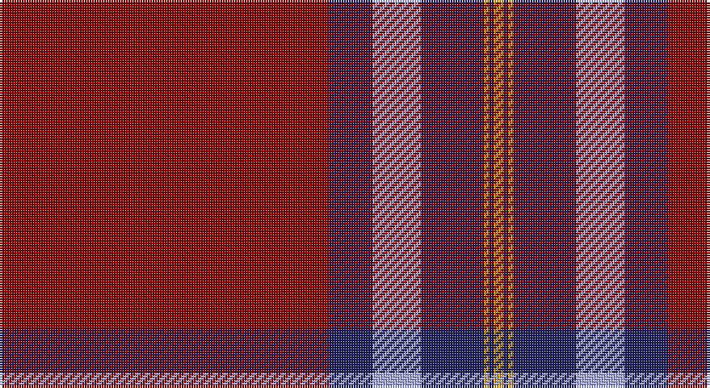

This page is one **sett** — a single exact thread-count. It belongs to the [tartan](/setts/r68db9lb10db13lo1db1lo2/)
(the same proportion at any scale), whose colour order is pattern [RBWBYBY](/stripes/rbwbyby/).

Sourced from register-of-tartans.  It is a [7 stripe tartan](/stripes/stripes7/).

Original link https://www.tartanregister.gov.uk/tartanDetails.aspx?ref=549

## Also known as

This cloth is also recorded under:

- 13, Legion Branch 50
- Canadian Legion Branch 50

2 attestations — the source records this cloth was collapsed from (oldest owns this page)

<ul>
<li>01/01/1969 — Canadian Legion Branch 50 (register-of-tartans, <a href="https://www.tartanregister.gov.uk/tartanDetails.aspx?ref=549">record</a>)</li>
<li>pre 1969 — Canadian Legion Br 50 (Corporate) (tartans-authority, <a href="http://www.tartansauthority.com/tartan-ferret/display/1327/">record</a>)</li>
</ul>

## Register references

External register numbers recorded for this tartan.

- Scottish Register of Tartans: [549](https://www.tartanregister.gov.uk/tartanDetails.aspx?ref=549)
- Scottish Tartans Authority (ITI): 1327
- Scottish Tartans World Register: 1327

## Thread count
DR/136 DB18 LP20 DB26 DY2 DB2 DY/4

One full sett is **276 threads**.

## Palette

Palette: <strong>Tartan Register</strong> <small style="color:#888">(3 of 4 colours)</small>
<table><thead><tr><th>Colour</th><th>Threads</th><th>Shade</th><th>Base</th><th>OKLCh</th></tr></thead><tbody><tr><td>DR/</td><td style="text-align:right;font-variant-numeric:tabular-nums">136</td><td><code style="background-color:#880000;">#880000</code> <small style="color:#888">#880000</small></td><td>R <code style="background-color:#CC0000;">#CC0000</code></td><td><small style="color:#888">oklch(39.4% 0.162 29.2)</small></td></tr><tr><td>DB</td><td style="text-align:right;font-variant-numeric:tabular-nums">18</td><td><code style="background-color:#202060;">#202060</code> <small style="color:#888">#202060</small></td><td>B <code style="background-color:#2A418A;">#2A418A</code></td><td><small style="color:#888">oklch(28.9% 0.111 276.9)</small></td></tr><tr><td>LP</td><td style="text-align:right;font-variant-numeric:tabular-nums">20</td><td><code style="background-color:#A8ACE8;">#A8ACE8</code> <small style="color:#888">#A8ACE8</small></td><td>W <code style="background-color:#F7F7F7;">#F7F7F7</code></td><td><small style="color:#888">oklch(76.3% 0.086 281.2)</small></td></tr><tr><td>DB</td><td style="text-align:right;font-variant-numeric:tabular-nums">26</td><td><code style="background-color:#202060;">#202060</code> <small style="color:#888">#202060</small></td><td>B <code style="background-color:#2A418A;">#2A418A</code></td><td><small style="color:#888">oklch(28.9% 0.111 276.9)</small></td></tr><tr><td>DY</td><td style="text-align:right;font-variant-numeric:tabular-nums">2</td><td><code style="background-color:#D09800;">#D09800</code> <small style="color:#888">#D09800</small></td><td>Y <code style="background-color:#F2BF00;">#F2BF00</code></td><td><small style="color:#888">oklch(71.4% 0.147 82.1)</small></td></tr><tr><td>DB</td><td style="text-align:right;font-variant-numeric:tabular-nums">2</td><td><code style="background-color:#202060;">#202060</code> <small style="color:#888">#202060</small></td><td>B <code style="background-color:#2A418A;">#2A418A</code></td><td><small style="color:#888">oklch(28.9% 0.111 276.9)</small></td></tr><tr><td>DY/</td><td style="text-align:right;font-variant-numeric:tabular-nums">4</td><td><code style="background-color:#D09800;">#D09800</code> <small style="color:#888">#D09800</small></td><td>Y <code style="background-color:#F2BF00;">#F2BF00</code></td><td><small style="color:#888">oklch(71.4% 0.147 82.1)</small></td></tr></tbody></table>

# Sample pattern

## Nearest tartans

The nearest existing variants by ΔTartan distance, with this tartan at the top so the swatches line up against it.

ΔTartan

Tartan

Sett

—

<a href="/ttd/edit/#slug=r68db9lb10db13lo1db1lo2~x2">Canadian Legion Branch 50</a> <a class="nn-out" href="/variants/s7/r68db9lb10db13lo1db1lo2~x2/" title="open its dictionary page">↗</a>

0.92

<a href="/ttd/edit/#slug=r40db8lo8r4lo1r4lr8~x4&amp;base=r68db9lb10db13lo1db1lo2~x2">Wcwm 4907-1</a> <a class="nn-out" href="/variants/s7/r40db8lo8r4lo1r4lr8~x4/" title="open its dictionary page">↗</a>

0.99

<a href="/ttd/edit/#slug=r68db9t10db13ly1db1ly2~x2&amp;base=r68db9lb10db13lo1db1lo2~x2">13, Legion Branch 50</a> <a class="nn-out" href="/variants/s7/r68db9t10db13ly1db1ly2~x2/" title="open its dictionary page">↗</a>

1.35

<a href="/variants/s6/r40b8r1w2~x4/">Lyon College (Corporate)</a>

1.49

<a href="/ttd/edit/#slug=dg2lo1dg11r50lo12db2lo4db2~x2&amp;base=r68db9lb10db13lo1db1lo2~x2">Slessor (Personal)</a> <a class="nn-out" href="/variants/s8/dg2lo1dg11r50lo12db2lo4db2~x2/" title="open its dictionary page">↗</a>

1.49

<a href="/ttd/edit/#slug=k3r48g6r6g12ly3g2k3~x2&amp;base=r68db9lb10db13lo1db1lo2~x2">Oakhall (Corporate)</a> <a class="nn-out" href="/variants/s8/k3r48g6r6g12ly3g2k3~x2/" title="open its dictionary page">↗</a>

1.52

<a href="/ttd/edit/#slug=r60b15r4dt10w2dt10w2dt10r4~x2&amp;base=r68db9lb10db13lo1db1lo2~x2">Robberstad</a> <a class="nn-out" href="/variants/s9/r60b15r4dt10w2dt10w2dt10r4~x2/" title="open its dictionary page">↗</a>

1.53

<a href="/ttd/edit/#slug=r64db16r1db1r12g16r8db2r2k1~x2&amp;base=r68db9lb10db13lo1db1lo2~x2">Moffat (1950)</a> <a class="nn-out" href="/variants/s10/r64db16r1db1r12g16r8db2r2k1~x2/" title="open its dictionary page">↗</a>

1.59

<a href="/ttd/edit/#slug=r40w1db7w1g12r8db6t2w1~x2&amp;base=r68db9lb10db13lo1db1lo2~x2">Spens (Lochcarron)</a> <a class="nn-out" href="/variants/s9/r40w1db7w1g12r8db6t2w1~x2/" title="open its dictionary page">↗</a>

1.60

<a href="/ttd/edit/#slug=r70k1dt12k1g12k1~x2&amp;base=r68db9lb10db13lo1db1lo2~x2">Lawers Estate (Corporate)</a> <a class="nn-out" href="/variants/s6/r70k1dt12k1g12k1~x2/" title="open its dictionary page">↗</a>

1.62

<a href="/variants/s10/r30db8r2k1r2k1~x2/">Masai Shuka 27 (Artefact)</a>

## Neighbour map

Every grey dot is one of 14360 variants placed by the first two principal components of the ΔTartan feature space (44% of its variance). Red is this tartan; blue dots are its nearest — click one to open its page.

<svg viewBox="0 0 640 380" role="img" style="max-width:100%;height:auto;border:1px solid #e0e0e0;border-radius:4px;display:block" xmlns="http://www.w3.org/2000/svg"><image href="/nn/cloud.v1.png" width="640" height="380"/><a href="/variants/s7/r40db8lo8r4lo1r4lr8~x4/"><circle cx="442.7" cy="123.8" r="4" fill="#3465a4"><title>Wcwm 4907-1</title></circle></a><a href="/variants/s7/r68db9t10db13ly1db1ly2~x2/"><circle cx="495.6" cy="107.5" r="4" fill="#3465a4"><title>13, Legion Branch 50</title></circle></a><a href="/variants/s6/r40b8r1w2~x4/"><circle cx="527.8" cy="144.9" r="4" fill="#3465a4"><title>Lyon College (Corporate)</title></circle></a><a href="/variants/s8/dg2lo1dg11r50lo12db2lo4db2~x2/"><circle cx="458.8" cy="116.0" r="4" fill="#3465a4"><title>Slessor (Personal)</title></circle></a><a href="/variants/s8/k3r48g6r6g12ly3g2k3~x2/"><circle cx="457.7" cy="142.1" r="4" fill="#3465a4"><title>Oakhall (Corporate)</title></circle></a><a href="/variants/s9/r60b15r4dt10w2dt10w2dt10r4~x2/"><circle cx="385.8" cy="111.1" r="4" fill="#3465a4"><title>Robberstad</title></circle></a><a href="/variants/s10/r64db16r1db1r12g16r8db2r2k1~x2/"><circle cx="523.0" cy="91.9" r="4" fill="#3465a4"><title>Moffat (1950)</title></circle></a><a href="/variants/s9/r40w1db7w1g12r8db6t2w1~x2/"><circle cx="403.5" cy="84.9" r="4" fill="#3465a4"><title>Spens (Lochcarron)</title></circle></a><a href="/variants/s6/r70k1dt12k1g12k1~x2/"><circle cx="548.7" cy="117.4" r="4" fill="#3465a4"><title>Lawers Estate (Corporate)</title></circle></a><a href="/variants/s10/r30db8r2k1r2k1~x2/"><circle cx="494.5" cy="121.0" r="4" fill="#3465a4"><title>Masai Shuka 27 (Artefact)</title></circle></a><circle cx="483.2" cy="109.3" r="5" fill="#c00000"/></svg>

ID: /variants/s7/r68db9lb10db13lo1db1lo2~x2/
