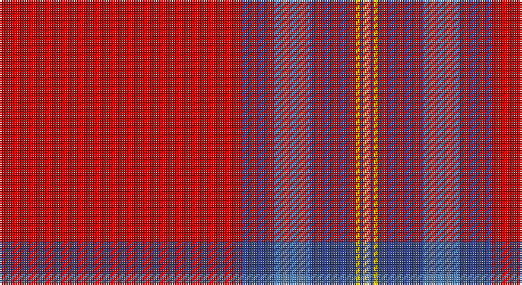

This page is one **sett** — a single exact thread-count. It belongs to the [tartan](/setts/r68db9t10db13ly1db1ly2/)
(the same proportion at any scale), whose colour order is pattern [RBBBYBY](/stripes/rbbbyby/).

Sourced from weddslist.  It is a [7 stripe tartan](/stripes/stripes7/).

Original link http://www.weddslist.com/cgi-bin/tartans/pg.pl?source=sts

## Provenance

Earliest known date: pre 2003 From a study of the portrait of Lord Loudoun (c 1747) outlined in the proceedings of the STS

2 attestations — the source records this cloth was collapsed from (oldest owns this page)

<ul>
<li>undated — 13, Legion Branch 50 (weddslist, <a href="http://www.weddslist.com/cgi-bin/tartans/pg.pl?source=sts">record</a>)</li>
<li>undated — Canadian Legion Branch 50 Corporate Tartan (house-of-tartan, <a href="http://www.house-of-tartan.scotland.net/house/TartanViewjs.asp?colr=Def&tnam=1327">record</a>)</li>
</ul>

## Thread count
R/136 B18 Ba20 B26 Y2 B2 Y/4

One full sett is **276 threads**.

## Palette

Palette: <strong>custom</strong>
<table><thead><tr><th>Colour</th><th>Threads</th><th>Shade</th><th>Base</th><th>OKLCh</th></tr></thead><tbody><tr><td>R/</td><td style="text-align:right;font-variant-numeric:tabular-nums">136</td><td><code style="background-color:#C00000;">#C00000</code> <small style="color:#888">#C00000</small></td><td>R <code style="background-color:#CC0000;">#CC0000</code></td><td><small style="color:#888">oklch(50.7% 0.208 29.2)</small></td></tr><tr><td>B</td><td style="text-align:right;font-variant-numeric:tabular-nums">18</td><td><code style="background-color:#304080;">#304080</code> <small style="color:#888">#304080</small></td><td>B <code style="background-color:#2A418A;">#2A418A</code></td><td><small style="color:#888">oklch(39.4% 0.109 270.2)</small></td></tr><tr><td>Ba</td><td style="text-align:right;font-variant-numeric:tabular-nums">20</td><td><code style="background-color:#5480B0;">#5480B0</code> <small style="color:#888">#5480B0</small></td><td>B <code style="background-color:#2A418A;">#2A418A</code></td><td><small style="color:#888">oklch(58.8% 0.089 251.5)</small></td></tr><tr><td>B</td><td style="text-align:right;font-variant-numeric:tabular-nums">26</td><td><code style="background-color:#304080;">#304080</code> <small style="color:#888">#304080</small></td><td>B <code style="background-color:#2A418A;">#2A418A</code></td><td><small style="color:#888">oklch(39.4% 0.109 270.2)</small></td></tr><tr><td>Y</td><td style="text-align:right;font-variant-numeric:tabular-nums">2</td><td><code style="background-color:#F0C000;">#F0C000</code> <small style="color:#888">#F0C000</small></td><td>Y <code style="background-color:#F2BF00;">#F2BF00</code></td><td><small style="color:#888">oklch(82.7% 0.169 90.5)</small></td></tr><tr><td>B</td><td style="text-align:right;font-variant-numeric:tabular-nums">2</td><td><code style="background-color:#304080;">#304080</code> <small style="color:#888">#304080</small></td><td>B <code style="background-color:#2A418A;">#2A418A</code></td><td><small style="color:#888">oklch(39.4% 0.109 270.2)</small></td></tr><tr><td>Y/</td><td style="text-align:right;font-variant-numeric:tabular-nums">4</td><td><code style="background-color:#F0C000;">#F0C000</code> <small style="color:#888">#F0C000</small></td><td>Y <code style="background-color:#F2BF00;">#F2BF00</code></td><td><small style="color:#888">oklch(82.7% 0.169 90.5)</small></td></tr></tbody></table>

# Sample pattern

## Nearest tartans

The nearest existing variants by ΔTartan distance, with this tartan at the top so the swatches line up against it.

ΔTartan

Tartan

Sett

—

<a href="/ttd/edit/#slug=r68db9t10db13ly1db1ly2~x2">13, Legion Branch 50</a> <a class="nn-out" href="/variants/s7/r68db9t10db13ly1db1ly2~x2/" title="open its dictionary page">↗</a>

0.99

<a href="/ttd/edit/#slug=r68db9lb10db13lo1db1lo2~x2&amp;base=r68db9t10db13ly1db1ly2~x2">Canadian Legion Branch 50</a> <a class="nn-out" href="/variants/s7/r68db9lb10db13lo1db1lo2~x2/" title="open its dictionary page">↗</a>

1.08

<a href="/ttd/edit/#slug=r70k1dt12k1g12k1~x2&amp;base=r68db9t10db13ly1db1ly2~x2">Lawers Estate (Corporate)</a> <a class="nn-out" href="/variants/s6/r70k1dt12k1g12k1~x2/" title="open its dictionary page">↗</a>

1.14

<a href="/ttd/edit/#slug=r64db16r1db1r12g16r8db2r2k1~x2&amp;base=r68db9t10db13ly1db1ly2~x2">Moffat (1950)</a> <a class="nn-out" href="/variants/s10/r64db16r1db1r12g16r8db2r2k1~x2/" title="open its dictionary page">↗</a>

1.23

<a href="/ttd/edit/#slug=r40db8lo8r4lo1r4lr8~x4&amp;base=r68db9t10db13ly1db1ly2~x2">Wcwm 4907-1</a> <a class="nn-out" href="/variants/s7/r40db8lo8r4lo1r4lr8~x4/" title="open its dictionary page">↗</a>

1.44

<a href="/ttd/edit/#slug=r40w1db7w1g12r8db6t2w1~x2&amp;base=r68db9t10db13ly1db1ly2~x2">Spens (Lochcarron)</a> <a class="nn-out" href="/variants/s9/r40w1db7w1g12r8db6t2w1~x2/" title="open its dictionary page">↗</a>

1.47

<a href="/ttd/edit/#slug=dg2lo1dg11r50lo12db2lo4db2~x2&amp;base=r68db9t10db13ly1db1ly2~x2">Slessor (Personal)</a> <a class="nn-out" href="/variants/s8/dg2lo1dg11r50lo12db2lo4db2~x2/" title="open its dictionary page">↗</a>

1.49

<a href="/ttd/edit/#slug=r50db3g6db1r3db1g8k1lb3~x2&amp;base=r68db9t10db13ly1db1ly2~x2">MacAulay of Ardincaple (Clan)</a> <a class="nn-out" href="/variants/s9/r50db3g6db1r3db1g8k1lb3~x2/" title="open its dictionary page">↗</a>

1.50

<a href="/ttd/edit/#slug=m5y20m5y3m4y5m36y1w4~x2&amp;base=r68db9t10db13ly1db1ly2~x2">Baluchistan Fitzgerald Regimental Tartan</a> <a class="nn-out" href="/variants/s9/m5y20m5y3m4y5m36y1w4~x2/" title="open its dictionary page">↗</a>

1.58

<a href="/variants/s10/r30db8r2k1r2k1~x2/">Masai Shuka 27 (Artefact)</a>

1.59

<a href="/ttd/edit/#slug=k3o6lr13r2lr2r32lr1r2lr2~x2&amp;base=r68db9t10db13ly1db1ly2~x2">Fueglistal (Aargau) (Personal)</a> <a class="nn-out" href="/variants/s9/k3o6lr13r2lr2r32lr1r2lr2~x2/" title="open its dictionary page">↗</a>

## Neighbour map

Every grey dot is one of 14360 variants placed by the first two principal components of the ΔTartan feature space (44% of its variance). Red is this tartan; blue dots are its nearest — click one to open its page.

<svg viewBox="0 0 640 380" role="img" style="max-width:100%;height:auto;border:1px solid #e0e0e0;border-radius:4px;display:block" xmlns="http://www.w3.org/2000/svg"><image href="/nn/cloud.v1.png" width="640" height="380"/><a href="/variants/s7/r68db9lb10db13lo1db1lo2~x2/"><circle cx="483.2" cy="109.3" r="4" fill="#3465a4"><title>Canadian Legion Branch 50</title></circle></a><a href="/variants/s6/r70k1dt12k1g12k1~x2/"><circle cx="548.7" cy="117.4" r="4" fill="#3465a4"><title>Lawers Estate (Corporate)</title></circle></a><a href="/variants/s10/r64db16r1db1r12g16r8db2r2k1~x2/"><circle cx="523.0" cy="91.9" r="4" fill="#3465a4"><title>Moffat (1950)</title></circle></a><a href="/variants/s7/r40db8lo8r4lo1r4lr8~x4/"><circle cx="442.7" cy="123.8" r="4" fill="#3465a4"><title>Wcwm 4907-1</title></circle></a><a href="/variants/s9/r40w1db7w1g12r8db6t2w1~x2/"><circle cx="403.5" cy="84.9" r="4" fill="#3465a4"><title>Spens (Lochcarron)</title></circle></a><a href="/variants/s8/dg2lo1dg11r50lo12db2lo4db2~x2/"><circle cx="458.8" cy="116.0" r="4" fill="#3465a4"><title>Slessor (Personal)</title></circle></a><a href="/variants/s9/r50db3g6db1r3db1g8k1lb3~x2/"><circle cx="505.1" cy="66.4" r="4" fill="#3465a4"><title>MacAulay of Ardincaple (Clan)</title></circle></a><a href="/variants/s9/m5y20m5y3m4y5m36y1w4~x2/"><circle cx="473.4" cy="151.2" r="4" fill="#3465a4"><title>Baluchistan Fitzgerald Regimental Tartan</title></circle></a><a href="/variants/s10/r30db8r2k1r2k1~x2/"><circle cx="494.5" cy="121.0" r="4" fill="#3465a4"><title>Masai Shuka 27 (Artefact)</title></circle></a><a href="/variants/s9/k3o6lr13r2lr2r32lr1r2lr2~x2/"><circle cx="412.0" cy="112.3" r="4" fill="#3465a4"><title>Fueglistal (Aargau) (Personal)</title></circle></a><circle cx="495.6" cy="107.5" r="5" fill="#c00000"/></svg>

ID: /variants/s7/r68db9t10db13ly1db1ly2~x2/
