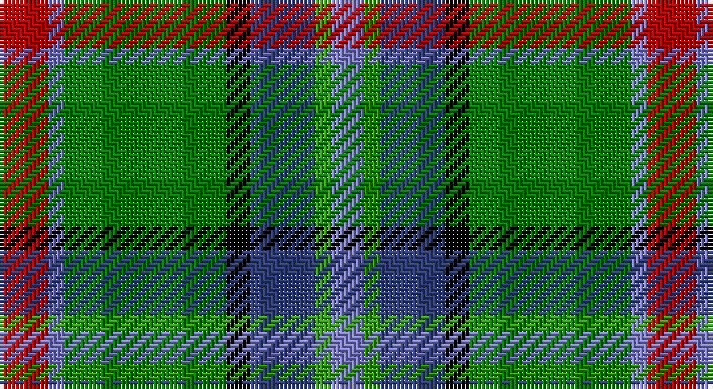

This page is one **sett** — a single exact thread-count. It belongs to the [tartan](/setts/r6b2g20k3db8gi2b4/)
(the same proportion at any scale), whose colour order is pattern [BGBKGBR](/stripes/bgbkgbr/).

Sourced from weddslist.  It is a [7 stripe tartan](/stripes/stripes7/).

Original link http://www.weddslist.com/cgi-bin/tartans/pg.pl?source=sts

## Thread count
R/12 B4 Ga40 K6 Ba16 G4 B/8

One full sett is **160 threads**.

## Palette

Palette: <strong>Ingles Buchan</strong> <small style="color:#888">(1 of 6 colours)</small>
<table><thead><tr><th>Colour</th><th>Threads</th><th>Shade</th><th>Base</th><th>OKLCh</th></tr></thead><tbody><tr><td>R/</td><td style="text-align:right;font-variant-numeric:tabular-nums">12</td><td><code style="background-color:#C00000;">#C00000</code> <small style="color:#888">#C00000</small></td><td>R <code style="background-color:#CC0000;">#CC0000</code></td><td><small style="color:#888">oklch(50.7% 0.208 29.2)</small></td></tr><tr><td>B</td><td style="text-align:right;font-variant-numeric:tabular-nums">4</td><td><code style="background-color:#8080D0;">#8080D0</code> <small style="color:#888">#8080D0</small></td><td>B <code style="background-color:#2A418A;">#2A418A</code></td><td><small style="color:#888">oklch(63.4% 0.119 282.5)</small></td></tr><tr><td>Ga</td><td style="text-align:right;font-variant-numeric:tabular-nums">40</td><td><code style="background-color:#008000;">#008000</code> <small style="color:#888">#008000</small></td><td>G <code style="background-color:#006100;">#006100</code></td><td><small style="color:#888">oklch(52.0% 0.177 142.5)</small></td></tr><tr><td>K</td><td style="text-align:right;font-variant-numeric:tabular-nums">6</td><td><code style="background-color:#000000;">#000000</code> <small style="color:#888">#000000</small></td><td>K <code style="background-color:#000000;">#000000</code></td><td><small style="color:#888">oklch(0.0% 0.000 0.0)</small></td></tr><tr><td>Ba</td><td style="text-align:right;font-variant-numeric:tabular-nums">16</td><td><code style="background-color:#304080;">#304080</code> <small style="color:#888">#304080</small></td><td>B <code style="background-color:#2A418A;">#2A418A</code></td><td><small style="color:#888">oklch(39.4% 0.109 270.2)</small></td></tr><tr><td>G</td><td style="text-align:right;font-variant-numeric:tabular-nums">4</td><td><code style="background-color:#30A010;">#30A010</code> <small style="color:#888">#30A010</small></td><td>G <code style="background-color:#006100;">#006100</code></td><td><small style="color:#888">oklch(61.9% 0.195 140.5)</small></td></tr><tr><td>B/</td><td style="text-align:right;font-variant-numeric:tabular-nums">8</td><td><code style="background-color:#8080D0;">#8080D0</code> <small style="color:#888">#8080D0</small></td><td>B <code style="background-color:#2A418A;">#2A418A</code></td><td><small style="color:#888">oklch(63.4% 0.119 282.5)</small></td></tr></tbody></table>

# Sample pattern

## Nearest tartans

The nearest existing variants by ΔTartan distance, with this tartan at the top so the swatches line up against it.

ΔTartan

Tartan

Sett

—

<a href="/ttd/edit/#slug=r6b2g20k3db8gi2b4~x2">Royal British Legion, The</a> <a class="nn-out" href="/variants/s7/r6b2g20k3db8gi2b4~x2/" title="open its dictionary page">↗</a>

0.78

<a href="/ttd/edit/#slug=o5dt30w3dg15ly8r4~x2&amp;base=r6b2g20k3db8gi2b4~x2">Carleton College Rugby</a> <a class="nn-out" href="/variants/s6/o5dt30w3dg15ly8r4~x2/" title="open its dictionary page">↗</a>

0.86

<a href="/ttd/edit/#slug=r3lb2gi20k3db8g2lb2~x2&amp;base=r6b2g20k3db8gi2b4~x2">Royal British Legion (Corporate)</a> <a class="nn-out" href="/variants/s7/r3lb2gi20k3db8g2lb2~x2/" title="open its dictionary page">↗</a>

1.01

<a href="/ttd/edit/#slug=o2t14k1g11k2lr2gi2k1~x4&amp;base=r6b2g20k3db8gi2b4~x2">Mission</a> <a class="nn-out" href="/variants/s8/o2t14k1g11k2lr2gi2k1~x4/" title="open its dictionary page">↗</a>

1.04

<a href="/ttd/edit/#slug=g11w11k3ly3dg36lo7~x2&amp;base=r6b2g20k3db8gi2b4~x2">Driver (Name)</a> <a class="nn-out" href="/variants/s6/g11w11k3ly3dg36lo7~x2/" title="open its dictionary page">↗</a>

1.04

<a href="/ttd/edit/#slug=k6r3g30ly10db30w3~x2&amp;base=r6b2g20k3db8gi2b4~x2">Turnbull of Thornton (Personal)</a> <a class="nn-out" href="/variants/s6/k6r3g30ly10db30w3~x2/" title="open its dictionary page">↗</a>

1.06

<a href="/ttd/edit/#slug=db2r1db10w1o4g8ly1g2~x4&amp;base=r6b2g20k3db8gi2b4~x2">Ayrshire</a> <a class="nn-out" href="/variants/s8/db2r1db10w1o4g8ly1g2~x4/" title="open its dictionary page">↗</a>

1.09

<a href="/ttd/edit/#slug=t6db17p4db2k11g33ly4~x2&amp;base=r6b2g20k3db8gi2b4~x2">East Lothian</a> <a class="nn-out" href="/variants/s7/t6db17p4db2k11g33ly4~x2/" title="open its dictionary page">↗</a>

1.09

<a href="/ttd/edit/#slug=lo2t14k1gi11k2w2g2k1~x4&amp;base=r6b2g20k3db8gi2b4~x2">Mission</a> <a class="nn-out" href="/variants/s8/lo2t14k1gi11k2w2g2k1~x4/" title="open its dictionary page">↗</a>

1.10

<a href="/ttd/edit/#slug=db20r2g9w6ly4k2g8~x2&amp;base=r6b2g20k3db8gi2b4~x2">Crofters (Personal)</a> <a class="nn-out" href="/variants/s7/db20r2g9w6ly4k2g8~x2/" title="open its dictionary page">↗</a>

1.11

<a href="/ttd/edit/#slug=lb2k2g8gi8r1gi1w1~x4&amp;base=r6b2g20k3db8gi2b4~x2">Lundy (Personal)</a> <a class="nn-out" href="/variants/s7/lb2k2g8gi8r1gi1w1~x4/" title="open its dictionary page">↗</a>

## Neighbour map

Every grey dot is one of 14360 variants placed by the first two principal components of the ΔTartan feature space (44% of its variance). Red is this tartan; blue dots are its nearest — click one to open its page.

<svg viewBox="0 0 640 380" role="img" style="max-width:100%;height:auto;border:1px solid #e0e0e0;border-radius:4px;display:block" xmlns="http://www.w3.org/2000/svg"><image href="/nn/cloud.v1.png" width="640" height="380"/><a href="/variants/s6/o5dt30w3dg15ly8r4~x2/"><circle cx="171.4" cy="168.8" r="4" fill="#3465a4"><title>Carleton College Rugby</title></circle></a><a href="/variants/s7/r3lb2gi20k3db8g2lb2~x2/"><circle cx="218.8" cy="161.2" r="4" fill="#3465a4"><title>Royal British Legion (Corporate)</title></circle></a><a href="/variants/s8/o2t14k1g11k2lr2gi2k1~x4/"><circle cx="174.2" cy="136.0" r="4" fill="#3465a4"><title>Mission</title></circle></a><a href="/variants/s6/g11w11k3ly3dg36lo7~x2/"><circle cx="201.4" cy="155.5" r="4" fill="#3465a4"><title>Driver (Name)</title></circle></a><a href="/variants/s6/k6r3g30ly10db30w3~x2/"><circle cx="143.5" cy="174.0" r="4" fill="#3465a4"><title>Turnbull of Thornton (Personal)</title></circle></a><a href="/variants/s8/db2r1db10w1o4g8ly1g2~x4/"><circle cx="191.7" cy="173.1" r="4" fill="#3465a4"><title>Ayrshire</title></circle></a><a href="/variants/s7/t6db17p4db2k11g33ly4~x2/"><circle cx="170.3" cy="145.3" r="4" fill="#3465a4"><title>East Lothian</title></circle></a><a href="/variants/s8/lo2t14k1gi11k2w2g2k1~x4/"><circle cx="181.2" cy="137.3" r="4" fill="#3465a4"><title>Mission</title></circle></a><a href="/variants/s7/db20r2g9w6ly4k2g8~x2/"><circle cx="130.0" cy="164.6" r="4" fill="#3465a4"><title>Crofters (Personal)</title></circle></a><a href="/variants/s7/lb2k2g8gi8r1gi1w1~x4/"><circle cx="157.6" cy="181.9" r="4" fill="#3465a4"><title>Lundy (Personal)</title></circle></a><circle cx="168.2" cy="164.9" r="5" fill="#c00000"/></svg>

ID: /variants/s7/r6b2g20k3db8gi2b4~x2/
