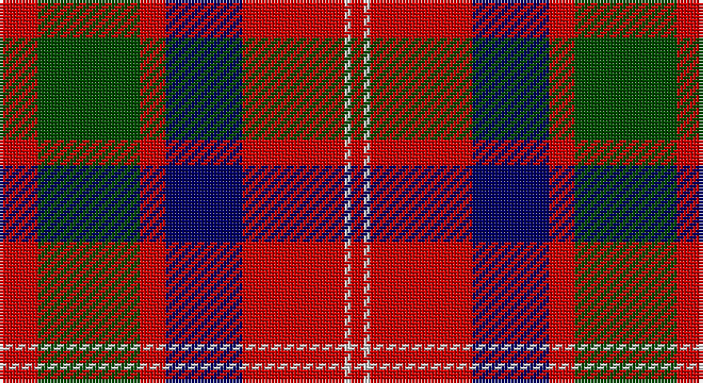

This page is one **sett** — a single exact thread-count. It belongs to the [tartan](/setts/r6dg16r4db12r16lb1r2/)
(the same proportion at any scale), whose colour order is pattern [RGRBRWR](/stripes/rgrbrwr/).

Part of the [MacQuarrie LO](/tartans/macquarrie-lo/) tartan — the named design grouping this sett with its other cloths.

Sourced from weddslist.  It is a [7 stripe tartan](/stripes/stripes7/).

Original link http://www.weddslist.com/cgi-bin/tartans/pg.pl?source=rb

## Also known as

This cloth is also recorded under:

- MacQuarrie #6
- MacQuarrie 2

## Thread count
R/12 G32 R8 DB24 R32 N2 R/4

One full sett is **212 threads**.

## Palette

Palette: <strong>Tartan Register</strong> <small style="color:#888">(3 of 4 colours)</small>
<table><thead><tr><th>Colour</th><th>Threads</th><th>Shade</th><th>Base</th><th>OKLCh</th></tr></thead><tbody><tr><td>R/</td><td style="text-align:right;font-variant-numeric:tabular-nums">12</td><td><code style="background-color:#C80000;">#C80000</code> <small style="color:#888">#C80000</small></td><td>R <code style="background-color:#CC0000;">#CC0000</code></td><td><small style="color:#888">oklch(52.3% 0.215 29.2)</small></td></tr><tr><td>G</td><td style="text-align:right;font-variant-numeric:tabular-nums">32</td><td><code style="background-color:#004C00;">#004C00</code> <small style="color:#888">#004C00</small></td><td>G <code style="background-color:#006100;">#006100</code></td><td><small style="color:#888">oklch(36.1% 0.123 142.5)</small></td></tr><tr><td>R</td><td style="text-align:right;font-variant-numeric:tabular-nums">8</td><td><code style="background-color:#C80000;">#C80000</code> <small style="color:#888">#C80000</small></td><td>R <code style="background-color:#CC0000;">#CC0000</code></td><td><small style="color:#888">oklch(52.3% 0.215 29.2)</small></td></tr><tr><td>DB</td><td style="text-align:right;font-variant-numeric:tabular-nums">24</td><td><code style="background-color:#000064;">#000064</code> <small style="color:#888">#000064</small></td><td>B <code style="background-color:#2A418A;">#2A418A</code></td><td><small style="color:#888">oklch(22.7% 0.158 264.1)</small></td></tr><tr><td>R</td><td style="text-align:right;font-variant-numeric:tabular-nums">32</td><td><code style="background-color:#C80000;">#C80000</code> <small style="color:#888">#C80000</small></td><td>R <code style="background-color:#CC0000;">#CC0000</code></td><td><small style="color:#888">oklch(52.3% 0.215 29.2)</small></td></tr><tr><td>N</td><td style="text-align:right;font-variant-numeric:tabular-nums">2</td><td><code style="background-color:#D0D0D0;">#D0D0D0</code> <small style="color:#888">#D0D0D0</small></td><td>W <code style="background-color:#F7F7F7;">#F7F7F7</code></td><td><small style="color:#888">oklch(85.8% 0.000 89.9)</small></td></tr><tr><td>R/</td><td style="text-align:right;font-variant-numeric:tabular-nums">4</td><td><code style="background-color:#C80000;">#C80000</code> <small style="color:#888">#C80000</small></td><td>R <code style="background-color:#CC0000;">#CC0000</code></td><td><small style="color:#888">oklch(52.3% 0.215 29.2)</small></td></tr></tbody></table>

# Sample pattern

## Compared to the master

This cloth is one sett of its design; the master sett (the exemplar the design is anchored on) is below for comparison.

<figure style="margin:0"><figcaption style="color:#888;font-size:smaller">this sett</figcaption></figure>
<figure style="margin:0"><figcaption style="color:#888;font-size:smaller"><a href="/setts/r6dg16r4db12r16b1r2/">master sett →</a></figcaption></figure>

## Nearest tartans

The nearest existing variants by ΔTartan distance, with this tartan at the top so the swatches line up against it.

ΔTartan

Tartan

Sett

—

<a href="/ttd/edit/#slug=r6dg16r4db12r16lb1r2~x2">MacQuarrie LO</a> <a class="nn-out" href="/variants/s7/r6dg16r4db12r16lb1r2~x2/" title="open its dictionary page">↗</a>

0.77

<a href="/ttd/edit/#slug=k2r12db6r3dg12r4db1~x2&amp;base=r6dg16r4db12r16lb1r2~x2">MacBean/MacElvain</a> <a class="nn-out" href="/variants/s7/k2r12db6r3dg12r4db1~x2/" title="open its dictionary page">↗</a>

0.80

<a href="/ttd/edit/#slug=r6dg16r4db12r16t1r2~x2&amp;base=r6dg16r4db12r16lb1r2~x2">MacQuarrie #6</a> <a class="nn-out" href="/variants/s7/r6dg16r4db12r16t1r2~x2/" title="open its dictionary page">↗</a>

0.83

<a href="/ttd/edit/#slug=r6dg16r4db12r16b1r2~x2&amp;base=r6dg16r4db12r16lb1r2~x2">MacQuarrie LO</a> <a class="nn-out" href="/variants/s7/r6dg16r4db12r16b1r2~x2/" title="open its dictionary page">↗</a>

0.86

<a href="/ttd/edit/#slug=db8r8dg17w3r35db10dg15w3~x2&amp;base=r6dg16r4db12r16lb1r2~x2">James of Glencarr (Personal)</a> <a class="nn-out" href="/variants/s8/db8r8dg17w3r35db10dg15w3~x2/" title="open its dictionary page">↗</a>

0.86

<a href="/ttd/edit/#slug=dg28r4dp25w5r22dg27r4dp2~x2&amp;base=r6dg16r4db12r16lb1r2~x2">New Glasgow (Canada)</a> <a class="nn-out" href="/variants/s8/dg28r4dp25w5r22dg27r4dp2~x2/" title="open its dictionary page">↗</a>

0.86

<a href="/ttd/edit/#slug=r1db6r1dg6r12lb1&amp;base=r6dg16r4db12r16lb1r2~x2">Fraser VS</a> <a class="nn-out" href="/variants/s6/r1db6r1dg6r12lb1/" title="open its dictionary page">↗</a>

0.87

<a href="/ttd/edit/#slug=k2r12db6r3g12r4db1~x2&amp;base=r6dg16r4db12r16lb1r2~x2">MacBean, MacElvain</a> <a class="nn-out" href="/variants/s7/k2r12db6r3g12r4db1~x2/" title="open its dictionary page">↗</a>

0.90

<a href="/ttd/edit/#slug=w6g15db18r30g2r4~x2&amp;base=r6dg16r4db12r16lb1r2~x2">Ruthven (V.S.)</a> <a class="nn-out" href="/variants/s6/w6g15db18r30g2r4~x2/" title="open its dictionary page">↗</a>

0.92

<a href="/ttd/edit/#slug=dp1r5g15r3dp9r10w1~x4&amp;base=r6dg16r4db12r16lb1r2~x2">Geddes</a> <a class="nn-out" href="/variants/s7/dp1r5g15r3dp9r10w1~x4/" title="open its dictionary page">↗</a>

0.92

<a href="/ttd/edit/#slug=r4k2r24k6db6dg16r3~x2&amp;base=r6dg16r4db12r16lb1r2~x2">MacDuff #4</a> <a class="nn-out" href="/variants/s7/r4k2r24k6db6dg16r3~x2/" title="open its dictionary page">↗</a>

## Neighbour map

Every grey dot is one of 14360 variants placed by the first two principal components of the ΔTartan feature space (44% of its variance). Red is this tartan; blue dots are its nearest — click one to open its page.

<svg viewBox="0 0 640 380" role="img" style="max-width:100%;height:auto;border:1px solid #e0e0e0;border-radius:4px;display:block" xmlns="http://www.w3.org/2000/svg"><image href="/nn/cloud.v1.png" width="640" height="380"/><a href="/variants/s7/k2r12db6r3dg12r4db1~x2/"><circle cx="259.2" cy="199.0" r="4" fill="#3465a4"><title>MacBean/MacElvain</title></circle></a><a href="/variants/s7/r6dg16r4db12r16t1r2~x2/"><circle cx="284.4" cy="191.1" r="4" fill="#3465a4"><title>MacQuarrie #6</title></circle></a><a href="/variants/s7/r6dg16r4db12r16b1r2~x2/"><circle cx="289.1" cy="201.4" r="4" fill="#3465a4"><title>MacQuarrie LO</title></circle></a><a href="/variants/s8/db8r8dg17w3r35db10dg15w3~x2/"><circle cx="227.4" cy="186.0" r="4" fill="#3465a4"><title>James of Glencarr (Personal)</title></circle></a><a href="/variants/s8/dg28r4dp25w5r22dg27r4dp2~x2/"><circle cx="249.0" cy="189.5" r="4" fill="#3465a4"><title>New Glasgow (Canada)</title></circle></a><a href="/variants/s6/r1db6r1dg6r12lb1/"><circle cx="280.6" cy="185.4" r="4" fill="#3465a4"><title>Fraser VS</title></circle></a><a href="/variants/s7/k2r12db6r3g12r4db1~x2/"><circle cx="249.5" cy="197.5" r="4" fill="#3465a4"><title>MacBean, MacElvain</title></circle></a><a href="/variants/s6/w6g15db18r30g2r4~x2/"><circle cx="241.1" cy="185.6" r="4" fill="#3465a4"><title>Ruthven (V.S.)</title></circle></a><a href="/variants/s7/dp1r5g15r3dp9r10w1~x4/"><circle cx="242.8" cy="188.1" r="4" fill="#3465a4"><title>Geddes</title></circle></a><a href="/variants/s7/r4k2r24k6db6dg16r3~x2/"><circle cx="278.1" cy="183.7" r="4" fill="#3465a4"><title>MacDuff #4</title></circle></a><circle cx="267.5" cy="187.0" r="5" fill="#c00000"/></svg>

ID: /variants/s7/r6dg16r4db12r16lb1r2~x2/
