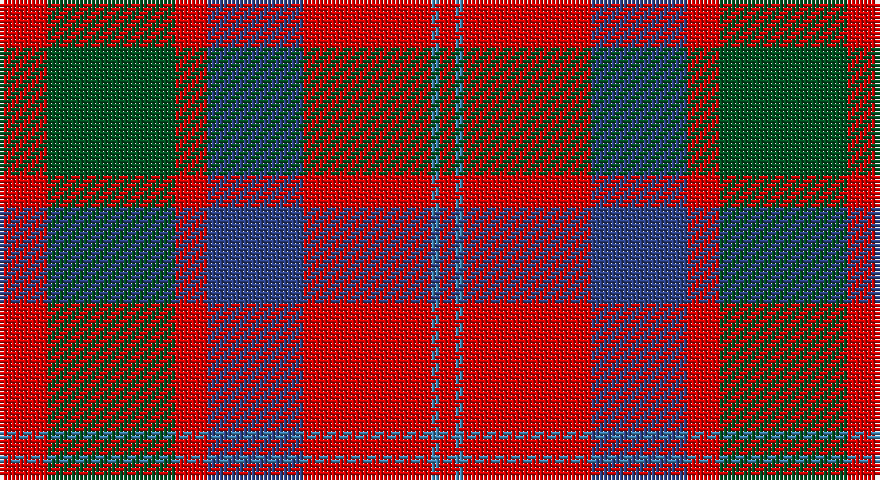

This page is one **sett** — a single exact thread-count. It belongs to the [tartan](/setts/r6dg16r4db12r16t1r2/)
(the same proportion at any scale), whose colour order is pattern [RBRBRGR](/stripes/rbrbrgr/).

Sourced from register-of-tartans.  It is a [7 stripe tartan](/stripes/stripes7/).

Original link https://www.tartanregister.gov.uk/tartanDetails.aspx?ref=2733

## Register references

External register numbers recorded for this tartan.

- Scottish Register of Tartans: [2733](https://www.tartanregister.gov.uk/tartanDetails.aspx?ref=2733)
- Scottish Tartans World Register: 1402

## Thread count
R/12 G32 R8 Ba24 R32 B2 R/4

One full sett is **212 threads**.

## Palette

Palette: <strong>Tartan Register</strong>
<table><thead><tr><th>Colour</th><th>Threads</th><th>Shade</th><th>Base</th><th>OKLCh</th></tr></thead><tbody><tr><td>R/</td><td style="text-align:right;font-variant-numeric:tabular-nums">12</td><td><code style="background-color:#DC0000;">#DC0000</code> <small style="color:#888">#DC0000</small></td><td>R <code style="background-color:#CC0000;">#CC0000</code></td><td><small style="color:#888">oklch(56.2% 0.230 29.2)</small></td></tr><tr><td>G</td><td style="text-align:right;font-variant-numeric:tabular-nums">32</td><td><code style="background-color:#005020;">#005020</code> <small style="color:#888">#005020</small></td><td>G <code style="background-color:#006100;">#006100</code></td><td><small style="color:#888">oklch(37.7% 0.105 149.6)</small></td></tr><tr><td>R</td><td style="text-align:right;font-variant-numeric:tabular-nums">8</td><td><code style="background-color:#DC0000;">#DC0000</code> <small style="color:#888">#DC0000</small></td><td>R <code style="background-color:#CC0000;">#CC0000</code></td><td><small style="color:#888">oklch(56.2% 0.230 29.2)</small></td></tr><tr><td>Ba</td><td style="text-align:right;font-variant-numeric:tabular-nums">24</td><td><code style="background-color:#2C4084;">#2C4084</code> <small style="color:#888">#2C4084</small></td><td>B <code style="background-color:#2A418A;">#2A418A</code></td><td><small style="color:#888">oklch(39.4% 0.117 268.3)</small></td></tr><tr><td>R</td><td style="text-align:right;font-variant-numeric:tabular-nums">32</td><td><code style="background-color:#DC0000;">#DC0000</code> <small style="color:#888">#DC0000</small></td><td>R <code style="background-color:#CC0000;">#CC0000</code></td><td><small style="color:#888">oklch(56.2% 0.230 29.2)</small></td></tr><tr><td>B</td><td style="text-align:right;font-variant-numeric:tabular-nums">2</td><td><code style="background-color:#3C82AF;">#3C82AF</code> <small style="color:#888">#3C82AF</small></td><td>B <code style="background-color:#2A418A;">#2A418A</code></td><td><small style="color:#888">oklch(58.1% 0.099 239.8)</small></td></tr><tr><td>R/</td><td style="text-align:right;font-variant-numeric:tabular-nums">4</td><td><code style="background-color:#DC0000;">#DC0000</code> <small style="color:#888">#DC0000</small></td><td>R <code style="background-color:#CC0000;">#CC0000</code></td><td><small style="color:#888">oklch(56.2% 0.230 29.2)</small></td></tr></tbody></table>

# Sample pattern

## Nearest tartans

The nearest existing variants by ΔTartan distance, with this tartan at the top so the swatches line up against it.

ΔTartan

Tartan

Sett

—

<a href="/ttd/edit/#slug=r6dg16r4db12r16t1r2~x2">MacQuarrie #6</a> <a class="nn-out" href="/variants/s7/r6dg16r4db12r16t1r2~x2/" title="open its dictionary page">↗</a>

0.54

<a href="/ttd/edit/#slug=k2r12db6r3dg12r4db1~x2&amp;base=r6dg16r4db12r16t1r2~x2">MacBean/MacElvain</a> <a class="nn-out" href="/variants/s7/k2r12db6r3dg12r4db1~x2/" title="open its dictionary page">↗</a>

0.60

<a href="/ttd/edit/#slug=r6g16r4db12r16t1r2~x2&amp;base=r6dg16r4db12r16t1r2~x2">MacQuarrie 2</a> <a class="nn-out" href="/variants/s7/r6g16r4db12r16t1r2~x2/" title="open its dictionary page">↗</a>

0.77

<a href="/ttd/edit/#slug=r28db12r3dg20t2dg2r7~x2&amp;base=r6dg16r4db12r16t1r2~x2">Carrick (Strathmore) District Tartan</a> <a class="nn-out" href="/variants/s7/r28db12r3dg20t2dg2r7~x2/" title="open its dictionary page">↗</a>

0.80

<a href="/variants/s8/db18r18dp2g12db1~x4/">Wyeth (Personal)</a>

0.80

<a href="/ttd/edit/#slug=r6dg16r4db12r16lb1r2~x2&amp;base=r6dg16r4db12r16t1r2~x2">MacQuarrie LO</a> <a class="nn-out" href="/variants/s7/r6dg16r4db12r16lb1r2~x2/" title="open its dictionary page">↗</a>

0.84

<a href="/ttd/edit/#slug=dp1r5g15r3dp9r10w1~x4&amp;base=r6dg16r4db12r16t1r2~x2">Geddes</a> <a class="nn-out" href="/variants/s7/dp1r5g15r3dp9r10w1~x4/" title="open its dictionary page">↗</a>

0.87

<a href="/ttd/edit/#slug=r8w2m30g12m3g12m3~x2&amp;base=r6dg16r4db12r16t1r2~x2">Wasko (Personal)</a> <a class="nn-out" href="/variants/s7/r8w2m30g12m3g12m3~x2/" title="open its dictionary page">↗</a>

0.88

<a href="/ttd/edit/#slug=r4k2r24k6db6dg16r3~x2&amp;base=r6dg16r4db12r16t1r2~x2">MacDuff #4</a> <a class="nn-out" href="/variants/s7/r4k2r24k6db6dg16r3~x2/" title="open its dictionary page">↗</a>

0.92

<a href="/ttd/edit/#slug=w6g15db18r30g2r4~x2&amp;base=r6dg16r4db12r16t1r2~x2">Ruthven (V.S.)</a> <a class="nn-out" href="/variants/s6/w6g15db18r30g2r4~x2/" title="open its dictionary page">↗</a>

0.93

<a href="/ttd/edit/#slug=k2r12db6r3g12r4db1~x2&amp;base=r6dg16r4db12r16t1r2~x2">MacBean, MacElvain</a> <a class="nn-out" href="/variants/s7/k2r12db6r3g12r4db1~x2/" title="open its dictionary page">↗</a>

## Neighbour map

Every grey dot is one of 14360 variants placed by the first two principal components of the ΔTartan feature space (44% of its variance). Red is this tartan; blue dots are its nearest — click one to open its page.

<svg viewBox="0 0 640 380" role="img" style="max-width:100%;height:auto;border:1px solid #e0e0e0;border-radius:4px;display:block" xmlns="http://www.w3.org/2000/svg"><image href="/nn/cloud.v1.png" width="640" height="380"/><a href="/variants/s7/k2r12db6r3dg12r4db1~x2/"><circle cx="259.2" cy="199.0" r="4" fill="#3465a4"><title>MacBean/MacElvain</title></circle></a><a href="/variants/s7/r6g16r4db12r16t1r2~x2/"><circle cx="287.9" cy="195.9" r="4" fill="#3465a4"><title>MacQuarrie 2</title></circle></a><a href="/variants/s7/r28db12r3dg20t2dg2r7~x2/"><circle cx="308.1" cy="185.9" r="4" fill="#3465a4"><title>Carrick (Strathmore) District Tartan</title></circle></a><a href="/variants/s8/db18r18dp2g12db1~x4/"><circle cx="251.3" cy="189.4" r="4" fill="#3465a4"><title>Wyeth (Personal)</title></circle></a><a href="/variants/s7/r6dg16r4db12r16lb1r2~x2/"><circle cx="267.5" cy="187.0" r="4" fill="#3465a4"><title>MacQuarrie LO</title></circle></a><a href="/variants/s7/dp1r5g15r3dp9r10w1~x4/"><circle cx="242.8" cy="188.1" r="4" fill="#3465a4"><title>Geddes</title></circle></a><a href="/variants/s7/r8w2m30g12m3g12m3~x2/"><circle cx="330.6" cy="186.9" r="4" fill="#3465a4"><title>Wasko (Personal)</title></circle></a><a href="/variants/s7/r4k2r24k6db6dg16r3~x2/"><circle cx="278.1" cy="183.7" r="4" fill="#3465a4"><title>MacDuff #4</title></circle></a><a href="/variants/s6/w6g15db18r30g2r4~x2/"><circle cx="241.1" cy="185.6" r="4" fill="#3465a4"><title>Ruthven (V.S.)</title></circle></a><a href="/variants/s7/k2r12db6r3g12r4db1~x2/"><circle cx="249.5" cy="197.5" r="4" fill="#3465a4"><title>MacBean, MacElvain</title></circle></a><circle cx="284.4" cy="191.1" r="5" fill="#c00000"/></svg>

ID: /variants/s7/r6dg16r4db12r16t1r2~x2/
