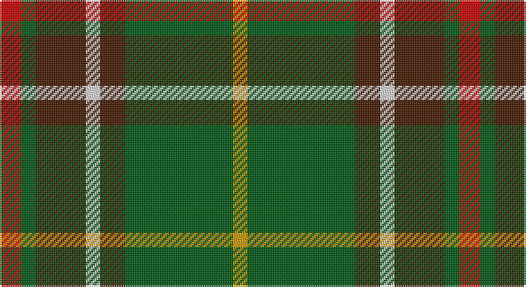

This page is one **sett** — a single exact thread-count. It belongs to the [tartan](/setts/r6dg4do14w4do7dg30lo4/)
(the same proportion at any scale), whose colour order is pattern [RGBWBGY](/stripes/rgbwbgy/).

Part of the [Newfoundland](/tartans/newfoundland/) tartan — the named design grouping this sett with its other cloths.

Sourced from tartans-authority.  It is a [7 stripe tartan](/stripes/stripes7/).

Original link http://www.tartansauthority.com/tartan-ferret/display/1543/

## Register references

External register numbers recorded for this tartan.

- Scottish Tartans Authority (ITI): 1543

## Thread count
R/12 G8 DR28 LN8 DR14 G60 DY/8

One full sett is **256 threads**.

## Palette

Palette: <strong>Tartan Register</strong> <small style="color:#888">(3 of 5 colours)</small>
<table><thead><tr><th>Colour</th><th>Threads</th><th>Shade</th><th>Base</th><th>OKLCh</th></tr></thead><tbody><tr><td>R/</td><td style="text-align:right;font-variant-numeric:tabular-nums">12</td><td><code style="background-color:#C80000;">#C80000</code> <small style="color:#888">#C80000</small></td><td>R <code style="background-color:#CC0000;">#CC0000</code></td><td><small style="color:#888">oklch(52.3% 0.215 29.2)</small></td></tr><tr><td>G</td><td style="text-align:right;font-variant-numeric:tabular-nums">8</td><td><code style="background-color:#005814;">#005814</code> <small style="color:#888">#005814</small></td><td>G <code style="background-color:#006100;">#006100</code></td><td><small style="color:#888">oklch(40.0% 0.125 145.2)</small></td></tr><tr><td>DR</td><td style="text-align:right;font-variant-numeric:tabular-nums">28</td><td><code style="background-color:#441800;">#441800</code> <small style="color:#888">#441800</small></td><td>B <code style="background-color:#2A418A;">#2A418A</code></td><td><small style="color:#888">oklch(27.3% 0.076 46.3)</small></td></tr><tr><td>LN</td><td style="text-align:right;font-variant-numeric:tabular-nums">8</td><td><code style="background-color:#E0E0E0;">#E0E0E0</code> <small style="color:#888">#E0E0E0</small></td><td>W <code style="background-color:#F7F7F7;">#F7F7F7</code></td><td><small style="color:#888">oklch(90.7% 0.000 89.9)</small></td></tr><tr><td>DR</td><td style="text-align:right;font-variant-numeric:tabular-nums">14</td><td><code style="background-color:#441800;">#441800</code> <small style="color:#888">#441800</small></td><td>B <code style="background-color:#2A418A;">#2A418A</code></td><td><small style="color:#888">oklch(27.3% 0.076 46.3)</small></td></tr><tr><td>G</td><td style="text-align:right;font-variant-numeric:tabular-nums">60</td><td><code style="background-color:#005814;">#005814</code> <small style="color:#888">#005814</small></td><td>G <code style="background-color:#006100;">#006100</code></td><td><small style="color:#888">oklch(40.0% 0.125 145.2)</small></td></tr><tr><td>DY/</td><td style="text-align:right;font-variant-numeric:tabular-nums">8</td><td><code style="background-color:#D09800;">#D09800</code> <small style="color:#888">#D09800</small></td><td>Y <code style="background-color:#F2BF00;">#F2BF00</code></td><td><small style="color:#888">oklch(71.4% 0.147 82.1)</small></td></tr></tbody></table>

# Sample pattern

## Nearest tartans

The nearest existing variants by ΔTartan distance, with this tartan at the top so the swatches line up against it.

ΔTartan

Tartan

Sett

—

<a href="/ttd/edit/#slug=r6dg4do14w4do7dg30lo4~x2">Newfoundland (District)</a> <a class="nn-out" href="/variants/s7/r6dg4do14w4do7dg30lo4~x2/" title="open its dictionary page">↗</a>

0.30

<a href="/ttd/edit/#slug=r6g4do14w4do7g30lo4~x2&amp;base=r6dg4do14w4do7dg30lo4~x2">Newfoundland</a> <a class="nn-out" href="/variants/s7/r6g4do14w4do7g30lo4~x2/" title="open its dictionary page">↗</a>

0.98

<a href="/ttd/edit/#slug=w3r3k4r6g22r4k18g24ly3~x2&amp;base=r6dg4do14w4do7dg30lo4~x2">Brown, George</a> <a class="nn-out" href="/variants/s9/w3r3k4r6g22r4k18g24ly3~x2/" title="open its dictionary page">↗</a>

0.99

<a href="/ttd/edit/#slug=r4g3dy8w3dy4g18ly3~x2&amp;base=r6dg4do14w4do7dg30lo4~x2">Newfoundland District Tartan</a> <a class="nn-out" href="/variants/s7/r4g3dy8w3dy4g18ly3~x2/" title="open its dictionary page">↗</a>

1.06

<a href="/ttd/edit/#slug=ly5dg14dy4db4dy27dg3dy4ly5&amp;base=r6dg4do14w4do7dg30lo4~x2">Invertere Corporate Tartan</a> <a class="nn-out" href="/variants/s8/ly5dg14dy4db4dy27dg3dy4ly5/" title="open its dictionary page">↗</a>

1.09

<a href="/ttd/edit/#slug=db1o9g5o1k5o1g5o9w1~x2&amp;base=r6dg4do14w4do7dg30lo4~x2">Duchess of York</a> <a class="nn-out" href="/variants/s9/db1o9g5o1k5o1g5o9w1~x2/" title="open its dictionary page">↗</a>

1.12

<a href="/ttd/edit/#slug=t2dg1t1dg12r2dg1ri6ly2~x2&amp;base=r6dg4do14w4do7dg30lo4~x2">Manitoba Red</a> <a class="nn-out" href="/variants/s8/t2dg1t1dg12r2dg1ri6ly2~x2/" title="open its dictionary page">↗</a>

1.16

<a href="/ttd/edit/#slug=k17g48ly4r10db12g4&amp;base=r6dg4do14w4do7dg30lo4~x2">Asheville Firefighters, The</a> <a class="nn-out" href="/variants/s6/k17g48ly4r10db12g4/" title="open its dictionary page">↗</a>

1.21

<a href="/ttd/edit/#slug=g23r3k9r3db18r3k9r3g23ly3~x2&amp;base=r6dg4do14w4do7dg30lo4~x2">Royal College of Physicians Corporate Tartan</a> <a class="nn-out" href="/variants/s10/g23r3k9r3db18r3k9r3g23ly3~x2/" title="open its dictionary page">↗</a>

1.22

<a href="/ttd/edit/#slug=t2g1t1g12r2g1m6ly2~x2&amp;base=r6dg4do14w4do7dg30lo4~x2">Manitoba District Tartan</a> <a class="nn-out" href="/variants/s8/t2g1t1g12r2g1m6ly2~x2/" title="open its dictionary page">↗</a>

1.25

<a href="/ttd/edit/#slug=lo12dg4lo24k9lo8dg36r4&amp;base=r6dg4do14w4do7dg30lo4~x2">Harmer (Corporate)</a> <a class="nn-out" href="/variants/s7/lo12dg4lo24k9lo8dg36r4/" title="open its dictionary page">↗</a>

## Neighbour map

Every grey dot is one of 14360 variants placed by the first two principal components of the ΔTartan feature space (44% of its variance). Red is this tartan; blue dots are its nearest — click one to open its page.

<svg viewBox="0 0 640 380" role="img" style="max-width:100%;height:auto;border:1px solid #e0e0e0;border-radius:4px;display:block" xmlns="http://www.w3.org/2000/svg"><image href="/nn/cloud.v1.png" width="640" height="380"/><a href="/variants/s7/r6g4do14w4do7g30lo4~x2/"><circle cx="232.5" cy="197.7" r="4" fill="#3465a4"><title>Newfoundland</title></circle></a><a href="/variants/s9/w3r3k4r6g22r4k18g24ly3~x2/"><circle cx="229.9" cy="182.7" r="4" fill="#3465a4"><title>Brown, George</title></circle></a><a href="/variants/s7/r4g3dy8w3dy4g18ly3~x2/"><circle cx="219.6" cy="214.4" r="4" fill="#3465a4"><title>Newfoundland District Tartan</title></circle></a><a href="/variants/s8/ly5dg14dy4db4dy27dg3dy4ly5/"><circle cx="288.9" cy="202.4" r="4" fill="#3465a4"><title>Invertere Corporate Tartan</title></circle></a><a href="/variants/s9/db1o9g5o1k5o1g5o9w1~x2/"><circle cx="248.1" cy="189.9" r="4" fill="#3465a4"><title>Duchess of York</title></circle></a><a href="/variants/s8/t2dg1t1dg12r2dg1ri6ly2~x2/"><circle cx="273.5" cy="164.5" r="4" fill="#3465a4"><title>Manitoba Red</title></circle></a><a href="/variants/s6/k17g48ly4r10db12g4/"><circle cx="278.3" cy="190.3" r="4" fill="#3465a4"><title>Asheville Firefighters, The</title></circle></a><a href="/variants/s10/g23r3k9r3db18r3k9r3g23ly3~x2/"><circle cx="200.9" cy="191.9" r="4" fill="#3465a4"><title>Royal College of Physicians Corporate Tartan</title></circle></a><a href="/variants/s8/t2g1t1g12r2g1m6ly2~x2/"><circle cx="273.7" cy="163.8" r="4" fill="#3465a4"><title>Manitoba District Tartan</title></circle></a><a href="/variants/s7/lo12dg4lo24k9lo8dg36r4/"><circle cx="238.1" cy="208.2" r="4" fill="#3465a4"><title>Harmer (Corporate)</title></circle></a><circle cx="237.0" cy="200.4" r="5" fill="#c00000"/></svg>

ID: /variants/s7/r6dg4do14w4do7dg30lo4~x2/
