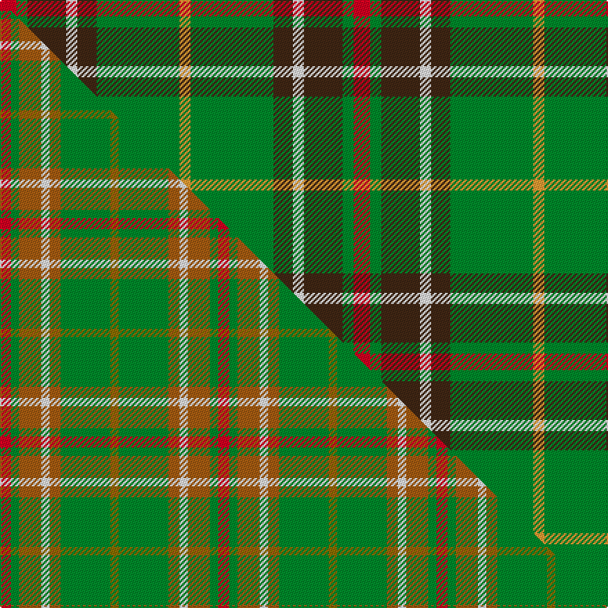

This page is one **sett** — a single exact thread-count. It belongs to the [tartan](/setts/r6g4do14w4do7g30lo4/)
(the same proportion at any scale), whose colour order is pattern [RGBWBGY](/stripes/rgbwbgy/).

Part of the [Newfoundland](/tartans/newfoundland-2/) tartan — the named design grouping this sett with its other cloths.

Sourced from tartans-authority.  It is a [7 stripe tartan](/stripes/stripes7/).

Original link http://www.tartansauthority.com/tartan-ferret/display/1543/

## Register references

External register numbers recorded for this tartan.

- Scottish Tartans Authority (ITI): 1543

## Thread count
R/12 G8 DO28 W8 DO14 G60 LO/8

One full sett is **256 threads**.

## Palette
<table><thead><tr><th>Colour</th><th>Shade</th><th>OKLCh</th></tr></thead><tbody><tr><td>DO</td><td><code style="background-color:#412714;">#412714</code> <small style="color:#888">#412714</small></td><td><small style="color:#888">oklch(30.1% 0.050 55.7)</small></td></tr><tr><td>LO</td><td><code style="background-color:#FF9C34;">#FF9C34</code> <small style="color:#888">#FF9C34</small></td><td><small style="color:#888">oklch(77.9% 0.161 61.8)</small></td></tr><tr><td>G</td><td><code style="background-color:#008B2A;">#008B2A</code> <small style="color:#888">#008B2A</small></td><td><small style="color:#888">oklch(55.4% 0.170 145.9)</small></td></tr><tr><td>W</td><td><code style="background-color:#F7F7F7;">#F7F7F7</code> <small style="color:#888">#F7F7F7</small></td><td><small style="color:#888">oklch(97.6% 0.000 89.9)</small></td></tr><tr><td>R</td><td><code style="background-color:#D60020;">#D60020</code> <small style="color:#888">#D60020</small></td><td><small style="color:#888">oklch(55.2% 0.224 25.5)</small></td></tr></tbody></table>

# Sample pattern

## Compared to the master

This cloth is one sett of its design; the master sett (the exemplar the design is anchored on) is below for comparison.

Its **ΔTartan distance** from the master is **0.63** — the same measure the nearest-tartans table ranks by (0 is identical; a re-scale of the same cloth is near 0, a recolour or a different proportion further).

<figure class="master-compare" style="margin:0">

this sett
master sett ★

<figcaption style="color:#888;font-size:smaller">One weave of this sett against the <a href="/setts/r4g3o8w3o4g18y3/">master sett ★</a>, split on the diagonal: a shared proportion runs seamlessly across it with only the shades shifting; a different proportion breaks on it.</figcaption>
</figure>

## Nearest tartan variants

The nearest existing variants by ΔTartan distance, with this cloth at the top so the swatches line up against it.

ΔTartan

Threads

Variant

Sett

—

256

<a href="/variants/s7/r6g4do14w4do7g30lo4~x2/">Newfoundland (District)</a>

<a href="/ttd/edit/#slug=r4g3dy8w3dy4g18y3~x2&amp;base=r6g4do14w4do7g30lo4~x2" title="compare in the TTD">2.17</a>

158

<a href="/variants/s7/r4g3dy8w3dy4g18y3~x2/">Newfoundland District Tartan</a>

<a href="/ttd/edit/#slug=r6g4dy14w4dy7g30y4~x2&amp;base=r6g4do14w4do7g30lo4~x2" title="compare in the TTD">2.22</a>

256

<a href="/variants/s7/r6g4dy14w4dy7g30y4~x2/">Newfoundland</a>

<a href="/ttd/edit/#slug=g4lo1dt1lo1dt2g9r1dt6w1~x4&amp;base=r6g4do14w4do7g30lo4~x2" title="compare in the TTD">2.25</a>

188

<a href="/variants/s9/g4lo1dt1lo1dt2g9r1dt6w1~x4/">Casey of West Virginia (Personal)</a>

<a href="/ttd/edit/#slug=dg13ly2dg2ly2dg4o10g2o2~x4&amp;base=r6g4do14w4do7g30lo4~x2" title="compare in the TTD">2.25</a>

236

<a href="/variants/s8/dg13ly2dg2ly2dg4o10g2o2~x4/">Oakwood</a>

<a href="/ttd/edit/#slug=g15y3r3dp8w2~x6&amp;base=r6g4do14w4do7g30lo4~x2" title="compare in the TTD">2.35</a>

270

<a href="/variants/s5/g15y3r3dp8w2~x6/">ChuMac (Personal)</a>

<a href="/ttd/edit/#slug=dy21r2g18r2g18r2dg8w6dy10~x2&amp;base=r6g4do14w4do7g30lo4~x2" title="compare in the TTD">2.64</a>

286

<a href="/variants/s9/dy21r2g18r2g18r2dg8w6dy10~x2/">Red Dirt Girl</a>

<a href="/ttd/edit/#slug=g19r3lb19r11g19y2db4~x2&amp;base=r6g4do14w4do7g30lo4~x2" title="compare in the TTD">2.74</a>

262

<a href="/variants/s7/g19r3lb19r11g19y2db4~x2/">Rotary Corporate Tartan</a>

<a href="/ttd/edit/#slug=g10dp42r5dg42g42ly5g6~g2408144-dg1806142&amp;base=r6g4do14w4do7g30lo4~x2" title="compare in the TTD">2.74</a>

288

<a href="/variants/s7/g10dp42r5dg42g42ly5g6~g2408144-dg1806142/">New Mexico (Fashion)</a>

<a href="/ttd/edit/#slug=r1g4w1g4y1dr8lb1~x6&amp;base=r6g4do14w4do7g30lo4~x2" title="compare in the TTD">2.80</a>

228

<a href="/variants/s7/r1g4w1g4y1dr8lb1~x6/">George Watson's College</a>

<a href="/ttd/edit/#slug=r5dt12g3db4g20dt3g3r5~x4&amp;base=r6g4do14w4do7g30lo4~x2" title="compare in the TTD">2.80</a>

400

<a href="/variants/s8/r5dt12g3db4g20dt3g3r5~x4/">Daks (0600150)</a>

## Neighbour map

Every grey dot is one of 13620 variants placed by the first two principal components of the ΔTartan feature space (42% of its variance). Red is this tartan; blue dots are its nearest — click one to open its page.

<svg viewBox="0 0 640 380" role="img" style="max-width:100%;height:auto;border:1px solid #e0e0e0;border-radius:4px;display:block" xmlns="http://www.w3.org/2000/svg"><image href="/nn/cloud.v1.png" width="640" height="380"/><a href="/variants/s7/r4g3dy8w3dy4g18y3~x2/"><circle cx="228.5" cy="222.3" r="4" fill="#3465a4"><title>Newfoundland District Tartan</title></circle></a><a href="/variants/s7/r6g4dy14w4dy7g30y4~x2/"><circle cx="249.4" cy="209.7" r="4" fill="#3465a4"><title>Newfoundland</title></circle></a><a href="/variants/s9/g4lo1dt1lo1dt2g9r1dt6w1~x4/"><circle cx="256.7" cy="190.0" r="4" fill="#3465a4"><title>Casey of West Virginia (Personal)</title></circle></a><a href="/variants/s8/dg13ly2dg2ly2dg4o10g2o2~x4/"><circle cx="285.3" cy="222.9" r="4" fill="#3465a4"><title>Oakwood</title></circle></a><a href="/variants/s5/g15y3r3dp8w2~x6/"><circle cx="224.9" cy="225.0" r="4" fill="#3465a4"><title>ChuMac (Personal)</title></circle></a><a href="/variants/s9/dy21r2g18r2g18r2dg8w6dy10~x2/"><circle cx="200.0" cy="200.5" r="4" fill="#3465a4"><title>Red Dirt Girl</title></circle></a><a href="/variants/s7/g19r3lb19r11g19y2db4~x2/"><circle cx="238.7" cy="220.5" r="4" fill="#3465a4"><title>Rotary Corporate Tartan</title></circle></a><a href="/variants/s7/g10dp42r5dg42g42ly5g6~g2408144-dg1806142/"><circle cx="200.3" cy="217.4" r="4" fill="#3465a4"><title>New Mexico (Fashion)</title></circle></a><a href="/variants/s7/r1g4w1g4y1dr8lb1~x6/"><circle cx="188.3" cy="191.1" r="4" fill="#3465a4"><title>George Watson's College</title></circle></a><a href="/variants/s8/r5dt12g3db4g20dt3g3r5~x4/"><circle cx="247.5" cy="227.7" r="4" fill="#3465a4"><title>Daks (0600150)</title></circle></a><circle cx="238.5" cy="204.9" r="5" fill="#c00000"/><text x="320" y="376" text-anchor="middle" font-size="11" fill="#999">ground</text><text x="11" y="190" text-anchor="middle" font-size="11" fill="#999" transform="rotate(-90 11 190)">complexity</text></svg>

ID: /variants/s7/r6g4do14w4do7g30lo4~x2/
