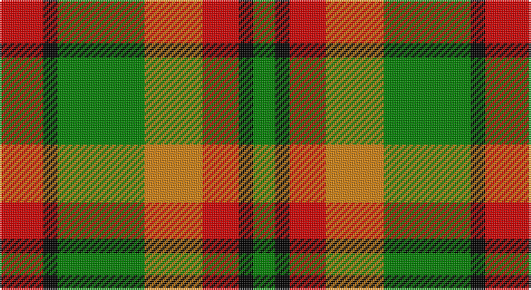

This page is one **sett** — a single exact thread-count. It belongs to the [tartan](/setts/r6k2g12lo8r5k2g3/)
(the same proportion at any scale), whose colour order is pattern [GKRYGKR](/stripes/gkrygkr/).

Sourced from weddslist.  It is a [7 stripe tartan](/stripes/stripes7/).

Original link http://www.weddslist.com/cgi-bin/tartans/pg.pl?source=sts

## Thread count
R/24 K8 G48 O32 R20 K8 G/12

One full sett is **268 threads**.

## Palette

Palette: <strong>Ingles Buchan</strong> <small style="color:#888">(1 of 4 colours)</small>
<table><thead><tr><th>Colour</th><th>Threads</th><th>Shade</th><th>Base</th><th>OKLCh</th></tr></thead><tbody><tr><td>R/</td><td style="text-align:right;font-variant-numeric:tabular-nums">24</td><td><code style="background-color:#D00000;">#D00000</code> <small style="color:#888">#D00000</small></td><td>R <code style="background-color:#CC0000;">#CC0000</code></td><td><small style="color:#888">oklch(53.9% 0.221 29.2)</small></td></tr><tr><td>K</td><td style="text-align:right;font-variant-numeric:tabular-nums">8</td><td><code style="background-color:#000000;">#000000</code> <small style="color:#888">#000000</small></td><td>K <code style="background-color:#000000;">#000000</code></td><td><small style="color:#888">oklch(0.0% 0.000 0.0)</small></td></tr><tr><td>G</td><td style="text-align:right;font-variant-numeric:tabular-nums">48</td><td><code style="background-color:#008000;">#008000</code> <small style="color:#888">#008000</small></td><td>G <code style="background-color:#006100;">#006100</code></td><td><small style="color:#888">oklch(52.0% 0.177 142.5)</small></td></tr><tr><td>O</td><td style="text-align:right;font-variant-numeric:tabular-nums">32</td><td><code style="background-color:#D08010;">#D08010</code> <small style="color:#888">#D08010</small></td><td>Y <code style="background-color:#F2BF00;">#F2BF00</code></td><td><small style="color:#888">oklch(67.0% 0.145 66.1)</small></td></tr><tr><td>R</td><td style="text-align:right;font-variant-numeric:tabular-nums">20</td><td><code style="background-color:#D00000;">#D00000</code> <small style="color:#888">#D00000</small></td><td>R <code style="background-color:#CC0000;">#CC0000</code></td><td><small style="color:#888">oklch(53.9% 0.221 29.2)</small></td></tr><tr><td>K</td><td style="text-align:right;font-variant-numeric:tabular-nums">8</td><td><code style="background-color:#000000;">#000000</code> <small style="color:#888">#000000</small></td><td>K <code style="background-color:#000000;">#000000</code></td><td><small style="color:#888">oklch(0.0% 0.000 0.0)</small></td></tr><tr><td>G/</td><td style="text-align:right;font-variant-numeric:tabular-nums">12</td><td><code style="background-color:#008000;">#008000</code> <small style="color:#888">#008000</small></td><td>G <code style="background-color:#006100;">#006100</code></td><td><small style="color:#888">oklch(52.0% 0.177 142.5)</small></td></tr></tbody></table>

# Sample pattern

## Nearest tartans

The nearest existing variants by ΔTartan distance, with this tartan at the top so the swatches line up against it.

ΔTartan

Tartan

Sett

—

<a href="/ttd/edit/#slug=r6k2g12lo8r5k2g3~x4">Londonderry</a> <a class="nn-out" href="/variants/s7/r6k2g12lo8r5k2g3~x4/" title="open its dictionary page">↗</a>

1.09

<a href="/ttd/edit/#slug=o6k2dg12lo8o5k2dg3~x4&amp;base=r6k2g12lo8r5k2g3~x4">Londonderry, County</a> <a class="nn-out" href="/variants/s7/o6k2dg12lo8o5k2dg3~x4/" title="open its dictionary page">↗</a>

1.29

<a href="/ttd/edit/#slug=r2g4db8r9g9k2r2~x2&amp;base=r6k2g12lo8r5k2g3~x4">Stewart, Plaid</a> <a class="nn-out" href="/variants/s7/r2g4db8r9g9k2r2~x2/" title="open its dictionary page">↗</a>

1.34

<a href="/ttd/edit/#slug=g9ly2g9w5r9t2r9t2~x2&amp;base=r6k2g12lo8r5k2g3~x4">Blackie</a> <a class="nn-out" href="/variants/s8/g9ly2g9w5r9t2r9t2~x2/" title="open its dictionary page">↗</a>

1.34

<a href="/ttd/edit/#slug=r2ly1r5k4g5w1~x4&amp;base=r6k2g12lo8r5k2g3~x4">Aboyne II (Fashion)</a> <a class="nn-out" href="/variants/s6/r2ly1r5k4g5w1~x4/" title="open its dictionary page">↗</a>

1.35

<a href="/ttd/edit/#slug=k3lo18k12lo18k2lo2k3~x2&amp;base=r6k2g12lo8r5k2g3~x4">Kinloch Anderson Check (Fashion)</a> <a class="nn-out" href="/variants/s7/k3lo18k12lo18k2lo2k3~x2/" title="open its dictionary page">↗</a>

1.35

<a href="/ttd/edit/#slug=dg20r8lr2r8dg5ly8dg2ly8~x2&amp;base=r6k2g12lo8r5k2g3~x4">Unidentified #57</a> <a class="nn-out" href="/variants/s8/dg20r8lr2r8dg5ly8dg2ly8~x2/" title="open its dictionary page">↗</a>

1.37

<a href="/ttd/edit/#slug=g10lo8r5k2g3k2r5lo8g12k2r6k2g2~x4&amp;base=r6k2g12lo8r5k2g3~x4">Londonderry Irish County Tartan</a> <a class="nn-out" href="/variants/s13/g10lo8r5k2g3k2r5lo8g12k2r6k2g2~x4/" title="open its dictionary page">↗</a>

1.40

<a href="/ttd/edit/#slug=dy3k7dy2w2lo12k2lo2dy3~x2&amp;base=r6k2g12lo8r5k2g3~x4">Daks (Brown)</a> <a class="nn-out" href="/variants/s8/dy3k7dy2w2lo12k2lo2dy3~x2/" title="open its dictionary page">↗</a>

1.45

<a href="/ttd/edit/#slug=g13ly16w4ly4r4ly4k20ly8r8~x2&amp;base=r6k2g12lo8r5k2g3~x4">Cawte of Middlebanknock (Personal)</a> <a class="nn-out" href="/variants/s9/g13ly16w4ly4r4ly4k20ly8r8~x2/" title="open its dictionary page">↗</a>

1.47

<a href="/ttd/edit/#slug=g6lr2g10k3r1k3lo10lr2lo6~x4&amp;base=r6k2g12lo8r5k2g3~x4">Eire (District?)</a> <a class="nn-out" href="/variants/s9/g6lr2g10k3r1k3lo10lr2lo6~x4/" title="open its dictionary page">↗</a>

## Neighbour map

Every grey dot is one of 14360 variants placed by the first two principal components of the ΔTartan feature space (44% of its variance). Red is this tartan; blue dots are its nearest — click one to open its page.

<svg viewBox="0 0 640 380" role="img" style="max-width:100%;height:auto;border:1px solid #e0e0e0;border-radius:4px;display:block" xmlns="http://www.w3.org/2000/svg"><image href="/nn/cloud.v1.png" width="640" height="380"/><a href="/variants/s7/o6k2dg12lo8o5k2dg3~x4/"><circle cx="170.0" cy="241.7" r="4" fill="#3465a4"><title>Londonderry, County</title></circle></a><a href="/variants/s7/r2g4db8r9g9k2r2~x2/"><circle cx="145.6" cy="247.8" r="4" fill="#3465a4"><title>Stewart, Plaid</title></circle></a><a href="/variants/s8/g9ly2g9w5r9t2r9t2~x2/"><circle cx="114.2" cy="219.4" r="4" fill="#3465a4"><title>Blackie</title></circle></a><a href="/variants/s6/r2ly1r5k4g5w1~x4/"><circle cx="112.9" cy="222.9" r="4" fill="#3465a4"><title>Aboyne II (Fashion)</title></circle></a><a href="/variants/s7/k3lo18k12lo18k2lo2k3~x2/"><circle cx="160.8" cy="182.7" r="4" fill="#3465a4"><title>Kinloch Anderson Check (Fashion)</title></circle></a><a href="/variants/s8/dg20r8lr2r8dg5ly8dg2ly8~x2/"><circle cx="223.3" cy="211.1" r="4" fill="#3465a4"><title>Unidentified #57</title></circle></a><a href="/variants/s13/g10lo8r5k2g3k2r5lo8g12k2r6k2g2~x4/"><circle cx="145.8" cy="203.6" r="4" fill="#3465a4"><title>Londonderry Irish County Tartan</title></circle></a><a href="/variants/s8/dy3k7dy2w2lo12k2lo2dy3~x2/"><circle cx="178.8" cy="205.2" r="4" fill="#3465a4"><title>Daks (Brown)</title></circle></a><a href="/variants/s9/g13ly16w4ly4r4ly4k20ly8r8~x2/"><circle cx="86.4" cy="190.3" r="4" fill="#3465a4"><title>Cawte of Middlebanknock (Personal)</title></circle></a><a href="/variants/s9/g6lr2g10k3r1k3lo10lr2lo6~x4/"><circle cx="135.1" cy="176.6" r="4" fill="#3465a4"><title>Eire (District?)</title></circle></a><circle cx="148.3" cy="225.5" r="5" fill="#c00000"/></svg>

ID: /variants/s7/r6k2g12lo8r5k2g3~x4/
