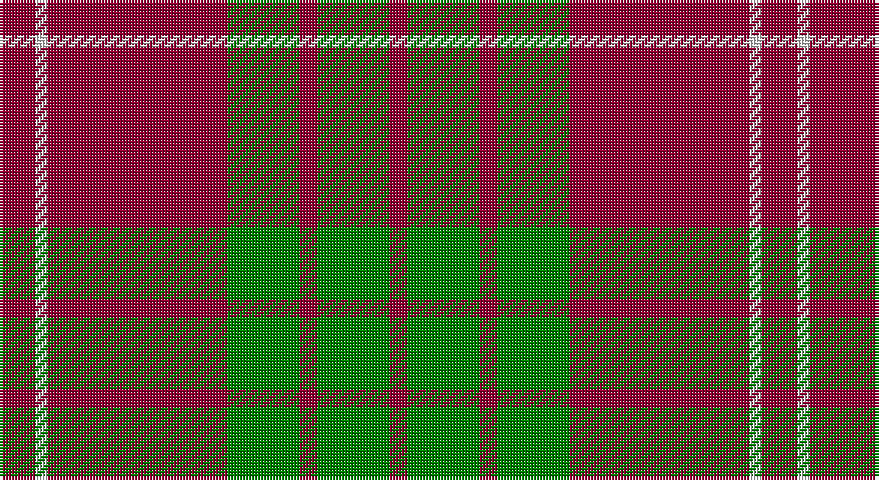

This page is one **sett** — a single exact thread-count. It belongs to the [tartan](/setts/r6w2r30g12r3g12r3/)
(the same proportion at any scale), whose colour order is pattern [RGRGRWR](/stripes/rgrgrwr/).

Sourced from weddslist.  It is a [7 stripe tartan](/stripes/stripes7/).

Original link http://www.weddslist.com/cgi-bin/tartans/pg.pl?source=sts

## Thread count
DR/12 LN4 DR60 G24 DR6 G24 DR/6

One full sett is **254 threads**.

## Palette

Palette: <strong>Tartan Dictionary</strong> <small style="color:#888">(1 of 3 colours)</small>
<table><thead><tr><th>Colour</th><th>Threads</th><th>Shade</th><th>Base</th><th>OKLCh</th></tr></thead><tbody><tr><td>DR/</td><td style="text-align:right;font-variant-numeric:tabular-nums">12</td><td><code style="background-color:#900030;">#900030</code> <small style="color:#888">#900030</small></td><td>R <code style="background-color:#CC0000;">#CC0000</code></td><td><small style="color:#888">oklch(41.6% 0.166 13.6)</small></td></tr><tr><td>LN</td><td style="text-align:right;font-variant-numeric:tabular-nums">4</td><td><code style="background-color:#E0E0E0;">#E0E0E0</code> <small style="color:#888">#E0E0E0</small></td><td>W <code style="background-color:#F7F7F7;">#F7F7F7</code></td><td><small style="color:#888">oklch(90.7% 0.000 89.9)</small></td></tr><tr><td>DR</td><td style="text-align:right;font-variant-numeric:tabular-nums">60</td><td><code style="background-color:#900030;">#900030</code> <small style="color:#888">#900030</small></td><td>R <code style="background-color:#CC0000;">#CC0000</code></td><td><small style="color:#888">oklch(41.6% 0.166 13.6)</small></td></tr><tr><td>G</td><td style="text-align:right;font-variant-numeric:tabular-nums">24</td><td><code style="background-color:#008000;">#008000</code> <small style="color:#888">#008000</small></td><td>G <code style="background-color:#006100;">#006100</code></td><td><small style="color:#888">oklch(52.0% 0.177 142.5)</small></td></tr><tr><td>DR</td><td style="text-align:right;font-variant-numeric:tabular-nums">6</td><td><code style="background-color:#900030;">#900030</code> <small style="color:#888">#900030</small></td><td>R <code style="background-color:#CC0000;">#CC0000</code></td><td><small style="color:#888">oklch(41.6% 0.166 13.6)</small></td></tr><tr><td>G</td><td style="text-align:right;font-variant-numeric:tabular-nums">24</td><td><code style="background-color:#008000;">#008000</code> <small style="color:#888">#008000</small></td><td>G <code style="background-color:#006100;">#006100</code></td><td><small style="color:#888">oklch(52.0% 0.177 142.5)</small></td></tr><tr><td>DR/</td><td style="text-align:right;font-variant-numeric:tabular-nums">6</td><td><code style="background-color:#900030;">#900030</code> <small style="color:#888">#900030</small></td><td>R <code style="background-color:#CC0000;">#CC0000</code></td><td><small style="color:#888">oklch(41.6% 0.166 13.6)</small></td></tr></tbody></table>

# Sample pattern

## Nearest tartans

The nearest existing variants by ΔTartan distance, with this tartan at the top so the swatches line up against it.

ΔTartan

Tartan

Sett

—

<a href="/ttd/edit/#slug=r6w2r30g12r3g12r3~x2">Crawford</a> <a class="nn-out" href="/variants/s7/r6w2r30g12r3g12r3~x2/" title="open its dictionary page">↗</a>

0.71

<a href="/ttd/edit/#slug=m6w2m30g12m3g12m3~x2&amp;base=r6w2r30g12r3g12r3~x2">Crawford (Clan)</a> <a class="nn-out" href="/variants/s7/m6w2m30g12m3g12m3~x2/" title="open its dictionary page">↗</a>

0.80

<a href="/ttd/edit/#slug=m6lb2m30g12m3g12m3~x2&amp;base=r6w2r30g12r3g12r3~x2">Crawford</a> <a class="nn-out" href="/variants/s7/m6lb2m30g12m3g12m3~x2/" title="open its dictionary page">↗</a>

0.90

<a href="/ttd/edit/#slug=r6lb2r30dg12r3dg12r3&amp;base=r6w2r30g12r3g12r3~x2">Crawford</a> <a class="nn-out" href="/variants/s7/r6lb2r30dg12r3dg12r3/" title="open its dictionary page">↗</a>

0.97

<a href="/ttd/edit/#slug=r1dg6r1dg6r15ly1~x2&amp;base=r6w2r30g12r3g12r3~x2">Cameron Clan D</a> <a class="nn-out" href="/variants/s6/r1dg6r1dg6r15ly1~x2/" title="open its dictionary page">↗</a>

0.99

<a href="/ttd/edit/#slug=r2dg6r2dg6r16ly1~x2&amp;base=r6w2r30g12r3g12r3~x2">Cameron</a> <a class="nn-out" href="/variants/s6/r2dg6r2dg6r16ly1~x2/" title="open its dictionary page">↗</a>

1.05

<a href="/ttd/edit/#slug=r2g6r2g6r16ly1~x4&amp;base=r6w2r30g12r3g12r3~x2">Cameron (Clan)</a> <a class="nn-out" href="/variants/s6/r2g6r2g6r16ly1~x4/" title="open its dictionary page">↗</a>

1.07

<a href="/ttd/edit/#slug=r4g14r5k6r24g2r4~x2&amp;base=r6w2r30g12r3g12r3~x2">Auld Lang Syne (red) Tartan</a> <a class="nn-out" href="/variants/s7/r4g14r5k6r24g2r4~x2/" title="open its dictionary page">↗</a>

1.10

<a href="/ttd/edit/#slug=r16db6r2g6r2db1~x2&amp;base=r6w2r30g12r3g12r3~x2">MacKintosh, Plaid</a> <a class="nn-out" href="/variants/s6/r16db6r2g6r2db1~x2/" title="open its dictionary page">↗</a>

1.10

<a href="/ttd/edit/#slug=r1g10r1db4r18g1~x4&amp;base=r6w2r30g12r3g12r3~x2">Robertson 6</a> <a class="nn-out" href="/variants/s6/r1g10r1db4r18g1~x4/" title="open its dictionary page">↗</a>

1.10

<a href="/ttd/edit/#slug=r2db1r16db4r1g10r1~x4&amp;base=r6w2r30g12r3g12r3~x2">Robertson - 1988 (Corporate)</a> <a class="nn-out" href="/variants/s7/r2db1r16db4r1g10r1~x4/" title="open its dictionary page">↗</a>

## Neighbour map

Every grey dot is one of 14360 variants placed by the first two principal components of the ΔTartan feature space (44% of its variance). Red is this tartan; blue dots are its nearest — click one to open its page.

<svg viewBox="0 0 640 380" role="img" style="max-width:100%;height:auto;border:1px solid #e0e0e0;border-radius:4px;display:block" xmlns="http://www.w3.org/2000/svg"><image href="/nn/cloud.v1.png" width="640" height="380"/><a href="/variants/s7/m6w2m30g12m3g12m3~x2/"><circle cx="419.7" cy="200.9" r="4" fill="#3465a4"><title>Crawford (Clan)</title></circle></a><a href="/variants/s7/m6lb2m30g12m3g12m3~x2/"><circle cx="425.7" cy="204.0" r="4" fill="#3465a4"><title>Crawford</title></circle></a><a href="/variants/s7/r6lb2r30dg12r3dg12r3/"><circle cx="416.0" cy="194.0" r="4" fill="#3465a4"><title>Crawford</title></circle></a><a href="/variants/s6/r1dg6r1dg6r15ly1~x2/"><circle cx="393.3" cy="195.9" r="4" fill="#3465a4"><title>Cameron Clan D</title></circle></a><a href="/variants/s6/r2dg6r2dg6r16ly1~x2/"><circle cx="413.4" cy="199.1" r="4" fill="#3465a4"><title>Cameron</title></circle></a><a href="/variants/s6/r2g6r2g6r16ly1~x4/"><circle cx="420.6" cy="202.7" r="4" fill="#3465a4"><title>Cameron (Clan)</title></circle></a><a href="/variants/s7/r4g14r5k6r24g2r4~x2/"><circle cx="393.5" cy="206.4" r="4" fill="#3465a4"><title>Auld Lang Syne (red) Tartan</title></circle></a><a href="/variants/s6/r16db6r2g6r2db1~x2/"><circle cx="401.6" cy="202.3" r="4" fill="#3465a4"><title>MacKintosh, Plaid</title></circle></a><a href="/variants/s6/r1g10r1db4r18g1~x4/"><circle cx="396.6" cy="186.7" r="4" fill="#3465a4"><title>Robertson 6</title></circle></a><a href="/variants/s7/r2db1r16db4r1g10r1~x4/"><circle cx="374.6" cy="178.0" r="4" fill="#3465a4"><title>Robertson - 1988 (Corporate)</title></circle></a><circle cx="409.9" cy="198.6" r="5" fill="#c00000"/></svg>

ID: /variants/s7/r6w2r30g12r3g12r3~x2/
