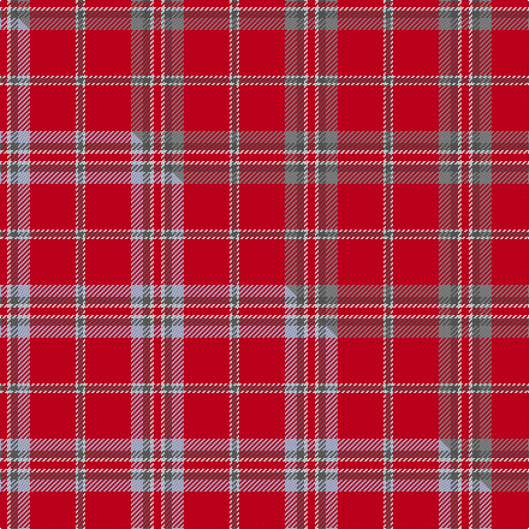

This page is one **sett** — a single exact thread-count. It belongs to the [tartan](/setts/r6w3n6o10r38w2n4/)
(the same proportion at any scale), whose colour order is pattern [BWRRBWR](/stripes/bwrrbwr/).

Part of the [Washington State University Cougar](/tartans/washington-state-university-cougar/) tartan — the named design grouping this sett with its other cloths.

Sourced from tartans-authority.  It is a [7 stripe tartan](/stripes/stripes7/).

Original link http://www.tartansauthority.com/tartan-ferret/display/10831/

## Register references

External register numbers recorded for this tartan.

- Scottish Register of Tartans: [10831](https://www.tartanregister.gov.uk/tartanDetails?ref=10831)
- Scottish Tartans Authority (ITI): 10831

## Thread count
R/6 W3 N6 O10 R38 W2 N/4

One full sett is **128 threads**.

## Palette
<table><thead><tr><th>Colour</th><th>Shade</th><th>OKLCh</th></tr></thead><tbody><tr><td>W</td><td><code style="background-color:#F7F7F7;">#F7F7F7</code> <small style="color:#888">#F7F7F7</small></td><td><small style="color:#888">oklch(97.6% 0.000 89.9)</small></td></tr><tr><td>N</td><td><code style="background-color:#5C5C5C;">#5C5C5C</code> <small style="color:#888">#5C5C5C</small></td><td><small style="color:#888">oklch(47.5% 0.000 89.9)</small></td></tr><tr><td>O</td><td><code style="background-color:#888888;">#888888</code> <small style="color:#888">#888888</small></td><td><small style="color:#888">oklch(62.7% 0.000 89.9)</small></td></tr><tr><td>R</td><td><code style="background-color:#D60020;">#D60020</code> <small style="color:#888">#D60020</small></td><td><small style="color:#888">oklch(55.2% 0.224 25.5)</small></td></tr></tbody></table>

# Sample pattern

## Compared to the master

This cloth is one sett of its design; the master sett (the exemplar the design is anchored on) is below for comparison.

Its **ΔTartan distance** from the master is **0.86** — the same measure the nearest-tartans table ranks by (0 is identical; a re-scale of the same cloth is near 0, a recolour or a different proportion further).

<figure class="master-compare" style="margin:0">

this sett
master sett ★

<figcaption style="color:#888;font-size:smaller">One weave of this sett against the <a href="/setts/r6w3n6lb10r38w2n4/">master sett ★</a>, split on the diagonal: a shared proportion runs seamlessly across it with only the shades shifting; a different proportion breaks on it.</figcaption>
</figure>

## Nearest variants

The nearest existing variants by ΔTartan distance, with this cloth at the top so the swatches line up against it.

ΔTartan

Threads

Variant

Sett

—

128

<a href="/variants/s7/r6w3n6o10r38w2n4~n1900000-o2500000/">Washington State University Cougar</a>

<a href="/ttd/edit/#slug=r6w3n6lb10r38w2n4&amp;base=r6w3n6o10r38w2n4~n1900000-o2500000" title="compare in the TTD">0.90</a>

128

<a href="/variants/s7/r6w3n6lb10r38w2n4/">Washington State University Cougar</a>

<a href="/ttd/edit/#slug=r12w1r2o1n3~x4~o2500000-n1900000&amp;base=r6w3n6o10r38w2n4~n1900000-o2500000" title="compare in the TTD">1.19</a>

92

<a href="/variants/s5/r12w1r2o1n3~x4~o2500000-n1900000/">Glen Shee Plaid (Fashion)</a>

<a href="/ttd/edit/#slug=r12w1r2lb1n3~x4&amp;base=r6w3n6o10r38w2n4~n1900000-o2500000" title="compare in the TTD">1.50</a>

92

<a href="/variants/s5/r12w1r2lb1n3~x4/">Glenshee</a>

<a href="/ttd/edit/#slug=r35w3r8y2g11~x2&amp;base=r6w3n6o10r38w2n4~n1900000-o2500000" title="compare in the TTD">2.49</a>

144

<a href="/variants/s5/r35w3r8y2g11~x2/">Highlands at Wyomissing, The</a>

<a href="/ttd/edit/#slug=r40db8lo8r4lo1r4lr8~x4&amp;base=r6w3n6o10r38w2n4~n1900000-o2500000" title="compare in the TTD">2.69</a>

392

<a href="/variants/s7/r40db8lo8r4lo1r4lr8~x4/">Wcwm 4907-1</a>

<a href="/ttd/edit/#slug=r40w2db2w2r1y20~x2&amp;base=r6w3n6o10r38w2n4~n1900000-o2500000" title="compare in the TTD">2.80</a>

148

<a href="/variants/s6/r40w2db2w2r1y20~x2/">National Defense</a>

## Neighbour map

Every grey dot is one of 13620 variants placed by the first two principal components of the ΔTartan feature space (42% of its variance). Red is this tartan; blue dots are its nearest — click one to open its page.

<svg viewBox="0 0 640 380" role="img" style="max-width:100%;height:auto;border:1px solid #e0e0e0;border-radius:4px;display:block" xmlns="http://www.w3.org/2000/svg"><image href="/nn/cloud.v1.png" width="640" height="380"/><a href="/variants/s7/r6w3n6lb10r38w2n4/"><circle cx="424.2" cy="157.4" r="4" fill="#3465a4"><title>Washington State University Cougar</title></circle></a><a href="/variants/s5/r12w1r2o1n3~x4~o2500000-n1900000/"><circle cx="516.2" cy="195.9" r="4" fill="#3465a4"><title>Glen Shee Plaid (Fashion)</title></circle></a><a href="/variants/s5/r12w1r2lb1n3~x4/"><circle cx="511.8" cy="196.9" r="4" fill="#3465a4"><title>Glenshee</title></circle></a><a href="/variants/s5/r35w3r8y2g11~x2/"><circle cx="485.7" cy="179.8" r="4" fill="#3465a4"><title>Highlands at Wyomissing, The</title></circle></a><a href="/variants/s7/r40db8lo8r4lo1r4lr8~x4/"><circle cx="461.5" cy="127.9" r="4" fill="#3465a4"><title>Wcwm 4907-1</title></circle></a><a href="/variants/s6/r40w2db2w2r1y20~x2/"><circle cx="474.1" cy="136.7" r="4" fill="#3465a4"><title>National Defense</title></circle></a><circle cx="439.6" cy="160.4" r="5" fill="#c00000"/><text x="320" y="376" text-anchor="middle" font-size="11" fill="#999">ground</text><text x="11" y="190" text-anchor="middle" font-size="11" fill="#999" transform="rotate(-90 11 190)">complexity</text></svg>

ID: /variants/s7/r6w3n6o10r38w2n4~n1900000-o2500000/
