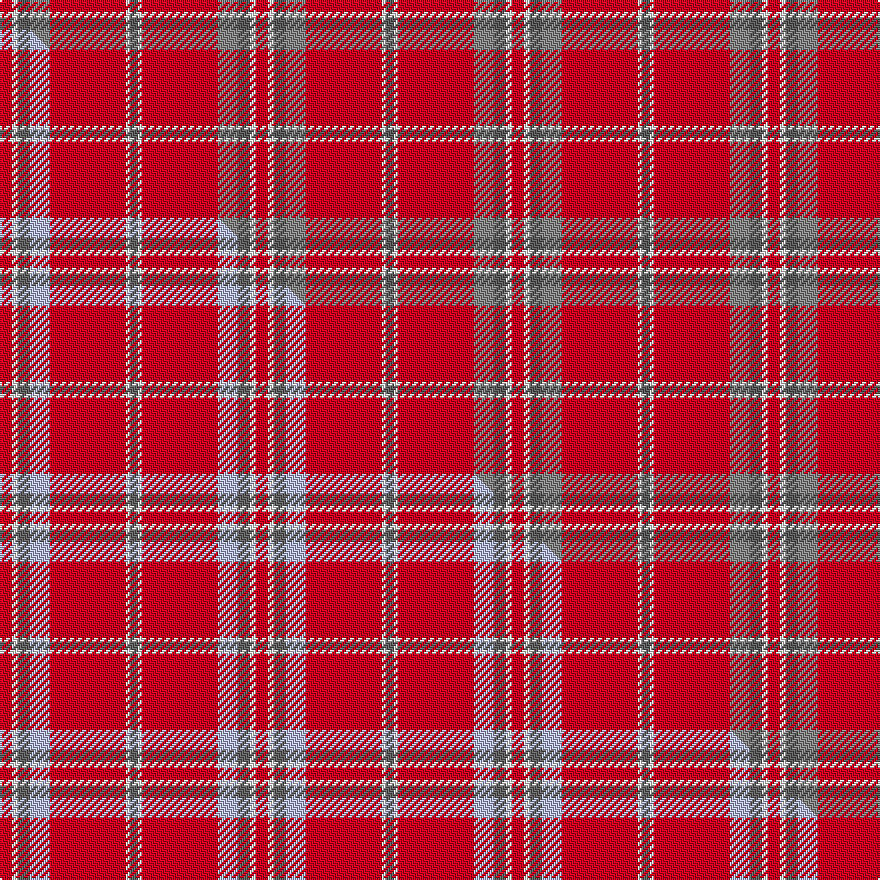

This is one **variant** — a specific cloth: this exact thread count and colourway, with its own
provenance below. It is one weaving of the [sett](/tartans/w/wa/washington-state-university-cougar/) (the scale-free proportion — the
same cloth at any scale or shade), whose colour order is pattern [BWRRBWR](/stripes/bwrrbwr/).

Part of the [Washington State University Cougar](/tartans/w/wa/washington-state-university-cougar/) tartan — the named design grouping this sett with its other cloths.

Sourced from tartans-authority.  It is a [7 stripe tartan](/stripes/stripes7/).

Original link <code>http://www.tartansauthority.com/tartan-ferret/display/10831/</code> — retired · [Internet Archive copy](https://web.archive.org/web/*/http://www.tartansauthority.com/tartan-ferret/display/10831/*)

Dataset <small>— provenance for this record, inherited from the source manifest</small>

<dl class="dataset-prov">
<dt>source</dt><dd><a href="/sources/tartans-authority/">Scottish Tartans Authority</a></dd>
<dt>data captured from</dt><dd><a href="https://github.com/thetartan/tartan-database/blob/master/data/tartans-authority/data.csv">https://github.com/thetartan/tartan-database/blob/master/data/tartans-authority/data.csv</a></dd>
<dt>data date</dt><dd>01/09/2012 <small>(this record)</small></dd>
<dt>licence</dt><dd><a href="https://creativecommons.org/licenses/by-nc-nd/4.0/">CC BY-NC-ND 4.0</a></dd>
</dl>

Capture chain <small>— the hands this data passed through, oldest first; each capture carries its own licence</small>

<ol class="capture-chain">
<li><a href="https://www.tartansauthority.com/">Scottish Tartans Authority</a> <small>the heritage body’s archive — its tartan-ferret record browser is retired; dead record links are shown unlinked, with an Internet Archive copy (ITI numbers are not SRT references)</small></li>
<li><a href="https://github.com/thetartan/tartan-database">thetartan/tartan-database</a> <small>2016-2017</small> · <a href="https://creativecommons.org/licenses/by-nc-nd/4.0/">CC BY-NC-ND 4.0</a> <small>Levko Kravets's frozen compilation — the capture we vendored, and where its CC licence text came from</small></li>
<li>this dictionary <small>captured 2026-06-10 · commit 5bf86c7566</small> <small>each re-capture is a git commit to data/sources</small></li>
</ol>

## Register references

External register numbers recorded for this tartan.

- Scottish Register of Tartans: [10831](https://www.tartanregister.gov.uk/tartanDetails?ref=10831)
- Scottish Tartans Authority (ITI): 10831

## Thread count
R/6 W3 N6 O10 R38 W2 N/4

One full sett is **128 threads**.

## Palette
<table><thead><tr><th>Colour</th><th>Shade</th><th>OKLCh</th></tr></thead><tbody><tr><td>W</td><td><code style="background-color:#F7F7F7;">#F7F7F7</code> <small style="color:#888">#F7F7F7</small></td><td><small style="color:#888">oklch(97.6% 0.000 89.9)</small></td></tr><tr><td>N</td><td><code style="background-color:#5C5C5C;">#5C5C5C</code> <small style="color:#888">#5C5C5C</small></td><td><small style="color:#888">oklch(47.5% 0.000 89.9)</small></td></tr><tr><td>O</td><td><code style="background-color:#888888;">#888888</code> <small style="color:#888">#888888</small></td><td><small style="color:#888">oklch(62.7% 0.000 89.9)</small></td></tr><tr><td>R</td><td><code style="background-color:#D60020;">#D60020</code> <small style="color:#888">#D60020</small></td><td><small style="color:#888">oklch(55.2% 0.224 25.5)</small></td></tr></tbody></table>

# Sample pattern

## Compared to the master

This cloth is one sett of its design; the master sett (the exemplar the design is anchored on) is below for comparison.

Its **ΔTartan distance** from the master is **0.90** — the same measure the nearest-tartans table ranks by (0 is identical; a re-scale of the same cloth is near 0, a recolour or a different proportion further).

<figure class="master-compare" style="margin:0">

this sett
master sett ★

<figcaption style="color:#888;font-size:smaller">One weave of this sett against the <a href="/setts/r6w3n6lb10r38w2n4/">master sett ★</a>, split on the diagonal: a shared proportion runs seamlessly across it with only the shades shifting; a different proportion breaks on it.</figcaption>
</figure>

## Nearest tartan variants

The nearest existing variants by ΔTartan distance, with this cloth at the top so the swatches line up against it.

ΔTartan

Threads

Variant

Sett

—

128

<a href="/variants/s7/r6w3n6o10r38w2n4~n47-o62/">Washington State University Cougar</a>

<a href="/ttd/edit/#slug=r6w3n6lb10r38w2n4&amp;base=r6w3n6o10r38w2n4~n47-o62" title="compare in the TTD">0.90</a>

128

<a href="/variants/s7/r6w3n6lb10r38w2n4/">Washington State University Cougar</a>

<a href="/ttd/edit/#slug=r12w1r2o1n3~x4~o62-n47&amp;base=r6w3n6o10r38w2n4~n47-o62" title="compare in the TTD">1.20</a>

92

<a href="/variants/s5/r12w1r2o1n3~x4~o62-n47/">Glen Shee Plaid (Fashion)</a>

<a href="/ttd/edit/#slug=r12w1r2lb1n3~x4&amp;base=r6w3n6o10r38w2n4~n47-o62" title="compare in the TTD">1.50</a>

92

<a href="/variants/s5/r12w1r2lb1n3~x4/">Glenshee Trade Tartan</a>

<a href="/ttd/edit/#slug=r40db8lo8r4lo1r4lr8~x4&amp;base=r6w3n6o10r38w2n4~n47-o62" title="compare in the TTD">2.82</a>

392

<a href="/variants/s7/r40db8lo8r4lo1r4lr8~x4/">Wcwm 4907-1</a>

<a href="/ttd/edit/#slug=r40w2db2w2r1y20~x2&amp;base=r6w3n6o10r38w2n4~n47-o62" title="compare in the TTD">2.93</a>

148

<a href="/variants/s6/r40w2db2w2r1y20~x2/">National Defense</a>

<a href="/ttd/edit/#slug=r24t3w1g9r12~x8&amp;base=r6w3n6o10r38w2n4~n47-o62" title="compare in the TTD">2.95</a>

496

<a href="/variants/s5/r24t3w1g9r12~x8/">Menzies</a>

<a href="/ttd/edit/#slug=r35w3r8y2g11~x2&amp;base=r6w3n6o10r38w2n4~n47-o62" title="compare in the TTD">3.03</a>

144

<a href="/variants/s5/r35w3r8y2g11~x2/">Highlands at Wyomissing, The</a>

<a href="/ttd/edit/#slug=r4dg13r3dp4r3dp3r40dp3r2ly4~x2&amp;base=r6w3n6o10r38w2n4~n47-o62" title="compare in the TTD">3.08</a>

300

<a href="/variants/s10/r4dg13r3dp4r3dp3r40dp3r2ly4~x2/">Galway, County</a>

<a href="/ttd/edit/#slug=r12w1r2dg1b3~x4&amp;base=r6w3n6o10r38w2n4~n47-o62" title="compare in the TTD">3.13</a>

92

<a href="/variants/s5/r12w1r2dg1b3~x4/">Glenshee</a>

<a href="/ttd/edit/#slug=r100db10w5db14y4dbi8y4r24~db2609279-dbi3514276&amp;base=r6w3n6o10r38w2n4~n47-o62" title="compare in the TTD">3.15</a>

214

<a href="/variants/s8/r100db10w5db14y4dbi8y4r24~db2609279-dbi3514276/">Earl of Inverness (Royal)</a>

## Neighbour map

Every grey dot is one of 13662 variants placed by the first two principal components of the ΔTartan feature space (42% of its variance). Red is this tartan; blue dots are its nearest — click one to open its page. The map is a flat projection of a many-dimensional space — [how to read it](/posts/neighbourhood-maps/).

<svg viewBox="0 0 640 380" role="img" style="max-width:100%;height:auto;border:1px solid #e0e0e0;border-radius:4px;display:block" xmlns="http://www.w3.org/2000/svg"><image href="/nn/cloud.v1.png" width="640" height="380"/><a href="/variants/s7/r6w3n6lb10r38w2n4/"><circle cx="424.7" cy="156.8" r="4" fill="#3465a4"><title>Washington State University Cougar</title></circle></a><a href="/variants/s5/r12w1r2o1n3~x4~o62-n47/"><circle cx="516.7" cy="195.1" r="4" fill="#3465a4"><title>Glen Shee Plaid (Fashion)</title></circle></a><a href="/variants/s5/r12w1r2lb1n3~x4/"><circle cx="512.4" cy="196.1" r="4" fill="#3465a4"><title>Glenshee Trade Tartan</title></circle></a><a href="/variants/s7/r40db8lo8r4lo1r4lr8~x4/"><circle cx="462.0" cy="127.2" r="4" fill="#3465a4"><title>Wcwm 4907-1</title></circle></a><a href="/variants/s6/r40w2db2w2r1y20~x2/"><circle cx="474.5" cy="136.1" r="4" fill="#3465a4"><title>National Defense</title></circle></a><a href="/variants/s5/r24t3w1g9r12~x8/"><circle cx="375.7" cy="162.9" r="4" fill="#3465a4"><title>Menzies</title></circle></a><a href="/variants/s5/r35w3r8y2g11~x2/"><circle cx="486.2" cy="178.9" r="4" fill="#3465a4"><title>Highlands at Wyomissing, The</title></circle></a><a href="/variants/s10/r4dg13r3dp4r3dp3r40dp3r2ly4~x2/"><circle cx="432.0" cy="121.5" r="4" fill="#3465a4"><title>Galway, County</title></circle></a><a href="/variants/s5/r12w1r2dg1b3~x4/"><circle cx="476.8" cy="183.1" r="4" fill="#3465a4"><title>Glenshee</title></circle></a><a href="/variants/s8/r100db10w5db14y4dbi8y4r24~db2609279-dbi3514276/"><circle cx="479.4" cy="101.6" r="4" fill="#3465a4"><title>Earl of Inverness (Royal)</title></circle></a><circle cx="440.0" cy="159.8" r="5" fill="#c00000"/><text x="320" y="376" text-anchor="middle" font-size="11" fill="#999">ground</text><text x="11" y="190" text-anchor="middle" font-size="11" fill="#999" transform="rotate(-90 11 190)">complexity</text></svg>

ID: /variants/s7/r6w3n6o10r38w2n4~n47-o62/
