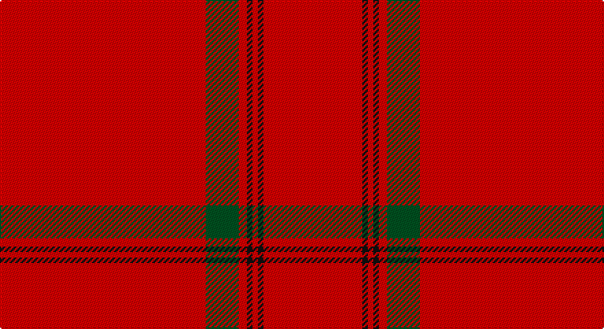

This page is one **sett** — a single exact thread-count. It belongs to the [tartan](/setts/r75dg12r3k2r2k2r36/)
(the same proportion at any scale), whose colour order is pattern [RGRKRKR](/stripes/rgrkrkr/).

Part of the [MacKintosh](/tartans/mackintosh/) tartan — the named design grouping this sett with its other cloths.

Sourced from register-of-tartans.  It is a [7 stripe tartan](/stripes/stripes7/).

Original link https://www.tartanregister.gov.uk/tartanDetails.aspx?ref=2563

## Also known as

This cloth is also recorded under:

- MacKintosh #4
- MacKintosh #5
- MacKintosh #6
- MacKintosh #8
- MacKintosh 4
- MacKintosh 7
- MacKintosh Plaid
- MacKintosh, Arisaid
- MacKintosh, Plaid
- MacKintosh, Red
- MacKintosh, Red Clan/Family
- Mackintosh #7

## Register references

External register numbers recorded for this tartan.

- Scottish Register of Tartans: [2563](https://www.tartanregister.gov.uk/tartanDetails.aspx?ref=2563)
- Scottish Tartans World Register: 1509

## Thread count
R/150 G24 R6 K4 R4 K4 R/72

One full sett is **306 threads**.

## Palette

Palette: <strong>Tartan Register</strong>
<table><thead><tr><th>Colour</th><th>Threads</th><th>Shade</th><th>Base</th><th>OKLCh</th></tr></thead><tbody><tr><td>R/</td><td style="text-align:right;font-variant-numeric:tabular-nums">150</td><td><code style="background-color:#DC0000;">#DC0000</code> <small style="color:#888">#DC0000</small></td><td>R <code style="background-color:#CC0000;">#CC0000</code></td><td><small style="color:#888">oklch(56.2% 0.230 29.2)</small></td></tr><tr><td>G</td><td style="text-align:right;font-variant-numeric:tabular-nums">24</td><td><code style="background-color:#005020;">#005020</code> <small style="color:#888">#005020</small></td><td>G <code style="background-color:#006100;">#006100</code></td><td><small style="color:#888">oklch(37.7% 0.105 149.6)</small></td></tr><tr><td>R</td><td style="text-align:right;font-variant-numeric:tabular-nums">6</td><td><code style="background-color:#DC0000;">#DC0000</code> <small style="color:#888">#DC0000</small></td><td>R <code style="background-color:#CC0000;">#CC0000</code></td><td><small style="color:#888">oklch(56.2% 0.230 29.2)</small></td></tr><tr><td>K</td><td style="text-align:right;font-variant-numeric:tabular-nums">4</td><td><code style="background-color:#101010;">#101010</code> <small style="color:#888">#101010</small></td><td>K <code style="background-color:#000000;">#000000</code></td><td><small style="color:#888">oklch(17.3% 0.000 89.9)</small></td></tr><tr><td>R</td><td style="text-align:right;font-variant-numeric:tabular-nums">4</td><td><code style="background-color:#DC0000;">#DC0000</code> <small style="color:#888">#DC0000</small></td><td>R <code style="background-color:#CC0000;">#CC0000</code></td><td><small style="color:#888">oklch(56.2% 0.230 29.2)</small></td></tr><tr><td>K</td><td style="text-align:right;font-variant-numeric:tabular-nums">4</td><td><code style="background-color:#101010;">#101010</code> <small style="color:#888">#101010</small></td><td>K <code style="background-color:#000000;">#000000</code></td><td><small style="color:#888">oklch(17.3% 0.000 89.9)</small></td></tr><tr><td>R/</td><td style="text-align:right;font-variant-numeric:tabular-nums">72</td><td><code style="background-color:#DC0000;">#DC0000</code> <small style="color:#888">#DC0000</small></td><td>R <code style="background-color:#CC0000;">#CC0000</code></td><td><small style="color:#888">oklch(56.2% 0.230 29.2)</small></td></tr></tbody></table>

# Sample pattern

## Compared to the master

This cloth is one sett of its design; the master sett (the exemplar the design is anchored on) is below for comparison.

<figure style="margin:0"><figcaption style="color:#888;font-size:smaller">this sett</figcaption></figure>
<figure style="margin:0"><figcaption style="color:#888;font-size:smaller"><a href="/setts/r16db6r2dg6r2db1/">master sett →</a></figcaption></figure>

## Nearest tartans

The nearest existing variants by ΔTartan distance, with this tartan at the top so the swatches line up against it.

ΔTartan

Tartan

Sett

—

<a href="/ttd/edit/#slug=r75dg12r3k2r2k2r36~x2">MacKintosh #5</a> <a class="nn-out" href="/variants/s7/r75dg12r3k2r2k2r36~x2/" title="open its dictionary page">↗</a>

0.63

<a href="/ttd/edit/#slug=r75g12r3k2r2k2r36~x2&amp;base=r75dg12r3k2r2k2r36~x2">MacKintosh 4</a> <a class="nn-out" href="/variants/s7/r75g12r3k2r2k2r36~x2/" title="open its dictionary page">↗</a>

1.42

<a href="/ttd/edit/#slug=r52k2r5g3r5k5r5ly3r5k2r52~x2&amp;base=r75dg12r3k2r2k2r36~x2">Taplin (Name)</a> <a class="nn-out" href="/variants/s11/r52k2r5g3r5k5r5ly3r5k2r52~x2/" title="open its dictionary page">↗</a>

1.44

<a href="/ttd/edit/#slug=r52k2r5dg3r5k5r5ly3r5k2r52~x2&amp;base=r75dg12r3k2r2k2r36~x2">Taplin</a> <a class="nn-out" href="/variants/s11/r52k2r5dg3r5k5r5ly3r5k2r52~x2/" title="open its dictionary page">↗</a>

1.57

<a href="/ttd/edit/#slug=r39dg6r2dg3w1~x2&amp;base=r75dg12r3k2r2k2r36~x2">MacGregor #2</a> <a class="nn-out" href="/variants/s5/r39dg6r2dg3w1~x2/" title="open its dictionary page">↗</a>

1.75

<a href="/ttd/edit/#slug=r39g6r2g3w1~x2&amp;base=r75dg12r3k2r2k2r36~x2">MacGregor</a> <a class="nn-out" href="/variants/s5/r39g6r2g3w1~x2/" title="open its dictionary page">↗</a>

1.80

<a href="/ttd/edit/#slug=r65w2r3ri4g11r3g3r11~x2&amp;base=r75dg12r3k2r2k2r36~x2">Gudbrandsdalen, Rondastakken</a> <a class="nn-out" href="/variants/s8/r65w2r3ri4g11r3g3r11~x2/" title="open its dictionary page">↗</a>

1.85

<a href="/ttd/edit/#slug=r42dp4ly1dp6g1dp1g1r12~x2&amp;base=r75dg12r3k2r2k2r36~x2">Earl of Inverness (Artefact)</a> <a class="nn-out" href="/variants/s8/r42dp4ly1dp6g1dp1g1r12~x2/" title="open its dictionary page">↗</a>

1.85

<a href="/ttd/edit/#slug=r65w2r3ri4dg11r3dg3r11&amp;base=r75dg12r3k2r2k2r36~x2">Gudbrandsdalen, Rondastakken</a> <a class="nn-out" href="/variants/s8/r65w2r3ri4dg11r3dg3r11/" title="open its dictionary page">↗</a>

1.86

<a href="/ttd/edit/#slug=r65w1r6k8g8r6k3r11~x2&amp;base=r75dg12r3k2r2k2r36~x2">Gudbrandsdalen, Rondastakken #2</a> <a class="nn-out" href="/variants/s8/r65w1r6k8g8r6k3r11~x2/" title="open its dictionary page">↗</a>

1.89

<a href="/ttd/edit/#slug=r42db4ly1db6dg1db1dg1r12~x2&amp;base=r75dg12r3k2r2k2r36~x2">Inverness Earl of</a> <a class="nn-out" href="/variants/s8/r42db4ly1db6dg1db1dg1r12~x2/" title="open its dictionary page">↗</a>

## Neighbour map

Every grey dot is one of 14360 variants placed by the first two principal components of the ΔTartan feature space (44% of its variance). Red is this tartan; blue dots are its nearest — click one to open its page.

<svg viewBox="0 0 640 380" role="img" style="max-width:100%;height:auto;border:1px solid #e0e0e0;border-radius:4px;display:block" xmlns="http://www.w3.org/2000/svg"><image href="/nn/cloud.v1.png" width="640" height="380"/><a href="/variants/s7/r75g12r3k2r2k2r36~x2/"><circle cx="626.0" cy="146.7" r="4" fill="#3465a4"><title>MacKintosh 4</title></circle></a><a href="/variants/s11/r52k2r5g3r5k5r5ly3r5k2r52~x2/"><circle cx="626.0" cy="119.6" r="4" fill="#3465a4"><title>Taplin (Name)</title></circle></a><a href="/variants/s11/r52k2r5dg3r5k5r5ly3r5k2r52~x2/"><circle cx="626.0" cy="112.7" r="4" fill="#3465a4"><title>Taplin</title></circle></a><a href="/variants/s5/r39dg6r2dg3w1~x2/"><circle cx="626.0" cy="145.8" r="4" fill="#3465a4"><title>MacGregor #2</title></circle></a><a href="/variants/s5/r39g6r2g3w1~x2/"><circle cx="626.0" cy="154.6" r="4" fill="#3465a4"><title>MacGregor</title></circle></a><a href="/variants/s8/r65w2r3ri4g11r3g3r11~x2/"><circle cx="619.0" cy="121.8" r="4" fill="#3465a4"><title>Gudbrandsdalen, Rondastakken</title></circle></a><a href="/variants/s8/r42dp4ly1dp6g1dp1g1r12~x2/"><circle cx="621.5" cy="111.6" r="4" fill="#3465a4"><title>Earl of Inverness (Artefact)</title></circle></a><a href="/variants/s8/r65w2r3ri4dg11r3dg3r11/"><circle cx="611.8" cy="119.8" r="4" fill="#3465a4"><title>Gudbrandsdalen, Rondastakken</title></circle></a><a href="/variants/s8/r65w1r6k8g8r6k3r11~x2/"><circle cx="614.9" cy="101.1" r="4" fill="#3465a4"><title>Gudbrandsdalen, Rondastakken #2</title></circle></a><a href="/variants/s8/r42db4ly1db6dg1db1dg1r12~x2/"><circle cx="605.6" cy="102.8" r="4" fill="#3465a4"><title>Inverness Earl of</title></circle></a><circle cx="626.0" cy="144.4" r="5" fill="#c00000"/></svg>

ID: /variants/s7/r75dg12r3k2r2k2r36~x2/
