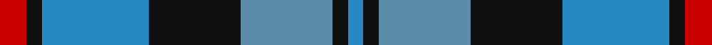
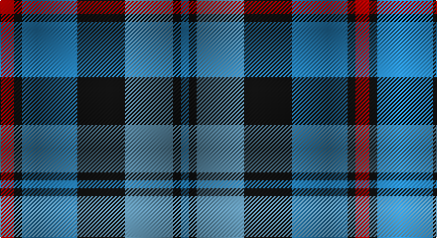

This page is one **sett** — a single exact thread-count. It belongs to the [tartan](/setts/r7k4t28k24ti24k4t4/)
(the same proportion at any scale), whose colour order is pattern [BKBKBKR](/stripes/bkbkbkr/).

Part of the [MacCorquodale](/tartans/maccorquodale/) tartan — the named design grouping this sett with its other cloths.

Sourced from register-of-tartans.  It is a [7 stripe tartan](/stripes/stripes7/).

Original link https://www.tartanregister.gov.uk/tartanDetails.aspx?ref=2326

## Also known as

This cloth is also recorded under:

- MacCorquodale #2

2 attestations — the source records this cloth was collapsed from (oldest owns this page)

<ul>
<li>01/01/1981 — MacCorquodale (register-of-tartans, <a href="https://www.tartanregister.gov.uk/tartanDetails.aspx?ref=2326">record</a>)</li>
<li>1981 — MacCorquodale (Clan?) (tartans-authority, <a href="http://www.tartansauthority.com/tartan-ferret/display/283/">record</a>)</li>
</ul>

## Register references

External register numbers recorded for this tartan.

- Scottish Register of Tartans: [2326](https://www.tartanregister.gov.uk/tartanDetails.aspx?ref=2326)
- Scottish Tartans Authority (ITI): 283
- Scottish Tartans World Register: 283

## Thread count
R/14 K8 Ba56 K48 B48 K8 Ba/8

One full sett is **358 threads**.

## Palette

Palette: <strong>Tartan Register</strong>
<table><thead><tr><th>Colour</th><th>Threads</th><th>Shade</th><th>Base</th><th>OKLCh</th></tr></thead><tbody><tr><td>R/</td><td style="text-align:right;font-variant-numeric:tabular-nums">14</td><td><code style="background-color:#C80000;">#C80000</code> <small style="color:#888">#C80000</small></td><td>R <code style="background-color:#CC0000;">#CC0000</code></td><td><small style="color:#888">oklch(52.3% 0.215 29.2)</small></td></tr><tr><td>K</td><td style="text-align:right;font-variant-numeric:tabular-nums">8</td><td><code style="background-color:#101010;">#101010</code> <small style="color:#888">#101010</small></td><td>K <code style="background-color:#000000;">#000000</code></td><td><small style="color:#888">oklch(17.3% 0.000 89.9)</small></td></tr><tr><td>Ba</td><td style="text-align:right;font-variant-numeric:tabular-nums">56</td><td><code style="background-color:#2888C4;">#2888C4</code> <small style="color:#888">#2888C4</small></td><td>B <code style="background-color:#2A418A;">#2A418A</code></td><td><small style="color:#888">oklch(60.1% 0.125 241.5)</small></td></tr><tr><td>K</td><td style="text-align:right;font-variant-numeric:tabular-nums">48</td><td><code style="background-color:#101010;">#101010</code> <small style="color:#888">#101010</small></td><td>K <code style="background-color:#000000;">#000000</code></td><td><small style="color:#888">oklch(17.3% 0.000 89.9)</small></td></tr><tr><td>B</td><td style="text-align:right;font-variant-numeric:tabular-nums">48</td><td><code style="background-color:#5C8CA8;">#5C8CA8</code> <small style="color:#888">#5C8CA8</small></td><td>B <code style="background-color:#2A418A;">#2A418A</code></td><td><small style="color:#888">oklch(61.7% 0.067 235.0)</small></td></tr><tr><td>K</td><td style="text-align:right;font-variant-numeric:tabular-nums">8</td><td><code style="background-color:#101010;">#101010</code> <small style="color:#888">#101010</small></td><td>K <code style="background-color:#000000;">#000000</code></td><td><small style="color:#888">oklch(17.3% 0.000 89.9)</small></td></tr><tr><td>Ba/</td><td style="text-align:right;font-variant-numeric:tabular-nums">8</td><td><code style="background-color:#2888C4;">#2888C4</code> <small style="color:#888">#2888C4</small></td><td>B <code style="background-color:#2A418A;">#2A418A</code></td><td><small style="color:#888">oklch(60.1% 0.125 241.5)</small></td></tr></tbody></table>

# Sample pattern

## Nearest tartans

The nearest existing variants by ΔTartan distance, with this tartan at the top so the swatches line up against it.

ΔTartan

Tartan

Sett

—

<a href="/ttd/edit/#slug=r7k4t28k24ti24k4t4~x2">MacCorquodale</a> <a class="nn-out" href="/variants/s7/r7k4t28k24ti24k4t4~x2/" title="open its dictionary page">↗</a>

0.93

<a href="/ttd/edit/#slug=ly8k4o39k37dt36k6dt7&amp;base=r7k4t28k24ti24k4t4~x2">Oceanic (Corporate?)</a> <a class="nn-out" href="/variants/s7/ly8k4o39k37dt36k6dt7/" title="open its dictionary page">↗</a>

0.95

<a href="/ttd/edit/#slug=w4db4dg22k20db20w3&amp;base=r7k4t28k24ti24k4t4~x2">Unidentified No 26</a> <a class="nn-out" href="/variants/s6/w4db4dg22k20db20w3/" title="open its dictionary page">↗</a>

0.97

<a href="/ttd/edit/#slug=db3g12k13w2db13w3~x2&amp;base=r7k4t28k24ti24k4t4~x2">Herd/Hurd</a> <a class="nn-out" href="/variants/s6/db3g12k13w2db13w3~x2/" title="open its dictionary page">↗</a>

1.05

<a href="/ttd/edit/#slug=r2b1db8b8o8b1o1~x2&amp;base=r7k4t28k24ti24k4t4~x2">Over Mountain</a> <a class="nn-out" href="/variants/s7/r2b1db8b8o8b1o1~x2/" title="open its dictionary page">↗</a>

1.08

<a href="/ttd/edit/#slug=db2g13db11t4w9db2~x2&amp;base=r7k4t28k24ti24k4t4~x2">Loch Leven Check Trade Tartan</a> <a class="nn-out" href="/variants/s6/db2g13db11t4w9db2~x2/" title="open its dictionary page">↗</a>

1.11

<a href="/ttd/edit/#slug=k1db8r6g8k1~x4&amp;base=r7k4t28k24ti24k4t4~x2">Edinburgh Tattoo 50th (Commemorative</a> <a class="nn-out" href="/variants/s5/k1db8r6g8k1~x4/" title="open its dictionary page">↗</a>

1.12

<a href="/ttd/edit/#slug=db9k7o5r1o5k1o2~x4&amp;base=r7k4t28k24ti24k4t4~x2">Greyhound Grenadiers (Corporate)</a> <a class="nn-out" href="/variants/s7/db9k7o5r1o5k1o2~x4/" title="open its dictionary page">↗</a>

1.17

<a href="/ttd/edit/#slug=r2lb1db8lb8y8lb1y1~x2&amp;base=r7k4t28k24ti24k4t4~x2">Over Mountain</a> <a class="nn-out" href="/variants/s7/r2lb1db8lb8y8lb1y1~x2/" title="open its dictionary page">↗</a>

1.19

<a href="/ttd/edit/#slug=k5b3k3b23n4k25n23lb3n5~x2&amp;base=r7k4t28k24ti24k4t4~x2">Cahonas Scotland</a> <a class="nn-out" href="/variants/s9/k5b3k3b23n4k25n23lb3n5~x2/" title="open its dictionary page">↗</a>

1.20

<a href="/ttd/edit/#slug=ly6dg3ly3dg22k23dp23k4~x2&amp;base=r7k4t28k24ti24k4t4~x2">Gordon of Esslemont</a> <a class="nn-out" href="/variants/s7/ly6dg3ly3dg22k23dp23k4~x2/" title="open its dictionary page">↗</a>

## Neighbour map

Every grey dot is one of 14360 variants placed by the first two principal components of the ΔTartan feature space (44% of its variance). Red is this tartan; blue dots are its nearest — click one to open its page.

<svg viewBox="0 0 640 380" role="img" style="max-width:100%;height:auto;border:1px solid #e0e0e0;border-radius:4px;display:block" xmlns="http://www.w3.org/2000/svg"><image href="/nn/cloud.v1.png" width="640" height="380"/><a href="/variants/s7/ly8k4o39k37dt36k6dt7/"><circle cx="172.9" cy="210.3" r="4" fill="#3465a4"><title>Oceanic (Corporate?)</title></circle></a><a href="/variants/s6/w4db4dg22k20db20w3/"><circle cx="150.1" cy="240.9" r="4" fill="#3465a4"><title>Unidentified No 26</title></circle></a><a href="/variants/s6/db3g12k13w2db13w3~x2/"><circle cx="126.2" cy="237.8" r="4" fill="#3465a4"><title>Herd/Hurd</title></circle></a><a href="/variants/s7/r2b1db8b8o8b1o1~x2/"><circle cx="170.9" cy="207.6" r="4" fill="#3465a4"><title>Over Mountain</title></circle></a><a href="/variants/s6/db2g13db11t4w9db2~x2/"><circle cx="131.0" cy="233.8" r="4" fill="#3465a4"><title>Loch Leven Check Trade Tartan</title></circle></a><a href="/variants/s5/k1db8r6g8k1~x4/"><circle cx="142.3" cy="233.7" r="4" fill="#3465a4"><title>Edinburgh Tattoo 50th (Commemorative</title></circle></a><a href="/variants/s7/db9k7o5r1o5k1o2~x4/"><circle cx="185.3" cy="222.0" r="4" fill="#3465a4"><title>Greyhound Grenadiers (Corporate)</title></circle></a><a href="/variants/s7/r2lb1db8lb8y8lb1y1~x2/"><circle cx="158.4" cy="199.3" r="4" fill="#3465a4"><title>Over Mountain</title></circle></a><a href="/variants/s9/k5b3k3b23n4k25n23lb3n5~x2/"><circle cx="198.6" cy="207.5" r="4" fill="#3465a4"><title>Cahonas Scotland</title></circle></a><a href="/variants/s7/ly6dg3ly3dg22k23dp23k4~x2/"><circle cx="148.6" cy="218.3" r="4" fill="#3465a4"><title>Gordon of Esslemont</title></circle></a><circle cx="149.9" cy="221.9" r="5" fill="#c00000"/></svg>

ID: /variants/s7/r7k4t28k24ti24k4t4~x2/
