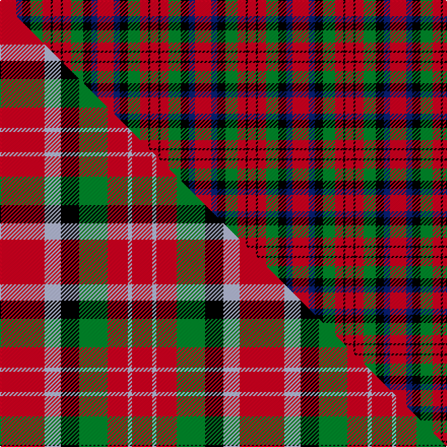

This page is one **sett** — a single exact thread-count. It belongs to the [tartan](/setts/r8db3k4g6r4k1r4/)
(the same proportion at any scale), whose colour order is pattern [RBKGRKR](/stripes/rbkgrkr/).

Part of the [MacDuff](/tartans/macduff/) tartan — the named design grouping this sett with its other cloths.

Sourced from weddslist.  It is a [7 stripe tartan](/stripes/stripes7/).

Original link http://www.weddslist.com/cgi-bin/tartans/pg.pl?source=rb

3 attestations — the source records this cloth was collapsed from (oldest owns this page)

<ul>
<li>undated — MacDuff (weddslist, <a href="http://www.weddslist.com/cgi-bin/tartans/pg.pl?source=rb">record</a>) </li>
<li>undated — MacDuff (weddslist, <a href="http://www.weddslist.com/cgi-bin/tartans/pg.pl?source=tinsel">record</a>) </li>
<li>undated — MacDuff (weddslist, <a href="http://www.weddslist.com/cgi-bin/tartans/pg.pl?source=x">record</a>) </li>
</ul>

## Thread count
R/16 DB6 K8 G12 R8 K2 R/8

One full sett is **96 threads**.

## Palette
<table><thead><tr><th>Colour</th><th>Shade</th><th>OKLCh</th></tr></thead><tbody><tr><td>DB</td><td><code style="background-color:#082077;">#082077</code> <small style="color:#888">#082077</small></td><td><small style="color:#888">oklch(30.0% 0.149 265.1)</small></td></tr><tr><td>G</td><td><code style="background-color:#008B2A;">#008B2A</code> <small style="color:#888">#008B2A</small></td><td><small style="color:#888">oklch(55.4% 0.170 145.9)</small></td></tr><tr><td>K</td><td><code style="background-color:#000000;">#000000</code> <small style="color:#888">#000000</small></td><td><small style="color:#888">oklch(0.0% 0.000 0.0)</small></td></tr><tr><td>R</td><td><code style="background-color:#D60020;">#D60020</code> <small style="color:#888">#D60020</small></td><td><small style="color:#888">oklch(55.2% 0.224 25.5)</small></td></tr></tbody></table>

# Sample pattern

## Compared to the master

This cloth is one sett of its design; the master sett (the exemplar the design is anchored on) is below for comparison.

Its **ΔTartan distance** from the master is **0.93** — the same measure the nearest-tartans table ranks by (0 is identical; a re-scale of the same cloth is near 0, a recolour or a different proportion further).

<figure class="master-compare" style="margin:0">

this sett
master sett ★

<figcaption style="color:#888;font-size:smaller">One weave of this sett against the <a href="/setts/r22lb8k9g14r10lb2r10/">master sett ★</a>, split on the diagonal: a shared proportion runs seamlessly across it with only the shades shifting; a different proportion breaks on it.</figcaption>
</figure>

## Nearest variants

The nearest existing variants by ΔTartan distance, with this cloth at the top so the swatches line up against it.

ΔTartan

Threads

Variant

Sett

—

96

<a href="/variants/s7/r8db3k4g6r4k1r4~x2/">MacDuff</a>

<a href="/ttd/edit/#slug=r8db3k4g6r4k1r4~x4&amp;base=r8db3k4g6r4k1r4~x2" title="compare in the TTD">0.00</a>

192

<a href="/variants/s7/r8db3k4g6r4k1r4~x4/">MacDuff Clan Tartan</a>

<a href="/ttd/edit/#slug=r8lb3k4g6r4k1r4~x2&amp;base=r8db3k4g6r4k1r4~x2" title="compare in the TTD">0.00</a>

96

<a href="/variants/s7/r8lb3k4g6r4k1r4~x2/">MacDuff #5</a>

<a href="/ttd/edit/#slug=r36db9k12g17r10k3r10~x2&amp;base=r8db3k4g6r4k1r4~x2" title="compare in the TTD">0.31</a>

296

<a href="/variants/s7/r36db9k12g17r10k3r10~x2/">MacDuff #6</a>

<a href="/ttd/edit/#slug=r36db9k12dg17r10k3r10~x2&amp;base=r8db3k4g6r4k1r4~x2" title="compare in the TTD">0.31</a>

296

<a href="/variants/s7/r36db9k12dg17r10k3r10~x2/">MacDuff - 1819 (Clan)</a>

<a href="/ttd/edit/#slug=r22lb8k9g14r10lb2r10~x2&amp;base=r8db3k4g6r4k1r4~x2" title="compare in the TTD">1.32</a>

236

<a href="/variants/s7/r22lb8k9g14r10lb2r10~x2/">MacDuff #2</a>

<a href="/ttd/edit/#slug=y6k8g7r6k2r18w6~x4&amp;base=r8db3k4g6r4k1r4~x2" title="compare in the TTD">1.81</a>

376

<a href="/variants/s7/y6k8g7r6k2r18w6~x4/">Thirkill (Dalgliesh)</a>

<a href="/ttd/edit/#slug=r52k32g22r16y3r16&amp;base=r8db3k4g6r4k1r4~x2" title="compare in the TTD">1.92</a>

214

<a href="/variants/s6/r52k32g22r16y3r16/">Sturrock</a>

<a href="/ttd/edit/#slug=r10g24k10r28lb3r6~x2&amp;base=r8db3k4g6r4k1r4~x2" title="compare in the TTD">2.09</a>

292

<a href="/variants/s6/r10g24k10r28lb3r6~x2/">Nisbet</a>

<a href="/ttd/edit/#slug=r5w2r28k12g16r3~x2&amp;base=r8db3k4g6r4k1r4~x2" title="compare in the TTD">2.12</a>

248

<a href="/variants/s6/r5w2r28k12g16r3~x2/">MacKintosh #4</a>

<a href="/ttd/edit/#slug=r12g2r4g4k15lb4r4lb2r12~x2&amp;base=r8db3k4g6r4k1r4~x2" title="compare in the TTD">2.48</a>

188

<a href="/variants/s9/r12g2r4g4k15lb4r4lb2r12~x2/">Alexander (Personal)</a>

## Neighbour map

Every grey dot is one of 13620 variants placed by the first two principal components of the ΔTartan feature space (42% of its variance). Red is this tartan; blue dots are its nearest — click one to open its page.

<svg viewBox="0 0 640 380" role="img" style="max-width:100%;height:auto;border:1px solid #e0e0e0;border-radius:4px;display:block" xmlns="http://www.w3.org/2000/svg"><image href="/nn/cloud.v1.png" width="640" height="380"/><a href="/variants/s7/r8db3k4g6r4k1r4~x4/"><circle cx="196.6" cy="221.1" r="4" fill="#3465a4"><title>MacDuff Clan Tartan</title></circle></a><a href="/variants/s7/r8lb3k4g6r4k1r4~x2/"><circle cx="193.4" cy="220.4" r="4" fill="#3465a4"><title>MacDuff #5</title></circle></a><a href="/variants/s7/r36db9k12g17r10k3r10~x2/"><circle cx="258.1" cy="178.3" r="4" fill="#3465a4"><title>MacDuff #6</title></circle></a><a href="/variants/s7/r36db9k12dg17r10k3r10~x2/"><circle cx="265.0" cy="178.6" r="4" fill="#3465a4"><title>MacDuff - 1819 (Clan)</title></circle></a><a href="/variants/s7/r22lb8k9g14r10lb2r10~x2/"><circle cx="232.9" cy="205.5" r="4" fill="#3465a4"><title>MacDuff #2</title></circle></a><a href="/variants/s7/y6k8g7r6k2r18w6~x4/"><circle cx="133.2" cy="187.2" r="4" fill="#3465a4"><title>Thirkill (Dalgliesh)</title></circle></a><a href="/variants/s6/r52k32g22r16y3r16/"><circle cx="281.3" cy="173.3" r="4" fill="#3465a4"><title>Sturrock</title></circle></a><a href="/variants/s6/r10g24k10r28lb3r6~x2/"><circle cx="246.7" cy="201.9" r="4" fill="#3465a4"><title>Nisbet</title></circle></a><a href="/variants/s6/r5w2r28k12g16r3~x2/"><circle cx="257.2" cy="169.1" r="4" fill="#3465a4"><title>MacKintosh #4</title></circle></a><a href="/variants/s9/r12g2r4g4k15lb4r4lb2r12~x2/"><circle cx="212.7" cy="183.4" r="4" fill="#3465a4"><title>Alexander (Personal)</title></circle></a><circle cx="196.6" cy="221.1" r="5" fill="#c00000"/><text x="320" y="376" text-anchor="middle" font-size="11" fill="#999">ground</text><text x="11" y="190" text-anchor="middle" font-size="11" fill="#999" transform="rotate(-90 11 190)">complexity</text></svg>

ID: /variants/s7/r8db3k4g6r4k1r4~x2/
