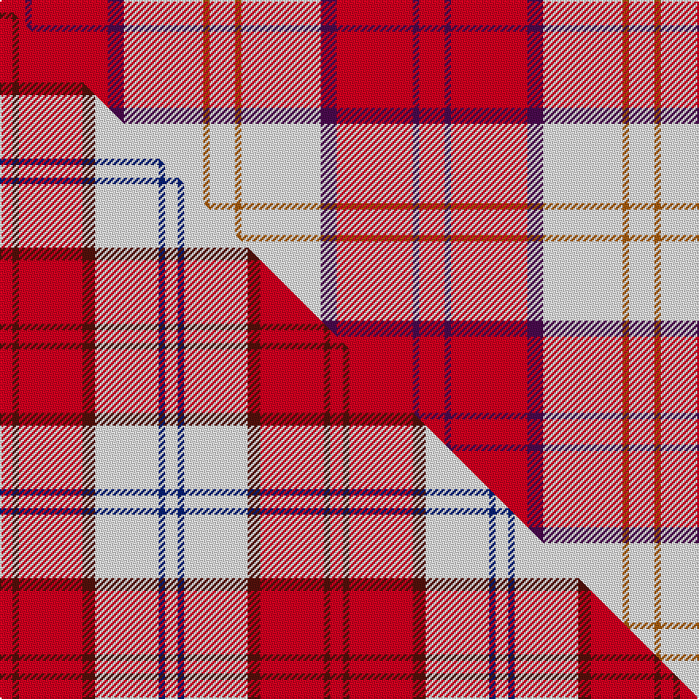

This is one **variant** — a specific cloth: this exact thread count and colourway, with its own
provenance below. It is one weaving of the [sett](/setts/r8dp2r24dp5w25o2w8/) (the scale-free proportion — the
same cloth at any scale or shade), whose colour order is pattern [RBRBWRW](/stripes/rbrbwrw/).

Part of the [Lennox Dress](/tartans/lennox-dress/) tartan — the named design grouping this sett with its other cloths.

Sourced from weddslist.  It is a [7 stripe tartan](/stripes/stripes7/).

Original link [http://www.weddslist.com/cgi-bin/tartans/pg.pl?source=sts](http://www.weddslist.com/cgi-bin/tartans/pg.pl?source=sts)

Dataset <small>— provenance for this record, inherited from the source manifest</small>

<dl class="dataset-prov">
<dt>source</dt><dd><a href="/sources/weddslist/">Weddslist</a></dd>
<dt>data captured from</dt><dd><a href="https://github.com/thetartan/tartan-database/blob/master/data/weddslist/data.csv">https://github.com/thetartan/tartan-database/blob/master/data/weddslist/data.csv</a></dd>
<dt>data date</dt><dd>2016-11-17 <small>(dataset default)</small></dd>
<dt>licence</dt><dd><a href="https://creativecommons.org/licenses/by-nc-nd/4.0/">CC BY-NC-ND 4.0</a></dd>
</dl>

Capture chain <small>— the hands this data passed through, oldest first; each capture carries its own licence</small>

<ol class="capture-chain">
<li><a href="https://www.weddslist.com/tartans/">Weddslist</a> <small>the living privately compiled reference</small></li>
<li><a href="https://github.com/thetartan/tartan-database">thetartan/tartan-database</a> <small>2016-2017</small> · <a href="https://creativecommons.org/licenses/by-nc-nd/4.0/">CC BY-NC-ND 4.0</a> <small>Levko Kravets's frozen compilation — the capture we vendored, and where its CC licence text came from</small></li>
<li>this dictionary <small>captured 2026-06-10 · commit 5bf86c7566</small> <small>each re-capture is a git commit to data/sources</small></li>
</ol>

## Thread count
R/16 DP4 R48 DP10 W50 O4 W/16

One full sett is **264 threads**.

## Palette
<table><thead><tr><th>Colour</th><th>Shade</th><th>OKLCh</th></tr></thead><tbody><tr><td>W</td><td><code style="background-color:#F7F7F7;">#F7F7F7</code> <small style="color:#888">#F7F7F7</small></td><td><small style="color:#888">oklch(97.6% 0.000 89.9)</small></td></tr><tr><td>O</td><td><code style="background-color:#A65C11;">#A65C11</code> <small style="color:#888">#A65C11</small></td><td><small style="color:#888">oklch(55.0% 0.125 58.3)</small></td></tr><tr><td>DP</td><td><code style="background-color:#4B0B4F;">#4B0B4F</code> <small style="color:#888">#4B0B4F</small></td><td><small style="color:#888">oklch(30.1% 0.125 325.4)</small></td></tr><tr><td>R</td><td><code style="background-color:#D60020;">#D60020</code> <small style="color:#888">#D60020</small></td><td><small style="color:#888">oklch(55.2% 0.224 25.5)</small></td></tr></tbody></table>

# Sample pattern

## Compared to the master

This cloth is one sett of its design; the master sett (the exemplar the design is anchored on) is below for comparison.

Its **ΔTartan distance** from the master is **0.64** — the same measure the nearest-tartans table ranks by (0 is identical; a re-scale of the same cloth is near 0, a recolour or a different proportion further).

<figure class="master-compare" style="margin:0">

this sett
master sett ★

<figcaption style="color:#888;font-size:smaller">One weave of this sett against the <a href="/setts/r8dp2r24db5w26dy2w8/">master sett ★</a>, split on the diagonal: a shared proportion runs seamlessly across it with only the shades shifting; a different proportion breaks on it.</figcaption>
</figure>

## Nearest tartan variants

The nearest existing variants by ΔTartan distance, with this cloth at the top so the swatches line up against it.

ΔTartan

Threads

Variant

Sett

—

264

<a href="/variants/s7/r8dp2r24dp5w25o2w8~x2/">Lennox, dress</a>

<a href="/ttd/edit/#slug=r8dp2r24dp5w25dy2w8~x2&amp;base=r8dp2r24dp5w25o2w8~x2" title="compare in the TTD">0.30</a>

264

<a href="/variants/s7/r8dp2r24dp5w25dy2w8~x2/">MacGiboney (Personal)</a>

<a href="/ttd/edit/#slug=r8dp2r24db5w26o2w8~x2&amp;base=r8dp2r24dp5w25o2w8~x2" title="compare in the TTD">0.34</a>

268

<a href="/variants/s7/r8dp2r24db5w26o2w8~x2/">Lennox, dress</a>

<a href="/ttd/edit/#slug=r8dp2r24db5w26dy2w8~x2&amp;base=r8dp2r24dp5w25o2w8~x2" title="compare in the TTD">0.64</a>

268

<a href="/variants/s7/r8dp2r24db5w26dy2w8~x2/">Lennox Dress</a>

<a href="/ttd/edit/#slug=g3r2dp2r30w30g2w3~x2&amp;base=r8dp2r24dp5w25o2w8~x2" title="compare in the TTD">1.19</a>

276

<a href="/variants/s7/g3r2dp2r30w30g2w3~x2/">Torridon, Burgundy (Dance)</a>

<a href="/ttd/edit/#slug=w4dr2w25r21w3r8y3~x2&amp;base=r8dp2r24dp5w25o2w8~x2" title="compare in the TTD">1.39</a>

250

<a href="/variants/s7/w4dr2w25r21w3r8y3~x2/">MacPherson Dress Red</a>

<a href="/ttd/edit/#slug=w4r2w25ri21w3ri8y3~x2~r1506028-ri2008029&amp;base=r8dp2r24dp5w25o2w8~x2" title="compare in the TTD">1.45</a>

250

<a href="/variants/s7/w4r2w25ri21w3ri8y3~x2~r1506028-ri2008029/">MacPherson, dress red</a>

<a href="/ttd/edit/#slug=ri8r2ri24r5w25dy2w8~x2~ri2109032-r1807008&amp;base=r8dp2r24dp5w25o2w8~x2" title="compare in the TTD">1.68</a>

264

<a href="/variants/s7/ri8r2ri24r5w25dy2w8~x2~ri2109032-r1807008/">Lennox Dress District Tartan</a>

<a href="/ttd/edit/#slug=r2dr1r10dr2w10db1w2~x4&amp;base=r8dp2r24dp5w25o2w8~x2" title="compare in the TTD">1.76</a>

208

<a href="/variants/s7/r2dr1r10dr2w10db1w2~x4/">Lennox Dress #2</a>

<a href="/ttd/edit/#slug=w4k2w25r21w3r8y3~x2&amp;base=r8dp2r24dp5w25o2w8~x2" title="compare in the TTD">2.10</a>

250

<a href="/variants/s7/w4k2w25r21w3r8y3~x2/">MacPherson Dress Burgandy Clan Tartan</a>

<a href="/ttd/edit/#slug=w5dp3w26r20w3r8y3~x2&amp;base=r8dp2r24dp5w25o2w8~x2" title="compare in the TTD">2.22</a>

256

<a href="/variants/s7/w5dp3w26r20w3r8y3~x2/">MacPherson Dress Red (Dance)</a>

## Neighbour map

Every grey dot is one of 13621 variants placed by the first two principal components of the ΔTartan feature space (42% of its variance). Red is this tartan; blue dots are its nearest — click one to open its page.

<svg viewBox="0 0 640 380" role="img" style="max-width:100%;height:auto;border:1px solid #e0e0e0;border-radius:4px;display:block" xmlns="http://www.w3.org/2000/svg"><image href="/nn/cloud.v1.png" width="640" height="380"/><a href="/variants/s7/r8dp2r24dp5w25dy2w8~x2/"><circle cx="252.0" cy="184.9" r="4" fill="#3465a4"><title>MacGiboney (Personal)</title></circle></a><a href="/variants/s7/r8dp2r24db5w26o2w8~x2/"><circle cx="239.2" cy="170.1" r="4" fill="#3465a4"><title>Lennox, dress</title></circle></a><a href="/variants/s7/r8dp2r24db5w26dy2w8~x2/"><circle cx="236.6" cy="169.4" r="4" fill="#3465a4"><title>Lennox Dress</title></circle></a><a href="/variants/s7/g3r2dp2r30w30g2w3~x2/"><circle cx="291.1" cy="155.8" r="4" fill="#3465a4"><title>Torridon, Burgundy (Dance)</title></circle></a><a href="/variants/s7/w4dr2w25r21w3r8y3~x2/"><circle cx="287.7" cy="180.8" r="4" fill="#3465a4"><title>MacPherson Dress Red</title></circle></a><a href="/variants/s7/w4r2w25ri21w3ri8y3~x2~r1506028-ri2008029/"><circle cx="283.1" cy="180.0" r="4" fill="#3465a4"><title>MacPherson, dress red</title></circle></a><a href="/variants/s7/ri8r2ri24r5w25dy2w8~x2~ri2109032-r1807008/"><circle cx="250.0" cy="181.8" r="4" fill="#3465a4"><title>Lennox Dress District Tartan</title></circle></a><a href="/variants/s7/r2dr1r10dr2w10db1w2~x4/"><circle cx="239.3" cy="185.7" r="4" fill="#3465a4"><title>Lennox Dress #2</title></circle></a><a href="/variants/s7/w4k2w25r21w3r8y3~x2/"><circle cx="267.3" cy="170.4" r="4" fill="#3465a4"><title>MacPherson Dress Burgandy Clan Tartan</title></circle></a><a href="/variants/s7/w5dp3w26r20w3r8y3~x2/"><circle cx="273.3" cy="196.7" r="4" fill="#3465a4"><title>MacPherson Dress Red (Dance)</title></circle></a><circle cx="254.7" cy="185.7" r="5" fill="#c00000"/><text x="320" y="376" text-anchor="middle" font-size="11" fill="#999">ground</text><text x="11" y="190" text-anchor="middle" font-size="11" fill="#999" transform="rotate(-90 11 190)">complexity</text></svg>

ID: /variants/s7/r8dp2r24dp5w25o2w8~x2/
