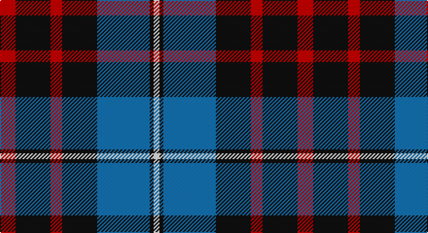

This page is one **sett** — a single exact thread-count. It belongs to the [tartan](/setts/r8k18r6k18b27k2w3/)
(the same proportion at any scale), whose colour order is pattern [RKRKBKW](/stripes/rkrkbkw/).

Part of the [MacKean](/tartans/mackean/) tartan — the named design grouping this sett with its other cloths.

Sourced from register-of-tartans.  It is a [7 stripe tartan](/stripes/stripes7/).

Original link https://www.tartanregister.gov.uk/tartanDetails.aspx?ref=2508

## Also known as

This cloth is also recorded under:

- MacKean Green
- MacKean Red
- MacKean, Green

## Register references

External register numbers recorded for this tartan.

- Scottish Register of Tartans: [2508](https://www.tartanregister.gov.uk/tartanDetails.aspx?ref=2508)
- Scottish Tartans Authority (ITI): 1442
- Scottish Tartans World Register: 1442

## Thread count
R/16 K36 R12 K36 B54 K4 W/6

One full sett is **306 threads**.

## Palette

Palette: <strong>Tartan Register</strong>
<table><thead><tr><th>Colour</th><th>Threads</th><th>Shade</th><th>Base</th><th>OKLCh</th></tr></thead><tbody><tr><td>R/</td><td style="text-align:right;font-variant-numeric:tabular-nums">16</td><td><code style="background-color:#C80000;">#C80000</code> <small style="color:#888">#C80000</small></td><td>R <code style="background-color:#CC0000;">#CC0000</code></td><td><small style="color:#888">oklch(52.3% 0.215 29.2)</small></td></tr><tr><td>K</td><td style="text-align:right;font-variant-numeric:tabular-nums">36</td><td><code style="background-color:#101010;">#101010</code> <small style="color:#888">#101010</small></td><td>K <code style="background-color:#000000;">#000000</code></td><td><small style="color:#888">oklch(17.3% 0.000 89.9)</small></td></tr><tr><td>R</td><td style="text-align:right;font-variant-numeric:tabular-nums">12</td><td><code style="background-color:#C80000;">#C80000</code> <small style="color:#888">#C80000</small></td><td>R <code style="background-color:#CC0000;">#CC0000</code></td><td><small style="color:#888">oklch(52.3% 0.215 29.2)</small></td></tr><tr><td>K</td><td style="text-align:right;font-variant-numeric:tabular-nums">36</td><td><code style="background-color:#101010;">#101010</code> <small style="color:#888">#101010</small></td><td>K <code style="background-color:#000000;">#000000</code></td><td><small style="color:#888">oklch(17.3% 0.000 89.9)</small></td></tr><tr><td>B</td><td style="text-align:right;font-variant-numeric:tabular-nums">54</td><td><code style="background-color:#1474B4;">#1474B4</code> <small style="color:#888">#1474B4</small></td><td>B <code style="background-color:#2A418A;">#2A418A</code></td><td><small style="color:#888">oklch(54.0% 0.129 245.1)</small></td></tr><tr><td>K</td><td style="text-align:right;font-variant-numeric:tabular-nums">4</td><td><code style="background-color:#101010;">#101010</code> <small style="color:#888">#101010</small></td><td>K <code style="background-color:#000000;">#000000</code></td><td><small style="color:#888">oklch(17.3% 0.000 89.9)</small></td></tr><tr><td>W/</td><td style="text-align:right;font-variant-numeric:tabular-nums">6</td><td><code style="background-color:#FCFCFC;">#FCFCFC</code> <small style="color:#888">#FCFCFC</small></td><td>W <code style="background-color:#F7F7F7;">#F7F7F7</code></td><td><small style="color:#888">oklch(99.1% 0.000 89.9)</small></td></tr></tbody></table>

# Sample pattern

## Compared to the master

This cloth is one sett of its design; the master sett (the exemplar the design is anchored on) is below for comparison.

<figure style="margin:0"><figcaption style="color:#888;font-size:smaller">this sett</figcaption></figure>
<figure style="margin:0"><figcaption style="color:#888;font-size:smaller"><a href="/setts/k4db8k4db8r2g10k1w2/">master sett →</a></figcaption></figure>

## Nearest tartans

The nearest existing variants by ΔTartan distance, with this tartan at the top so the swatches line up against it.

ΔTartan

Tartan

Sett

—

<a href="/ttd/edit/#slug=r8k18r6k18b27k2w3~x2">MacKean (Personal)</a> <a class="nn-out" href="/variants/s7/r8k18r6k18b27k2w3~x2/" title="open its dictionary page">↗</a>

0.94

<a href="/ttd/edit/#slug=t3o26g4t13k13t2~x2&amp;base=r8k18r6k18b27k2w3~x2">MacTavish / Thom(p)son, hunting</a> <a class="nn-out" href="/variants/s6/t3o26g4t13k13t2~x2/" title="open its dictionary page">↗</a>

0.96

<a href="/ttd/edit/#slug=r12k3w14dt10k2dt24r2~x2&amp;base=r8k18r6k18b27k2w3~x2">Yusra Personal Tartan</a> <a class="nn-out" href="/variants/s7/r12k3w14dt10k2dt24r2~x2/" title="open its dictionary page">↗</a>

1.00

<a href="/ttd/edit/#slug=r25g10db30w4db30g10r25w2~x2&amp;base=r8k18r6k18b27k2w3~x2">Highland Spring Dress (2004)</a> <a class="nn-out" href="/variants/s8/r25g10db30w4db30g10r25w2~x2/" title="open its dictionary page">↗</a>

1.04

<a href="/ttd/edit/#slug=k21o2k8w2o16n6k2n8~x2&amp;base=r8k18r6k18b27k2w3~x2">Ardmore (Fashion)</a> <a class="nn-out" href="/variants/s8/k21o2k8w2o16n6k2n8~x2/" title="open its dictionary page">↗</a>

1.04

<a href="/ttd/edit/#slug=r12db3g5db16ly2g2~x2&amp;base=r8k18r6k18b27k2w3~x2">Dunbog Primary (School)</a> <a class="nn-out" href="/variants/s6/r12db3g5db16ly2g2~x2/" title="open its dictionary page">↗</a>

1.07

<a href="/ttd/edit/#slug=db14g21db4r21db14ly2~x2&amp;base=r8k18r6k18b27k2w3~x2">Kilgour</a> <a class="nn-out" href="/variants/s6/db14g21db4r21db14ly2~x2/" title="open its dictionary page">↗</a>

1.09

<a href="/ttd/edit/#slug=db9k7o5r1o5k1o2~x4&amp;base=r8k18r6k18b27k2w3~x2">Greyhound Grenadiers (Corporate)</a> <a class="nn-out" href="/variants/s7/db9k7o5r1o5k1o2~x4/" title="open its dictionary page">↗</a>

1.10

<a href="/ttd/edit/#slug=lo32db10k52db10w5k24db16w10k11lo15&amp;base=r8k18r6k18b27k2w3~x2">Cavan County Crest (Fashion)</a> <a class="nn-out" href="/variants/s10/lo32db10k52db10w5k24db16w10k11lo15/" title="open its dictionary page">↗</a>

1.13

<a href="/ttd/edit/#slug=k3lb3k3n10r1~x6&amp;base=r8k18r6k18b27k2w3~x2">Greystone (Burberry Grey)</a> <a class="nn-out" href="/variants/s5/k3lb3k3n10r1~x6/" title="open its dictionary page">↗</a>

1.13

<a href="/ttd/edit/#slug=db14dg21db4r21db14ly2~x2&amp;base=r8k18r6k18b27k2w3~x2">Kilgour</a> <a class="nn-out" href="/variants/s6/db14dg21db4r21db14ly2~x2/" title="open its dictionary page">↗</a>

## Neighbour map

Every grey dot is one of 14360 variants placed by the first two principal components of the ΔTartan feature space (44% of its variance). Red is this tartan; blue dots are its nearest — click one to open its page.

<svg viewBox="0 0 640 380" role="img" style="max-width:100%;height:auto;border:1px solid #e0e0e0;border-radius:4px;display:block" xmlns="http://www.w3.org/2000/svg"><image href="/nn/cloud.v1.png" width="640" height="380"/><a href="/variants/s6/t3o26g4t13k13t2~x2/"><circle cx="214.8" cy="196.5" r="4" fill="#3465a4"><title>MacTavish / Thom(p)son, hunting</title></circle></a><a href="/variants/s7/r12k3w14dt10k2dt24r2~x2/"><circle cx="227.4" cy="183.8" r="4" fill="#3465a4"><title>Yusra Personal Tartan</title></circle></a><a href="/variants/s8/r25g10db30w4db30g10r25w2~x2/"><circle cx="231.0" cy="198.0" r="4" fill="#3465a4"><title>Highland Spring Dress (2004)</title></circle></a><a href="/variants/s8/k21o2k8w2o16n6k2n8~x2/"><circle cx="239.1" cy="198.5" r="4" fill="#3465a4"><title>Ardmore (Fashion)</title></circle></a><a href="/variants/s6/r12db3g5db16ly2g2~x2/"><circle cx="223.3" cy="210.7" r="4" fill="#3465a4"><title>Dunbog Primary (School)</title></circle></a><a href="/variants/s6/db14g21db4r21db14ly2~x2/"><circle cx="185.2" cy="225.7" r="4" fill="#3465a4"><title>Kilgour</title></circle></a><a href="/variants/s7/db9k7o5r1o5k1o2~x4/"><circle cx="185.3" cy="222.0" r="4" fill="#3465a4"><title>Greyhound Grenadiers (Corporate)</title></circle></a><a href="/variants/s10/lo32db10k52db10w5k24db16w10k11lo15/"><circle cx="197.3" cy="183.6" r="4" fill="#3465a4"><title>Cavan County Crest (Fashion)</title></circle></a><a href="/variants/s5/k3lb3k3n10r1~x6/"><circle cx="230.4" cy="210.3" r="4" fill="#3465a4"><title>Greystone (Burberry Grey)</title></circle></a><a href="/variants/s6/db14dg21db4r21db14ly2~x2/"><circle cx="197.4" cy="228.2" r="4" fill="#3465a4"><title>Kilgour</title></circle></a><circle cx="229.8" cy="195.6" r="5" fill="#c00000"/></svg>

ID: /variants/s7/r8k18r6k18b27k2w3~x2/
