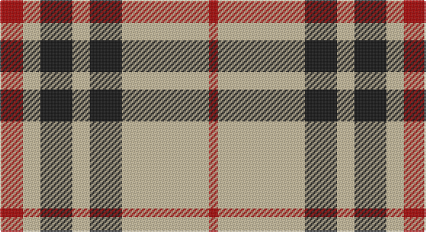

This page is one **sett** — a single exact thread-count. It belongs to the [tartan](/setts/r8ly6k11ly6k11ly30r3/)
(the same proportion at any scale), whose colour order is pattern [RYKYKYR](/stripes/rykykyr/).

Sourced from tartans-authority.  It is a [7 stripe tartan](/stripes/stripes7/).

Original link http://www.tartansauthority.com/tartan-ferret/display/8083/

## Register references

External register numbers recorded for this tartan.

- Scottish Register of Tartans: [8083](https://www.tartanregister.gov.uk/tartanDetails?ref=8083)
- Scottish Tartans Authority (ITI): 8083

## Thread count
DR/16 N12 K22 N12 K22 N60 DR/6

One full sett is **278 threads**.

## Palette

Palette: <strong>Logan (The Scottish Gael, 1831)</strong> <small style="color:#888">(1 of 3 colours)</small>
<table><thead><tr><th>Colour</th><th>Threads</th><th>Shade</th><th>Base</th><th>OKLCh</th></tr></thead><tbody><tr><td>DR/</td><td style="text-align:right;font-variant-numeric:tabular-nums">16</td><td><code style="background-color:#A80000;">#A80000</code> <small style="color:#888">#A80000</small></td><td>R <code style="background-color:#CC0000;">#CC0000</code></td><td><small style="color:#888">oklch(45.9% 0.189 29.2)</small></td></tr><tr><td>N</td><td style="text-align:right;font-variant-numeric:tabular-nums">12</td><td><code style="background-color:#C8BC9C;">#C8BC9C</code> <small style="color:#888">#C8BC9C</small></td><td>Y <code style="background-color:#F2BF00;">#F2BF00</code></td><td><small style="color:#888">oklch(79.7% 0.045 89.9)</small></td></tr><tr><td>K</td><td style="text-align:right;font-variant-numeric:tabular-nums">22</td><td><code style="background-color:#101010;">#101010</code> <small style="color:#888">#101010</small></td><td>K <code style="background-color:#000000;">#000000</code></td><td><small style="color:#888">oklch(17.3% 0.000 89.9)</small></td></tr><tr><td>N</td><td style="text-align:right;font-variant-numeric:tabular-nums">12</td><td><code style="background-color:#C8BC9C;">#C8BC9C</code> <small style="color:#888">#C8BC9C</small></td><td>Y <code style="background-color:#F2BF00;">#F2BF00</code></td><td><small style="color:#888">oklch(79.7% 0.045 89.9)</small></td></tr><tr><td>K</td><td style="text-align:right;font-variant-numeric:tabular-nums">22</td><td><code style="background-color:#101010;">#101010</code> <small style="color:#888">#101010</small></td><td>K <code style="background-color:#000000;">#000000</code></td><td><small style="color:#888">oklch(17.3% 0.000 89.9)</small></td></tr><tr><td>N</td><td style="text-align:right;font-variant-numeric:tabular-nums">60</td><td><code style="background-color:#C8BC9C;">#C8BC9C</code> <small style="color:#888">#C8BC9C</small></td><td>Y <code style="background-color:#F2BF00;">#F2BF00</code></td><td><small style="color:#888">oklch(79.7% 0.045 89.9)</small></td></tr><tr><td>DR/</td><td style="text-align:right;font-variant-numeric:tabular-nums">6</td><td><code style="background-color:#A80000;">#A80000</code> <small style="color:#888">#A80000</small></td><td>R <code style="background-color:#CC0000;">#CC0000</code></td><td><small style="color:#888">oklch(45.9% 0.189 29.2)</small></td></tr></tbody></table>

# Sample pattern

## Nearest tartans

The nearest existing variants by ΔTartan distance, with this tartan at the top so the swatches line up against it.

ΔTartan

Tartan

Sett

—

<a href="/ttd/edit/#slug=r8ly6k11ly6k11ly30r3~x2">Blackberry (Fashion)</a> <a class="nn-out" href="/variants/s7/r8ly6k11ly6k11ly30r3~x2/" title="open its dictionary page">↗</a>

0.89

<a href="/ttd/edit/#slug=w5k20w2r5w20r2~x2&amp;base=r8ly6k11ly6k11ly30r3~x2">Gangs of New York Fashion Check Tartan</a> <a class="nn-out" href="/variants/s6/w5k20w2r5w20r2~x2/" title="open its dictionary page">↗</a>

0.98

<a href="/ttd/edit/#slug=lr2dr4lr2dr4lr9k1~x2&amp;base=r8ly6k11ly6k11ly30r3~x2">Buchanan VS</a> <a class="nn-out" href="/variants/s6/lr2dr4lr2dr4lr9k1~x2/" title="open its dictionary page">↗</a>

1.17

<a href="/ttd/edit/#slug=dy8lr29dy8lo3dy8lr8lo3~x2&amp;base=r8ly6k11ly6k11ly30r3~x2">Lister (Misty Mountain)</a> <a class="nn-out" href="/variants/s7/dy8lr29dy8lo3dy8lr8lo3~x2/" title="open its dictionary page">↗</a>

1.20

<a href="/ttd/edit/#slug=k5lo25k10r3k10lo25w5~x2&amp;base=r8ly6k11ly6k11ly30r3~x2">Richmond de Ellel (Personal)</a> <a class="nn-out" href="/variants/s7/k5lo25k10r3k10lo25w5~x2/" title="open its dictionary page">↗</a>

1.25

<a href="/ttd/edit/#slug=k10ly2k10w2k2ly13w3~x2&amp;base=r8ly6k11ly6k11ly30r3~x2">Nooten-Boom (Personal)</a> <a class="nn-out" href="/variants/s7/k10ly2k10w2k2ly13w3~x2/" title="open its dictionary page">↗</a>

1.28

<a href="/ttd/edit/#slug=k4ly2k13ly1y8y13ly2y4~x2&amp;base=r8ly6k11ly6k11ly30r3~x2">Bannockbane Grey #3</a> <a class="nn-out" href="/variants/s8/k4ly2k13ly1y8y13ly2y4~x2/" title="open its dictionary page">↗</a>

1.32

<a href="/ttd/edit/#slug=k6w6k6lo21r2~x4&amp;base=r8ly6k11ly6k11ly30r3~x2">Burberry Check Corporate Tartan</a> <a class="nn-out" href="/variants/s5/k6w6k6lo21r2~x4/" title="open its dictionary page">↗</a>

1.34

<a href="/ttd/edit/#slug=k3w3k3ly10r1~x6&amp;base=r8ly6k11ly6k11ly30r3~x2">Burberry (Genuine)</a> <a class="nn-out" href="/variants/s5/k3w3k3ly10r1~x6/" title="open its dictionary page">↗</a>

1.34

<a href="/ttd/edit/#slug=g1lb4dy12lb3dy6lb12g1lb1~x4&amp;base=r8ly6k11ly6k11ly30r3~x2">O'Neill Pipe Band 1970 (Corporate)</a> <a class="nn-out" href="/variants/s8/g1lb4dy12lb3dy6lb12g1lb1~x4/" title="open its dictionary page">↗</a>

1.35

<a href="/ttd/edit/#slug=k27w29k5w14r2~x2&amp;base=r8ly6k11ly6k11ly30r3~x2">McPartlin (Personal)</a> <a class="nn-out" href="/variants/s5/k27w29k5w14r2~x2/" title="open its dictionary page">↗</a>

## Neighbour map

Every grey dot is one of 14360 variants placed by the first two principal components of the ΔTartan feature space (44% of its variance). Red is this tartan; blue dots are its nearest — click one to open its page.

<svg viewBox="0 0 640 380" role="img" style="max-width:100%;height:auto;border:1px solid #e0e0e0;border-radius:4px;display:block" xmlns="http://www.w3.org/2000/svg"><image href="/nn/cloud.v1.png" width="640" height="380"/><a href="/variants/s6/w5k20w2r5w20r2~x2/"><circle cx="249.8" cy="188.6" r="4" fill="#3465a4"><title>Gangs of New York Fashion Check Tartan</title></circle></a><a href="/variants/s6/lr2dr4lr2dr4lr9k1~x2/"><circle cx="316.3" cy="222.8" r="4" fill="#3465a4"><title>Buchanan VS</title></circle></a><a href="/variants/s7/dy8lr29dy8lo3dy8lr8lo3~x2/"><circle cx="311.1" cy="200.8" r="4" fill="#3465a4"><title>Lister (Misty Mountain)</title></circle></a><a href="/variants/s7/k5lo25k10r3k10lo25w5~x2/"><circle cx="287.4" cy="205.0" r="4" fill="#3465a4"><title>Richmond de Ellel (Personal)</title></circle></a><a href="/variants/s7/k10ly2k10w2k2ly13w3~x2/"><circle cx="234.8" cy="220.3" r="4" fill="#3465a4"><title>Nooten-Boom (Personal)</title></circle></a><a href="/variants/s8/k4ly2k13ly1y8y13ly2y4~x2/"><circle cx="290.1" cy="200.8" r="4" fill="#3465a4"><title>Bannockbane Grey #3</title></circle></a><a href="/variants/s5/k6w6k6lo21r2~x4/"><circle cx="243.9" cy="198.7" r="4" fill="#3465a4"><title>Burberry Check Corporate Tartan</title></circle></a><a href="/variants/s5/k3w3k3ly10r1~x6/"><circle cx="222.6" cy="195.8" r="4" fill="#3465a4"><title>Burberry (Genuine)</title></circle></a><a href="/variants/s8/g1lb4dy12lb3dy6lb12g1lb1~x4/"><circle cx="303.3" cy="192.0" r="4" fill="#3465a4"><title>O'Neill Pipe Band 1970 (Corporate)</title></circle></a><a href="/variants/s5/k27w29k5w14r2~x2/"><circle cx="298.6" cy="201.7" r="4" fill="#3465a4"><title>McPartlin (Personal)</title></circle></a><circle cx="276.4" cy="198.9" r="5" fill="#c00000"/></svg>

ID: /variants/s7/r8ly6k11ly6k11ly30r3~x2/
