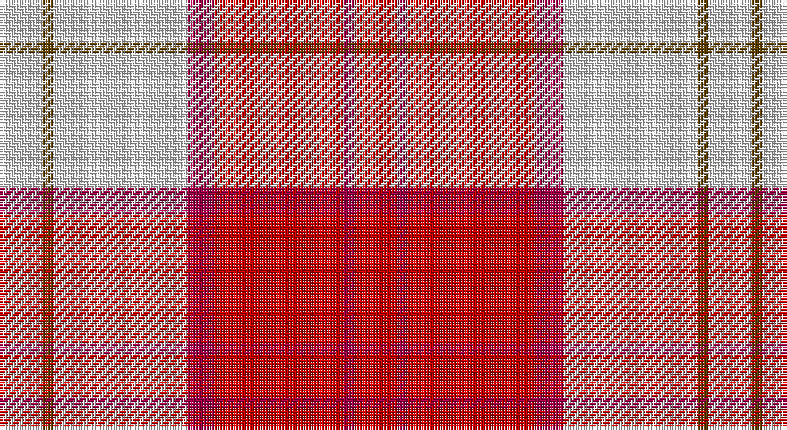

This page is one **sett** — a single exact thread-count. It belongs to the [tartan](/setts/r8m2r24m5w25dy2w8/)
(the same proportion at any scale), whose colour order is pattern [RRRRWGW](/stripes/rrrrwgw/).

Part of the [Lennox Dress](/tartans/lennox-dress/) tartan — the named design grouping this sett with its other cloths.

Sourced from house-of-tartan.  It is a [7 stripe tartan](/stripes/stripes7/).

Original link http://www.house-of-tartan.scotland.net/house/TartanViewjs.asp?colr=Def&tnam=1649

## Provenance

Earliest known date: 1986 Families with the surname 'Lennox' are usually considered related to Clans Stewart or MacFarlane. Some of this surname also choose to wear the distinctive and ancient 'Lennox' tartan. D W Stewart reproduced the sett from a 'lost' portrait of the Countess of Lennox dating from the 16th century.

## Also known as

This cloth is also recorded under:

- Lennox Dress #2
- Lennox Dress, Purple
- Lennox Dress, Red
- Lennox, dress

## Thread count
LN/16 T4 LN50 R10 Ra48 R4 Ra/16

One full sett is **264 threads**.

## Palette

Palette: <strong>Tartan Register</strong>
<table><thead><tr><th>Colour</th><th>Threads</th><th>Shade</th><th>Base</th><th>OKLCh</th></tr></thead><tbody><tr><td>LN/</td><td style="text-align:right;font-variant-numeric:tabular-nums">16</td><td><code style="background-color:#E0E0E0;">#E0E0E0</code> <small style="color:#888">#E0E0E0</small></td><td>W <code style="background-color:#F7F7F7;">#F7F7F7</code></td><td><small style="color:#888">oklch(90.7% 0.000 89.9)</small></td></tr><tr><td>T</td><td style="text-align:right;font-variant-numeric:tabular-nums">4</td><td><code style="background-color:#604000;">#604000</code> <small style="color:#888">#604000</small></td><td>G <code style="background-color:#006100;">#006100</code></td><td><small style="color:#888">oklch(39.8% 0.083 76.8)</small></td></tr><tr><td>LN</td><td style="text-align:right;font-variant-numeric:tabular-nums">50</td><td><code style="background-color:#E0E0E0;">#E0E0E0</code> <small style="color:#888">#E0E0E0</small></td><td>W <code style="background-color:#F7F7F7;">#F7F7F7</code></td><td><small style="color:#888">oklch(90.7% 0.000 89.9)</small></td></tr><tr><td>R</td><td style="text-align:right;font-variant-numeric:tabular-nums">10</td><td><code style="background-color:#A00048;">#A00048</code> <small style="color:#888">#A00048</small></td><td>R <code style="background-color:#CC0000;">#CC0000</code></td><td><small style="color:#888">oklch(45.4% 0.182 5.3)</small></td></tr><tr><td>Ra</td><td style="text-align:right;font-variant-numeric:tabular-nums">48</td><td><code style="background-color:#C80000;">#C80000</code> <small style="color:#888">#C80000</small></td><td>R <code style="background-color:#CC0000;">#CC0000</code></td><td><small style="color:#888">oklch(52.3% 0.215 29.2)</small></td></tr><tr><td>R</td><td style="text-align:right;font-variant-numeric:tabular-nums">4</td><td><code style="background-color:#A00048;">#A00048</code> <small style="color:#888">#A00048</small></td><td>R <code style="background-color:#CC0000;">#CC0000</code></td><td><small style="color:#888">oklch(45.4% 0.182 5.3)</small></td></tr><tr><td>Ra/</td><td style="text-align:right;font-variant-numeric:tabular-nums">16</td><td><code style="background-color:#C80000;">#C80000</code> <small style="color:#888">#C80000</small></td><td>R <code style="background-color:#CC0000;">#CC0000</code></td><td><small style="color:#888">oklch(52.3% 0.215 29.2)</small></td></tr></tbody></table>

# Sample pattern

## Compared to the master

This cloth is one sett of its design; the master sett (the exemplar the design is anchored on) is below for comparison.

<figure style="margin:0"><figcaption style="color:#888;font-size:smaller">this sett</figcaption></figure>
<figure style="margin:0"><figcaption style="color:#888;font-size:smaller"><a href="/setts/r8dp2r24db5w26dy2w8/">master sett →</a></figcaption></figure>

## Nearest tartans

The nearest existing variants by ΔTartan distance, with this tartan at the top so the swatches line up against it.

ΔTartan

Tartan

Sett

—

<a href="/ttd/edit/#slug=r8m2r24m5w25dy2w8~x2">Lennox Dress District Tartan</a> <a class="nn-out" href="/variants/s7/r8m2r24m5w25dy2w8~x2/" title="open its dictionary page">↗</a>

0.32

<a href="/ttd/edit/#slug=r8p2r24p5w25o2w8~x2&amp;base=r8m2r24m5w25dy2w8~x2">Lennox, dress</a> <a class="nn-out" href="/variants/s7/r8p2r24p5w25o2w8~x2/" title="open its dictionary page">↗</a>

0.33

<a href="/ttd/edit/#slug=r8dp2r24dp5w25dy2w8~x2&amp;base=r8m2r24m5w25dy2w8~x2">MacGiboney (Personal)</a> <a class="nn-out" href="/variants/s7/r8dp2r24dp5w25dy2w8~x2/" title="open its dictionary page">↗</a>

0.53

<a href="/ttd/edit/#slug=r2ri1r10ri2w10db1w2~x4&amp;base=r8m2r24m5w25dy2w8~x2">Lennox Dress #2</a> <a class="nn-out" href="/variants/s7/r2ri1r10ri2w10db1w2~x4/" title="open its dictionary page">↗</a>

0.76

<a href="/ttd/edit/#slug=w4ri2w25r21w3r8ly3~x2&amp;base=r8m2r24m5w25dy2w8~x2">MacPherson Dress Red</a> <a class="nn-out" href="/variants/s7/w4ri2w25r21w3r8ly3~x2/" title="open its dictionary page">↗</a>

0.88

<a href="/ttd/edit/#slug=w5dp3w26r20w3r8ly3~x2&amp;base=r8m2r24m5w25dy2w8~x2">MacPherson Dress Red (Dance)</a> <a class="nn-out" href="/variants/s7/w5dp3w26r20w3r8ly3~x2/" title="open its dictionary page">↗</a>

0.89

<a href="/ttd/edit/#slug=w5p3w26r20w3r8ly3~x2&amp;base=r8m2r24m5w25dy2w8~x2">MacPherson, Red</a> <a class="nn-out" href="/variants/s7/w5p3w26r20w3r8ly3~x2/" title="open its dictionary page">↗</a>

0.90

<a href="/ttd/edit/#slug=w5k2w30r24w3r8dt3~x2&amp;base=r8m2r24m5w25dy2w8~x2">Arduaine, Red (Dance)</a> <a class="nn-out" href="/variants/s7/w5k2w30r24w3r8dt3~x2/" title="open its dictionary page">↗</a>

0.92

<a href="/ttd/edit/#slug=r8dp2r24db5w26dy2w8~x2&amp;base=r8m2r24m5w25dy2w8~x2">Lennox Dress</a> <a class="nn-out" href="/variants/s7/r8dp2r24db5w26dy2w8~x2/" title="open its dictionary page">↗</a>

0.97

<a href="/ttd/edit/#slug=r8p2r24db5w26o2w8~x2&amp;base=r8m2r24m5w25dy2w8~x2">Lennox, dress</a> <a class="nn-out" href="/variants/s7/r8p2r24db5w26o2w8~x2/" title="open its dictionary page">↗</a>

1.06

<a href="/ttd/edit/#slug=r8ri3r28w32ri3w4~x2&amp;base=r8m2r24m5w25dy2w8~x2">Ailsa, Red V2 (Dance)</a> <a class="nn-out" href="/variants/s6/r8ri3r28w32ri3w4~x2/" title="open its dictionary page">↗</a>

## Neighbour map

Every grey dot is one of 14360 variants placed by the first two principal components of the ΔTartan feature space (44% of its variance). Red is this tartan; blue dots are its nearest — click one to open its page.

<svg viewBox="0 0 640 380" role="img" style="max-width:100%;height:auto;border:1px solid #e0e0e0;border-radius:4px;display:block" xmlns="http://www.w3.org/2000/svg"><image href="/nn/cloud.v1.png" width="640" height="380"/><a href="/variants/s7/r8p2r24p5w25o2w8~x2/"><circle cx="248.5" cy="159.2" r="4" fill="#3465a4"><title>Lennox, dress</title></circle></a><a href="/variants/s7/r8dp2r24dp5w25dy2w8~x2/"><circle cx="247.0" cy="157.2" r="4" fill="#3465a4"><title>MacGiboney (Personal)</title></circle></a><a href="/variants/s7/r2ri1r10ri2w10db1w2~x4/"><circle cx="235.9" cy="158.9" r="4" fill="#3465a4"><title>Lennox Dress #2</title></circle></a><a href="/variants/s7/w4ri2w25r21w3r8ly3~x2/"><circle cx="287.8" cy="154.9" r="4" fill="#3465a4"><title>MacPherson Dress Red</title></circle></a><a href="/variants/s7/w5dp3w26r20w3r8ly3~x2/"><circle cx="265.3" cy="169.5" r="4" fill="#3465a4"><title>MacPherson Dress Red (Dance)</title></circle></a><a href="/variants/s7/w5p3w26r20w3r8ly3~x2/"><circle cx="263.8" cy="169.4" r="4" fill="#3465a4"><title>MacPherson, Red</title></circle></a><a href="/variants/s7/w5k2w30r24w3r8dt3~x2/"><circle cx="295.3" cy="141.5" r="4" fill="#3465a4"><title>Arduaine, Red (Dance)</title></circle></a><a href="/variants/s7/r8dp2r24db5w26dy2w8~x2/"><circle cx="232.8" cy="140.5" r="4" fill="#3465a4"><title>Lennox Dress</title></circle></a><a href="/variants/s7/r8p2r24db5w26o2w8~x2/"><circle cx="231.6" cy="142.0" r="4" fill="#3465a4"><title>Lennox, dress</title></circle></a><a href="/variants/s6/r8ri3r28w32ri3w4~x2/"><circle cx="291.5" cy="179.9" r="4" fill="#3465a4"><title>Ailsa, Red V2 (Dance)</title></circle></a><circle cx="252.3" cy="159.5" r="5" fill="#c00000"/></svg>

ID: /variants/s7/r8m2r24m5w25dy2w8~x2/
