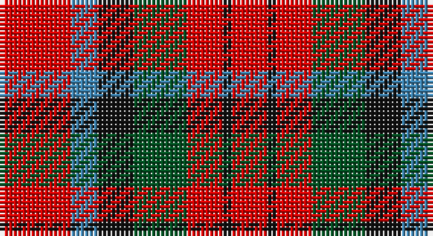

This page is one **sett** — a single exact thread-count. It belongs to the [tartan](/setts/r8t3k4dg6r4k1r4/)
(the same proportion at any scale), whose colour order is pattern [RBKGRKR](/stripes/rbkgrkr/).

Part of the [MacDuff](/tartans/macduff/) tartan — the named design grouping this sett with its other cloths.

Sourced from register-of-tartans.  It is a [7 stripe tartan](/stripes/stripes7/).

Original link https://www.tartanregister.gov.uk/tartanDetails.aspx?ref=2417

## Also known as

This cloth is also recorded under:

- MacDuff #2
- MacDuff #3
- MacDuff #4
- MacDuff #5
- MacDuff #6
- MacDuff Dress #2

## Register references

External register numbers recorded for this tartan.

- Scottish Register of Tartans: [2417](https://www.tartanregister.gov.uk/tartanDetails.aspx?ref=2417)
- Scottish Tartans World Register: 2141

## Thread count
R/16 B6 K8 G12 R8 K2 R/8

One full sett is **96 threads**.

## Palette

Palette: <strong>Tartan Register</strong>
<table><thead><tr><th>Colour</th><th>Threads</th><th>Shade</th><th>Base</th><th>OKLCh</th></tr></thead><tbody><tr><td>R/</td><td style="text-align:right;font-variant-numeric:tabular-nums">16</td><td><code style="background-color:#DC0000;">#DC0000</code> <small style="color:#888">#DC0000</small></td><td>R <code style="background-color:#CC0000;">#CC0000</code></td><td><small style="color:#888">oklch(56.2% 0.230 29.2)</small></td></tr><tr><td>B</td><td style="text-align:right;font-variant-numeric:tabular-nums">6</td><td><code style="background-color:#3C82AF;">#3C82AF</code> <small style="color:#888">#3C82AF</small></td><td>B <code style="background-color:#2A418A;">#2A418A</code></td><td><small style="color:#888">oklch(58.1% 0.099 239.8)</small></td></tr><tr><td>K</td><td style="text-align:right;font-variant-numeric:tabular-nums">8</td><td><code style="background-color:#101010;">#101010</code> <small style="color:#888">#101010</small></td><td>K <code style="background-color:#000000;">#000000</code></td><td><small style="color:#888">oklch(17.3% 0.000 89.9)</small></td></tr><tr><td>G</td><td style="text-align:right;font-variant-numeric:tabular-nums">12</td><td><code style="background-color:#005020;">#005020</code> <small style="color:#888">#005020</small></td><td>G <code style="background-color:#006100;">#006100</code></td><td><small style="color:#888">oklch(37.7% 0.105 149.6)</small></td></tr><tr><td>R</td><td style="text-align:right;font-variant-numeric:tabular-nums">8</td><td><code style="background-color:#DC0000;">#DC0000</code> <small style="color:#888">#DC0000</small></td><td>R <code style="background-color:#CC0000;">#CC0000</code></td><td><small style="color:#888">oklch(56.2% 0.230 29.2)</small></td></tr><tr><td>K</td><td style="text-align:right;font-variant-numeric:tabular-nums">2</td><td><code style="background-color:#101010;">#101010</code> <small style="color:#888">#101010</small></td><td>K <code style="background-color:#000000;">#000000</code></td><td><small style="color:#888">oklch(17.3% 0.000 89.9)</small></td></tr><tr><td>R/</td><td style="text-align:right;font-variant-numeric:tabular-nums">8</td><td><code style="background-color:#DC0000;">#DC0000</code> <small style="color:#888">#DC0000</small></td><td>R <code style="background-color:#CC0000;">#CC0000</code></td><td><small style="color:#888">oklch(56.2% 0.230 29.2)</small></td></tr></tbody></table>

# Sample pattern

## Compared to the master

This cloth is one sett of its design; the master sett (the exemplar the design is anchored on) is below for comparison.

<figure style="margin:0"><figcaption style="color:#888;font-size:smaller">this sett</figcaption></figure>
<figure style="margin:0"><figcaption style="color:#888;font-size:smaller"><a href="/setts/r10db6k8dg10r6dg3r6/">master sett →</a></figcaption></figure>

## Nearest tartans

The nearest existing variants by ΔTartan distance, with this tartan at the top so the swatches line up against it.

ΔTartan

Tartan

Sett

—

<a href="/ttd/edit/#slug=r8t3k4dg6r4k1r4~x2">MacDuff #5</a> <a class="nn-out" href="/variants/s7/r8t3k4dg6r4k1r4~x2/" title="open its dictionary page">↗</a>

0.39

<a href="/ttd/edit/#slug=r8db3k4g6r4k1r4~x4&amp;base=r8t3k4dg6r4k1r4~x2">MacDuff Clan Tartan</a> <a class="nn-out" href="/variants/s7/r8db3k4g6r4k1r4~x4/" title="open its dictionary page">↗</a>

0.65

<a href="/ttd/edit/#slug=r22t8k9dg14r10t2r10~x2&amp;base=r8t3k4dg6r4k1r4~x2">MacDuff #2</a> <a class="nn-out" href="/variants/s7/r22t8k9dg14r10t2r10~x2/" title="open its dictionary page">↗</a>

0.73

<a href="/ttd/edit/#slug=r8t3k4g6r4k1r4~x2&amp;base=r8t3k4dg6r4k1r4~x2">MacDuff</a> <a class="nn-out" href="/variants/s7/r8t3k4g6r4k1r4~x2/" title="open its dictionary page">↗</a>

0.74

<a href="/ttd/edit/#slug=r22t8k9g14r10t2r10~x2&amp;base=r8t3k4dg6r4k1r4~x2">MacDuff</a> <a class="nn-out" href="/variants/s7/r22t8k9g14r10t2r10~x2/" title="open its dictionary page">↗</a>

0.94

<a href="/ttd/edit/#slug=dg9w1r9k9r9~x8&amp;base=r8t3k4dg6r4k1r4~x2">Unidentified item</a> <a class="nn-out" href="/variants/s5/dg9w1r9k9r9~x8/" title="open its dictionary page">↗</a>

0.95

<a href="/ttd/edit/#slug=r8db3k4dg6r4k1r4~x2&amp;base=r8t3k4dg6r4k1r4~x2">MacDuff</a> <a class="nn-out" href="/variants/s7/r8db3k4dg6r4k1r4~x2/" title="open its dictionary page">↗</a>

0.96

<a href="/ttd/edit/#slug=r6g1r6db1g3k3g3~x4&amp;base=r8t3k4dg6r4k1r4~x2">MacTavish</a> <a class="nn-out" href="/variants/s7/r6g1r6db1g3k3g3~x4/" title="open its dictionary page">↗</a>

1.20

<a href="/ttd/edit/#slug=r13t3r13dg12ly2dp9t9r13dp2~x2&amp;base=r8t3k4dg6r4k1r4~x2">Caledonia No 3</a> <a class="nn-out" href="/variants/s9/r13t3r13dg12ly2dp9t9r13dp2~x2/" title="open its dictionary page">↗</a>

1.21

<a href="/ttd/edit/#slug=r13t3r13g12ly2dp9t9r13dp2~x2&amp;base=r8t3k4dg6r4k1r4~x2">Caledonia No 3</a> <a class="nn-out" href="/variants/s9/r13t3r13g12ly2dp9t9r13dp2~x2/" title="open its dictionary page">↗</a>

1.24

<a href="/ttd/edit/#slug=r13dt13o5lo2dt13lo13~x2&amp;base=r8t3k4dg6r4k1r4~x2">Torana</a> <a class="nn-out" href="/variants/s6/r13dt13o5lo2dt13lo13~x2/" title="open its dictionary page">↗</a>

## Neighbour map

Every grey dot is one of 14360 variants placed by the first two principal components of the ΔTartan feature space (44% of its variance). Red is this tartan; blue dots are its nearest — click one to open its page.

<svg viewBox="0 0 640 380" role="img" style="max-width:100%;height:auto;border:1px solid #e0e0e0;border-radius:4px;display:block" xmlns="http://www.w3.org/2000/svg"><image href="/nn/cloud.v1.png" width="640" height="380"/><a href="/variants/s7/r8db3k4g6r4k1r4~x4/"><circle cx="239.1" cy="240.6" r="4" fill="#3465a4"><title>MacDuff Clan Tartan</title></circle></a><a href="/variants/s7/r22t8k9dg14r10t2r10~x2/"><circle cx="267.5" cy="216.7" r="4" fill="#3465a4"><title>MacDuff #2</title></circle></a><a href="/variants/s7/r8t3k4g6r4k1r4~x2/"><circle cx="213.8" cy="229.9" r="4" fill="#3465a4"><title>MacDuff</title></circle></a><a href="/variants/s7/r22t8k9g14r10t2r10~x2/"><circle cx="253.4" cy="213.9" r="4" fill="#3465a4"><title>MacDuff</title></circle></a><a href="/variants/s5/dg9w1r9k9r9~x8/"><circle cx="211.6" cy="248.9" r="4" fill="#3465a4"><title>Unidentified item</title></circle></a><a href="/variants/s7/r8db3k4dg6r4k1r4~x2/"><circle cx="218.7" cy="233.0" r="4" fill="#3465a4"><title>MacDuff</title></circle></a><a href="/variants/s7/r6g1r6db1g3k3g3~x4/"><circle cx="246.2" cy="241.3" r="4" fill="#3465a4"><title>MacTavish</title></circle></a><a href="/variants/s9/r13t3r13dg12ly2dp9t9r13dp2~x2/"><circle cx="191.7" cy="204.6" r="4" fill="#3465a4"><title>Caledonia No 3</title></circle></a><a href="/variants/s9/r13t3r13g12ly2dp9t9r13dp2~x2/"><circle cx="198.6" cy="210.4" r="4" fill="#3465a4"><title>Caledonia No 3</title></circle></a><a href="/variants/s6/r13dt13o5lo2dt13lo13~x2/"><circle cx="162.9" cy="246.7" r="4" fill="#3465a4"><title>Torana</title></circle></a><circle cx="230.9" cy="233.9" r="5" fill="#c00000"/></svg>

ID: /variants/s7/r8t3k4dg6r4k1r4~x2/
