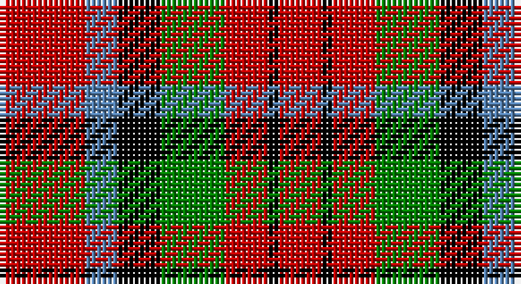

This page is one **sett** — a single exact thread-count. It belongs to the [tartan](/setts/r8t3k4g6r4k1r4/)
(the same proportion at any scale), whose colour order is pattern [RBKGRKR](/stripes/rbkgrkr/).

Sourced from weddslist.  It is a [7 stripe tartan](/stripes/stripes7/).

Original link http://www.weddslist.com/cgi-bin/tartans/pg.pl?source=sts

## Thread count
R/16 B6 K8 G12 R8 K2 R/8

One full sett is **96 threads**.

## Palette

Palette: <strong>Ingles Buchan</strong> <small style="color:#888">(1 of 4 colours)</small>
<table><thead><tr><th>Colour</th><th>Threads</th><th>Shade</th><th>Base</th><th>OKLCh</th></tr></thead><tbody><tr><td>R/</td><td style="text-align:right;font-variant-numeric:tabular-nums">16</td><td><code style="background-color:#C00000;">#C00000</code> <small style="color:#888">#C00000</small></td><td>R <code style="background-color:#CC0000;">#CC0000</code></td><td><small style="color:#888">oklch(50.7% 0.208 29.2)</small></td></tr><tr><td>B</td><td style="text-align:right;font-variant-numeric:tabular-nums">6</td><td><code style="background-color:#5480B0;">#5480B0</code> <small style="color:#888">#5480B0</small></td><td>B <code style="background-color:#2A418A;">#2A418A</code></td><td><small style="color:#888">oklch(58.8% 0.089 251.5)</small></td></tr><tr><td>K</td><td style="text-align:right;font-variant-numeric:tabular-nums">8</td><td><code style="background-color:#000000;">#000000</code> <small style="color:#888">#000000</small></td><td>K <code style="background-color:#000000;">#000000</code></td><td><small style="color:#888">oklch(0.0% 0.000 0.0)</small></td></tr><tr><td>G</td><td style="text-align:right;font-variant-numeric:tabular-nums">12</td><td><code style="background-color:#008000;">#008000</code> <small style="color:#888">#008000</small></td><td>G <code style="background-color:#006100;">#006100</code></td><td><small style="color:#888">oklch(52.0% 0.177 142.5)</small></td></tr><tr><td>R</td><td style="text-align:right;font-variant-numeric:tabular-nums">8</td><td><code style="background-color:#C00000;">#C00000</code> <small style="color:#888">#C00000</small></td><td>R <code style="background-color:#CC0000;">#CC0000</code></td><td><small style="color:#888">oklch(50.7% 0.208 29.2)</small></td></tr><tr><td>K</td><td style="text-align:right;font-variant-numeric:tabular-nums">2</td><td><code style="background-color:#000000;">#000000</code> <small style="color:#888">#000000</small></td><td>K <code style="background-color:#000000;">#000000</code></td><td><small style="color:#888">oklch(0.0% 0.000 0.0)</small></td></tr><tr><td>R/</td><td style="text-align:right;font-variant-numeric:tabular-nums">8</td><td><code style="background-color:#C00000;">#C00000</code> <small style="color:#888">#C00000</small></td><td>R <code style="background-color:#CC0000;">#CC0000</code></td><td><small style="color:#888">oklch(50.7% 0.208 29.2)</small></td></tr></tbody></table>

# Sample pattern

## Nearest tartans

The nearest existing variants by ΔTartan distance, with this tartan at the top so the swatches line up against it.

ΔTartan

Tartan

Sett

—

<a href="/ttd/edit/#slug=r8t3k4g6r4k1r4~x2">MacDuff</a> <a class="nn-out" href="/variants/s7/r8t3k4g6r4k1r4~x2/" title="open its dictionary page">↗</a>

0.64

<a href="/ttd/edit/#slug=r8db3k4dg6r4k1r4~x2&amp;base=r8t3k4g6r4k1r4~x2">MacDuff</a> <a class="nn-out" href="/variants/s7/r8db3k4dg6r4k1r4~x2/" title="open its dictionary page">↗</a>

0.70

<a href="/ttd/edit/#slug=r22t8k9g14r10t2r10~x2&amp;base=r8t3k4g6r4k1r4~x2">MacDuff</a> <a class="nn-out" href="/variants/s7/r22t8k9g14r10t2r10~x2/" title="open its dictionary page">↗</a>

0.73

<a href="/ttd/edit/#slug=r8t3k4dg6r4k1r4~x2&amp;base=r8t3k4g6r4k1r4~x2">MacDuff #5</a> <a class="nn-out" href="/variants/s7/r8t3k4dg6r4k1r4~x2/" title="open its dictionary page">↗</a>

0.88

<a href="/ttd/edit/#slug=r8db3k4g6r4k1r4~x4&amp;base=r8t3k4g6r4k1r4~x2">MacDuff Clan Tartan</a> <a class="nn-out" href="/variants/s7/r8db3k4g6r4k1r4~x4/" title="open its dictionary page">↗</a>

0.91

<a href="/ttd/edit/#slug=dg9w1r9k9r9~x8&amp;base=r8t3k4g6r4k1r4~x2">Unidentified item</a> <a class="nn-out" href="/variants/s5/dg9w1r9k9r9~x8/" title="open its dictionary page">↗</a>

0.99

<a href="/ttd/edit/#slug=r9k9r9w1g9~x8&amp;base=r8t3k4g6r4k1r4~x2">Unidentified, item</a> <a class="nn-out" href="/variants/s5/r9k9r9w1g9~x8/" title="open its dictionary page">↗</a>

1.03

<a href="/ttd/edit/#slug=r13dt13o5lo2dt13lo13~x2&amp;base=r8t3k4g6r4k1r4~x2">Torana</a> <a class="nn-out" href="/variants/s6/r13dt13o5lo2dt13lo13~x2/" title="open its dictionary page">↗</a>

1.12

<a href="/ttd/edit/#slug=r22t8k9dg14r10t2r10~x2&amp;base=r8t3k4g6r4k1r4~x2">MacDuff #2</a> <a class="nn-out" href="/variants/s7/r22t8k9dg14r10t2r10~x2/" title="open its dictionary page">↗</a>

1.17

<a href="/ttd/edit/#slug=r6g1r6db1g3k3g3~x4&amp;base=r8t3k4g6r4k1r4~x2">MacTavish</a> <a class="nn-out" href="/variants/s7/r6g1r6db1g3k3g3~x4/" title="open its dictionary page">↗</a>

1.30

<a href="/ttd/edit/#slug=r8k8ly1k8r8w1~x4&amp;base=r8t3k4g6r4k1r4~x2">Connel</a> <a class="nn-out" href="/variants/s6/r8k8ly1k8r8w1~x4/" title="open its dictionary page">↗</a>

## Neighbour map

Every grey dot is one of 14360 variants placed by the first two principal components of the ΔTartan feature space (44% of its variance). Red is this tartan; blue dots are its nearest — click one to open its page.

<svg viewBox="0 0 640 380" role="img" style="max-width:100%;height:auto;border:1px solid #e0e0e0;border-radius:4px;display:block" xmlns="http://www.w3.org/2000/svg"><image href="/nn/cloud.v1.png" width="640" height="380"/><a href="/variants/s7/r8db3k4dg6r4k1r4~x2/"><circle cx="218.7" cy="233.0" r="4" fill="#3465a4"><title>MacDuff</title></circle></a><a href="/variants/s7/r22t8k9g14r10t2r10~x2/"><circle cx="253.4" cy="213.9" r="4" fill="#3465a4"><title>MacDuff</title></circle></a><a href="/variants/s7/r8t3k4dg6r4k1r4~x2/"><circle cx="230.9" cy="233.9" r="4" fill="#3465a4"><title>MacDuff #5</title></circle></a><a href="/variants/s7/r8db3k4g6r4k1r4~x4/"><circle cx="239.1" cy="240.6" r="4" fill="#3465a4"><title>MacDuff Clan Tartan</title></circle></a><a href="/variants/s5/dg9w1r9k9r9~x8/"><circle cx="211.6" cy="248.9" r="4" fill="#3465a4"><title>Unidentified item</title></circle></a><a href="/variants/s5/r9k9r9w1g9~x8/"><circle cx="192.6" cy="244.7" r="4" fill="#3465a4"><title>Unidentified, item</title></circle></a><a href="/variants/s6/r13dt13o5lo2dt13lo13~x2/"><circle cx="162.9" cy="246.7" r="4" fill="#3465a4"><title>Torana</title></circle></a><a href="/variants/s7/r22t8k9dg14r10t2r10~x2/"><circle cx="267.5" cy="216.7" r="4" fill="#3465a4"><title>MacDuff #2</title></circle></a><a href="/variants/s7/r6g1r6db1g3k3g3~x4/"><circle cx="246.2" cy="241.3" r="4" fill="#3465a4"><title>MacTavish</title></circle></a><a href="/variants/s6/r8k8ly1k8r8w1~x4/"><circle cx="245.2" cy="227.8" r="4" fill="#3465a4"><title>Connel</title></circle></a><circle cx="213.8" cy="229.9" r="5" fill="#c00000"/></svg>

ID: /variants/s7/r8t3k4g6r4k1r4~x2/
