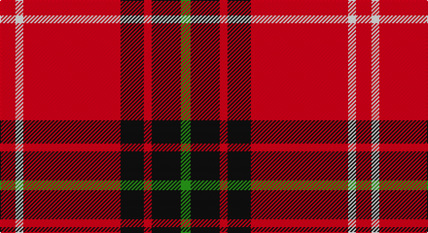

This page is one **sett** — a single exact thread-count. It belongs to the [tartan](/setts/r8w4r50k12r4k15g5/)
(the same proportion at any scale), whose colour order is pattern [GKRKRWR](/stripes/gkrkrwr/).

Part of the [Instakilt,](/tartans/instakilt/) tartan — the named design grouping this sett with its other cloths.

Sourced from tartans-authority.  It is a [7 stripe tartan](/stripes/stripes7/).

Original link http://www.tartansauthority.com/tartan-ferret/display/7549/

## Also known as

This cloth is also recorded under:

- Instakilt, Blue
- Instakilt, Green
- Instakilt, Red

## Register references

External register numbers recorded for this tartan.

- Scottish Tartans Authority (ITI): 7549

## Thread count
R/16 W8 R100 K24 R8 K30 G/10

One full sett is **366 threads**.

## Palette

Palette: <strong>Tartan Register</strong> <small style="color:#888">(3 of 4 colours)</small>
<table><thead><tr><th>Colour</th><th>Threads</th><th>Shade</th><th>Base</th><th>OKLCh</th></tr></thead><tbody><tr><td>R/</td><td style="text-align:right;font-variant-numeric:tabular-nums">16</td><td><code style="background-color:#E40018;">#E40018</code> <small style="color:#888">#E40018</small></td><td>R <code style="background-color:#CC0000;">#CC0000</code></td><td><small style="color:#888">oklch(57.8% 0.236 27.1)</small></td></tr><tr><td>W</td><td style="text-align:right;font-variant-numeric:tabular-nums">8</td><td><code style="background-color:#F8F8F8;">#F8F8F8</code> <small style="color:#888">#F8F8F8</small></td><td>W <code style="background-color:#F7F7F7;">#F7F7F7</code></td><td><small style="color:#888">oklch(97.9% 0.000 89.9)</small></td></tr><tr><td>R</td><td style="text-align:right;font-variant-numeric:tabular-nums">100</td><td><code style="background-color:#E40018;">#E40018</code> <small style="color:#888">#E40018</small></td><td>R <code style="background-color:#CC0000;">#CC0000</code></td><td><small style="color:#888">oklch(57.8% 0.236 27.1)</small></td></tr><tr><td>K</td><td style="text-align:right;font-variant-numeric:tabular-nums">24</td><td><code style="background-color:#101010;">#101010</code> <small style="color:#888">#101010</small></td><td>K <code style="background-color:#000000;">#000000</code></td><td><small style="color:#888">oklch(17.3% 0.000 89.9)</small></td></tr><tr><td>R</td><td style="text-align:right;font-variant-numeric:tabular-nums">8</td><td><code style="background-color:#E40018;">#E40018</code> <small style="color:#888">#E40018</small></td><td>R <code style="background-color:#CC0000;">#CC0000</code></td><td><small style="color:#888">oklch(57.8% 0.236 27.1)</small></td></tr><tr><td>K</td><td style="text-align:right;font-variant-numeric:tabular-nums">30</td><td><code style="background-color:#101010;">#101010</code> <small style="color:#888">#101010</small></td><td>K <code style="background-color:#000000;">#000000</code></td><td><small style="color:#888">oklch(17.3% 0.000 89.9)</small></td></tr><tr><td>G/</td><td style="text-align:right;font-variant-numeric:tabular-nums">10</td><td><code style="background-color:#289C18;">#289C18</code> <small style="color:#888">#289C18</small></td><td>G <code style="background-color:#006100;">#006100</code></td><td><small style="color:#888">oklch(60.6% 0.191 141.6)</small></td></tr></tbody></table>

# Sample pattern

## Compared to the master

This cloth is one sett of its design; the master sett (the exemplar the design is anchored on) is below for comparison.

<figure style="margin:0"><figcaption style="color:#888;font-size:smaller">this sett</figcaption></figure>
<figure style="margin:0"><figcaption style="color:#888;font-size:smaller"><a href="/setts/b8w4b50k12b4k15r5/">master sett →</a></figcaption></figure>

## Nearest tartans

The nearest existing variants by ΔTartan distance, with this tartan at the top so the swatches line up against it.

ΔTartan

Tartan

Sett

—

<a href="/ttd/edit/#slug=r8w4r50k12r4k15g5~x2">Instakilt, Red (Fashion)</a> <a class="nn-out" href="/variants/s7/r8w4r50k12r4k15g5~x2/" title="open its dictionary page">↗</a>

0.92

<a href="/ttd/edit/#slug=r48k12o7k5w3~x2&amp;base=r8w4r50k12r4k15g5~x2">Turner (Personal)</a> <a class="nn-out" href="/variants/s5/r48k12o7k5w3~x2/" title="open its dictionary page">↗</a>

1.00

<a href="/ttd/edit/#slug=w3r27k5r5k32r5k5r27ly3~x2&amp;base=r8w4r50k12r4k15g5~x2">MacIver #2</a> <a class="nn-out" href="/variants/s9/w3r27k5r5k32r5k5r27ly3~x2/" title="open its dictionary page">↗</a>

1.11

<a href="/ttd/edit/#slug=r50db14w6db9lo3db4r4~x2&amp;base=r8w4r50k12r4k15g5~x2">Texas Lone Star (Fashion)</a> <a class="nn-out" href="/variants/s7/r50db14w6db9lo3db4r4~x2/" title="open its dictionary page">↗</a>

1.20

<a href="/ttd/edit/#slug=k4r4ly2r41k4r4k12w2~x2&amp;base=r8w4r50k12r4k15g5~x2">Aberdeen Football Club (2002)</a> <a class="nn-out" href="/variants/s8/k4r4ly2r41k4r4k12w2~x2/" title="open its dictionary page">↗</a>

1.21

<a href="/ttd/edit/#slug=lb6k2r32lo2k6lo2r4k2lb3~x2&amp;base=r8w4r50k12r4k15g5~x2">Lantern, The</a> <a class="nn-out" href="/variants/s9/lb6k2r32lo2k6lo2r4k2lb3~x2/" title="open its dictionary page">↗</a>

1.26

<a href="/ttd/edit/#slug=r35dg16r5dg5w2k3~x2&amp;base=r8w4r50k12r4k15g5~x2">MacGregor</a> <a class="nn-out" href="/variants/s6/r35dg16r5dg5w2k3~x2/" title="open its dictionary page">↗</a>

1.28

<a href="/ttd/edit/#slug=r24o2r4n2k6o2r14k3o4n8~x2&amp;base=r8w4r50k12r4k15g5~x2">Dobrain (Personal)</a> <a class="nn-out" href="/variants/s10/r24o2r4n2k6o2r14k3o4n8~x2/" title="open its dictionary page">↗</a>

1.30

<a href="/ttd/edit/#slug=m8w4m50k12m4k15mi5~x2&amp;base=r8w4r50k12r4k15g5~x2">Instakilt, Pink (Fashion)</a> <a class="nn-out" href="/variants/s7/m8w4m50k12m4k15mi5~x2/" title="open its dictionary page">↗</a>

1.30

<a href="/ttd/edit/#slug=r12dg6k1dg2k1dg1k6r24lb2~x2&amp;base=r8w4r50k12r4k15g5~x2">Stuart of Bute</a> <a class="nn-out" href="/variants/s9/r12dg6k1dg2k1dg1k6r24lb2~x2/" title="open its dictionary page">↗</a>

1.30

<a href="/ttd/edit/#slug=r38w9r3dr9w3~x2&amp;base=r8w4r50k12r4k15g5~x2">Loch Morar</a> <a class="nn-out" href="/variants/s5/r38w9r3dr9w3~x2/" title="open its dictionary page">↗</a>

## Neighbour map

Every grey dot is one of 14360 variants placed by the first two principal components of the ΔTartan feature space (44% of its variance). Red is this tartan; blue dots are its nearest — click one to open its page.

<svg viewBox="0 0 640 380" role="img" style="max-width:100%;height:auto;border:1px solid #e0e0e0;border-radius:4px;display:block" xmlns="http://www.w3.org/2000/svg"><image href="/nn/cloud.v1.png" width="640" height="380"/><a href="/variants/s5/r48k12o7k5w3~x2/"><circle cx="393.7" cy="161.5" r="4" fill="#3465a4"><title>Turner (Personal)</title></circle></a><a href="/variants/s9/w3r27k5r5k32r5k5r27ly3~x2/"><circle cx="321.1" cy="161.7" r="4" fill="#3465a4"><title>MacIver #2</title></circle></a><a href="/variants/s7/r50db14w6db9lo3db4r4~x2/"><circle cx="371.1" cy="139.4" r="4" fill="#3465a4"><title>Texas Lone Star (Fashion)</title></circle></a><a href="/variants/s8/k4r4ly2r41k4r4k12w2~x2/"><circle cx="433.9" cy="116.1" r="4" fill="#3465a4"><title>Aberdeen Football Club (2002)</title></circle></a><a href="/variants/s9/lb6k2r32lo2k6lo2r4k2lb3~x2/"><circle cx="368.4" cy="117.2" r="4" fill="#3465a4"><title>Lantern, The</title></circle></a><a href="/variants/s6/r35dg16r5dg5w2k3~x2/"><circle cx="386.2" cy="161.0" r="4" fill="#3465a4"><title>MacGregor</title></circle></a><a href="/variants/s10/r24o2r4n2k6o2r14k3o4n8~x2/"><circle cx="332.4" cy="155.8" r="4" fill="#3465a4"><title>Dobrain (Personal)</title></circle></a><a href="/variants/s7/m8w4m50k12m4k15mi5~x2/"><circle cx="364.5" cy="154.3" r="4" fill="#3465a4"><title>Instakilt, Pink (Fashion)</title></circle></a><a href="/variants/s9/r12dg6k1dg2k1dg1k6r24lb2~x2/"><circle cx="398.8" cy="118.6" r="4" fill="#3465a4"><title>Stuart of Bute</title></circle></a><a href="/variants/s5/r38w9r3dr9w3~x2/"><circle cx="411.1" cy="183.0" r="4" fill="#3465a4"><title>Loch Morar</title></circle></a><circle cx="364.9" cy="150.8" r="5" fill="#c00000"/></svg>

ID: /variants/s7/r8w4r50k12r4k15g5~x2/
