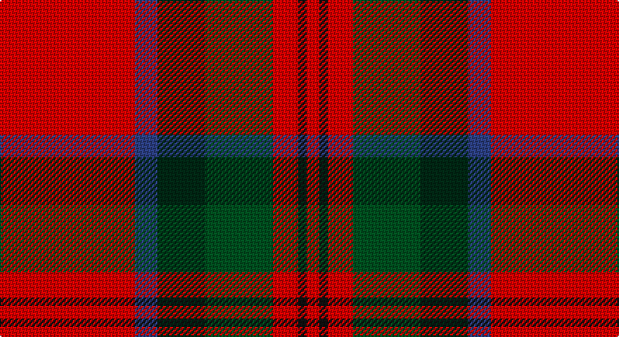

This page is one **sett** — a single exact thread-count. It belongs to the [tartan](/setts/r96db16dg34dgi48r18k6r9/)
(the same proportion at any scale), whose colour order is pattern [RBGGRKR](/stripes/rbggrkr/).

Part of the [MacDuff](/tartans/macduff/) tartan — the named design grouping this sett with its other cloths.

Sourced from register-of-tartans.  It is a [7 stripe tartan](/stripes/stripes7/).

Original link https://www.tartanregister.gov.uk/tartanDetails.aspx?ref=2413

## Also known as

This cloth is also recorded under:

- MacDuff #2
- MacDuff #3
- MacDuff #4
- MacDuff #5
- MacDuff #6
- MacDuff Dress #2

## Register references

External register numbers recorded for this tartan.

- Scottish Register of Tartans: [2413](https://www.tartanregister.gov.uk/tartanDetails.aspx?ref=2413)
- Scottish Tartans World Register: 1333

## Thread count
R/96 B16 DG34 G48 R18 K6 R/9

One full sett is **349 threads**.

## Palette

Palette: <strong>Tartan Register</strong>
<table><thead><tr><th>Colour</th><th>Threads</th><th>Shade</th><th>Base</th><th>OKLCh</th></tr></thead><tbody><tr><td>R/</td><td style="text-align:right;font-variant-numeric:tabular-nums">96</td><td><code style="background-color:#DC0000;">#DC0000</code> <small style="color:#888">#DC0000</small></td><td>R <code style="background-color:#CC0000;">#CC0000</code></td><td><small style="color:#888">oklch(56.2% 0.230 29.2)</small></td></tr><tr><td>B</td><td style="text-align:right;font-variant-numeric:tabular-nums">16</td><td><code style="background-color:#2C4084;">#2C4084</code> <small style="color:#888">#2C4084</small></td><td>B <code style="background-color:#2A418A;">#2A418A</code></td><td><small style="color:#888">oklch(39.4% 0.117 268.3)</small></td></tr><tr><td>DG</td><td style="text-align:right;font-variant-numeric:tabular-nums">34</td><td><code style="background-color:#002814;">#002814</code> <small style="color:#888">#002814</small></td><td>G <code style="background-color:#006100;">#006100</code></td><td><small style="color:#888">oklch(24.4% 0.059 156.5)</small></td></tr><tr><td>G</td><td style="text-align:right;font-variant-numeric:tabular-nums">48</td><td><code style="background-color:#005020;">#005020</code> <small style="color:#888">#005020</small></td><td>G <code style="background-color:#006100;">#006100</code></td><td><small style="color:#888">oklch(37.7% 0.105 149.6)</small></td></tr><tr><td>R</td><td style="text-align:right;font-variant-numeric:tabular-nums">18</td><td><code style="background-color:#DC0000;">#DC0000</code> <small style="color:#888">#DC0000</small></td><td>R <code style="background-color:#CC0000;">#CC0000</code></td><td><small style="color:#888">oklch(56.2% 0.230 29.2)</small></td></tr><tr><td>K</td><td style="text-align:right;font-variant-numeric:tabular-nums">6</td><td><code style="background-color:#101010;">#101010</code> <small style="color:#888">#101010</small></td><td>K <code style="background-color:#000000;">#000000</code></td><td><small style="color:#888">oklch(17.3% 0.000 89.9)</small></td></tr><tr><td>R/</td><td style="text-align:right;font-variant-numeric:tabular-nums">9</td><td><code style="background-color:#DC0000;">#DC0000</code> <small style="color:#888">#DC0000</small></td><td>R <code style="background-color:#CC0000;">#CC0000</code></td><td><small style="color:#888">oklch(56.2% 0.230 29.2)</small></td></tr></tbody></table>

# Sample pattern

## Compared to the master

This cloth is one sett of its design; the master sett (the exemplar the design is anchored on) is below for comparison.

<figure style="margin:0"><figcaption style="color:#888;font-size:smaller">this sett</figcaption></figure>
<figure style="margin:0"><figcaption style="color:#888;font-size:smaller"><a href="/setts/r10db6k8dg10r6dg3r6/">master sett →</a></figcaption></figure>

## Nearest tartans

The nearest existing variants by ΔTartan distance, with this tartan at the top so the swatches line up against it.

ΔTartan

Tartan

Sett

—

<a href="/ttd/edit/#slug=r96db16dg34dgi48r18k6r9">MacDuff</a> <a class="nn-out" href="/variants/s7/r96db16dg34dgi48r18k6r9/" title="open its dictionary page">↗</a>

0.57

<a href="/ttd/edit/#slug=r96db16dg34g48r18k6r9&amp;base=r96db16dg34dgi48r18k6r9">MacDuff</a> <a class="nn-out" href="/variants/s7/r96db16dg34g48r18k6r9/" title="open its dictionary page">↗</a>

0.91

<a href="/ttd/edit/#slug=r30g12k5w2db6r30db12w2k5g12~x2&amp;base=r96db16dg34dgi48r18k6r9">Sinclair</a> <a class="nn-out" href="/variants/s10/r30g12k5w2db6r30db12w2k5g12~x2/" title="open its dictionary page">↗</a>

0.92

<a href="/ttd/edit/#slug=r25db7r3g13t1k2~x4&amp;base=r96db16dg34dgi48r18k6r9">MacPhail</a> <a class="nn-out" href="/variants/s6/r25db7r3g13t1k2~x4/" title="open its dictionary page">↗</a>

0.93

<a href="/ttd/edit/#slug=r6g14r6db12r31lb2r4ly3~x2&amp;base=r96db16dg34dgi48r18k6r9">Loch Lochy (District)</a> <a class="nn-out" href="/variants/s8/r6g14r6db12r31lb2r4ly3~x2/" title="open its dictionary page">↗</a>

0.98

<a href="/ttd/edit/#slug=r52b16k16g22r16lo3r16~x2&amp;base=r96db16dg34dgi48r18k6r9">Sturrock, Blue/Black (Clan)</a> <a class="nn-out" href="/variants/s7/r52b16k16g22r16lo3r16~x2/" title="open its dictionary page">↗</a>

1.02

<a href="/ttd/edit/#slug=r4k2r24k6db6dg16r3~x2&amp;base=r96db16dg34dgi48r18k6r9">MacDuff #4</a> <a class="nn-out" href="/variants/s7/r4k2r24k6db6dg16r3~x2/" title="open its dictionary page">↗</a>

1.06

<a href="/ttd/edit/#slug=b4r1k11r20k20r20g4ly1~x2&amp;base=r96db16dg34dgi48r18k6r9">Templeton (Name?)</a> <a class="nn-out" href="/variants/s8/b4r1k11r20k20r20g4ly1~x2/" title="open its dictionary page">↗</a>

1.06

<a href="/ttd/edit/#slug=r50k25g10o5ly2~x2&amp;base=r96db16dg34dgi48r18k6r9">MacGleish Formal (Personal)</a> <a class="nn-out" href="/variants/s5/r50k25g10o5ly2~x2/" title="open its dictionary page">↗</a>

1.09

<a href="/ttd/edit/#slug=k2r1g8r3g3r14ly1r1w2~x2&amp;base=r96db16dg34dgi48r18k6r9">Melieres, Michel (Personal)</a> <a class="nn-out" href="/variants/s9/k2r1g8r3g3r14ly1r1w2~x2/" title="open its dictionary page">↗</a>

1.09

<a href="/ttd/edit/#slug=r27g4k4g4k4db6lo1~x4&amp;base=r96db16dg34dgi48r18k6r9">MacLeay (Clan)</a> <a class="nn-out" href="/variants/s7/r27g4k4g4k4db6lo1~x4/" title="open its dictionary page">↗</a>

## Neighbour map

Every grey dot is one of 14360 variants placed by the first two principal components of the ΔTartan feature space (44% of its variance). Red is this tartan; blue dots are its nearest — click one to open its page.

<svg viewBox="0 0 640 380" role="img" style="max-width:100%;height:auto;border:1px solid #e0e0e0;border-radius:4px;display:block" xmlns="http://www.w3.org/2000/svg"><image href="/nn/cloud.v1.png" width="640" height="380"/><a href="/variants/s7/r96db16dg34g48r18k6r9/"><circle cx="292.7" cy="160.0" r="4" fill="#3465a4"><title>MacDuff</title></circle></a><a href="/variants/s10/r30g12k5w2db6r30db12w2k5g12~x2/"><circle cx="256.8" cy="145.4" r="4" fill="#3465a4"><title>Sinclair</title></circle></a><a href="/variants/s6/r25db7r3g13t1k2~x4/"><circle cx="327.3" cy="143.1" r="4" fill="#3465a4"><title>MacPhail</title></circle></a><a href="/variants/s8/r6g14r6db12r31lb2r4ly3~x2/"><circle cx="333.6" cy="149.6" r="4" fill="#3465a4"><title>Loch Lochy (District)</title></circle></a><a href="/variants/s7/r52b16k16g22r16lo3r16~x2/"><circle cx="315.9" cy="173.4" r="4" fill="#3465a4"><title>Sturrock, Blue/Black (Clan)</title></circle></a><a href="/variants/s7/r4k2r24k6db6dg16r3~x2/"><circle cx="278.1" cy="183.7" r="4" fill="#3465a4"><title>MacDuff #4</title></circle></a><a href="/variants/s8/b4r1k11r20k20r20g4ly1~x2/"><circle cx="285.4" cy="149.6" r="4" fill="#3465a4"><title>Templeton (Name?)</title></circle></a><a href="/variants/s5/r50k25g10o5ly2~x2/"><circle cx="321.1" cy="146.9" r="4" fill="#3465a4"><title>MacGleish Formal (Personal)</title></circle></a><a href="/variants/s9/k2r1g8r3g3r14ly1r1w2~x2/"><circle cx="298.9" cy="135.6" r="4" fill="#3465a4"><title>Melieres, Michel (Personal)</title></circle></a><a href="/variants/s7/r27g4k4g4k4db6lo1~x4/"><circle cx="324.9" cy="121.0" r="4" fill="#3465a4"><title>MacLeay (Clan)</title></circle></a><circle cx="293.0" cy="156.4" r="5" fill="#c00000"/></svg>

ID: /variants/s7/r96db16dg34dgi48r18k6r9/
