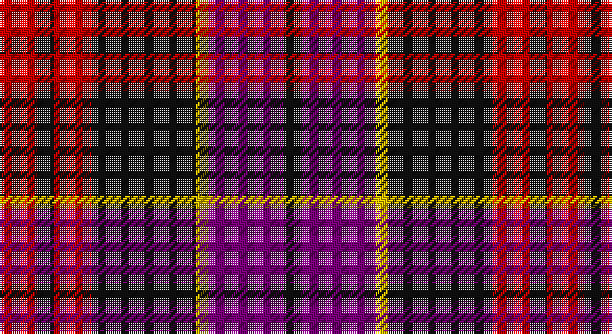

This page is one **sett** — a single exact thread-count. It belongs to the [tartan](/setts/r9k4r9k25ly3dp18k4/)
(the same proportion at any scale), whose colour order is pattern [KBYKRKR](/stripes/kbykrkr/).

Sourced from tartans-authority.  It is a [7 stripe tartan](/stripes/stripes7/).

Original link http://www.tartansauthority.com/tartan-ferret/display/11215/

## Register references

External register numbers recorded for this tartan.

- Scottish Register of Tartans: [11215](https://www.tartanregister.gov.uk/tartanDetails?ref=11215)
- Scottish Tartans Authority (ITI): 11215

## Thread count
R/18 K8 R18 K50 Y6 P36 K/8

One full sett is **262 threads**.

## Palette

Palette: <strong>Tartan Register</strong>
<table><thead><tr><th>Colour</th><th>Threads</th><th>Shade</th><th>Base</th><th>OKLCh</th></tr></thead><tbody><tr><td>R/</td><td style="text-align:right;font-variant-numeric:tabular-nums">18</td><td><code style="background-color:#C80000;">#C80000</code> <small style="color:#888">#C80000</small></td><td>R <code style="background-color:#CC0000;">#CC0000</code></td><td><small style="color:#888">oklch(52.3% 0.215 29.2)</small></td></tr><tr><td>K</td><td style="text-align:right;font-variant-numeric:tabular-nums">8</td><td><code style="background-color:#101010;">#101010</code> <small style="color:#888">#101010</small></td><td>K <code style="background-color:#000000;">#000000</code></td><td><small style="color:#888">oklch(17.3% 0.000 89.9)</small></td></tr><tr><td>R</td><td style="text-align:right;font-variant-numeric:tabular-nums">18</td><td><code style="background-color:#C80000;">#C80000</code> <small style="color:#888">#C80000</small></td><td>R <code style="background-color:#CC0000;">#CC0000</code></td><td><small style="color:#888">oklch(52.3% 0.215 29.2)</small></td></tr><tr><td>K</td><td style="text-align:right;font-variant-numeric:tabular-nums">50</td><td><code style="background-color:#101010;">#101010</code> <small style="color:#888">#101010</small></td><td>K <code style="background-color:#000000;">#000000</code></td><td><small style="color:#888">oklch(17.3% 0.000 89.9)</small></td></tr><tr><td>Y</td><td style="text-align:right;font-variant-numeric:tabular-nums">6</td><td><code style="background-color:#E8C000;">#E8C000</code> <small style="color:#888">#E8C000</small></td><td>Y <code style="background-color:#F2BF00;">#F2BF00</code></td><td><small style="color:#888">oklch(81.9% 0.168 93.7)</small></td></tr><tr><td>P</td><td style="text-align:right;font-variant-numeric:tabular-nums">36</td><td><code style="background-color:#780078;">#780078</code> <small style="color:#888">#780078</small></td><td>B <code style="background-color:#2A418A;">#2A418A</code></td><td><small style="color:#888">oklch(40.2% 0.185 328.4)</small></td></tr><tr><td>K/</td><td style="text-align:right;font-variant-numeric:tabular-nums">8</td><td><code style="background-color:#101010;">#101010</code> <small style="color:#888">#101010</small></td><td>K <code style="background-color:#000000;">#000000</code></td><td><small style="color:#888">oklch(17.3% 0.000 89.9)</small></td></tr></tbody></table>

# Sample pattern

## Nearest tartans

The nearest existing variants by ΔTartan distance, with this tartan at the top so the swatches line up against it.

ΔTartan

Tartan

Sett

—

<a href="/ttd/edit/#slug=r9k4r9k25ly3dp18k4~x2">Wounded Warriors Canada</a> <a class="nn-out" href="/variants/s7/r9k4r9k25ly3dp18k4~x2/" title="open its dictionary page">↗</a>

0.73

<a href="/ttd/edit/#slug=r26t3r4k16db16k4~x2&amp;base=r9k4r9k25ly3dp18k4~x2">Graham of Menteith, (Red)</a> <a class="nn-out" href="/variants/s6/r26t3r4k16db16k4~x2/" title="open its dictionary page">↗</a>

0.82

<a href="/ttd/edit/#slug=r36lb3r5k21db24k3~x2&amp;base=r9k4r9k25ly3dp18k4~x2">Graham of Menteith (Red)</a> <a class="nn-out" href="/variants/s6/r36lb3r5k21db24k3~x2/" title="open its dictionary page">↗</a>

0.96

<a href="/ttd/edit/#slug=r9k4r9k25o3dp18k4~x2&amp;base=r9k4r9k25ly3dp18k4~x2">Wounded Warriors Canada</a> <a class="nn-out" href="/variants/s7/r9k4r9k25o3dp18k4~x2/" title="open its dictionary page">↗</a>

1.07

<a href="/ttd/edit/#slug=b2r12db2b6k6b1~x2&amp;base=r9k4r9k25ly3dp18k4~x2">MacTavish</a> <a class="nn-out" href="/variants/s6/b2r12db2b6k6b1~x2/" title="open its dictionary page">↗</a>

1.07

<a href="/ttd/edit/#slug=b2r12db2b6k6b1&amp;base=r9k4r9k25ly3dp18k4~x2">MacTavish</a> <a class="nn-out" href="/variants/s6/b2r12db2b6k6b1/" title="open its dictionary page">↗</a>

1.10

<a href="/ttd/edit/#slug=r2dp8k8w1r2~x2&amp;base=r9k4r9k25ly3dp18k4~x2">Inder (Corporate)</a> <a class="nn-out" href="/variants/s5/r2dp8k8w1r2~x2/" title="open its dictionary page">↗</a>

1.11

<a href="/ttd/edit/#slug=lb5r34k22r4o24r4~x2&amp;base=r9k4r9k25ly3dp18k4~x2">Wcwm 759-2</a> <a class="nn-out" href="/variants/s6/lb5r34k22r4o24r4~x2/" title="open its dictionary page">↗</a>

1.12

<a href="/ttd/edit/#slug=db4r30k6db13k13db3~x2&amp;base=r9k4r9k25ly3dp18k4~x2">Thompson/Thomson/MacTavish (Bonner)</a> <a class="nn-out" href="/variants/s6/db4r30k6db13k13db3~x2/" title="open its dictionary page">↗</a>

1.14

<a href="/ttd/edit/#slug=r10k4r4k6r28k10lo4db30k4db7~x2&amp;base=r9k4r9k25ly3dp18k4~x2">St George's School</a> <a class="nn-out" href="/variants/s10/r10k4r4k6r28k10lo4db30k4db7~x2/" title="open its dictionary page">↗</a>

1.19

<a href="/ttd/edit/#slug=b2k2r14dg15k8b7r14k2b2~x2&amp;base=r9k4r9k25ly3dp18k4~x2">Montrose</a> <a class="nn-out" href="/variants/s9/b2k2r14dg15k8b7r14k2b2~x2/" title="open its dictionary page">↗</a>

## Neighbour map

Every grey dot is one of 14360 variants placed by the first two principal components of the ΔTartan feature space (44% of its variance). Red is this tartan; blue dots are its nearest — click one to open its page.

<svg viewBox="0 0 640 380" role="img" style="max-width:100%;height:auto;border:1px solid #e0e0e0;border-radius:4px;display:block" xmlns="http://www.w3.org/2000/svg"><image href="/nn/cloud.v1.png" width="640" height="380"/><a href="/variants/s6/r26t3r4k16db16k4~x2/"><circle cx="205.3" cy="208.7" r="4" fill="#3465a4"><title>Graham of Menteith, (Red)</title></circle></a><a href="/variants/s6/r36lb3r5k21db24k3~x2/"><circle cx="248.5" cy="195.7" r="4" fill="#3465a4"><title>Graham of Menteith (Red)</title></circle></a><a href="/variants/s7/r9k4r9k25o3dp18k4~x2/"><circle cx="255.8" cy="227.3" r="4" fill="#3465a4"><title>Wounded Warriors Canada</title></circle></a><a href="/variants/s6/b2r12db2b6k6b1~x2/"><circle cx="209.9" cy="196.7" r="4" fill="#3465a4"><title>MacTavish</title></circle></a><a href="/variants/s6/b2r12db2b6k6b1/"><circle cx="209.9" cy="196.7" r="4" fill="#3465a4"><title>MacTavish</title></circle></a><a href="/variants/s5/r2dp8k8w1r2~x2/"><circle cx="203.1" cy="223.2" r="4" fill="#3465a4"><title>Inder (Corporate)</title></circle></a><a href="/variants/s6/lb5r34k22r4o24r4~x2/"><circle cx="205.7" cy="203.8" r="4" fill="#3465a4"><title>Wcwm 759-2</title></circle></a><a href="/variants/s6/db4r30k6db13k13db3~x2/"><circle cx="255.2" cy="217.3" r="4" fill="#3465a4"><title>Thompson/Thomson/MacTavish (Bonner)</title></circle></a><a href="/variants/s10/r10k4r4k6r28k10lo4db30k4db7~x2/"><circle cx="207.3" cy="188.6" r="4" fill="#3465a4"><title>St George's School</title></circle></a><a href="/variants/s9/b2k2r14dg15k8b7r14k2b2~x2/"><circle cx="183.7" cy="204.2" r="4" fill="#3465a4"><title>Montrose</title></circle></a><circle cx="229.3" cy="211.0" r="5" fill="#c00000"/></svg>

ID: /variants/s7/r9k4r9k25ly3dp18k4~x2/
