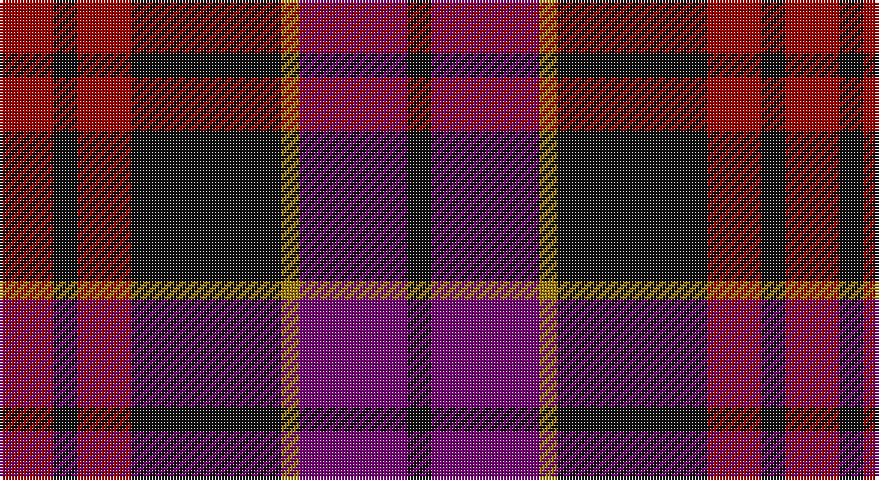

This page is one **sett** — a single exact thread-count. It belongs to the [tartan](/setts/r9k4r9k25o3dp18k4/)
(the same proportion at any scale), whose colour order is pattern [KBRKRKR](/stripes/kbrkrkr/).

Sourced from register-of-tartans.  It is a [7 stripe tartan](/stripes/stripes7/).

Original link https://www.tartanregister.gov.uk/tartanDetails.aspx?ref=11215

## Register references

External register numbers recorded for this tartan.

- Scottish Register of Tartans: [11215](https://www.tartanregister.gov.uk/tartanDetails.aspx?ref=11215)

## Thread count
DR/18 K8 DR18 K50 DY6 P36 K/8

One full sett is **262 threads**.

## Palette

Palette: <strong>Tartan Register</strong> <small style="color:#888">(3 of 4 colours)</small>
<table><thead><tr><th>Colour</th><th>Threads</th><th>Shade</th><th>Base</th><th>OKLCh</th></tr></thead><tbody><tr><td>DR/</td><td style="text-align:right;font-variant-numeric:tabular-nums">18</td><td><code style="background-color:#A00000;">#A00000</code> <small style="color:#888">#A00000</small></td><td>R <code style="background-color:#CC0000;">#CC0000</code></td><td><small style="color:#888">oklch(44.3% 0.182 29.2)</small></td></tr><tr><td>K</td><td style="text-align:right;font-variant-numeric:tabular-nums">8</td><td><code style="background-color:#101010;">#101010</code> <small style="color:#888">#101010</small></td><td>K <code style="background-color:#000000;">#000000</code></td><td><small style="color:#888">oklch(17.3% 0.000 89.9)</small></td></tr><tr><td>DR</td><td style="text-align:right;font-variant-numeric:tabular-nums">18</td><td><code style="background-color:#A00000;">#A00000</code> <small style="color:#888">#A00000</small></td><td>R <code style="background-color:#CC0000;">#CC0000</code></td><td><small style="color:#888">oklch(44.3% 0.182 29.2)</small></td></tr><tr><td>K</td><td style="text-align:right;font-variant-numeric:tabular-nums">50</td><td><code style="background-color:#101010;">#101010</code> <small style="color:#888">#101010</small></td><td>K <code style="background-color:#000000;">#000000</code></td><td><small style="color:#888">oklch(17.3% 0.000 89.9)</small></td></tr><tr><td>DY</td><td style="text-align:right;font-variant-numeric:tabular-nums">6</td><td><code style="background-color:#A07C00;">#A07C00</code> <small style="color:#888">#A07C00</small></td><td>R <code style="background-color:#CC0000;">#CC0000</code></td><td><small style="color:#888">oklch(60.4% 0.124 88.2)</small></td></tr><tr><td>P</td><td style="text-align:right;font-variant-numeric:tabular-nums">36</td><td><code style="background-color:#780078;">#780078</code> <small style="color:#888">#780078</small></td><td>B <code style="background-color:#2A418A;">#2A418A</code></td><td><small style="color:#888">oklch(40.2% 0.185 328.4)</small></td></tr><tr><td>K/</td><td style="text-align:right;font-variant-numeric:tabular-nums">8</td><td><code style="background-color:#101010;">#101010</code> <small style="color:#888">#101010</small></td><td>K <code style="background-color:#000000;">#000000</code></td><td><small style="color:#888">oklch(17.3% 0.000 89.9)</small></td></tr></tbody></table>

# Sample pattern

## Nearest tartans

The nearest existing variants by ΔTartan distance, with this tartan at the top so the swatches line up against it.

ΔTartan

Tartan

Sett

—

<a href="/ttd/edit/#slug=r9k4r9k25o3dp18k4~x2">Wounded Warriors Canada</a> <a class="nn-out" href="/variants/s7/r9k4r9k25o3dp18k4~x2/" title="open its dictionary page">↗</a>

0.96

<a href="/ttd/edit/#slug=r9k4r9k25ly3dp18k4~x2&amp;base=r9k4r9k25o3dp18k4~x2">Wounded Warriors Canada</a> <a class="nn-out" href="/variants/s7/r9k4r9k25ly3dp18k4~x2/" title="open its dictionary page">↗</a>

1.23

<a href="/ttd/edit/#slug=k4dr8m30k8dr6k8dr12w3~x2&amp;base=r9k4r9k25o3dp18k4~x2">Believe - Corinna</a> <a class="nn-out" href="/variants/s8/k4dr8m30k8dr6k8dr12w3~x2/" title="open its dictionary page">↗</a>

1.28

<a href="/ttd/edit/#slug=r36lb3r5k21db24k3~x2&amp;base=r9k4r9k25o3dp18k4~x2">Graham of Menteith (Red)</a> <a class="nn-out" href="/variants/s6/r36lb3r5k21db24k3~x2/" title="open its dictionary page">↗</a>

1.35

<a href="/ttd/edit/#slug=dp1k2r7o4r2k4r7o2dp1~x4&amp;base=r9k4r9k25o3dp18k4~x2">Clanton (Personal)</a> <a class="nn-out" href="/variants/s9/dp1k2r7o4r2k4r7o2dp1~x4/" title="open its dictionary page">↗</a>

1.35

<a href="/ttd/edit/#slug=dg3r9t1dg9r1dg1r8db9r1~x4&amp;base=r9k4r9k25o3dp18k4~x2">Baronage</a> <a class="nn-out" href="/variants/s9/dg3r9t1dg9r1dg1r8db9r1~x4/" title="open its dictionary page">↗</a>

1.39

<a href="/ttd/edit/#slug=n32w4n4k24dp29k4&amp;base=r9k4r9k25o3dp18k4~x2">Grammar School at Leeds (School)</a> <a class="nn-out" href="/variants/s6/n32w4n4k24dp29k4/" title="open its dictionary page">↗</a>

1.40

<a href="/ttd/edit/#slug=db1k1r12g12k6db5r12k1db1~x4&amp;base=r9k4r9k25o3dp18k4~x2">Montrose (Macnaughton variation)</a> <a class="nn-out" href="/variants/s9/db1k1r12g12k6db5r12k1db1~x4/" title="open its dictionary page">↗</a>

1.41

<a href="/ttd/edit/#slug=r10k4r4k6r28k10lo4db30k4db7~x2&amp;base=r9k4r9k25o3dp18k4~x2">St George's School</a> <a class="nn-out" href="/variants/s10/r10k4r4k6r28k10lo4db30k4db7~x2/" title="open its dictionary page">↗</a>

1.42

<a href="/ttd/edit/#slug=k36r3db3r3k8db24r18g3r3~x2&amp;base=r9k4r9k25o3dp18k4~x2">Grady (Personal)</a> <a class="nn-out" href="/variants/s9/k36r3db3r3k8db24r18g3r3~x2/" title="open its dictionary page">↗</a>

1.42

<a href="/ttd/edit/#slug=r6dg16r4db12r16b1r2~x2&amp;base=r9k4r9k25o3dp18k4~x2">MacQuarrie LO</a> <a class="nn-out" href="/variants/s7/r6dg16r4db12r16b1r2~x2/" title="open its dictionary page">↗</a>

## Neighbour map

Every grey dot is one of 14360 variants placed by the first two principal components of the ΔTartan feature space (44% of its variance). Red is this tartan; blue dots are its nearest — click one to open its page.

<svg viewBox="0 0 640 380" role="img" style="max-width:100%;height:auto;border:1px solid #e0e0e0;border-radius:4px;display:block" xmlns="http://www.w3.org/2000/svg"><image href="/nn/cloud.v1.png" width="640" height="380"/><a href="/variants/s7/r9k4r9k25ly3dp18k4~x2/"><circle cx="229.3" cy="211.0" r="4" fill="#3465a4"><title>Wounded Warriors Canada</title></circle></a><a href="/variants/s8/k4dr8m30k8dr6k8dr12w3~x2/"><circle cx="235.7" cy="202.6" r="4" fill="#3465a4"><title>Believe - Corinna</title></circle></a><a href="/variants/s6/r36lb3r5k21db24k3~x2/"><circle cx="248.5" cy="195.7" r="4" fill="#3465a4"><title>Graham of Menteith (Red)</title></circle></a><a href="/variants/s9/dp1k2r7o4r2k4r7o2dp1~x4/"><circle cx="273.9" cy="226.4" r="4" fill="#3465a4"><title>Clanton (Personal)</title></circle></a><a href="/variants/s9/dg3r9t1dg9r1dg1r8db9r1~x4/"><circle cx="246.4" cy="200.5" r="4" fill="#3465a4"><title>Baronage</title></circle></a><a href="/variants/s6/n32w4n4k24dp29k4/"><circle cx="207.2" cy="230.1" r="4" fill="#3465a4"><title>Grammar School at Leeds (School)</title></circle></a><a href="/variants/s9/db1k1r12g12k6db5r12k1db1~x4/"><circle cx="272.3" cy="199.2" r="4" fill="#3465a4"><title>Montrose (Macnaughton variation)</title></circle></a><a href="/variants/s10/r10k4r4k6r28k10lo4db30k4db7~x2/"><circle cx="207.3" cy="188.6" r="4" fill="#3465a4"><title>St George's School</title></circle></a><a href="/variants/s9/k36r3db3r3k8db24r18g3r3~x2/"><circle cx="259.3" cy="178.5" r="4" fill="#3465a4"><title>Grady (Personal)</title></circle></a><a href="/variants/s7/r6dg16r4db12r16b1r2~x2/"><circle cx="289.1" cy="201.4" r="4" fill="#3465a4"><title>MacQuarrie LO</title></circle></a><circle cx="255.8" cy="227.3" r="5" fill="#c00000"/></svg>

ID: /variants/s7/r9k4r9k25o3dp18k4~x2/
