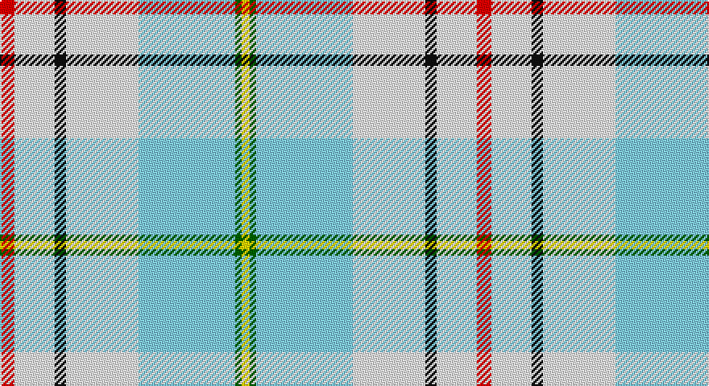

This page is one **sett** — a single exact thread-count. It belongs to the [tartan](/setts/r9w25k7w45lt60g4ly5/)
(the same proportion at any scale), whose colour order is pattern [RWKWWGY](/stripes/rwkwwgy/).

Sourced from register-of-tartans.  It is a [7 stripe tartan](/stripes/stripes7/).

Original link https://www.tartanregister.gov.uk/tartanDetails.aspx?ref=10850

## Register references

External register numbers recorded for this tartan.

- Scottish Register of Tartans: [10850](https://www.tartanregister.gov.uk/tartanDetails.aspx?ref=10850)

## Thread count
R/9 W25 K7 W45 LB60 G4 Y/5

One full sett is **296 threads**.

## Palette

Palette: <strong>Tartan Register</strong>
<table><thead><tr><th>Colour</th><th>Threads</th><th>Shade</th><th>Base</th><th>OKLCh</th></tr></thead><tbody><tr><td>R/</td><td style="text-align:right;font-variant-numeric:tabular-nums">9</td><td><code style="background-color:#FF0000;">#FF0000</code> <small style="color:#888">#FF0000</small></td><td>R <code style="background-color:#CC0000;">#CC0000</code></td><td><small style="color:#888">oklch(62.8% 0.258 29.2)</small></td></tr><tr><td>W</td><td style="text-align:right;font-variant-numeric:tabular-nums">25</td><td><code style="background-color:#FFFFFF;">#FFFFFF</code> <small style="color:#888">#FFFFFF</small></td><td>W <code style="background-color:#F7F7F7;">#F7F7F7</code></td><td><small style="color:#888">oklch(100.0% 0.000 89.9)</small></td></tr><tr><td>K</td><td style="text-align:right;font-variant-numeric:tabular-nums">7</td><td><code style="background-color:#101010;">#101010</code> <small style="color:#888">#101010</small></td><td>K <code style="background-color:#000000;">#000000</code></td><td><small style="color:#888">oklch(17.3% 0.000 89.9)</small></td></tr><tr><td>W</td><td style="text-align:right;font-variant-numeric:tabular-nums">45</td><td><code style="background-color:#FFFFFF;">#FFFFFF</code> <small style="color:#888">#FFFFFF</small></td><td>W <code style="background-color:#F7F7F7;">#F7F7F7</code></td><td><small style="color:#888">oklch(100.0% 0.000 89.9)</small></td></tr><tr><td>LB</td><td style="text-align:right;font-variant-numeric:tabular-nums">60</td><td><code style="background-color:#82CFFD;">#82CFFD</code> <small style="color:#888">#82CFFD</small></td><td>W <code style="background-color:#F7F7F7;">#F7F7F7</code></td><td><small style="color:#888">oklch(82.2% 0.100 236.0)</small></td></tr><tr><td>G</td><td style="text-align:right;font-variant-numeric:tabular-nums">4</td><td><code style="background-color:#006400;">#006400</code> <small style="color:#888">#006400</small></td><td>G <code style="background-color:#006100;">#006100</code></td><td><small style="color:#888">oklch(43.6% 0.148 142.5)</small></td></tr><tr><td>Y/</td><td style="text-align:right;font-variant-numeric:tabular-nums">5</td><td><code style="background-color:#FFE600;">#FFE600</code> <small style="color:#888">#FFE600</small></td><td>Y <code style="background-color:#F2BF00;">#F2BF00</code></td><td><small style="color:#888">oklch(91.7% 0.192 101.4)</small></td></tr></tbody></table>

# Sample pattern

## Nearest tartans

The nearest existing variants by ΔTartan distance, with this tartan at the top so the swatches line up against it.

ΔTartan

Tartan

Sett

—

<a href="/ttd/edit/#slug=r9w25k7w45lt60g4ly5">Ch. Supt. Everett and Mrs Julene Summerfield Dress</a> <a class="nn-out" href="/variants/s7/r9w25k7w45lt60g4ly5/" title="open its dictionary page">↗</a>

0.31

<a href="/ttd/edit/#slug=r9w27k7w45lb60dg4lo5&amp;base=r9w25k7w45lt60g4ly5">Ch. Supt. Everett and Mrs Julene Sum</a> <a class="nn-out" href="/variants/s7/r9w27k7w45lb60dg4lo5/" title="open its dictionary page">↗</a>

1.36

<a href="/ttd/edit/#slug=g4ly3r2ly22lb22w2lb3k2~x2&amp;base=r9w25k7w45lt60g4ly5">Aguilar Pardo, Luis Alejandro (Personal)</a> <a class="nn-out" href="/variants/s8/g4ly3r2ly22lb22w2lb3k2~x2/" title="open its dictionary page">↗</a>

1.46

<a href="/ttd/edit/#slug=w26lb9k2lb2w2lb2o11lb8ly2o2r2~x2&amp;base=r9w25k7w45lt60g4ly5">Manchester Blues Dress (Comm)</a> <a class="nn-out" href="/variants/s11/w26lb9k2lb2w2lb2o11lb8ly2o2r2~x2/" title="open its dictionary page">↗</a>

1.48

<a href="/ttd/edit/#slug=w26lb9k2lb2w2lb2lr11lb8ly2lr2r2~x2&amp;base=r9w25k7w45lt60g4ly5">Manchester Blues Dress</a> <a class="nn-out" href="/variants/s11/w26lb9k2lb2w2lb2lr11lb8ly2lr2r2~x2/" title="open its dictionary page">↗</a>

1.50

<a href="/ttd/edit/#slug=w8ly3w22o22dr3r2w4~x2&amp;base=r9w25k7w45lt60g4ly5">Banff, White (Fashion)</a> <a class="nn-out" href="/variants/s7/w8ly3w22o22dr3r2w4~x2/" title="open its dictionary page">↗</a>

1.53

<a href="/ttd/edit/#slug=lb26w9k2w2lb2w2o11w8ly2o2r2~x2&amp;base=r9w25k7w45lt60g4ly5">Manchester Blues Modern</a> <a class="nn-out" href="/variants/s11/lb26w9k2w2lb2w2o11w8ly2o2r2~x2/" title="open its dictionary page">↗</a>

1.63

<a href="/ttd/edit/#slug=lb26w9k2w2lb2w2lr11w8ly2lr2r2~x2&amp;base=r9w25k7w45lt60g4ly5">Manchester Blues Modern</a> <a class="nn-out" href="/variants/s11/lb26w9k2w2lb2w2lr11w8ly2lr2r2~x2/" title="open its dictionary page">↗</a>

1.64

<a href="/ttd/edit/#slug=t14db1n3g1n3db1n4w24r1~x4&amp;base=r9w25k7w45lt60g4ly5">Musselburgh Dress (Dance)</a> <a class="nn-out" href="/variants/s9/t14db1n3g1n3db1n4w24r1~x4/" title="open its dictionary page">↗</a>

1.67

<a href="/ttd/edit/#slug=w8g5dp10t24w30g2lp2~x2&amp;base=r9w25k7w45lt60g4ly5">Shiel, Purple V2 (Dance)</a> <a class="nn-out" href="/variants/s7/w8g5dp10t24w30g2lp2~x2/" title="open its dictionary page">↗</a>

1.68

<a href="/ttd/edit/#slug=t53k2w53k2r4ly7~x2&amp;base=r9w25k7w45lt60g4ly5">Galicia</a> <a class="nn-out" href="/variants/s6/t53k2w53k2r4ly7~x2/" title="open its dictionary page">↗</a>

## Neighbour map

Every grey dot is one of 14360 variants placed by the first two principal components of the ΔTartan feature space (44% of its variance). Red is this tartan; blue dots are its nearest — click one to open its page.

<svg viewBox="0 0 640 380" role="img" style="max-width:100%;height:auto;border:1px solid #e0e0e0;border-radius:4px;display:block" xmlns="http://www.w3.org/2000/svg"><image href="/nn/cloud.v1.png" width="640" height="380"/><a href="/variants/s7/r9w27k7w45lb60dg4lo5/"><circle cx="206.2" cy="125.6" r="4" fill="#3465a4"><title>Ch. Supt. Everett and Mrs Julene Sum</title></circle></a><a href="/variants/s8/g4ly3r2ly22lb22w2lb3k2~x2/"><circle cx="192.5" cy="121.8" r="4" fill="#3465a4"><title>Aguilar Pardo, Luis Alejandro (Personal)</title></circle></a><a href="/variants/s11/w26lb9k2lb2w2lb2o11lb8ly2o2r2~x2/"><circle cx="188.0" cy="105.9" r="4" fill="#3465a4"><title>Manchester Blues Dress (Comm)</title></circle></a><a href="/variants/s11/w26lb9k2lb2w2lb2lr11lb8ly2lr2r2~x2/"><circle cx="187.9" cy="106.4" r="4" fill="#3465a4"><title>Manchester Blues Dress</title></circle></a><a href="/variants/s7/w8ly3w22o22dr3r2w4~x2/"><circle cx="249.2" cy="150.3" r="4" fill="#3465a4"><title>Banff, White (Fashion)</title></circle></a><a href="/variants/s11/lb26w9k2w2lb2w2o11w8ly2o2r2~x2/"><circle cx="190.7" cy="108.9" r="4" fill="#3465a4"><title>Manchester Blues Modern</title></circle></a><a href="/variants/s11/lb26w9k2w2lb2w2lr11w8ly2lr2r2~x2/"><circle cx="192.4" cy="111.3" r="4" fill="#3465a4"><title>Manchester Blues Modern</title></circle></a><a href="/variants/s9/t14db1n3g1n3db1n4w24r1~x4/"><circle cx="225.3" cy="75.9" r="4" fill="#3465a4"><title>Musselburgh Dress (Dance)</title></circle></a><a href="/variants/s7/w8g5dp10t24w30g2lp2~x2/"><circle cx="207.7" cy="145.1" r="4" fill="#3465a4"><title>Shiel, Purple V2 (Dance)</title></circle></a><a href="/variants/s6/t53k2w53k2r4ly7~x2/"><circle cx="260.0" cy="110.7" r="4" fill="#3465a4"><title>Galicia</title></circle></a><circle cx="203.1" cy="125.4" r="5" fill="#c00000"/></svg>

ID: /variants/s7/r9w25k7w45lt60g4ly5/
