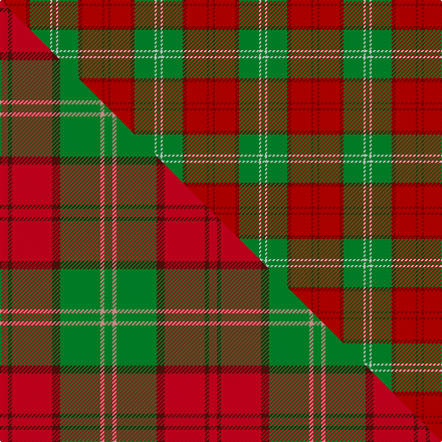

This page is one **sett** — a single exact thread-count. It belongs to the [tartan](/setts/ri2r1ri10r2g10w1g2/)
(the same proportion at any scale), whose colour order is pattern [GWGRRRR](/stripes/gwgrrrr/).

Part of the [Lennox](/tartans/lennox/) tartan — the named design grouping this sett with its other cloths.

Sourced from weddslist.  It is a [7 stripe tartan](/stripes/stripes7/).

Original link http://www.weddslist.com/cgi-bin/tartans/pg.pl?source=sts

## Thread count
Ri/4 R2 Ri20 R4 G20 W2 G/4

One full sett is **104 threads**.

## Palette
<table><thead><tr><th>Colour</th><th>Shade</th><th>OKLCh</th></tr></thead><tbody><tr><td>R</td><td><code style="background-color:#800000;">#800000</code> <small style="color:#888">#800000</small></td><td><small style="color:#888">oklch(37.7% 0.155 29.2)</small></td></tr><tr><td>G</td><td><code style="background-color:#008B2A;">#008B2A</code> <small style="color:#888">#008B2A</small></td><td><small style="color:#888">oklch(55.4% 0.170 145.9)</small></td></tr><tr><td>W</td><td><code style="background-color:#F7F7F7;">#F7F7F7</code> <small style="color:#888">#F7F7F7</small></td><td><small style="color:#888">oklch(97.6% 0.000 89.9)</small></td></tr><tr><td>R</td><td><code style="background-color:#C00000;">#C00000</code> <small style="color:#888">#C00000</small></td><td><small style="color:#888">oklch(50.7% 0.208 29.2)</small></td></tr></tbody></table>

# Sample pattern

## Compared to the master

This cloth is one sett of its design; the master sett (the exemplar the design is anchored on) is below for comparison.

Its **ΔTartan distance** from the master is **0.38** — the same measure the nearest-tartans table ranks by (0 is identical; a re-scale of the same cloth is near 0, a recolour or a different proportion further).

<figure class="master-compare" style="margin:0">

this sett
master sett ★

<figcaption style="color:#888;font-size:smaller">One weave of this sett against the <a href="/setts/r2dr1r10dr2g10lr1g2/">master sett ★</a>, split on the diagonal: a shared proportion runs seamlessly across it with only the shades shifting; a different proportion breaks on it.</figcaption>
</figure>

## Nearest variants

The nearest existing variants by ΔTartan distance, with this cloth at the top so the swatches line up against it.

ΔTartan

Threads

Variant

Sett

—

104

<a href="/variants/s7/ri2r1ri10r2g10w1g2~x2~ri2008029-r1506028/">Lennox</a>

<a href="/ttd/edit/#slug=r2dr1r10dr2g10w1g2~x2&amp;base=ri2r1ri10r2g10w1g2~x2~ri2008029-r1506028" title="compare in the TTD">0.00</a>

104

<a href="/variants/s7/r2dr1r10dr2g10w1g2~x2/">Lennox District Tartan</a>

<a href="/ttd/edit/#slug=r2dr1r10dr2g10lr1g2~x4&amp;base=ri2r1ri10r2g10w1g2~x2~ri2008029-r1506028" title="compare in the TTD">0.30</a>

208

<a href="/variants/s7/r2dr1r10dr2g10lr1g2~x4/">Lennox</a>

<a href="/ttd/edit/#slug=r2g16ri1r2ri12y1lb1~x2~r1706009-ri2109032&amp;base=ri2r1ri10r2g10w1g2~x2~ri2008029-r1506028" title="compare in the TTD">2.15</a>

134

<a href="/variants/s7/r2g16ri1r2ri12y1lb1~x2~r1706009-ri2109032/">Spragg (Name)</a>

<a href="/ttd/edit/#slug=ri8r1g4r1g1lb2~x2~ri2209032-r2208029&amp;base=ri2r1ri10r2g10w1g2~x2~ri2008029-r1506028" title="compare in the TTD">2.30</a>

48

<a href="/variants/s6/ri8r1g4r1g1lb2~x2~ri2209032-r2208029/">Moray of Abercairney</a>

<a href="/ttd/edit/#slug=g6r2dr2g4dr2r12k1~x2~r1908029&amp;base=ri2r1ri10r2g10w1g2~x2~ri2008029-r1506028" title="compare in the TTD">2.53</a>

102

<a href="/variants/s7/g6r2dr2g4dr2r12k1~x2~r1908029/">MacNab VS</a>

<a href="/ttd/edit/#slug=g6ri2r2g4r2ri12k1~x2~ri2008029-r1707016&amp;base=ri2r1ri10r2g10w1g2~x2~ri2008029-r1506028" title="compare in the TTD">2.53</a>

102

<a href="/variants/s7/g6ri2r2g4r2ri12k1~x2~ri2008029-r1707016/">MacNab 5</a>

<a href="/ttd/edit/#slug=g6ri2r2g4r2ri12k1~x2~ri2209032-r1707016&amp;base=ri2r1ri10r2g10w1g2~x2~ri2008029-r1506028" title="compare in the TTD">2.53</a>

102

<a href="/variants/s7/g6ri2r2g4r2ri12k1~x2~ri2209032-r1707016/">MacNab #3</a>

<a href="/ttd/edit/#slug=g28r7dr7g14dr7r48k4~x2&amp;base=ri2r1ri10r2g10w1g2~x2~ri2008029-r1506028" title="compare in the TTD">2.54</a>

396

<a href="/variants/s7/g28r7dr7g14dr7r48k4~x2/">MacNab (Crimson)</a>

<a href="/ttd/edit/#slug=do4g25lr10g3lr18r4~x2&amp;base=ri2r1ri10r2g10w1g2~x2~ri2008029-r1506028" title="compare in the TTD">2.77</a>

240

<a href="/variants/s6/do4g25lr10g3lr18r4~x2/">Unidentfied (Ligioner Highland Games</a>

<a href="/ttd/edit/#slug=r3dr14g8r2g2w2g2r1~x2&amp;base=ri2r1ri10r2g10w1g2~x2~ri2008029-r1506028" title="compare in the TTD">2.92</a>

128

<a href="/variants/s8/r3dr14g8r2g2w2g2r1~x2/">Scott Hunting Clan Tartan</a>

## Neighbour map

Every grey dot is one of 13620 variants placed by the first two principal components of the ΔTartan feature space (42% of its variance). Red is this tartan; blue dots are its nearest — click one to open its page.

<svg viewBox="0 0 640 380" role="img" style="max-width:100%;height:auto;border:1px solid #e0e0e0;border-radius:4px;display:block" xmlns="http://www.w3.org/2000/svg"><image href="/nn/cloud.v1.png" width="640" height="380"/><a href="/variants/s7/r2dr1r10dr2g10w1g2~x2/"><circle cx="275.1" cy="201.8" r="4" fill="#3465a4"><title>Lennox District Tartan</title></circle></a><a href="/variants/s7/r2dr1r10dr2g10lr1g2~x4/"><circle cx="285.2" cy="204.4" r="4" fill="#3465a4"><title>Lennox</title></circle></a><a href="/variants/s7/r2g16ri1r2ri12y1lb1~x2~r1706009-ri2109032/"><circle cx="311.6" cy="165.0" r="4" fill="#3465a4"><title>Spragg (Name)</title></circle></a><a href="/variants/s6/ri8r1g4r1g1lb2~x2~ri2209032-r2208029/"><circle cx="289.1" cy="222.1" r="4" fill="#3465a4"><title>Moray of Abercairney</title></circle></a><a href="/variants/s7/g6r2dr2g4dr2r12k1~x2~r1908029/"><circle cx="280.2" cy="189.0" r="4" fill="#3465a4"><title>MacNab VS</title></circle></a><a href="/variants/s7/g6ri2r2g4r2ri12k1~x2~ri2008029-r1707016/"><circle cx="281.3" cy="187.5" r="4" fill="#3465a4"><title>MacNab 5</title></circle></a><a href="/variants/s7/g6ri2r2g4r2ri12k1~x2~ri2209032-r1707016/"><circle cx="271.9" cy="183.3" r="4" fill="#3465a4"><title>MacNab #3</title></circle></a><a href="/variants/s7/g28r7dr7g14dr7r48k4~x2/"><circle cx="265.7" cy="177.8" r="4" fill="#3465a4"><title>MacNab (Crimson)</title></circle></a><a href="/variants/s6/do4g25lr10g3lr18r4~x2/"><circle cx="267.3" cy="235.4" r="4" fill="#3465a4"><title>Unidentfied (Ligioner Highland Games</title></circle></a><a href="/variants/s8/r3dr14g8r2g2w2g2r1~x2/"><circle cx="242.0" cy="175.2" r="4" fill="#3465a4"><title>Scott Hunting Clan Tartan</title></circle></a><circle cx="283.0" cy="203.1" r="5" fill="#c00000"/><text x="320" y="376" text-anchor="middle" font-size="11" fill="#999">ground</text><text x="11" y="190" text-anchor="middle" font-size="11" fill="#999" transform="rotate(-90 11 190)">complexity</text></svg>

ID: /variants/s7/ri2r1ri10r2g10w1g2~x2~ri2008029-r1506028/
