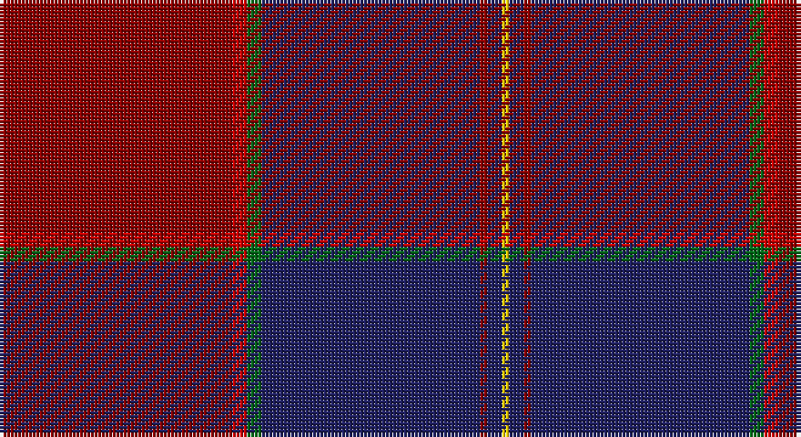

This page is one **sett** — a single exact thread-count. It belongs to the [tartan](/setts/ri32r2g2db30ri1db2ly1/)
(the same proportion at any scale), whose colour order is pattern [RRGBRBY](/stripes/rrgbrby/).

Sourced from tartans-authority.  It is a [7 stripe tartan](/stripes/stripes7/).

Original link http://www.tartansauthority.com/tartan-ferret/display/8399/

## Register references

External register numbers recorded for this tartan.

- Scottish Register of Tartans: [8399](https://www.tartanregister.gov.uk/tartanDetails?ref=8399)
- Scottish Tartans Authority (ITI): 8399

## Thread count
DR/64 R4 G4 DB60 DR2 DB4 Y/2

One full sett is **214 threads**.

## Palette

Palette: <strong>Tartan Register</strong>
<table><thead><tr><th>Colour</th><th>Threads</th><th>Shade</th><th>Base</th><th>OKLCh</th></tr></thead><tbody><tr><td>DR/</td><td style="text-align:right;font-variant-numeric:tabular-nums">64</td><td><code style="background-color:#880000;">#880000</code> <small style="color:#888">#880000</small></td><td>R <code style="background-color:#CC0000;">#CC0000</code></td><td><small style="color:#888">oklch(39.4% 0.162 29.2)</small></td></tr><tr><td>R</td><td style="text-align:right;font-variant-numeric:tabular-nums">4</td><td><code style="background-color:#C80000;">#C80000</code> <small style="color:#888">#C80000</small></td><td>R <code style="background-color:#CC0000;">#CC0000</code></td><td><small style="color:#888">oklch(52.3% 0.215 29.2)</small></td></tr><tr><td>G</td><td style="text-align:right;font-variant-numeric:tabular-nums">4</td><td><code style="background-color:#006818;">#006818</code> <small style="color:#888">#006818</small></td><td>G <code style="background-color:#006100;">#006100</code></td><td><small style="color:#888">oklch(45.0% 0.142 145.0)</small></td></tr><tr><td>DB</td><td style="text-align:right;font-variant-numeric:tabular-nums">60</td><td><code style="background-color:#202060;">#202060</code> <small style="color:#888">#202060</small></td><td>B <code style="background-color:#2A418A;">#2A418A</code></td><td><small style="color:#888">oklch(28.9% 0.111 276.9)</small></td></tr><tr><td>DR</td><td style="text-align:right;font-variant-numeric:tabular-nums">2</td><td><code style="background-color:#880000;">#880000</code> <small style="color:#888">#880000</small></td><td>R <code style="background-color:#CC0000;">#CC0000</code></td><td><small style="color:#888">oklch(39.4% 0.162 29.2)</small></td></tr><tr><td>DB</td><td style="text-align:right;font-variant-numeric:tabular-nums">4</td><td><code style="background-color:#202060;">#202060</code> <small style="color:#888">#202060</small></td><td>B <code style="background-color:#2A418A;">#2A418A</code></td><td><small style="color:#888">oklch(28.9% 0.111 276.9)</small></td></tr><tr><td>Y/</td><td style="text-align:right;font-variant-numeric:tabular-nums">2</td><td><code style="background-color:#FCCC00;">#FCCC00</code> <small style="color:#888">#FCCC00</small></td><td>Y <code style="background-color:#F2BF00;">#F2BF00</code></td><td><small style="color:#888">oklch(86.2% 0.176 91.5)</small></td></tr></tbody></table>

# Sample pattern

## Nearest tartans

The nearest existing variants by ΔTartan distance, with this tartan at the top so the swatches line up against it.

ΔTartan

Tartan

Sett

—

<a href="/ttd/edit/#slug=ri32r2g2db30ri1db2ly1~x2">Highland Prince (Fashion)</a> <a class="nn-out" href="/variants/s7/ri32r2g2db30ri1db2ly1~x2/" title="open its dictionary page">↗</a>

1.23

<a href="/ttd/edit/#slug=g2n1r29b29n1lo2~x2&amp;base=ri32r2g2db30ri1db2ly1~x2">Reagan</a> <a class="nn-out" href="/variants/s6/g2n1r29b29n1lo2~x2/" title="open its dictionary page">↗</a>

1.24

<a href="/ttd/edit/#slug=w2dp5m34k5n9k12dp1~x2&amp;base=ri32r2g2db30ri1db2ly1~x2">Thomson, Reona Ellen (Personal)</a> <a class="nn-out" href="/variants/s7/w2dp5m34k5n9k12dp1~x2/" title="open its dictionary page">↗</a>

1.33

<a href="/ttd/edit/#slug=r6lo1r24dg6db2k1db2k1db12r1~x2&amp;base=ri32r2g2db30ri1db2ly1~x2">MacEdward (MacGregor Hastie)</a> <a class="nn-out" href="/variants/s10/r6lo1r24dg6db2k1db2k1db12r1~x2/" title="open its dictionary page">↗</a>

1.40

<a href="/ttd/edit/#slug=lo1ri45dt23w1dt6r2lo1r2lo1~x2&amp;base=ri32r2g2db30ri1db2ly1~x2">Arbroath Smokie</a> <a class="nn-out" href="/variants/s9/lo1ri45dt23w1dt6r2lo1r2lo1~x2/" title="open its dictionary page">↗</a>

1.42

<a href="/ttd/edit/#slug=m13dg16dgi4dp4dgi4dp34lo1dp1~x2&amp;base=ri32r2g2db30ri1db2ly1~x2">Heather Mead (Personal)</a> <a class="nn-out" href="/variants/s8/m13dg16dgi4dp4dgi4dp34lo1dp1~x2/" title="open its dictionary page">↗</a>

1.49

<a href="/variants/s10/g2n1r29b29n1lo2~x2/">Reagan Clan Tartan</a>

1.49

<a href="/ttd/edit/#slug=k2dr1dt17dr17db1ly2~x4&amp;base=ri32r2g2db30ri1db2ly1~x2">Murdoch (Geoffrey)</a> <a class="nn-out" href="/variants/s6/k2dr1dt17dr17db1ly2~x4/" title="open its dictionary page">↗</a>

1.50

<a href="/ttd/edit/#slug=ri28r1db18ly2g1db18~x2&amp;base=ri32r2g2db30ri1db2ly1~x2">European Judo Union</a> <a class="nn-out" href="/variants/s6/ri28r1db18ly2g1db18~x2/" title="open its dictionary page">↗</a>

1.51

<a href="/ttd/edit/#slug=k2m1db17m17dt1ly2~x4&amp;base=ri32r2g2db30ri1db2ly1~x2">Murdoch</a> <a class="nn-out" href="/variants/s6/k2m1db17m17dt1ly2~x4/" title="open its dictionary page">↗</a>

1.53

<a href="/ttd/edit/#slug=dpi13dg16g4dp1g4dp34ly1dp1~x2&amp;base=ri32r2g2db30ri1db2ly1~x2">Heather Mead (Personal)</a> <a class="nn-out" href="/variants/s8/dpi13dg16g4dp1g4dp34ly1dp1~x2/" title="open its dictionary page">↗</a>

## Neighbour map

Every grey dot is one of 14360 variants placed by the first two principal components of the ΔTartan feature space (44% of its variance). Red is this tartan; blue dots are its nearest — click one to open its page.

<svg viewBox="0 0 640 380" role="img" style="max-width:100%;height:auto;border:1px solid #e0e0e0;border-radius:4px;display:block" xmlns="http://www.w3.org/2000/svg"><image href="/nn/cloud.v1.png" width="640" height="380"/><a href="/variants/s6/g2n1r29b29n1lo2~x2/"><circle cx="361.9" cy="152.2" r="4" fill="#3465a4"><title>Reagan</title></circle></a><a href="/variants/s7/w2dp5m34k5n9k12dp1~x2/"><circle cx="331.5" cy="137.8" r="4" fill="#3465a4"><title>Thomson, Reona Ellen (Personal)</title></circle></a><a href="/variants/s10/r6lo1r24dg6db2k1db2k1db12r1~x2/"><circle cx="393.8" cy="141.8" r="4" fill="#3465a4"><title>MacEdward (MacGregor Hastie)</title></circle></a><a href="/variants/s9/lo1ri45dt23w1dt6r2lo1r2lo1~x2/"><circle cx="432.7" cy="100.2" r="4" fill="#3465a4"><title>Arbroath Smokie</title></circle></a><a href="/variants/s8/m13dg16dgi4dp4dgi4dp34lo1dp1~x2/"><circle cx="342.2" cy="143.6" r="4" fill="#3465a4"><title>Heather Mead (Personal)</title></circle></a><a href="/variants/s10/g2n1r29b29n1lo2~x2/"><circle cx="367.8" cy="144.1" r="4" fill="#3465a4"><title>Reagan Clan Tartan</title></circle></a><a href="/variants/s6/k2dr1dt17dr17db1ly2~x4/"><circle cx="327.5" cy="184.0" r="4" fill="#3465a4"><title>Murdoch (Geoffrey)</title></circle></a><a href="/variants/s6/ri28r1db18ly2g1db18~x2/"><circle cx="364.3" cy="160.9" r="4" fill="#3465a4"><title>European Judo Union</title></circle></a><a href="/variants/s6/k2m1db17m17dt1ly2~x4/"><circle cx="313.9" cy="172.4" r="4" fill="#3465a4"><title>Murdoch</title></circle></a><a href="/variants/s8/dpi13dg16g4dp1g4dp34ly1dp1~x2/"><circle cx="351.1" cy="147.4" r="4" fill="#3465a4"><title>Heather Mead (Personal)</title></circle></a><circle cx="386.5" cy="136.3" r="5" fill="#c00000"/></svg>

ID: /variants/s7/ri32r2g2db30ri1db2ly1~x2/
