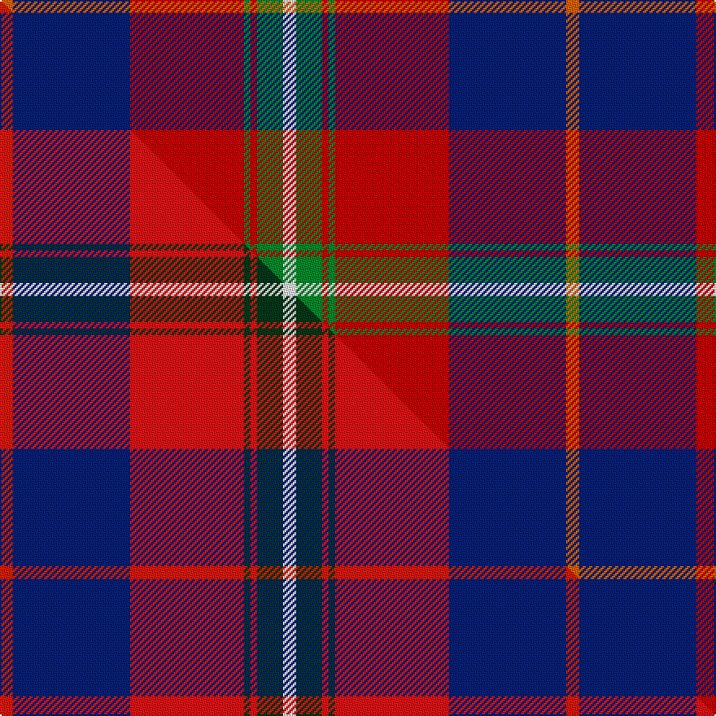

This page is one **sett** — a single exact thread-count. It belongs to the [tartan](/setts/ri4db36r35g2r2g8w4/)
(the same proportion at any scale), whose colour order is pattern [RBRGRGW](/stripes/rbrgrgw/).

Part of the [Cherry, John S](/tartans/cherry-john-s/) tartan — the named design grouping this sett with its other cloths.

Sourced from tartans-authority.  It is a [7 stripe tartan](/stripes/stripes7/).

Original link http://www.tartansauthority.com/tartan-ferret/display/10341/

## Register references

External register numbers recorded for this tartan.

- Scottish Register of Tartans: [10341](https://www.tartanregister.gov.uk/tartanDetails?ref=10341)
- Scottish Tartans Authority (ITI): 10341

## Thread count
Ri/8 DB72 R70 G4 R4 G16 W/8

One full sett is **348 threads**.

## Palette
<table><thead><tr><th>Colour</th><th>Shade</th><th>OKLCh</th></tr></thead><tbody><tr><td>DB</td><td><code style="background-color:#082077;">#082077</code> <small style="color:#888">#082077</small></td><td><small style="color:#888">oklch(30.0% 0.149 265.1)</small></td></tr><tr><td>G</td><td><code style="background-color:#008B2A;">#008B2A</code> <small style="color:#888">#008B2A</small></td><td><small style="color:#888">oklch(55.4% 0.170 145.9)</small></td></tr><tr><td>R</td><td><code style="background-color:#E86000;">#E86000</code> <small style="color:#888">#E86000</small></td><td><small style="color:#888">oklch(65.3% 0.187 44.9)</small></td></tr><tr><td>R</td><td><code style="background-color:#C80000;">#C80000</code> <small style="color:#888">#C80000</small></td><td><small style="color:#888">oklch(52.3% 0.215 29.2)</small></td></tr><tr><td>W</td><td><code style="background-color:#F7F7F7;">#F7F7F7</code> <small style="color:#888">#F7F7F7</small></td><td><small style="color:#888">oklch(97.6% 0.000 89.9)</small></td></tr></tbody></table>

# Sample pattern

## Compared to the master

This cloth is one sett of its design; the master sett (the exemplar the design is anchored on) is below for comparison.

Its **ΔTartan distance** from the master is **0.58** — the same measure the nearest-tartans table ranks by (0 is identical; a re-scale of the same cloth is near 0, a recolour or a different proportion further).

<figure class="master-compare" style="margin:0">

this sett
master sett ★

<figcaption style="color:#888;font-size:smaller">One weave of this sett against the <a href="/setts/r4db36ri35dg2ri2dg8w4/">master sett ★</a>, split on the diagonal: a shared proportion runs seamlessly across it with only the shades shifting; a different proportion breaks on it.</figcaption>
</figure>

## Nearest variants

The nearest existing variants by ΔTartan distance, with this cloth at the top so the swatches line up against it.

ΔTartan

Threads

Variant

Sett

—

348

<a href="/variants/s7/ri4db36r35g2r2g8w4~x2~ri2607041-r2109032/">Cherry, John S. (Personal)</a>

<a href="/ttd/edit/#slug=w3dg18db22r19dg1r2~x2&amp;base=ri4db36r35g2r2g8w4~x2~ri2607041-r2109032" title="compare in the TTD">1.24</a>

250

<a href="/variants/s6/w3dg18db22r19dg1r2~x2/">Nibley (Personal)</a>

<a href="/ttd/edit/#slug=w3g15db18r30g1r2~x2&amp;base=ri4db36r35g2r2g8w4~x2~ri2607041-r2109032" title="compare in the TTD">1.54</a>

266

<a href="/variants/s6/w3g15db18r30g1r2~x2/">Ruthven</a>

<a href="/ttd/edit/#slug=g3r2db22r22db2w3~x2&amp;base=ri4db36r35g2r2g8w4~x2~ri2607041-r2109032" title="compare in the TTD">1.90</a>

204

<a href="/variants/s6/g3r2db22r22db2w3~x2/">Galloway Red</a>

<a href="/ttd/edit/#slug=ly3db8w3db34r34g4r4w2~x2&amp;base=ri4db36r35g2r2g8w4~x2~ri2607041-r2109032" title="compare in the TTD">2.07</a>

358

<a href="/variants/s8/ly3db8w3db34r34g4r4w2~x2/">Manitoba Masonic (Corporate)</a>

<a href="/ttd/edit/#slug=y3db8w3db34r34dg4r4w2~x2&amp;base=ri4db36r35g2r2g8w4~x2~ri2607041-r2109032" title="compare in the TTD">2.07</a>

358

<a href="/variants/s8/y3db8w3db34r34dg4r4w2~x2/">Manitoba Masonic</a>

<a href="/ttd/edit/#slug=y2db1r16db16r1g2~x2&amp;base=ri4db36r35g2r2g8w4~x2~ri2607041-r2109032" title="compare in the TTD">2.20</a>

144

<a href="/variants/s6/y2db1r16db16r1g2~x2/">Galloway dress</a>

<a href="/ttd/edit/#slug=dg2r1db16r16db1y2~x2&amp;base=ri4db36r35g2r2g8w4~x2~ri2607041-r2109032" title="compare in the TTD">2.20</a>

144

<a href="/variants/s6/dg2r1db16r16db1y2~x2/">Galloway Dress (Yellow Line)</a>

<a href="/ttd/edit/#slug=w3db23r44db26g4y2~x2&amp;base=ri4db36r35g2r2g8w4~x2~ri2607041-r2109032" title="compare in the TTD">2.33</a>

398

<a href="/variants/s6/w3db23r44db26g4y2~x2/">Tartan Lassie (Fashion)</a>

<a href="/ttd/edit/#slug=y1db14r28dg14r1g14y1~x2&amp;base=ri4db36r35g2r2g8w4~x2~ri2607041-r2109032" title="compare in the TTD">2.34</a>

288

<a href="/variants/s7/y1db14r28dg14r1g14y1~x2/">Abernethy (Colerain, USA)</a>

<a href="/ttd/edit/#slug=w3g15db18r30db1r2~x2&amp;base=ri4db36r35g2r2g8w4~x2~ri2607041-r2109032" title="compare in the TTD">2.52</a>

266

<a href="/variants/s6/w3g15db18r30db1r2~x2/">Ruthven</a>

## Neighbour map

Every grey dot is one of 13620 variants placed by the first two principal components of the ΔTartan feature space (42% of its variance). Red is this tartan; blue dots are its nearest — click one to open its page.

<svg viewBox="0 0 640 380" role="img" style="max-width:100%;height:auto;border:1px solid #e0e0e0;border-radius:4px;display:block" xmlns="http://www.w3.org/2000/svg"><image href="/nn/cloud.v1.png" width="640" height="380"/><a href="/variants/s6/w3dg18db22r19dg1r2~x2/"><circle cx="224.3" cy="183.7" r="4" fill="#3465a4"><title>Nibley (Personal)</title></circle></a><a href="/variants/s6/w3g15db18r30g1r2~x2/"><circle cx="284.1" cy="158.6" r="4" fill="#3465a4"><title>Ruthven</title></circle></a><a href="/variants/s6/g3r2db22r22db2w3~x2/"><circle cx="274.3" cy="186.0" r="4" fill="#3465a4"><title>Galloway Red</title></circle></a><a href="/variants/s8/ly3db8w3db34r34g4r4w2~x2/"><circle cx="263.1" cy="135.6" r="4" fill="#3465a4"><title>Manitoba Masonic (Corporate)</title></circle></a><a href="/variants/s8/y3db8w3db34r34dg4r4w2~x2/"><circle cx="268.9" cy="136.9" r="4" fill="#3465a4"><title>Manitoba Masonic</title></circle></a><a href="/variants/s6/y2db1r16db16r1g2~x2/"><circle cx="307.8" cy="172.5" r="4" fill="#3465a4"><title>Galloway dress</title></circle></a><a href="/variants/s6/dg2r1db16r16db1y2~x2/"><circle cx="311.6" cy="173.2" r="4" fill="#3465a4"><title>Galloway Dress (Yellow Line)</title></circle></a><a href="/variants/s6/w3db23r44db26g4y2~x2/"><circle cx="298.2" cy="158.0" r="4" fill="#3465a4"><title>Tartan Lassie (Fashion)</title></circle></a><a href="/variants/s7/y1db14r28dg14r1g14y1~x2/"><circle cx="233.3" cy="152.5" r="4" fill="#3465a4"><title>Abernethy (Colerain, USA)</title></circle></a><a href="/variants/s6/w3g15db18r30db1r2~x2/"><circle cx="287.6" cy="160.5" r="4" fill="#3465a4"><title>Ruthven</title></circle></a><circle cx="242.3" cy="145.5" r="5" fill="#c00000"/><text x="320" y="376" text-anchor="middle" font-size="11" fill="#999">ground</text><text x="11" y="190" text-anchor="middle" font-size="11" fill="#999" transform="rotate(-90 11 190)">complexity</text></svg>

ID: /variants/s7/ri4db36r35g2r2g8w4~x2~ri2607041-r2109032/
