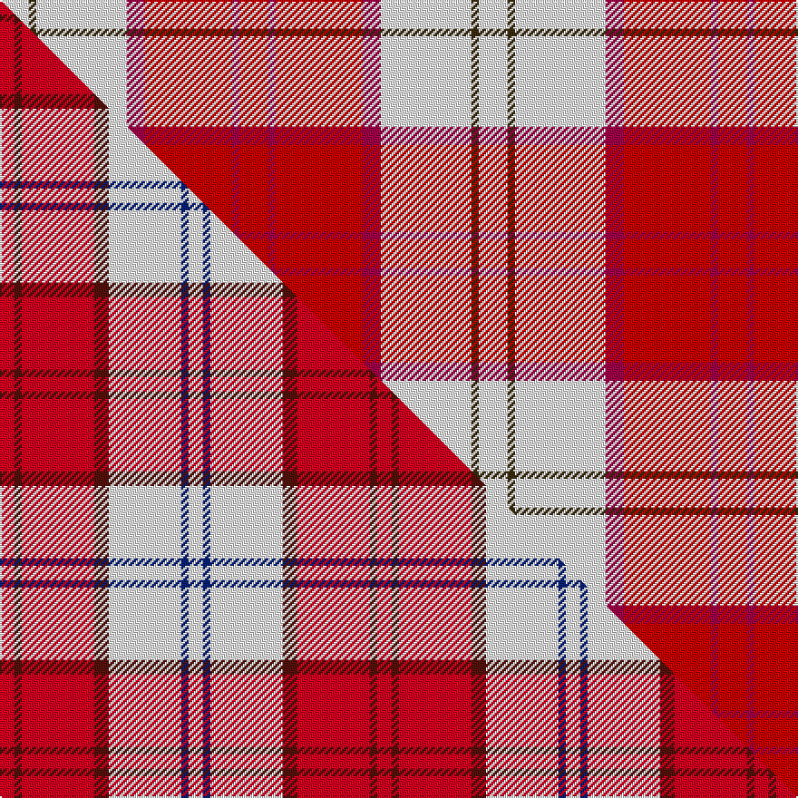

This is one **variant** — a specific cloth: this exact thread count and colourway, with its own
provenance below. It is one weaving of the [sett](/setts/ri8r2ri24r5w25dy2w8/) (the scale-free proportion — the
same cloth at any scale or shade), whose colour order is pattern [RRRRWGW](/stripes/rrrrwgw/).

Part of the [Lennox Dress](/tartans/l/le/lennox-dress-2/) tartan — the named design grouping this sett with its other cloths.

Sourced from house-of-tartan.  It is a [7 stripe tartan](/stripes/stripes7/).

Original link [http://www.house-of-tartan.scotland.net/house/TartanViewjs.asp?colr=Def&tnam=1649](http://www.house-of-tartan.scotland.net/house/TartanViewjs.asp?colr=Def&tnam=1649)

## Provenance

Earliest known date: 1986 Families with the surname 'Lennox' are usually considered related to Clans Stewart or MacFarlane. Some of this surname also choose to wear the distinctive and ancient 'Lennox' tartan. D W Stewart reproduced the sett from a 'lost' portrait of the Countess of Lennox dating from the 16th century.

Dataset <small>— provenance for this record, inherited from the source manifest</small>

<dl class="dataset-prov">
<dt>source</dt><dd><a href="/sources/house-of-tartan/">House of Tartan</a></dd>
<dt>data captured from</dt><dd><a href="https://github.com/thetartan/tartan-database/blob/master/data/house-of-tartan/data.csv">https://github.com/thetartan/tartan-database/blob/master/data/house-of-tartan/data.csv</a></dd>
<dt>data date</dt><dd>1986 <small>(this record)</small></dd>
<dt>licence</dt><dd><a href="https://creativecommons.org/licenses/by-nc-nd/4.0/">CC BY-NC-ND 4.0</a></dd>
</dl>

Capture chain <small>— the hands this data passed through, oldest first; each capture carries its own licence</small>

<ol class="capture-chain">
<li><a href="http://www.house-of-tartan.scotland.net/">House of Tartan</a> <small>the weaver/retailer's database — the site is now offline; the URL is kept as the ultimate source's identity</small></li>
<li><a href="https://github.com/thetartan/tartan-database">thetartan/tartan-database</a> <small>2016-2017</small> · <a href="https://creativecommons.org/licenses/by-nc-nd/4.0/">CC BY-NC-ND 4.0</a> <small>Levko Kravets's frozen compilation — the capture we vendored, and where its CC licence text came from</small></li>
<li>this dictionary <small>captured 2026-06-10 · commit 5bf86c7566</small> <small>each re-capture is a git commit to data/sources</small></li>
</ol>

## Thread count
W/16 DY4 W50 R10 Ri48 R4 Ri/16

One full sett is **264 threads**.

## Palette
<table><thead><tr><th>Colour</th><th>Shade</th><th>OKLCh</th></tr></thead><tbody><tr><td>W</td><td><code style="background-color:#F7F7F7;">#F7F7F7</code> <small style="color:#888">#F7F7F7</small></td><td><small style="color:#888">oklch(97.6% 0.000 89.9)</small></td></tr><tr><td>R</td><td><code style="background-color:#A00048;">#A00048</code> <small style="color:#888">#A00048</small></td><td><small style="color:#888">oklch(45.4% 0.182 5.3)</small></td></tr><tr><td>R</td><td><code style="background-color:#C80000;">#C80000</code> <small style="color:#888">#C80000</small></td><td><small style="color:#888">oklch(52.3% 0.215 29.2)</small></td></tr><tr><td>DY</td><td><code style="background-color:#3A2B0D;">#3A2B0D</code> <small style="color:#888">#3A2B0D</small></td><td><small style="color:#888">oklch(30.0% 0.049 82.0)</small></td></tr></tbody></table>

# Sample pattern

## Compared to the master

This cloth is one sett of its design; the master sett (the exemplar the design is anchored on) is below for comparison.

Its **ΔTartan distance** from the master is **0.65** — the same measure the nearest-tartans table ranks by (0 is identical; a re-scale of the same cloth is near 0, a recolour or a different proportion further).

<figure class="master-compare" style="margin:0">

this sett
master sett ★

<figcaption style="color:#888;font-size:smaller">One weave of this sett against the <a href="/setts/r2dr1r10dr2w10db1w2/">master sett ★</a>, split on the diagonal: a shared proportion runs seamlessly across it with only the shades shifting; a different proportion breaks on it.</figcaption>
</figure>

## Nearest tartan variants

The nearest existing variants by ΔTartan distance, with this cloth at the top so the swatches line up against it.

ΔTartan

Threads

Variant

Sett

—

264

<a href="/variants/s7/ri8r2ri24r5w25dy2w8~x2~ri2109032-r1807008/">Lennox Dress District Tartan</a>

<a href="/ttd/edit/#slug=r2dr1r10dr2w10db1w2~x4&amp;base=ri8r2ri24r5w25dy2w8~x2~ri2109032-r1807008" title="compare in the TTD">0.65</a>

208

<a href="/variants/s7/r2dr1r10dr2w10db1w2~x4/">Lennox Dress #2</a>

<a href="/ttd/edit/#slug=r8dr3r28w32dr3w4~x2&amp;base=ri8r2ri24r5w25dy2w8~x2~ri2109032-r1807008" title="compare in the TTD">1.19</a>

288

<a href="/variants/s6/r8dr3r28w32dr3w4~x2/">Ailsa, Red V2 (Dance)</a>

<a href="/ttd/edit/#slug=r8dr3r28w32dr3w4~x2~r2108022&amp;base=ri8r2ri24r5w25dy2w8~x2~ri2109032-r1807008" title="compare in the TTD">1.19</a>

288

<a href="/variants/s6/r8dr3r28w32dr3w4~x2~r2108022/">Ailsa Red</a>

<a href="/ttd/edit/#slug=dr3r2db2r30w30db2w3~x2&amp;base=ri8r2ri24r5w25dy2w8~x2~ri2109032-r1807008" title="compare in the TTD">1.19</a>

276

<a href="/variants/s7/dr3r2db2r30w30db2w3~x2/">Torridon, Cherry (Dance)</a>

<a href="/ttd/edit/#slug=w4k2w25r21w3r8y3~x2&amp;base=ri8r2ri24r5w25dy2w8~x2~ri2109032-r1807008" title="compare in the TTD">1.50</a>

250

<a href="/variants/s7/w4k2w25r21w3r8y3~x2/">MacPherson Dress Burgandy Clan Tartan</a>

<a href="/ttd/edit/#slug=r8dp2r24dp5w25o2w8~x2&amp;base=ri8r2ri24r5w25dy2w8~x2~ri2109032-r1807008" title="compare in the TTD">1.68</a>

264

<a href="/variants/s7/r8dp2r24dp5w25o2w8~x2/">Lennox, dress</a>

<a href="/ttd/edit/#slug=r8dp2r24dp5w25dy2w8~x2&amp;base=ri8r2ri24r5w25dy2w8~x2~ri2109032-r1807008" title="compare in the TTD">2.05</a>

264

<a href="/variants/s7/r8dp2r24dp5w25dy2w8~x2/">MacGiboney (Personal)</a>

<a href="/ttd/edit/#slug=w5k2w30r24w3r8db3~x2&amp;base=ri8r2ri24r5w25dy2w8~x2~ri2109032-r1807008" title="compare in the TTD">2.13</a>

284

<a href="/variants/s7/w5k2w30r24w3r8db3~x2/">Arduaine, Red (Dance)</a>

<a href="/ttd/edit/#slug=w4r2w25ri21w3ri8y3~x2~r1506028-ri2008029&amp;base=ri8r2ri24r5w25dy2w8~x2~ri2109032-r1807008" title="compare in the TTD">2.18</a>

250

<a href="/variants/s7/w4r2w25ri21w3ri8y3~x2~r1506028-ri2008029/">MacPherson, dress red</a>

<a href="/ttd/edit/#slug=w4dr2w25r21w3r8y3~x2&amp;base=ri8r2ri24r5w25dy2w8~x2~ri2109032-r1807008" title="compare in the TTD">2.18</a>

250

<a href="/variants/s7/w4dr2w25r21w3r8y3~x2/">MacPherson Dress Red</a>

## Neighbour map

Every grey dot is one of 13621 variants placed by the first two principal components of the ΔTartan feature space (42% of its variance). Red is this tartan; blue dots are its nearest — click one to open its page. The map is a flat projection of a many-dimensional space — [how to read it](/posts/neighbourhood-maps/).

<svg viewBox="0 0 640 380" role="img" style="max-width:100%;height:auto;border:1px solid #e0e0e0;border-radius:4px;display:block" xmlns="http://www.w3.org/2000/svg"><image href="/nn/cloud.v1.png" width="640" height="380"/><a href="/variants/s7/r2dr1r10dr2w10db1w2~x4/"><circle cx="239.3" cy="185.7" r="4" fill="#3465a4"><title>Lennox Dress #2</title></circle></a><a href="/variants/s6/r8dr3r28w32dr3w4~x2/"><circle cx="293.7" cy="204.8" r="4" fill="#3465a4"><title>Ailsa, Red V2 (Dance)</title></circle></a><a href="/variants/s6/r8dr3r28w32dr3w4~x2~r2108022/"><circle cx="291.4" cy="204.4" r="4" fill="#3465a4"><title>Ailsa Red</title></circle></a><a href="/variants/s7/dr3r2db2r30w30db2w3~x2/"><circle cx="286.8" cy="153.7" r="4" fill="#3465a4"><title>Torridon, Cherry (Dance)</title></circle></a><a href="/variants/s7/w4k2w25r21w3r8y3~x2/"><circle cx="267.3" cy="170.4" r="4" fill="#3465a4"><title>MacPherson Dress Burgandy Clan Tartan</title></circle></a><a href="/variants/s7/r8dp2r24dp5w25o2w8~x2/"><circle cx="254.7" cy="185.7" r="4" fill="#3465a4"><title>Lennox, dress</title></circle></a><a href="/variants/s7/r8dp2r24dp5w25dy2w8~x2/"><circle cx="252.0" cy="184.9" r="4" fill="#3465a4"><title>MacGiboney (Personal)</title></circle></a><a href="/variants/s7/w5k2w30r24w3r8db3~x2/"><circle cx="281.8" cy="158.4" r="4" fill="#3465a4"><title>Arduaine, Red (Dance)</title></circle></a><a href="/variants/s7/w4r2w25ri21w3ri8y3~x2~r1506028-ri2008029/"><circle cx="283.1" cy="180.0" r="4" fill="#3465a4"><title>MacPherson, dress red</title></circle></a><a href="/variants/s7/w4dr2w25r21w3r8y3~x2/"><circle cx="287.7" cy="180.8" r="4" fill="#3465a4"><title>MacPherson Dress Red</title></circle></a><circle cx="250.0" cy="181.8" r="5" fill="#c00000"/><text x="320" y="376" text-anchor="middle" font-size="11" fill="#999">ground</text><text x="11" y="190" text-anchor="middle" font-size="11" fill="#999" transform="rotate(-90 11 190)">complexity</text></svg>

ID: /variants/s7/ri8r2ri24r5w25dy2w8~x2~ri2109032-r1807008/
