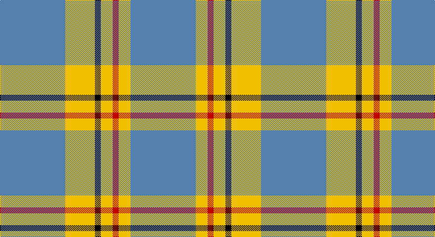

This page is one **sett** — a single exact thread-count. It belongs to the [tartan](/setts/t11ly5k1ly2r1ly2t11/)
(the same proportion at any scale), whose colour order is pattern [BYKYRYB](/stripes/bykyryb/).

Part of the [Carlisle](/tartans/carlisle/) tartan — the named design grouping this sett with its other cloths.

Sourced from weddslist.  It is a [7 stripe tartan](/stripes/stripes7/).

Original link http://www.weddslist.com/cgi-bin/tartans/pg.pl?source=sts

## Provenance

Earliest known date: 1987 Derived from the Coat of Arms.

## Also known as

This cloth is also recorded under:

- Carlisle Ancient
- Carlisle Family
- Carlisle, Ancient

2 attestations — the source records this cloth was collapsed from (oldest owns this page)

<ul>
<li>undated — Carlisle (weddslist, <a href="http://www.weddslist.com/cgi-bin/tartans/pg.pl?source=sts">record</a>)</li>
<li>undated — Carlisle Family Tartan (house-of-tartan, <a href="http://www.house-of-tartan.scotland.net/house/TartanViewjs.asp?colr=Def&tnam=674">record</a>)</li>
</ul>

## Thread count
B/132 Y60 K12 Y24 R12 Y24 B/132

One full sett is **528 threads**.

## Palette

Palette: <strong>Ingles Buchan</strong> <small style="color:#888">(1 of 4 colours)</small>
<table><thead><tr><th>Colour</th><th>Threads</th><th>Shade</th><th>Base</th><th>OKLCh</th></tr></thead><tbody><tr><td>B/</td><td style="text-align:right;font-variant-numeric:tabular-nums">132</td><td><code style="background-color:#5480B0;">#5480B0</code> <small style="color:#888">#5480B0</small></td><td>B <code style="background-color:#2A418A;">#2A418A</code></td><td><small style="color:#888">oklch(58.8% 0.089 251.5)</small></td></tr><tr><td>Y</td><td style="text-align:right;font-variant-numeric:tabular-nums">60</td><td><code style="background-color:#F0C000;">#F0C000</code> <small style="color:#888">#F0C000</small></td><td>Y <code style="background-color:#F2BF00;">#F2BF00</code></td><td><small style="color:#888">oklch(82.7% 0.169 90.5)</small></td></tr><tr><td>K</td><td style="text-align:right;font-variant-numeric:tabular-nums">12</td><td><code style="background-color:#000000;">#000000</code> <small style="color:#888">#000000</small></td><td>K <code style="background-color:#000000;">#000000</code></td><td><small style="color:#888">oklch(0.0% 0.000 0.0)</small></td></tr><tr><td>Y</td><td style="text-align:right;font-variant-numeric:tabular-nums">24</td><td><code style="background-color:#F0C000;">#F0C000</code> <small style="color:#888">#F0C000</small></td><td>Y <code style="background-color:#F2BF00;">#F2BF00</code></td><td><small style="color:#888">oklch(82.7% 0.169 90.5)</small></td></tr><tr><td>R</td><td style="text-align:right;font-variant-numeric:tabular-nums">12</td><td><code style="background-color:#C00000;">#C00000</code> <small style="color:#888">#C00000</small></td><td>R <code style="background-color:#CC0000;">#CC0000</code></td><td><small style="color:#888">oklch(50.7% 0.208 29.2)</small></td></tr><tr><td>Y</td><td style="text-align:right;font-variant-numeric:tabular-nums">24</td><td><code style="background-color:#F0C000;">#F0C000</code> <small style="color:#888">#F0C000</small></td><td>Y <code style="background-color:#F2BF00;">#F2BF00</code></td><td><small style="color:#888">oklch(82.7% 0.169 90.5)</small></td></tr><tr><td>B/</td><td style="text-align:right;font-variant-numeric:tabular-nums">132</td><td><code style="background-color:#5480B0;">#5480B0</code> <small style="color:#888">#5480B0</small></td><td>B <code style="background-color:#2A418A;">#2A418A</code></td><td><small style="color:#888">oklch(58.8% 0.089 251.5)</small></td></tr></tbody></table>

# Sample pattern

## Compared to the master

This cloth is one sett of its design; the master sett (the exemplar the design is anchored on) is below for comparison.

<figure style="margin:0"><figcaption style="color:#888;font-size:smaller">this sett</figcaption></figure>
<figure style="margin:0"><figcaption style="color:#888;font-size:smaller"><a href="/setts/b11lo2r1lo2r1/">master sett →</a></figcaption></figure>

## Nearest tartans

The nearest existing variants by ΔTartan distance, with this tartan at the top so the swatches line up against it.

ΔTartan

Tartan

Sett

—

<a href="/ttd/edit/#slug=t11ly5k1ly2r1ly2t11~x12">Carlisle</a> <a class="nn-out" href="/variants/s7/t11ly5k1ly2r1ly2t11~x12/" title="open its dictionary page">↗</a>

1.44

<a href="/ttd/edit/#slug=k10t30g3t3g3t3r6~x2&amp;base=t11ly5k1ly2r1ly2t11~x12">Kinding (Personal)</a> <a class="nn-out" href="/variants/s7/k10t30g3t3g3t3r6~x2/" title="open its dictionary page">↗</a>

1.50

<a href="/ttd/edit/#slug=t11ly2r1ly2r1~x4&amp;base=t11ly5k1ly2r1ly2t11~x12">Carlisle, Ancient</a> <a class="nn-out" href="/variants/s5/t11ly2r1ly2r1~x4/" title="open its dictionary page">↗</a>

1.51

<a href="/ttd/edit/#slug=b12ly1w16b1w1b14w3b14r2~x4&amp;base=t11ly5k1ly2r1ly2t11~x12">Orlando Dress, City of (District)</a> <a class="nn-out" href="/variants/s9/b12ly1w16b1w1b14w3b14r2~x4/" title="open its dictionary page">↗</a>

1.51

<a href="/ttd/edit/#slug=k3t10ly5t29k10r6k2~x2&amp;base=t11ly5k1ly2r1ly2t11~x12">Perkins 2015</a> <a class="nn-out" href="/variants/s7/k3t10ly5t29k10r6k2~x2/" title="open its dictionary page">↗</a>

1.53

<a href="/ttd/edit/#slug=r1o6k1o1k2o1k1o6lo1~x8&amp;base=t11ly5k1ly2r1ly2t11~x12">Mowdowny (Fashion)</a> <a class="nn-out" href="/variants/s9/r1o6k1o1k2o1k1o6lo1~x8/" title="open its dictionary page">↗</a>

1.61

<a href="/ttd/edit/#slug=w24g2w8db5ly4db5ly4~x2&amp;base=t11ly5k1ly2r1ly2t11~x12">Clackson Arisaid (Name?)</a> <a class="nn-out" href="/variants/s7/w24g2w8db5ly4db5ly4~x2/" title="open its dictionary page">↗</a>

1.62

<a href="/ttd/edit/#slug=n27lr3n14k3n13k3ly23~x2&amp;base=t11ly5k1ly2r1ly2t11~x12">Grange School</a> <a class="nn-out" href="/variants/s7/n27lr3n14k3n13k3ly23~x2/" title="open its dictionary page">↗</a>

1.62

<a href="/ttd/edit/#slug=db9lb27db2ly4db2lb10db2w3~x2&amp;base=t11ly5k1ly2r1ly2t11~x12">Alaska Highlanders P &amp; D (Corporate)</a> <a class="nn-out" href="/variants/s8/db9lb27db2ly4db2lb10db2w3~x2/" title="open its dictionary page">↗</a>

1.65

<a href="/ttd/edit/#slug=lb1lg11k6lg3lb1lg1lb1~x4&amp;base=t11ly5k1ly2r1ly2t11~x12">Angle, Blue (Fashion)</a> <a class="nn-out" href="/variants/s7/lb1lg11k6lg3lb1lg1lb1~x4/" title="open its dictionary page">↗</a>

1.66

<a href="/ttd/edit/#slug=n62w11k4lg17~x2&amp;base=t11ly5k1ly2r1ly2t11~x12">Thunderlord (Corporate)</a> <a class="nn-out" href="/variants/s4/n62w11k4lg17~x2/" title="open its dictionary page">↗</a>

## Neighbour map

Every grey dot is one of 14360 variants placed by the first two principal components of the ΔTartan feature space (44% of its variance). Red is this tartan; blue dots are its nearest — click one to open its page.

<svg viewBox="0 0 640 380" role="img" style="max-width:100%;height:auto;border:1px solid #e0e0e0;border-radius:4px;display:block" xmlns="http://www.w3.org/2000/svg"><image href="/nn/cloud.v1.png" width="640" height="380"/><a href="/variants/s7/k10t30g3t3g3t3r6~x2/"><circle cx="339.2" cy="186.0" r="4" fill="#3465a4"><title>Kinding (Personal)</title></circle></a><a href="/variants/s5/t11ly2r1ly2r1~x4/"><circle cx="407.1" cy="208.9" r="4" fill="#3465a4"><title>Carlisle, Ancient</title></circle></a><a href="/variants/s9/b12ly1w16b1w1b14w3b14r2~x4/"><circle cx="339.5" cy="160.7" r="4" fill="#3465a4"><title>Orlando Dress, City of (District)</title></circle></a><a href="/variants/s7/k3t10ly5t29k10r6k2~x2/"><circle cx="316.4" cy="176.8" r="4" fill="#3465a4"><title>Perkins 2015</title></circle></a><a href="/variants/s9/r1o6k1o1k2o1k1o6lo1~x8/"><circle cx="368.9" cy="204.9" r="4" fill="#3465a4"><title>Mowdowny (Fashion)</title></circle></a><a href="/variants/s7/w24g2w8db5ly4db5ly4~x2/"><circle cx="303.2" cy="162.2" r="4" fill="#3465a4"><title>Clackson Arisaid (Name?)</title></circle></a><a href="/variants/s7/n27lr3n14k3n13k3ly23~x2/"><circle cx="333.5" cy="217.0" r="4" fill="#3465a4"><title>Grange School</title></circle></a><a href="/variants/s8/db9lb27db2ly4db2lb10db2w3~x2/"><circle cx="332.5" cy="153.9" r="4" fill="#3465a4"><title>Alaska Highlanders P &amp; D (Corporate)</title></circle></a><a href="/variants/s7/lb1lg11k6lg3lb1lg1lb1~x4/"><circle cx="337.9" cy="192.6" r="4" fill="#3465a4"><title>Angle, Blue (Fashion)</title></circle></a><a href="/variants/s4/n62w11k4lg17~x2/"><circle cx="403.0" cy="211.4" r="4" fill="#3465a4"><title>Thunderlord (Corporate)</title></circle></a><circle cx="365.9" cy="191.7" r="5" fill="#c00000"/></svg>

ID: /variants/s7/t11ly5k1ly2r1ly2t11~x12/
