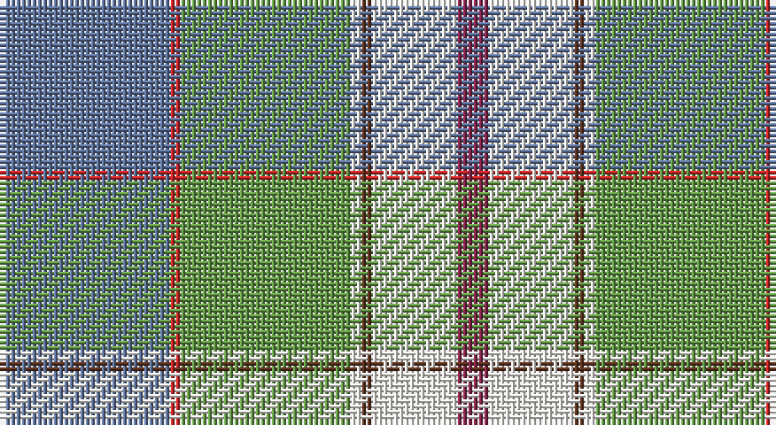

This page is one **sett** — a single exact thread-count. It belongs to the [tartan](/setts/t16r1g16w1dy1w8m3/)
(the same proportion at any scale), whose colour order is pattern [BRGWGWR](/stripes/brgwgwr/).

Part of the [Chambers, Christopher J](/tartans/chambers-christopher-j/) tartan — the named design grouping this sett with its other cloths.

Sourced from register-of-tartans.  It is a [7 stripe tartan](/stripes/stripes7/).

Original link https://www.tartanregister.gov.uk/tartanDetails.aspx?ref=10570

## Register references

External register numbers recorded for this tartan.

- Scottish Register of Tartans: [10570](https://www.tartanregister.gov.uk/tartanDetails.aspx?ref=10570)

## Thread count
B/32 R2 LG32 W2 T2 W16 DR/6

One full sett is **146 threads**.

## Palette

Palette: <strong>Tartan Register</strong> <small style="color:#888">(2 of 6 colours)</small>
<table><thead><tr><th>Colour</th><th>Threads</th><th>Shade</th><th>Base</th><th>OKLCh</th></tr></thead><tbody><tr><td>B/</td><td style="text-align:right;font-variant-numeric:tabular-nums">32</td><td><code style="background-color:#5F749C;">#5F749C</code> <small style="color:#888">#5F749C</small></td><td>B <code style="background-color:#2A418A;">#2A418A</code></td><td><small style="color:#888">oklch(55.8% 0.067 262.9)</small></td></tr><tr><td>R</td><td style="text-align:right;font-variant-numeric:tabular-nums">2</td><td><code style="background-color:#CA2625;">#CA2625</code> <small style="color:#888">#CA2625</small></td><td>R <code style="background-color:#CC0000;">#CC0000</code></td><td><small style="color:#888">oklch(54.4% 0.199 27.2)</small></td></tr><tr><td>LG</td><td style="text-align:right;font-variant-numeric:tabular-nums">32</td><td><code style="background-color:#649848;">#649848</code> <small style="color:#888">#649848</small></td><td>G <code style="background-color:#006100;">#006100</code></td><td><small style="color:#888">oklch(62.4% 0.125 135.7)</small></td></tr><tr><td>W</td><td style="text-align:right;font-variant-numeric:tabular-nums">2</td><td><code style="background-color:#F9F5EF;">#F9F5EF</code> <small style="color:#888">#F9F5EF</small></td><td>W <code style="background-color:#F7F7F7;">#F7F7F7</code></td><td><small style="color:#888">oklch(97.2% 0.009 78.3)</small></td></tr><tr><td>T</td><td style="text-align:right;font-variant-numeric:tabular-nums">2</td><td><code style="background-color:#5D321F;">#5D321F</code> <small style="color:#888">#5D321F</small></td><td>G <code style="background-color:#006100;">#006100</code></td><td><small style="color:#888">oklch(36.8% 0.069 44.0)</small></td></tr><tr><td>W</td><td style="text-align:right;font-variant-numeric:tabular-nums">16</td><td><code style="background-color:#F9F5EF;">#F9F5EF</code> <small style="color:#888">#F9F5EF</small></td><td>W <code style="background-color:#F7F7F7;">#F7F7F7</code></td><td><small style="color:#888">oklch(97.2% 0.009 78.3)</small></td></tr><tr><td>DR/</td><td style="text-align:right;font-variant-numeric:tabular-nums">6</td><td><code style="background-color:#86264D;">#86264D</code> <small style="color:#888">#86264D</small></td><td>R <code style="background-color:#CC0000;">#CC0000</code></td><td><small style="color:#888">oklch(43.0% 0.135 359.7)</small></td></tr></tbody></table>

# Sample pattern

## Nearest tartans

The nearest existing variants by ΔTartan distance, with this tartan at the top so the swatches line up against it.

ΔTartan

Tartan

Sett

—

<a href="/ttd/edit/#slug=t16r1g16w1dy1w8m3~x2">Chambers, Christopher J (Personal)</a> <a class="nn-out" href="/variants/s7/t16r1g16w1dy1w8m3~x2/" title="open its dictionary page">↗</a>

1.02

<a href="/ttd/edit/#slug=db4k1lg18y2lg11y11lb18k1r4~x2&amp;base=t16r1g16w1dy1w8m3~x2">Morgan in Maryland (USA)</a> <a class="nn-out" href="/variants/s9/db4k1lg18y2lg11y11lb18k1r4~x2/" title="open its dictionary page">↗</a>

1.10

<a href="/ttd/edit/#slug=m5g2m2g26k9lr9lb13w5~x2&amp;base=t16r1g16w1dy1w8m3~x2">Alexander of Menstry Hunting</a> <a class="nn-out" href="/variants/s8/m5g2m2g26k9lr9lb13w5~x2/" title="open its dictionary page">↗</a>

1.11

<a href="/ttd/edit/#slug=lb38dt18lb4ly3g10lo3g4lb3lo17r4~x2&amp;base=t16r1g16w1dy1w8m3~x2">State Seal of Delaware (Fashion)</a> <a class="nn-out" href="/variants/s10/lb38dt18lb4ly3g10lo3g4lb3lo17r4~x2/" title="open its dictionary page">↗</a>

1.20

<a href="/ttd/edit/#slug=k2lb25k2b8k2g28ly2~x2&amp;base=t16r1g16w1dy1w8m3~x2">Presley of Lonmay</a> <a class="nn-out" href="/variants/s7/k2lb25k2b8k2g28ly2~x2/" title="open its dictionary page">↗</a>

1.23

<a href="/ttd/edit/#slug=lo2lb14k1g11k2r2gi2k1~x4&amp;base=t16r1g16w1dy1w8m3~x2">Mission (District)</a> <a class="nn-out" href="/variants/s8/lo2lb14k1g11k2r2gi2k1~x4/" title="open its dictionary page">↗</a>

1.32

<a href="/ttd/edit/#slug=lo2t14k1gi11k2w2g2k1~x4&amp;base=t16r1g16w1dy1w8m3~x2">Mission</a> <a class="nn-out" href="/variants/s8/lo2t14k1gi11k2w2g2k1~x4/" title="open its dictionary page">↗</a>

1.32

<a href="/ttd/edit/#slug=db4k1g18dy2g11dy11lg18k1r4~x2&amp;base=t16r1g16w1dy1w8m3~x2">Morgan in Maryland (USA) (Name)</a> <a class="nn-out" href="/variants/s9/db4k1g18dy2g11dy11lg18k1r4~x2/" title="open its dictionary page">↗</a>

1.33

<a href="/ttd/edit/#slug=w4t5lo3t22ly4k3g16lo7k2lo7ly2~x2&amp;base=t16r1g16w1dy1w8m3~x2">Cossar (Personal)</a> <a class="nn-out" href="/variants/s11/w4t5lo3t22ly4k3g16lo7k2lo7ly2~x2/" title="open its dictionary page">↗</a>

1.38

<a href="/ttd/edit/#slug=t25k1dy6k1lr10w3lr10k1ly3~x4&amp;base=t16r1g16w1dy1w8m3~x2">O'Rourke (Estimated threadcount)</a> <a class="nn-out" href="/variants/s9/t25k1dy6k1lr10w3lr10k1ly3~x4/" title="open its dictionary page">↗</a>

1.40

<a href="/ttd/edit/#slug=lb5o49lb3dg24r5lo4dy30lb4~x2&amp;base=t16r1g16w1dy1w8m3~x2">State Seal of New Mexico (Fashion)</a> <a class="nn-out" href="/variants/s8/lb5o49lb3dg24r5lo4dy30lb4~x2/" title="open its dictionary page">↗</a>

## Neighbour map

Every grey dot is one of 14360 variants placed by the first two principal components of the ΔTartan feature space (44% of its variance). Red is this tartan; blue dots are its nearest — click one to open its page.

<svg viewBox="0 0 640 380" role="img" style="max-width:100%;height:auto;border:1px solid #e0e0e0;border-radius:4px;display:block" xmlns="http://www.w3.org/2000/svg"><image href="/nn/cloud.v1.png" width="640" height="380"/><a href="/variants/s9/db4k1lg18y2lg11y11lb18k1r4~x2/"><circle cx="170.9" cy="127.8" r="4" fill="#3465a4"><title>Morgan in Maryland (USA)</title></circle></a><a href="/variants/s8/m5g2m2g26k9lr9lb13w5~x2/"><circle cx="131.8" cy="146.5" r="4" fill="#3465a4"><title>Alexander of Menstry Hunting</title></circle></a><a href="/variants/s10/lb38dt18lb4ly3g10lo3g4lb3lo17r4~x2/"><circle cx="176.1" cy="122.8" r="4" fill="#3465a4"><title>State Seal of Delaware (Fashion)</title></circle></a><a href="/variants/s7/k2lb25k2b8k2g28ly2~x2/"><circle cx="217.3" cy="154.5" r="4" fill="#3465a4"><title>Presley of Lonmay</title></circle></a><a href="/variants/s8/lo2lb14k1g11k2r2gi2k1~x4/"><circle cx="163.1" cy="123.5" r="4" fill="#3465a4"><title>Mission (District)</title></circle></a><a href="/variants/s8/lo2t14k1gi11k2w2g2k1~x4/"><circle cx="181.2" cy="137.3" r="4" fill="#3465a4"><title>Mission</title></circle></a><a href="/variants/s9/db4k1g18dy2g11dy11lg18k1r4~x2/"><circle cx="198.8" cy="146.7" r="4" fill="#3465a4"><title>Morgan in Maryland (USA) (Name)</title></circle></a><a href="/variants/s11/w4t5lo3t22ly4k3g16lo7k2lo7ly2~x2/"><circle cx="122.5" cy="137.1" r="4" fill="#3465a4"><title>Cossar (Personal)</title></circle></a><a href="/variants/s9/t25k1dy6k1lr10w3lr10k1ly3~x4/"><circle cx="237.8" cy="115.8" r="4" fill="#3465a4"><title>O'Rourke (Estimated threadcount)</title></circle></a><a href="/variants/s8/lb5o49lb3dg24r5lo4dy30lb4~x2/"><circle cx="196.5" cy="136.2" r="4" fill="#3465a4"><title>State Seal of New Mexico (Fashion)</title></circle></a><circle cx="170.4" cy="138.1" r="5" fill="#c00000"/></svg>

ID: /variants/s7/t16r1g16w1dy1w8m3~x2/
