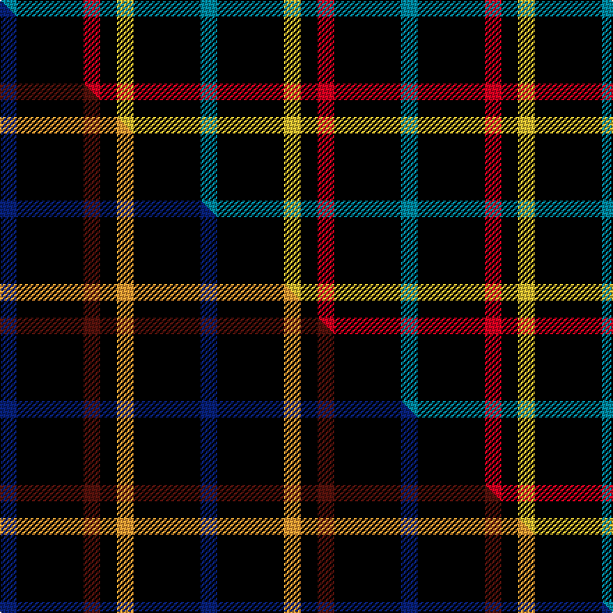

This page is one **sett** — a single exact thread-count. It belongs to the [tartan](/setts/t1k4r1k1ly1k4t1/)
(the same proportion at any scale), whose colour order is pattern [BKRKYKB](/stripes/bkrkykb/).

Part of the [Justus](/tartans/justus/) tartan — the named design grouping this sett with its other cloths.

Sourced from tartans-authority.  It is a [7 stripe tartan](/stripes/stripes7/).

Original link http://www.tartansauthority.com/tartan-ferret/display/2100/

## Register references

External register numbers recorded for this tartan.

- Scottish Tartans Authority (ITI): 2100

## Thread count
T/12 K48 R12 K12 LY12 K48 T/12

One full sett is **288 threads**.

## Palette
<table><thead><tr><th>Colour</th><th>Shade</th><th>OKLCh</th></tr></thead><tbody><tr><td>T</td><td><code style="background-color:#00879F;">#00879F</code> <small style="color:#888">#00879F</small></td><td><small style="color:#888">oklch(57.4% 0.102 216.1)</small></td></tr><tr><td>R</td><td><code style="background-color:#D60020;">#D60020</code> <small style="color:#888">#D60020</small></td><td><small style="color:#888">oklch(55.2% 0.224 25.5)</small></td></tr><tr><td>LY</td><td><code style="background-color:#DCBC32;">#DCBC32</code> <small style="color:#888">#DCBC32</small></td><td><small style="color:#888">oklch(80.0% 0.150 95.2)</small></td></tr><tr><td>K</td><td><code style="background-color:#000000;">#000000</code> <small style="color:#888">#000000</small></td><td><small style="color:#888">oklch(0.0% 0.000 0.0)</small></td></tr></tbody></table>

# Sample pattern

## Compared to the master

This cloth is one sett of its design; the master sett (the exemplar the design is anchored on) is below for comparison.

Its **ΔTartan distance** from the master is **0.99** — the same measure the nearest-tartans table ranks by (0 is identical; a re-scale of the same cloth is near 0, a recolour or a different proportion further).

<figure class="master-compare" style="margin:0">

this sett
master sett ★

<figcaption style="color:#888;font-size:smaller">One weave of this sett against the <a href="/setts/db1k4dr1k1lo1k4db1/">master sett ★</a>, split on the diagonal: a shared proportion runs seamlessly across it with only the shades shifting; a different proportion breaks on it.</figcaption>
</figure>

## Nearest variants

The nearest existing variants by ΔTartan distance, with this cloth at the top so the swatches line up against it.

ΔTartan

Threads

Variant

Sett

—

288

<a href="/variants/s7/t1k4r1k1ly1k4t1~x12/">Justus #1 (Personal)</a>

<a href="/ttd/edit/#slug=db1k4r1k1y1k4db1~x6&amp;base=t1k4r1k1ly1k4t1~x12" title="compare in the TTD">0.00</a>

144

<a href="/variants/s7/db1k4r1k1y1k4db1~x6/">Justus Family Tartan</a>

<a href="/ttd/edit/#slug=db1k4dr1k1lo1k4db1~x12&amp;base=t1k4r1k1ly1k4t1~x12" title="compare in the TTD">0.30</a>

288

<a href="/variants/s7/db1k4dr1k1lo1k4db1~x12/">Justus (Personal)</a>

<a href="/ttd/edit/#slug=k17dr6k2lb6k17ly2~x2&amp;base=t1k4r1k1ly1k4t1~x12" title="compare in the TTD">1.70</a>

162

<a href="/variants/s6/k17dr6k2lb6k17ly2~x2/">Black (symmetrical)</a>

<a href="/ttd/edit/#slug=k17dr6k2lb6k17lo2~x2&amp;base=t1k4r1k1ly1k4t1~x12" title="compare in the TTD">2.01</a>

162

<a href="/variants/s6/k17dr6k2lb6k17lo2~x2/">Black Clan/Family Tartan</a>

<a href="/ttd/edit/#slug=k2lb5k1lb1k10r1k1~x4&amp;base=t1k4r1k1ly1k4t1~x12" title="compare in the TTD">2.12</a>

156

<a href="/variants/s7/k2lb5k1lb1k10r1k1~x4/">Lundy Reform</a>

<a href="/ttd/edit/#slug=k8lb3k32t14w3k25lb3~x2&amp;base=t1k4r1k1ly1k4t1~x12" title="compare in the TTD">2.16</a>

330

<a href="/variants/s7/k8lb3k32t14w3k25lb3~x2/">Cowe (Personal)</a>

<a href="/ttd/edit/#slug=k21lb2k4lb4do2lb4k13g2~x4&amp;base=t1k4r1k1ly1k4t1~x12" title="compare in the TTD">2.20</a>

324

<a href="/variants/s8/k21lb2k4lb4do2lb4k13g2~x4/">Anzac (Fashion)</a>

<a href="/ttd/edit/#slug=k5r1y1k1y1r1k8db1w1~x6&amp;base=t1k4r1k1ly1k4t1~x12" title="compare in the TTD">2.32</a>

204

<a href="/variants/s9/k5r1y1k1y1r1k8db1w1~x6/">Muylle, Jelle (Personal)</a>

<a href="/ttd/edit/#slug=k16t2k8r3lr3r3k8~x2&amp;base=t1k4r1k1ly1k4t1~x12" title="compare in the TTD">2.69</a>

124

<a href="/variants/s7/k16t2k8r3lr3r3k8~x2/">Benson (New England)</a>

<a href="/ttd/edit/#slug=k25y5k5g25k25t3k10~x2&amp;base=t1k4r1k1ly1k4t1~x12" title="compare in the TTD">2.87</a>

322

<a href="/variants/s7/k25y5k5g25k25t3k10~x2/">London Community Gospel Choir</a>

## Neighbour map

Every grey dot is one of 13620 variants placed by the first two principal components of the ΔTartan feature space (42% of its variance). Red is this tartan; blue dots are its nearest — click one to open its page.

<svg viewBox="0 0 640 380" role="img" style="max-width:100%;height:auto;border:1px solid #e0e0e0;border-radius:4px;display:block" xmlns="http://www.w3.org/2000/svg"><image href="/nn/cloud.v1.png" width="640" height="380"/><a href="/variants/s7/db1k4r1k1y1k4db1~x6/"><circle cx="306.7" cy="221.5" r="4" fill="#3465a4"><title>Justus Family Tartan</title></circle></a><a href="/variants/s7/db1k4dr1k1lo1k4db1~x12/"><circle cx="309.0" cy="225.1" r="4" fill="#3465a4"><title>Justus (Personal)</title></circle></a><a href="/variants/s6/k17dr6k2lb6k17ly2~x2/"><circle cx="336.9" cy="193.5" r="4" fill="#3465a4"><title>Black (symmetrical)</title></circle></a><a href="/variants/s6/k17dr6k2lb6k17lo2~x2/"><circle cx="337.7" cy="193.3" r="4" fill="#3465a4"><title>Black Clan/Family Tartan</title></circle></a><a href="/variants/s7/k2lb5k1lb1k10r1k1~x4/"><circle cx="328.6" cy="163.7" r="4" fill="#3465a4"><title>Lundy Reform</title></circle></a><a href="/variants/s7/k8lb3k32t14w3k25lb3~x2/"><circle cx="359.6" cy="172.6" r="4" fill="#3465a4"><title>Cowe (Personal)</title></circle></a><a href="/variants/s8/k21lb2k4lb4do2lb4k13g2~x4/"><circle cx="353.4" cy="153.1" r="4" fill="#3465a4"><title>Anzac (Fashion)</title></circle></a><a href="/variants/s9/k5r1y1k1y1r1k8db1w1~x6/"><circle cx="305.4" cy="137.1" r="4" fill="#3465a4"><title>Muylle, Jelle (Personal)</title></circle></a><a href="/variants/s7/k16t2k8r3lr3r3k8~x2/"><circle cx="342.9" cy="181.8" r="4" fill="#3465a4"><title>Benson (New England)</title></circle></a><a href="/variants/s7/k25y5k5g25k25t3k10~x2/"><circle cx="288.8" cy="196.2" r="4" fill="#3465a4"><title>London Community Gospel Choir</title></circle></a><circle cx="277.7" cy="214.5" r="5" fill="#c00000"/><text x="320" y="376" text-anchor="middle" font-size="11" fill="#999">ground</text><text x="11" y="190" text-anchor="middle" font-size="11" fill="#999" transform="rotate(-90 11 190)">complexity</text></svg>

ID: /variants/s7/t1k4r1k1ly1k4t1~x12/
