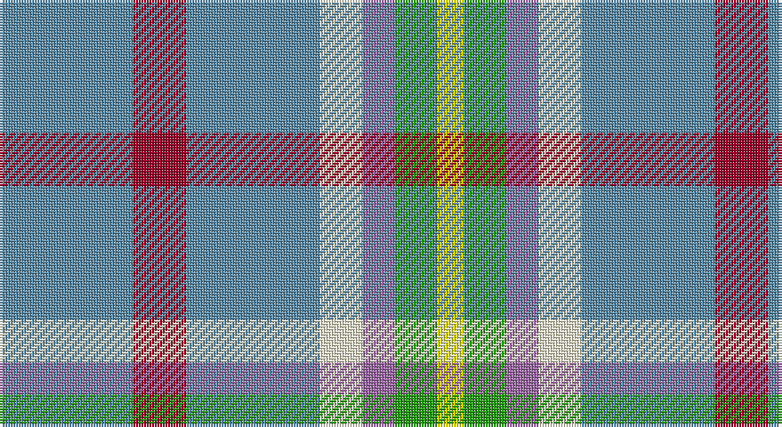

This page is one **sett** — a single exact thread-count. It belongs to the [tartan](/setts/t25r10t25w8m6g8ly5/)
(the same proportion at any scale), whose colour order is pattern [BRBWRGY](/stripes/brbwrgy/).

Part of the [Barneys](/tartans/barneys/) tartan — the named design grouping this sett with its other cloths.

Sourced from register-of-tartans.  It is a [7 stripe tartan](/stripes/stripes7/).

Original link https://www.tartanregister.gov.uk/tartanDetails.aspx?ref=10954

## Register references

External register numbers recorded for this tartan.

- Scottish Register of Tartans: [10954](https://www.tartanregister.gov.uk/tartanDetails.aspx?ref=10954)

## Thread count
B/50 DR20 B50 LY16 LP12 G16 Y/10

One full sett is **288 threads**.

## Palette

Palette: <strong>Tartan Register</strong> <small style="color:#888">(5 of 6 colours)</small>
<table><thead><tr><th>Colour</th><th>Threads</th><th>Shade</th><th>Base</th><th>OKLCh</th></tr></thead><tbody><tr><td>B/</td><td style="text-align:right;font-variant-numeric:tabular-nums">50</td><td><code style="background-color:#5C8CA8;">#5C8CA8</code> <small style="color:#888">#5C8CA8</small></td><td>B <code style="background-color:#2A418A;">#2A418A</code></td><td><small style="color:#888">oklch(61.7% 0.067 235.0)</small></td></tr><tr><td>DR</td><td style="text-align:right;font-variant-numeric:tabular-nums">20</td><td><code style="background-color:#960028;">#960028</code> <small style="color:#888">#960028</small></td><td>R <code style="background-color:#CC0000;">#CC0000</code></td><td><small style="color:#888">oklch(42.7% 0.171 18.3)</small></td></tr><tr><td>B</td><td style="text-align:right;font-variant-numeric:tabular-nums">50</td><td><code style="background-color:#5C8CA8;">#5C8CA8</code> <small style="color:#888">#5C8CA8</small></td><td>B <code style="background-color:#2A418A;">#2A418A</code></td><td><small style="color:#888">oklch(61.7% 0.067 235.0)</small></td></tr><tr><td>LY</td><td style="text-align:right;font-variant-numeric:tabular-nums">16</td><td><code style="background-color:#F8F4D0;">#F8F4D0</code> <small style="color:#888">#F8F4D0</small></td><td>W <code style="background-color:#F7F7F7;">#F7F7F7</code></td><td><small style="color:#888">oklch(96.1% 0.047 102.0)</small></td></tr><tr><td>LP</td><td style="text-align:right;font-variant-numeric:tabular-nums">12</td><td><code style="background-color:#9C68A4;">#9C68A4</code> <small style="color:#888">#9C68A4</small></td><td>R <code style="background-color:#CC0000;">#CC0000</code></td><td><small style="color:#888">oklch(59.4% 0.107 322.0)</small></td></tr><tr><td>G</td><td style="text-align:right;font-variant-numeric:tabular-nums">16</td><td><code style="background-color:#289C18;">#289C18</code> <small style="color:#888">#289C18</small></td><td>G <code style="background-color:#006100;">#006100</code></td><td><small style="color:#888">oklch(60.6% 0.191 141.6)</small></td></tr><tr><td>Y/</td><td style="text-align:right;font-variant-numeric:tabular-nums">10</td><td><code style="background-color:#FFFF00;">#FFFF00</code> <small style="color:#888">#FFFF00</small></td><td>Y <code style="background-color:#F2BF00;">#F2BF00</code></td><td><small style="color:#888">oklch(96.8% 0.211 109.8)</small></td></tr></tbody></table>

# Sample pattern

## Nearest tartans

The nearest existing variants by ΔTartan distance, with this tartan at the top so the swatches line up against it.

ΔTartan

Tartan

Sett

—

<a href="/ttd/edit/#slug=t25r10t25w8m6g8ly5~x2">Barneys (Scunthorpe) (Personal)</a> <a class="nn-out" href="/variants/s7/t25r10t25w8m6g8ly5~x2/" title="open its dictionary page">↗</a>

0.35

<a href="/ttd/edit/#slug=t25r10t25w8p6g8ly5~x2&amp;base=t25r10t25w8m6g8ly5~x2">Barneys (Scunthorpe) (Personal)</a> <a class="nn-out" href="/variants/s7/t25r10t25w8p6g8ly5~x2/" title="open its dictionary page">↗</a>

1.51

<a href="/ttd/edit/#slug=t31dt4lb4t20dt8ly16r8t14lb4dt4lyi4&amp;base=t25r10t25w8m6g8ly5~x2">Cian Clan Irish Family Tartan</a> <a class="nn-out" href="/variants/s11/t31dt4lb4t20dt8ly16r8t14lb4dt4lyi4/" title="open its dictionary page">↗</a>

1.53

<a href="/ttd/edit/#slug=k4ly12n3ly3n3ly4lr17ly15dy4~x2&amp;base=t25r10t25w8m6g8ly5~x2">Cotswolds Distillery</a> <a class="nn-out" href="/variants/s9/k4ly12n3ly3n3ly4lr17ly15dy4~x2/" title="open its dictionary page">↗</a>

1.67

<a href="/ttd/edit/#slug=b15k3b19w3b5ly5r3ly5lb3ly5k3~x2&amp;base=t25r10t25w8m6g8ly5~x2">Gouranga</a> <a class="nn-out" href="/variants/s11/b15k3b19w3b5ly5r3ly5lb3ly5k3~x2/" title="open its dictionary page">↗</a>

1.67

<a href="/ttd/edit/#slug=lg8do2lg13r4lg12t22lg5lo3~x2&amp;base=t25r10t25w8m6g8ly5~x2">Kildare Irish County Tartan</a> <a class="nn-out" href="/variants/s8/lg8do2lg13r4lg12t22lg5lo3~x2/" title="open its dictionary page">↗</a>

1.74

<a href="/ttd/edit/#slug=b9db2lb2b10db4ly8r4b7lb2db2ly2~x4&amp;base=t25r10t25w8m6g8ly5~x2">Healy (Name)</a> <a class="nn-out" href="/variants/s11/b9db2lb2b10db4ly8r4b7lb2db2ly2~x4/" title="open its dictionary page">↗</a>

1.81

<a href="/ttd/edit/#slug=g5lb5t1lb1ly1lb1t1lb5g5w1~x8&amp;base=t25r10t25w8m6g8ly5~x2">MacGiboney Dress</a> <a class="nn-out" href="/variants/s10/g5lb5t1lb1ly1lb1t1lb5g5w1~x8/" title="open its dictionary page">↗</a>

1.81

<a href="/ttd/edit/#slug=g5lb5t1lb1ly1lb1t1lb5g5w1~x4&amp;base=t25r10t25w8m6g8ly5~x2">MacGiboney Clan Tartan</a> <a class="nn-out" href="/variants/s10/g5lb5t1lb1ly1lb1t1lb5g5w1~x4/" title="open its dictionary page">↗</a>

1.85

<a href="/ttd/edit/#slug=n1lo8dy2lo2db6w1db6lo2dy2lo8r1~x4&amp;base=t25r10t25w8m6g8ly5~x2">MacKessog</a> <a class="nn-out" href="/variants/s11/n1lo8dy2lo2db6w1db6lo2dy2lo8r1~x4/" title="open its dictionary page">↗</a>

1.90

<a href="/ttd/edit/#slug=n10w3lb3g1r1~x10&amp;base=t25r10t25w8m6g8ly5~x2">Bagpipe Shop (Corporate)</a> <a class="nn-out" href="/variants/s5/n10w3lb3g1r1~x10/" title="open its dictionary page">↗</a>

## Neighbour map

Every grey dot is one of 14360 variants placed by the first two principal components of the ΔTartan feature space (44% of its variance). Red is this tartan; blue dots are its nearest — click one to open its page.

<svg viewBox="0 0 640 380" role="img" style="max-width:100%;height:auto;border:1px solid #e0e0e0;border-radius:4px;display:block" xmlns="http://www.w3.org/2000/svg"><image href="/nn/cloud.v1.png" width="640" height="380"/><a href="/variants/s7/t25r10t25w8p6g8ly5~x2/"><circle cx="211.7" cy="212.3" r="4" fill="#3465a4"><title>Barneys (Scunthorpe) (Personal)</title></circle></a><a href="/variants/s11/t31dt4lb4t20dt8ly16r8t14lb4dt4lyi4/"><circle cx="233.5" cy="175.9" r="4" fill="#3465a4"><title>Cian Clan Irish Family Tartan</title></circle></a><a href="/variants/s9/k4ly12n3ly3n3ly4lr17ly15dy4~x2/"><circle cx="201.8" cy="191.5" r="4" fill="#3465a4"><title>Cotswolds Distillery</title></circle></a><a href="/variants/s11/b15k3b19w3b5ly5r3ly5lb3ly5k3~x2/"><circle cx="197.5" cy="158.7" r="4" fill="#3465a4"><title>Gouranga</title></circle></a><a href="/variants/s8/lg8do2lg13r4lg12t22lg5lo3~x2/"><circle cx="260.1" cy="183.7" r="4" fill="#3465a4"><title>Kildare Irish County Tartan</title></circle></a><a href="/variants/s11/b9db2lb2b10db4ly8r4b7lb2db2ly2~x4/"><circle cx="162.0" cy="206.3" r="4" fill="#3465a4"><title>Healy (Name)</title></circle></a><a href="/variants/s10/g5lb5t1lb1ly1lb1t1lb5g5w1~x8/"><circle cx="182.6" cy="200.6" r="4" fill="#3465a4"><title>MacGiboney Dress</title></circle></a><a href="/variants/s10/g5lb5t1lb1ly1lb1t1lb5g5w1~x4/"><circle cx="182.6" cy="200.6" r="4" fill="#3465a4"><title>MacGiboney Clan Tartan</title></circle></a><a href="/variants/s11/n1lo8dy2lo2db6w1db6lo2dy2lo8r1~x4/"><circle cx="220.8" cy="170.0" r="4" fill="#3465a4"><title>MacKessog</title></circle></a><a href="/variants/s5/n10w3lb3g1r1~x10/"><circle cx="274.0" cy="188.6" r="4" fill="#3465a4"><title>Bagpipe Shop (Corporate)</title></circle></a><circle cx="207.3" cy="211.5" r="5" fill="#c00000"/></svg>

ID: /variants/s7/t25r10t25w8m6g8ly5~x2/
