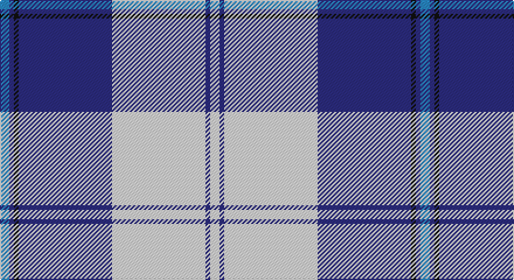

This page is one **sett** — a single exact thread-count. It belongs to the [tartan](/setts/t2db1k1db20w20db1w2/)
(the same proportion at any scale), whose colour order is pattern [BBKBWBW](/stripes/bbkbwbw/).

Part of the [Cunningham Dress,](/tartans/cunningham-dress/) tartan — the named design grouping this sett with its other cloths.

Sourced from house-of-tartan.  It is a [7 stripe tartan](/stripes/stripes7/).

Original link http://www.house-of-tartan.scotland.net/house/TartanViewjs.asp?colr=Def&tnam=4642

## Provenance

Earliest known date: 01/01/2002 Like so many of the invented 'Dance' tartans this one is not known by the relevant Clan Cunningham Association (USA). /Threadcount and colours aren't 100% original. Generated manually./

## Also known as

This cloth is also recorded under:

- Cunningham Dress
- Cunningham Dress Green
- Cunningham Dress Purple
- Cunningham Dress, Blue
- Cunningham Dress, Green
- Cunningham, Dress Blue
- Cunningham, dress

## Thread count
B/8 DB4 K4 DB80 LN80 DB4 LN/8

One full sett is **360 threads**.

## Palette

Palette: <strong>Tartan Register</strong>
<table><thead><tr><th>Colour</th><th>Threads</th><th>Shade</th><th>Base</th><th>OKLCh</th></tr></thead><tbody><tr><td>B/</td><td style="text-align:right;font-variant-numeric:tabular-nums">8</td><td><code style="background-color:#2888C4;">#2888C4</code> <small style="color:#888">#2888C4</small></td><td>B <code style="background-color:#2A418A;">#2A418A</code></td><td><small style="color:#888">oklch(60.1% 0.125 241.5)</small></td></tr><tr><td>DB</td><td style="text-align:right;font-variant-numeric:tabular-nums">4</td><td><code style="background-color:#2C2C80;">#2C2C80</code> <small style="color:#888">#2C2C80</small></td><td>B <code style="background-color:#2A418A;">#2A418A</code></td><td><small style="color:#888">oklch(35.0% 0.138 276.6)</small></td></tr><tr><td>K</td><td style="text-align:right;font-variant-numeric:tabular-nums">4</td><td><code style="background-color:#101010;">#101010</code> <small style="color:#888">#101010</small></td><td>K <code style="background-color:#000000;">#000000</code></td><td><small style="color:#888">oklch(17.3% 0.000 89.9)</small></td></tr><tr><td>DB</td><td style="text-align:right;font-variant-numeric:tabular-nums">80</td><td><code style="background-color:#2C2C80;">#2C2C80</code> <small style="color:#888">#2C2C80</small></td><td>B <code style="background-color:#2A418A;">#2A418A</code></td><td><small style="color:#888">oklch(35.0% 0.138 276.6)</small></td></tr><tr><td>LN</td><td style="text-align:right;font-variant-numeric:tabular-nums">80</td><td><code style="background-color:#E0E0E0;">#E0E0E0</code> <small style="color:#888">#E0E0E0</small></td><td>W <code style="background-color:#F7F7F7;">#F7F7F7</code></td><td><small style="color:#888">oklch(90.7% 0.000 89.9)</small></td></tr><tr><td>DB</td><td style="text-align:right;font-variant-numeric:tabular-nums">4</td><td><code style="background-color:#2C2C80;">#2C2C80</code> <small style="color:#888">#2C2C80</small></td><td>B <code style="background-color:#2A418A;">#2A418A</code></td><td><small style="color:#888">oklch(35.0% 0.138 276.6)</small></td></tr><tr><td>LN/</td><td style="text-align:right;font-variant-numeric:tabular-nums">8</td><td><code style="background-color:#E0E0E0;">#E0E0E0</code> <small style="color:#888">#E0E0E0</small></td><td>W <code style="background-color:#F7F7F7;">#F7F7F7</code></td><td><small style="color:#888">oklch(90.7% 0.000 89.9)</small></td></tr></tbody></table>

# Sample pattern

## Compared to the master

This cloth is one sett of its design; the master sett (the exemplar the design is anchored on) is below for comparison.

<figure style="margin:0"><figcaption style="color:#888;font-size:smaller">this sett</figcaption></figure>
<figure style="margin:0"><figcaption style="color:#888;font-size:smaller"><a href="/setts/b3db2k2db28w30db2w3/">master sett →</a></figcaption></figure>

## Nearest tartans

The nearest existing variants by ΔTartan distance, with this tartan at the top so the swatches line up against it.

ΔTartan

Tartan

Sett

—

<a href="/ttd/edit/#slug=t2db1k1db20w20db1w2~x4">Cunningham, Dress Blue (Dance) Fashion Tartan</a> <a class="nn-out" href="/variants/s7/t2db1k1db20w20db1w2~x4/" title="open its dictionary page">↗</a>

0.68

<a href="/ttd/edit/#slug=b3db2k2db28w30db2w3~x2&amp;base=t2db1k1db20w20db1w2~x4">Cunningham, Dress Blue (Dance)</a> <a class="nn-out" href="/variants/s7/b3db2k2db28w30db2w3~x2/" title="open its dictionary page">↗</a>

0.91

<a href="/ttd/edit/#slug=db41ti2w2ti2db5t12w31db4~x2&amp;base=t2db1k1db20w20db1w2~x4">Harmony Eildon (Dance)</a> <a class="nn-out" href="/variants/s8/db41ti2w2ti2db5t12w31db4~x2/" title="open its dictionary page">↗</a>

0.91

<a href="/ttd/edit/#slug=db41t2w2t2db5b12w31db4~x2&amp;base=t2db1k1db20w20db1w2~x4">Harmony, Eildon</a> <a class="nn-out" href="/variants/s8/db41t2w2t2db5b12w31db4~x2/" title="open its dictionary page">↗</a>

1.00

<a href="/ttd/edit/#slug=db26w28db14ly3k1ly2k1~x2&amp;base=t2db1k1db20w20db1w2~x4">Gothenburg/Goteborg</a> <a class="nn-out" href="/variants/s7/db26w28db14ly3k1ly2k1~x2/" title="open its dictionary page">↗</a>

1.04

<a href="/ttd/edit/#slug=w3dbi2w30db30k2db2ly3~x2&amp;base=t2db1k1db20w20db1w2~x4">Torridon, Saphire (Dance)</a> <a class="nn-out" href="/variants/s7/w3dbi2w30db30k2db2ly3~x2/" title="open its dictionary page">↗</a>

1.12

<a href="/ttd/edit/#slug=db30t2w2t2db4ti10w25db4~x2&amp;base=t2db1k1db20w20db1w2~x4">Eildon/Longniddry Blue Dress Fashion Tartan</a> <a class="nn-out" href="/variants/s8/db30t2w2t2db4ti10w25db4~x2/" title="open its dictionary page">↗</a>

1.13

<a href="/ttd/edit/#slug=b26w28b14ly3k1ly2k1~x2&amp;base=t2db1k1db20w20db1w2~x4">Gothenburg</a> <a class="nn-out" href="/variants/s7/b26w28b14ly3k1ly2k1~x2/" title="open its dictionary page">↗</a>

1.14

<a href="/ttd/edit/#slug=dt3n2w2n30w30r2w3~x2&amp;base=t2db1k1db20w20db1w2~x4">Torridon, Royal Blue (Dance)</a> <a class="nn-out" href="/variants/s7/dt3n2w2n30w30r2w3~x2/" title="open its dictionary page">↗</a>

1.30

<a href="/ttd/edit/#slug=w3db2k4db2w2db26r4w30r2w3~x2&amp;base=t2db1k1db20w20db1w2~x4">Harris, Royal Blue (Dance)</a> <a class="nn-out" href="/variants/s10/w3db2k4db2w2db26r4w30r2w3~x2/" title="open its dictionary page">↗</a>

1.34

<a href="/ttd/edit/#slug=b4r2b40k11g2w16r2~x2&amp;base=t2db1k1db20w20db1w2~x4">Jack Sinclair (Personal)</a> <a class="nn-out" href="/variants/s7/b4r2b40k11g2w16r2~x2/" title="open its dictionary page">↗</a>

## Neighbour map

Every grey dot is one of 14360 variants placed by the first two principal components of the ΔTartan feature space (44% of its variance). Red is this tartan; blue dots are its nearest — click one to open its page.

<svg viewBox="0 0 640 380" role="img" style="max-width:100%;height:auto;border:1px solid #e0e0e0;border-radius:4px;display:block" xmlns="http://www.w3.org/2000/svg"><image href="/nn/cloud.v1.png" width="640" height="380"/><a href="/variants/s7/b3db2k2db28w30db2w3~x2/"><circle cx="268.2" cy="141.5" r="4" fill="#3465a4"><title>Cunningham, Dress Blue (Dance)</title></circle></a><a href="/variants/s8/db41ti2w2ti2db5t12w31db4~x2/"><circle cx="278.5" cy="134.5" r="4" fill="#3465a4"><title>Harmony Eildon (Dance)</title></circle></a><a href="/variants/s8/db41t2w2t2db5b12w31db4~x2/"><circle cx="285.9" cy="135.9" r="4" fill="#3465a4"><title>Harmony, Eildon</title></circle></a><a href="/variants/s7/db26w28db14ly3k1ly2k1~x2/"><circle cx="308.0" cy="132.9" r="4" fill="#3465a4"><title>Gothenburg/Goteborg</title></circle></a><a href="/variants/s7/w3dbi2w30db30k2db2ly3~x2/"><circle cx="238.7" cy="122.5" r="4" fill="#3465a4"><title>Torridon, Saphire (Dance)</title></circle></a><a href="/variants/s8/db30t2w2t2db4ti10w25db4~x2/"><circle cx="243.4" cy="147.6" r="4" fill="#3465a4"><title>Eildon/Longniddry Blue Dress Fashion Tartan</title></circle></a><a href="/variants/s7/b26w28b14ly3k1ly2k1~x2/"><circle cx="312.4" cy="134.6" r="4" fill="#3465a4"><title>Gothenburg</title></circle></a><a href="/variants/s7/dt3n2w2n30w30r2w3~x2/"><circle cx="284.2" cy="142.4" r="4" fill="#3465a4"><title>Torridon, Royal Blue (Dance)</title></circle></a><a href="/variants/s10/w3db2k4db2w2db26r4w30r2w3~x2/"><circle cx="257.8" cy="113.8" r="4" fill="#3465a4"><title>Harris, Royal Blue (Dance)</title></circle></a><a href="/variants/s7/b4r2b40k11g2w16r2~x2/"><circle cx="286.2" cy="119.9" r="4" fill="#3465a4"><title>Jack Sinclair (Personal)</title></circle></a><circle cx="288.4" cy="129.3" r="5" fill="#c00000"/></svg>

ID: /variants/s7/t2db1k1db20w20db1w2~x4/
