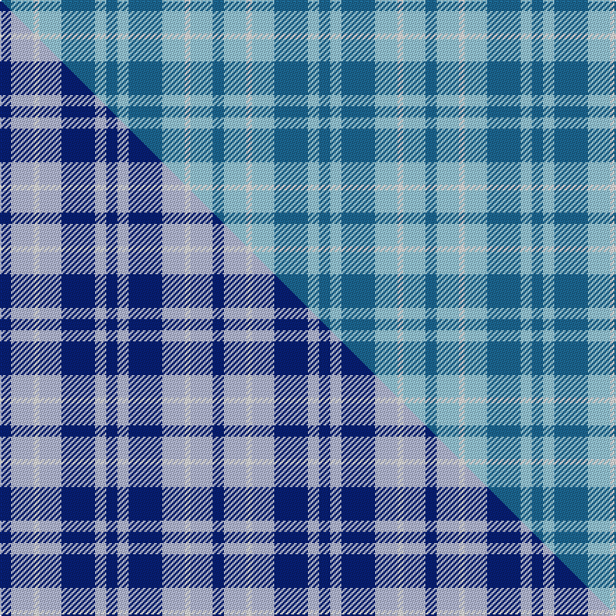

This page is one **sett** — a single exact thread-count. It belongs to the [tartan](/setts/t2lb4w1lb4t6lb2t2/)
(the same proportion at any scale), whose colour order is pattern [BWBWWWB](/stripes/bwbwwwb/).

Part of the [Langdons](/tartans/langdons/) tartan — the named design grouping this sett with its other cloths.

Sourced from tartans-authority.  It is a [7 stripe tartan](/stripes/stripes7/).

Original link http://www.tartansauthority.com/tartan-ferret/display/10103/

## Register references

External register numbers recorded for this tartan.

- Scottish Register of Tartans: [10103](https://www.tartanregister.gov.uk/tartanDetails?ref=10103)
- Scottish Tartans Authority (ITI): 10103

## Thread count
T/8 LB16 W4 LB16 T24 LB8 T/8

One full sett is **152 threads**.

## Palette
<table><thead><tr><th>Colour</th><th>Shade</th><th>OKLCh</th></tr></thead><tbody><tr><td>T</td><td><code style="background-color:#1C6894;">#1C6894</code> <small style="color:#888">#1C6894</small></td><td><small style="color:#888">oklch(49.4% 0.100 239.6)</small></td></tr><tr><td>LB</td><td><code style="background-color:#98C8E8;">#98C8E8</code> <small style="color:#888">#98C8E8</small></td><td><small style="color:#888">oklch(81.0% 0.068 237.9)</small></td></tr><tr><td>W</td><td><code style="background-color:#F7F7F7;">#F7F7F7</code> <small style="color:#888">#F7F7F7</small></td><td><small style="color:#888">oklch(97.6% 0.000 89.9)</small></td></tr></tbody></table>

# Sample pattern

## Compared to the master

This cloth is one sett of its design; the master sett (the exemplar the design is anchored on) is below for comparison.

Its **ΔTartan distance** from the master is **0.17** — the same measure the nearest-tartans table ranks by (0 is identical; a re-scale of the same cloth is near 0, a recolour or a different proportion further).

<figure class="master-compare" style="margin:0">

this sett
master sett ★

<figcaption style="color:#888;font-size:smaller">One weave of this sett against the <a href="/setts/db2lb4w1lb4db6lb2db2/">master sett ★</a>, split on the diagonal: a shared proportion runs seamlessly across it with only the shades shifting; a different proportion breaks on it.</figcaption>
</figure>

## Nearest tartan variants

The nearest existing variants by ΔTartan distance, with this cloth at the top so the swatches line up against it.

ΔTartan

Threads

Variant

Sett

—

152

<a href="/variants/s7/t2lb4w1lb4t6lb2t2~x4~t2004245-lb3203246/">Langdons (Corporate)</a>

<a href="/ttd/edit/#slug=db2lb4w1lb4db6lb2db2~x4&amp;base=t2lb4w1lb4t6lb2t2~x4~t2004245-lb3203246" title="compare in the TTD">0.17</a>

152

<a href="/variants/s7/db2lb4w1lb4db6lb2db2~x4/">Langdons</a>

<a href="/ttd/edit/#slug=db5lb5w1lb5db5lb1~x4&amp;base=t2lb4w1lb4t6lb2t2~x4~t2004245-lb3203246" title="compare in the TTD">1.40</a>

152

<a href="/variants/s6/db5lb5w1lb5db5lb1~x4/">Manx Cornaa (Personal)</a>

<a href="/ttd/edit/#slug=w2db13b13y2b13db13w2db6b6y1~x2&amp;base=t2lb4w1lb4t6lb2t2~x4~t2004245-lb3203246" title="compare in the TTD">1.77</a>

278

<a href="/variants/s10/w2db13b13y2b13db13w2db6b6y1~x2/">Westwood MacSky (Fashion)</a>

<a href="/ttd/edit/#slug=db10t10db60w9db7t36w6db6&amp;base=t2lb4w1lb4t6lb2t2~x4~t2004245-lb3203246" title="compare in the TTD">2.18</a>

272

<a href="/variants/s8/db10t10db60w9db7t36w6db6/">Salem Scottish Dancer's Wee Bluet</a>

<a href="/ttd/edit/#slug=db3w1db12b12db1b3~x4&amp;base=t2lb4w1lb4t6lb2t2~x4~t2004245-lb3203246" title="compare in the TTD">2.33</a>

232

<a href="/variants/s6/db3w1db12b12db1b3~x4/">Erskine Blue (Fashion)</a>

<a href="/ttd/edit/#slug=db3lb3db16lb16db16w3~x2&amp;base=t2lb4w1lb4t6lb2t2~x4~t2004245-lb3203246" title="compare in the TTD">2.79</a>

216

<a href="/variants/s6/db3lb3db16lb16db16w3~x2/">Murray Taylor</a>

<a href="/ttd/edit/#slug=db2lb2db7dr8lb10db2lb2db2~x2&amp;base=t2lb4w1lb4t6lb2t2~x4~t2004245-lb3203246" title="compare in the TTD">3.19</a>

132

<a href="/variants/s8/db2lb2db7dr8lb10db2lb2db2~x2/">Laval Dress, Tartan de</a>

<a href="/ttd/edit/#slug=g25b4db24b21g25b3db4~x2&amp;base=t2lb4w1lb4t6lb2t2~x4~t2004245-lb3203246" title="compare in the TTD">3.23</a>

366

<a href="/variants/s7/g25b4db24b21g25b3db4~x2/">Glasgow</a>

<a href="/ttd/edit/#slug=w4db25lb25db2lb5w2~x2&amp;base=t2lb4w1lb4t6lb2t2~x4~t2004245-lb3203246" title="compare in the TTD">3.36</a>

240

<a href="/variants/s6/w4db25lb25db2lb5w2~x2/">Douglas Variation</a>

<a href="/ttd/edit/#slug=w4db25b25db2b5w2~x2&amp;base=t2lb4w1lb4t6lb2t2~x4~t2004245-lb3203246" title="compare in the TTD">3.37</a>

240

<a href="/variants/s6/w4db25b25db2b5w2~x2/">Douglas, Variation</a>

## Neighbour map

Every grey dot is one of 13620 variants placed by the first two principal components of the ΔTartan feature space (42% of its variance). Red is this tartan; blue dots are its nearest — click one to open its page.

<svg viewBox="0 0 640 380" role="img" style="max-width:100%;height:auto;border:1px solid #e0e0e0;border-radius:4px;display:block" xmlns="http://www.w3.org/2000/svg"><image href="/nn/cloud.v1.png" width="640" height="380"/><a href="/variants/s7/db2lb4w1lb4db6lb2db2~x4/"><circle cx="287.0" cy="295.1" r="4" fill="#3465a4"><title>Langdons</title></circle></a><a href="/variants/s6/db5lb5w1lb5db5lb1~x4/"><circle cx="297.4" cy="313.7" r="4" fill="#3465a4"><title>Manx Cornaa (Personal)</title></circle></a><a href="/variants/s10/w2db13b13y2b13db13w2db6b6y1~x2/"><circle cx="310.1" cy="224.3" r="4" fill="#3465a4"><title>Westwood MacSky (Fashion)</title></circle></a><a href="/variants/s8/db10t10db60w9db7t36w6db6/"><circle cx="377.9" cy="230.7" r="4" fill="#3465a4"><title>Salem Scottish Dancer's Wee Bluet</title></circle></a><a href="/variants/s6/db3w1db12b12db1b3~x4/"><circle cx="431.4" cy="265.1" r="4" fill="#3465a4"><title>Erskine Blue (Fashion)</title></circle></a><a href="/variants/s6/db3lb3db16lb16db16w3~x2/"><circle cx="359.3" cy="288.6" r="4" fill="#3465a4"><title>Murray Taylor</title></circle></a><a href="/variants/s8/db2lb2db7dr8lb10db2lb2db2~x2/"><circle cx="241.4" cy="276.3" r="4" fill="#3465a4"><title>Laval Dress, Tartan de</title></circle></a><a href="/variants/s7/g25b4db24b21g25b3db4~x2/"><circle cx="306.1" cy="279.3" r="4" fill="#3465a4"><title>Glasgow</title></circle></a><a href="/variants/s6/w4db25lb25db2lb5w2~x2/"><circle cx="338.4" cy="235.0" r="4" fill="#3465a4"><title>Douglas Variation</title></circle></a><a href="/variants/s6/w4db25b25db2b5w2~x2/"><circle cx="369.8" cy="243.4" r="4" fill="#3465a4"><title>Douglas, Variation</title></circle></a><circle cx="345.1" cy="319.7" r="5" fill="#c00000"/><text x="320" y="376" text-anchor="middle" font-size="11" fill="#999">ground</text><text x="11" y="190" text-anchor="middle" font-size="11" fill="#999" transform="rotate(-90 11 190)">complexity</text></svg>

ID: /variants/s7/t2lb4w1lb4t6lb2t2~x4~t2004245-lb3203246/
