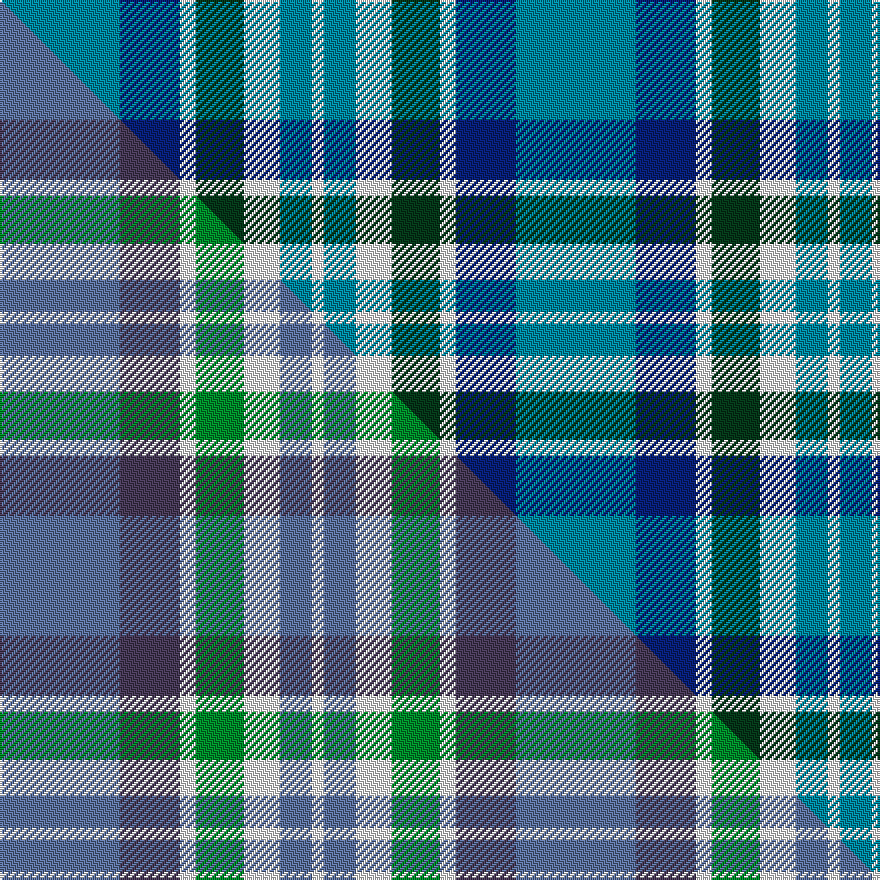

This is one **variant** — a specific cloth: this exact thread count and colourway, with its own
provenance below. It is one weaving of the [sett](/tartans/n/ne/newall/) (the scale-free proportion — the
same cloth at any scale or shade), whose colour order is pattern [BBWGWBW](/stripes/bbwgwbw/).

Part of the [Newall](/tartans/n/ne/newall/) tartan — the named design grouping this sett with its other cloths.

Sourced from tartans-authority.  It is a [7 stripe tartan](/stripes/stripes7/).

Original link <code>http://www.tartansauthority.com/tartan-ferret/display/10830/</code> — retired · [Internet Archive copy](https://web.archive.org/web/*/http://www.tartansauthority.com/tartan-ferret/display/10830/*)

Dataset <small>— provenance for this record, inherited from the source manifest</small>

<dl class="dataset-prov">
<dt>source</dt><dd><a href="/sources/tartans-authority/">Scottish Tartans Authority</a></dd>
<dt>data captured from</dt><dd><a href="https://github.com/thetartan/tartan-database/blob/master/data/tartans-authority/data.csv">https://github.com/thetartan/tartan-database/blob/master/data/tartans-authority/data.csv</a></dd>
<dt>data date</dt><dd>04/04/2013 <small>(this record)</small></dd>
<dt>licence</dt><dd><a href="https://creativecommons.org/licenses/by-nc-nd/4.0/">CC BY-NC-ND 4.0</a></dd>
</dl>

Capture chain <small>— the hands this data passed through, oldest first; each capture carries its own licence</small>

<ol class="capture-chain">
<li><a href="https://www.tartansauthority.com/">Scottish Tartans Authority</a> <small>the heritage body’s archive — its tartan-ferret record browser is retired; dead record links are shown unlinked, with an Internet Archive copy (ITI numbers are not SRT references)</small></li>
<li><a href="https://github.com/thetartan/tartan-database">thetartan/tartan-database</a> <small>2016-2017</small> · <a href="https://creativecommons.org/licenses/by-nc-nd/4.0/">CC BY-NC-ND 4.0</a> <small>Levko Kravets's frozen compilation — the capture we vendored, and where its CC licence text came from</small></li>
<li>this dictionary <small>captured 2026-06-10 · commit 5bf86c7566</small> <small>each re-capture is a git commit to data/sources</small></li>
</ol>

## Register references

External register numbers recorded for this tartan.

- Scottish Register of Tartans: [10830](https://www.tartanregister.gov.uk/tartanDetails?ref=10830)
- Scottish Tartans Authority (ITI): 10830

## Thread count
T/60 DB30 W8 DG24 W18 T16 W/6

One full sett is **258 threads**.

## Palette
<table><thead><tr><th>Colour</th><th>Shade</th><th>OKLCh</th></tr></thead><tbody><tr><td>T</td><td><code style="background-color:#00879F;">#00879F</code> <small style="color:#888">#00879F</small></td><td><small style="color:#888">oklch(57.4% 0.102 216.1)</small></td></tr><tr><td>DB</td><td><code style="background-color:#082077;">#082077</code> <small style="color:#888">#082077</small></td><td><small style="color:#888">oklch(30.0% 0.149 265.1)</small></td></tr><tr><td>DG</td><td><code style="background-color:#053819;">#053819</code> <small style="color:#888">#053819</small></td><td><small style="color:#888">oklch(30.0% 0.075 151.3)</small></td></tr><tr><td>W</td><td><code style="background-color:#F7F7F7;">#F7F7F7</code> <small style="color:#888">#F7F7F7</small></td><td><small style="color:#888">oklch(97.6% 0.000 89.9)</small></td></tr></tbody></table>

# Sample pattern

## Compared to the master

This cloth is one sett of its design; the master sett (the exemplar the design is anchored on) is below for comparison.

Its **ΔTartan distance** from the master is **2.53** — the same measure the nearest-tartans table ranks by (0 is identical; a re-scale of the same cloth is near 0, a recolour or a different proportion further).

<figure class="master-compare" style="margin:0">

this sett
master sett ★

<figcaption style="color:#888;font-size:smaller">One weave of this sett against the <a href="/setts/n30dp15w4g12w9n8w3/">master sett ★</a>, split on the diagonal: a shared proportion runs seamlessly across it with only the shades shifting; a different proportion breaks on it.</figcaption>
</figure>

## Nearest tartan variants

The nearest existing variants by ΔTartan distance, with this cloth at the top so the swatches line up against it.

ΔTartan

Threads

Variant

Sett

—

258

<a href="/variants/s7/t30db15w4dg12w9t8w3~x2/">Newall (Personal)</a>

<a href="/ttd/edit/#slug=g5db15lb11w2lb1w1dg4~x4&amp;base=t30db15w4dg12w9t8w3~x2" title="compare in the TTD">1.78</a>

276

<a href="/variants/s7/g5db15lb11w2lb1w1dg4~x4/">Highlands Country Club Corporate Tartan</a>

<a href="/ttd/edit/#slug=lb34db24w18dr3w18dg2w3~x2~dg1806142&amp;base=t30db15w4dg12w9t8w3~x2" title="compare in the TTD">2.32</a>

334

<a href="/variants/s7/lb34db24w18dr3w18dg2w3~x2~dg1806142/">Ferguson Dress Clan Tartan</a>

<a href="/ttd/edit/#slug=n30dp15w4g12w9n8w3~x2~n2203265-dp1502305&amp;base=t30db15w4dg12w9t8w3~x2" title="compare in the TTD">2.57</a>

258

<a href="/variants/s7/n30dp15w4g12w9n8w3~x2~n2203265-dp1502305/">Newall (Dumbarton) (Personal)</a>

<a href="/ttd/edit/#slug=g10db2g2db6lb5db1lb2~x2&amp;base=t30db15w4dg12w9t8w3~x2" title="compare in the TTD">2.75</a>

88

<a href="/variants/s7/g10db2g2db6lb5db1lb2~x2/">Unidentified No 17</a>

<a href="/ttd/edit/#slug=w2g29lb12db29lb2~x2&amp;base=t30db15w4dg12w9t8w3~x2" title="compare in the TTD">2.77</a>

288

<a href="/variants/s5/w2g29lb12db29lb2~x2/">Wallace Blue (Fashion)</a>

<a href="/ttd/edit/#slug=b4y2b16db15g16w3g3w4~x2&amp;base=t30db15w4dg12w9t8w3~x2" title="compare in the TTD">2.84</a>

236

<a href="/variants/s8/b4y2b16db15g16w3g3w4~x2/">Business Air</a>

<a href="/ttd/edit/#slug=g5db15lr11lb2lr1lb1g4~x4~lr3200000-lb3103284&amp;base=t30db15w4dg12w9t8w3~x2" title="compare in the TTD">2.88</a>

276

<a href="/variants/s7/g5db15lbi11lb2lbi1lb1g4~x4~lbi3200000-lb3103284/">Highlands Country Club (Corporate)</a>

<a href="/ttd/edit/#slug=db1g7db7dbi2w6db1w1~x4~db0906265-dbi1208266&amp;base=t30db15w4dg12w9t8w3~x2" title="compare in the TTD">2.91</a>

192

<a href="/variants/s7/db1g7db7dbi2w6db1w1~x4~db0906265-dbi1208266/">Blue Boy, The (Fashion)</a>

<a href="/ttd/edit/#slug=g2db15n5g2db2g7w2~x4&amp;base=t30db15w4dg12w9t8w3~x2" title="compare in the TTD">2.92</a>

264

<a href="/variants/s7/g2db15n5g2db2g7w2~x4/">Chambers Bay</a>

<a href="/ttd/edit/#slug=db2g13db11lb4w9db2~x2&amp;base=t30db15w4dg12w9t8w3~x2" title="compare in the TTD">2.96</a>

156

<a href="/variants/s6/db2g13db11lb4w9db2~x2/">Loch Leven Check Trade Tartan</a>

## Neighbour map

Every grey dot is one of 13656 variants placed by the first two principal components of the ΔTartan feature space (42% of its variance). Red is this tartan; blue dots are its nearest — click one to open its page. The map is a flat projection of a many-dimensional space — [how to read it](/posts/neighbourhood-maps/).

<svg viewBox="0 0 640 380" role="img" style="max-width:100%;height:auto;border:1px solid #e0e0e0;border-radius:4px;display:block" xmlns="http://www.w3.org/2000/svg"><image href="/nn/cloud.v1.png" width="640" height="380"/><a href="/variants/s7/g5db15lb11w2lb1w1dg4~x4/"><circle cx="195.3" cy="186.3" r="4" fill="#3465a4"><title>Highlands Country Club Corporate Tartan</title></circle></a><a href="/variants/s7/lb34db24w18dr3w18dg2w3~x2~dg1806142/"><circle cx="213.0" cy="196.7" r="4" fill="#3465a4"><title>Ferguson Dress Clan Tartan</title></circle></a><a href="/variants/s7/n30dp15w4g12w9n8w3~x2~n2203265-dp1502305/"><circle cx="269.9" cy="244.9" r="4" fill="#3465a4"><title>Newall (Dumbarton) (Personal)</title></circle></a><a href="/variants/s7/g10db2g2db6lb5db1lb2~x2/"><circle cx="261.4" cy="250.9" r="4" fill="#3465a4"><title>Unidentified No 17</title></circle></a><a href="/variants/s5/w2g29lb12db29lb2~x2/"><circle cx="259.8" cy="233.7" r="4" fill="#3465a4"><title>Wallace Blue (Fashion)</title></circle></a><a href="/variants/s8/b4y2b16db15g16w3g3w4~x2/"><circle cx="163.1" cy="228.6" r="4" fill="#3465a4"><title>Business Air</title></circle></a><a href="/variants/s7/g5db15lbi11lb2lbi1lb1g4~x4~lbi3200000-lb3103284/"><circle cx="229.5" cy="203.6" r="4" fill="#3465a4"><title>Highlands Country Club (Corporate)</title></circle></a><a href="/variants/s7/db1g7db7dbi2w6db1w1~x4~db0906265-dbi1208266/"><circle cx="162.3" cy="238.5" r="4" fill="#3465a4"><title>Blue Boy, The (Fashion)</title></circle></a><a href="/variants/s7/g2db15n5g2db2g7w2~x4/"><circle cx="277.5" cy="235.1" r="4" fill="#3465a4"><title>Chambers Bay</title></circle></a><a href="/variants/s6/db2g13db11lb4w9db2~x2/"><circle cx="165.7" cy="262.9" r="4" fill="#3465a4"><title>Loch Leven Check Trade Tartan</title></circle></a><circle cx="243.4" cy="239.2" r="5" fill="#c00000"/><text x="320" y="376" text-anchor="middle" font-size="11" fill="#999">ground</text><text x="11" y="190" text-anchor="middle" font-size="11" fill="#999" transform="rotate(-90 11 190)">complexity</text></svg>

ID: /variants/s7/t30db15w4dg12w9t8w3~x2/
