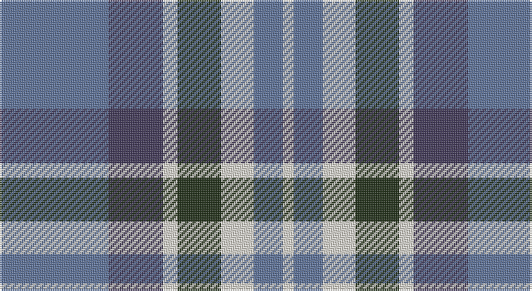

This page is one **sett** — a single exact thread-count. It belongs to the [tartan](/setts/t30dp15w4dg12w9t8w3/)
(the same proportion at any scale), whose colour order is pattern [BBWGWBW](/stripes/bbwgwbw/).

Part of the [Newall](/tartans/newall/) tartan — the named design grouping this sett with its other cloths.

Sourced from register-of-tartans.  It is a [7 stripe tartan](/stripes/stripes7/).

Original link https://www.tartanregister.gov.uk/tartanDetails.aspx?ref=10830

## Register references

External register numbers recorded for this tartan.

- Scottish Register of Tartans: [10830](https://www.tartanregister.gov.uk/tartanDetails.aspx?ref=10830)

## Thread count
B/60 N30 W8 K24 W18 B16 W/6

One full sett is **258 threads**.

## Palette

Palette: <strong>Tartan Register</strong> <small style="color:#888">(1 of 4 colours)</small>
<table><thead><tr><th>Colour</th><th>Threads</th><th>Shade</th><th>Base</th><th>OKLCh</th></tr></thead><tbody><tr><td>B/</td><td style="text-align:right;font-variant-numeric:tabular-nums">60</td><td><code style="background-color:#5F749C;">#5F749C</code> <small style="color:#888">#5F749C</small></td><td>B <code style="background-color:#2A418A;">#2A418A</code></td><td><small style="color:#888">oklch(55.8% 0.067 262.9)</small></td></tr><tr><td>N</td><td style="text-align:right;font-variant-numeric:tabular-nums">30</td><td><code style="background-color:#433A5A;">#433A5A</code> <small style="color:#888">#433A5A</small></td><td>B <code style="background-color:#2A418A;">#2A418A</code></td><td><small style="color:#888">oklch(37.2% 0.055 296.6)</small></td></tr><tr><td>W</td><td style="text-align:right;font-variant-numeric:tabular-nums">8</td><td><code style="background-color:#E5E0D2;">#E5E0D2</code> <small style="color:#888">#E5E0D2</small></td><td>W <code style="background-color:#F7F7F7;">#F7F7F7</code></td><td><small style="color:#888">oklch(90.7% 0.020 90.6)</small></td></tr><tr><td>K</td><td style="text-align:right;font-variant-numeric:tabular-nums">24</td><td><code style="background-color:#23321B;">#23321B</code> <small style="color:#888">#23321B</small></td><td>G <code style="background-color:#006100;">#006100</code></td><td><small style="color:#888">oklch(29.7% 0.045 135.3)</small></td></tr><tr><td>W</td><td style="text-align:right;font-variant-numeric:tabular-nums">18</td><td><code style="background-color:#E5E0D2;">#E5E0D2</code> <small style="color:#888">#E5E0D2</small></td><td>W <code style="background-color:#F7F7F7;">#F7F7F7</code></td><td><small style="color:#888">oklch(90.7% 0.020 90.6)</small></td></tr><tr><td>B</td><td style="text-align:right;font-variant-numeric:tabular-nums">16</td><td><code style="background-color:#5F749C;">#5F749C</code> <small style="color:#888">#5F749C</small></td><td>B <code style="background-color:#2A418A;">#2A418A</code></td><td><small style="color:#888">oklch(55.8% 0.067 262.9)</small></td></tr><tr><td>W/</td><td style="text-align:right;font-variant-numeric:tabular-nums">6</td><td><code style="background-color:#E5E0D2;">#E5E0D2</code> <small style="color:#888">#E5E0D2</small></td><td>W <code style="background-color:#F7F7F7;">#F7F7F7</code></td><td><small style="color:#888">oklch(90.7% 0.020 90.6)</small></td></tr></tbody></table>

# Sample pattern

## Nearest tartans

The nearest existing variants by ΔTartan distance, with this tartan at the top so the swatches line up against it.

ΔTartan

Tartan

Sett

—

<a href="/ttd/edit/#slug=t30dp15w4dg12w9t8w3~x2">Newall (Dumbarton) (Personal)</a> <a class="nn-out" href="/variants/s7/t30dp15w4dg12w9t8w3~x2/" title="open its dictionary page">↗</a>

0.91

<a href="/ttd/edit/#slug=b30dt15lb4dg12lb9b8lb3~x2&amp;base=t30dp15w4dg12w9t8w3~x2">Newall (Personal)</a> <a class="nn-out" href="/variants/s7/b30dt15lb4dg12lb9b8lb3~x2/" title="open its dictionary page">↗</a>

1.09

<a href="/ttd/edit/#slug=dt7w3dt2w6dt16t26r4~x2&amp;base=t30dp15w4dg12w9t8w3~x2">Keela (Corporate)</a> <a class="nn-out" href="/variants/s7/dt7w3dt2w6dt16t26r4~x2/" title="open its dictionary page">↗</a>

1.15

<a href="/ttd/edit/#slug=k3lb10db2g6db18g2~x2&amp;base=t30dp15w4dg12w9t8w3~x2">Crombie House Check</a> <a class="nn-out" href="/variants/s6/k3lb10db2g6db18g2~x2/" title="open its dictionary page">↗</a>

1.16

<a href="/ttd/edit/#slug=k11t38r11g11k5~x2&amp;base=t30dp15w4dg12w9t8w3~x2">All as One (Corporate)</a> <a class="nn-out" href="/variants/s5/k11t38r11g11k5~x2/" title="open its dictionary page">↗</a>

1.18

<a href="/ttd/edit/#slug=o19k2w4k2n5k2n5~x2&amp;base=t30dp15w4dg12w9t8w3~x2">Kyle Tartan</a> <a class="nn-out" href="/variants/s7/o19k2w4k2n5k2n5~x2/" title="open its dictionary page">↗</a>

1.19

<a href="/ttd/edit/#slug=r9w5t57k5t9r29k18w9&amp;base=t30dp15w4dg12w9t8w3~x2">Yale College of Wrexham (Corporate)</a> <a class="nn-out" href="/variants/s8/r9w5t57k5t9r29k18w9/" title="open its dictionary page">↗</a>

1.19

<a href="/ttd/edit/#slug=b23dt18w5dt2r14dt18~x2&amp;base=t30dp15w4dg12w9t8w3~x2">Pitt (Name)</a> <a class="nn-out" href="/variants/s6/b23dt18w5dt2r14dt18~x2/" title="open its dictionary page">↗</a>

1.22

<a href="/ttd/edit/#slug=db3g21db3o21db35w3~x2&amp;base=t30dp15w4dg12w9t8w3~x2">Donnolly</a> <a class="nn-out" href="/variants/s6/db3g21db3o21db35w3~x2/" title="open its dictionary page">↗</a>

1.25

<a href="/ttd/edit/#slug=db9ly9db9t23r3~x2&amp;base=t30dp15w4dg12w9t8w3~x2">Tilburg (District)</a> <a class="nn-out" href="/variants/s5/db9ly9db9t23r3~x2/" title="open its dictionary page">↗</a>

1.28

<a href="/ttd/edit/#slug=r4t28k6lb12k12lo3~x2&amp;base=t30dp15w4dg12w9t8w3~x2">MacTavish Dress</a> <a class="nn-out" href="/variants/s6/r4t28k6lb12k12lo3~x2/" title="open its dictionary page">↗</a>

## Neighbour map

Every grey dot is one of 14360 variants placed by the first two principal components of the ΔTartan feature space (44% of its variance). Red is this tartan; blue dots are its nearest — click one to open its page.

<svg viewBox="0 0 640 380" role="img" style="max-width:100%;height:auto;border:1px solid #e0e0e0;border-radius:4px;display:block" xmlns="http://www.w3.org/2000/svg"><image href="/nn/cloud.v1.png" width="640" height="380"/><a href="/variants/s7/b30dt15lb4dg12lb9b8lb3~x2/"><circle cx="215.4" cy="216.3" r="4" fill="#3465a4"><title>Newall (Personal)</title></circle></a><a href="/variants/s7/dt7w3dt2w6dt16t26r4~x2/"><circle cx="213.0" cy="182.8" r="4" fill="#3465a4"><title>Keela (Corporate)</title></circle></a><a href="/variants/s6/k3lb10db2g6db18g2~x2/"><circle cx="226.8" cy="209.5" r="4" fill="#3465a4"><title>Crombie House Check</title></circle></a><a href="/variants/s5/k11t38r11g11k5~x2/"><circle cx="228.1" cy="232.4" r="4" fill="#3465a4"><title>All as One (Corporate)</title></circle></a><a href="/variants/s7/o19k2w4k2n5k2n5~x2/"><circle cx="255.1" cy="189.1" r="4" fill="#3465a4"><title>Kyle Tartan</title></circle></a><a href="/variants/s8/r9w5t57k5t9r29k18w9/"><circle cx="225.3" cy="167.9" r="4" fill="#3465a4"><title>Yale College of Wrexham (Corporate)</title></circle></a><a href="/variants/s6/b23dt18w5dt2r14dt18~x2/"><circle cx="223.4" cy="234.9" r="4" fill="#3465a4"><title>Pitt (Name)</title></circle></a><a href="/variants/s6/db3g21db3o21db35w3~x2/"><circle cx="264.6" cy="208.1" r="4" fill="#3465a4"><title>Donnolly</title></circle></a><a href="/variants/s5/db9ly9db9t23r3~x2/"><circle cx="194.3" cy="246.6" r="4" fill="#3465a4"><title>Tilburg (District)</title></circle></a><a href="/variants/s6/r4t28k6lb12k12lo3~x2/"><circle cx="167.8" cy="188.3" r="4" fill="#3465a4"><title>MacTavish Dress</title></circle></a><circle cx="213.7" cy="207.4" r="5" fill="#c00000"/></svg>

ID: /variants/s7/t30dp15w4dg12w9t8w3~x2/
