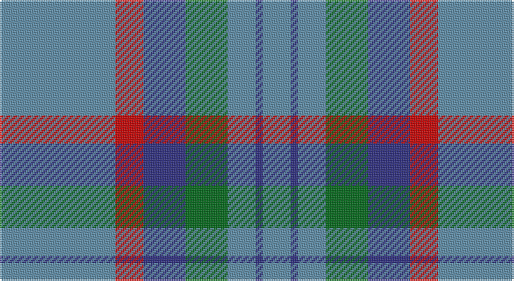

This page is one **sett** — a single exact thread-count. It belongs to the [tartan](/setts/t33r8db12g12t8db2t8/)
(the same proportion at any scale), whose colour order is pattern [BBBGBRB](/stripes/bbbgbrb/).

Part of the [Bermuda](/tartans/bermuda/) tartan — the named design grouping this sett with its other cloths.

Sourced from tartans-authority.  It is a [7 stripe tartan](/stripes/stripes7/).

Original link http://www.tartansauthority.com/tartan-ferret/display/696/

## Provenance

Earliest known date: 1962 The original Bermuda Plaid was designed by Peter Macarthur Limited of Hamilton, Scotland in 1962 and was marketed on the island by Trimmingham Bros., Ltd. The colours represent the Sky, the Sea, the Coral and the Cedar trees which grow on the island. Bermuda is a British Dependant Territory. (Source: District Tartans, P Smith and G Teall, 1992)

## Also known as

This cloth is also recorded under:

- Bermuda Blue
- Bermuda Plaid
- Bermuda, Blue
- Bermuda, Plaid

4 attestations — the source records this cloth was collapsed from (oldest owns this page)

<ul>
<li>1947 — Bermuda Plaid (1947) (District) (tartans-authority, <a href="http://www.tartansauthority.com/tartan-ferret/display/696/">record</a>)</li>
<li>01/01/1962 — Bermuda Plaid (1962) (register-of-tartans, <a href="https://www.tartanregister.gov.uk/tartanDetails.aspx?ref=254">record</a>)</li>
<li>undated — Bermuda, Plaid (weddslist, <a href="http://www.weddslist.com/cgi-bin/tartans/pg.pl?source=sts">record</a>)</li>
<li>undated — Bermuda Plaid District Tartan (house-of-tartan, <a href="http://www.house-of-tartan.scotland.net/house/TartanViewjs.asp?colr=Def&tnam=696">record</a>)</li>
</ul>

## Register references

External register numbers recorded for this tartan.

- Scottish Register of Tartans: [254](https://www.tartanregister.gov.uk/tartanDetails.aspx?ref=254)
- Scottish Tartans Authority (ITI): 696
- Scottish Tartans World Register: 696

## Thread count
B/66 R16 DB24 G24 B16 DB4 B/16

One full sett is **250 threads**.

## Palette

Palette: <strong>Tartan Register</strong>
<table><thead><tr><th>Colour</th><th>Threads</th><th>Shade</th><th>Base</th><th>OKLCh</th></tr></thead><tbody><tr><td>B/</td><td style="text-align:right;font-variant-numeric:tabular-nums">66</td><td><code style="background-color:#5C8CA8;">#5C8CA8</code> <small style="color:#888">#5C8CA8</small></td><td>B <code style="background-color:#2A418A;">#2A418A</code></td><td><small style="color:#888">oklch(61.7% 0.067 235.0)</small></td></tr><tr><td>R</td><td style="text-align:right;font-variant-numeric:tabular-nums">16</td><td><code style="background-color:#C80000;">#C80000</code> <small style="color:#888">#C80000</small></td><td>R <code style="background-color:#CC0000;">#CC0000</code></td><td><small style="color:#888">oklch(52.3% 0.215 29.2)</small></td></tr><tr><td>DB</td><td style="text-align:right;font-variant-numeric:tabular-nums">24</td><td><code style="background-color:#2C2C80;">#2C2C80</code> <small style="color:#888">#2C2C80</small></td><td>B <code style="background-color:#2A418A;">#2A418A</code></td><td><small style="color:#888">oklch(35.0% 0.138 276.6)</small></td></tr><tr><td>G</td><td style="text-align:right;font-variant-numeric:tabular-nums">24</td><td><code style="background-color:#006818;">#006818</code> <small style="color:#888">#006818</small></td><td>G <code style="background-color:#006100;">#006100</code></td><td><small style="color:#888">oklch(45.0% 0.142 145.0)</small></td></tr><tr><td>B</td><td style="text-align:right;font-variant-numeric:tabular-nums">16</td><td><code style="background-color:#5C8CA8;">#5C8CA8</code> <small style="color:#888">#5C8CA8</small></td><td>B <code style="background-color:#2A418A;">#2A418A</code></td><td><small style="color:#888">oklch(61.7% 0.067 235.0)</small></td></tr><tr><td>DB</td><td style="text-align:right;font-variant-numeric:tabular-nums">4</td><td><code style="background-color:#2C2C80;">#2C2C80</code> <small style="color:#888">#2C2C80</small></td><td>B <code style="background-color:#2A418A;">#2A418A</code></td><td><small style="color:#888">oklch(35.0% 0.138 276.6)</small></td></tr><tr><td>B/</td><td style="text-align:right;font-variant-numeric:tabular-nums">16</td><td><code style="background-color:#5C8CA8;">#5C8CA8</code> <small style="color:#888">#5C8CA8</small></td><td>B <code style="background-color:#2A418A;">#2A418A</code></td><td><small style="color:#888">oklch(61.7% 0.067 235.0)</small></td></tr></tbody></table>

# Sample pattern

## Compared to the master

This cloth is one sett of its design; the master sett (the exemplar the design is anchored on) is below for comparison.

<figure style="margin:0"><figcaption style="color:#888;font-size:smaller">this sett</figcaption></figure>
<figure style="margin:0"><figcaption style="color:#888;font-size:smaller"><a href="/setts/b12r4db4b42r6b6db11b6dg19b8r4b6db6/">master sett →</a></figcaption></figure>

## Nearest tartans

The nearest existing variants by ΔTartan distance, with this tartan at the top so the swatches line up against it.

ΔTartan

Tartan

Sett

—

<a href="/ttd/edit/#slug=t33r8db12g12t8db2t8~x2">Bermuda Plaid (1947) (District)</a> <a class="nn-out" href="/variants/s7/t33r8db12g12t8db2t8~x2/" title="open its dictionary page">↗</a>

1.16

<a href="/ttd/edit/#slug=dt3t14dt3o16dt34r3~x2&amp;base=t33r8db12g12t8db2t8~x2">Thorburn (Lochcarron)</a> <a class="nn-out" href="/variants/s6/dt3t14dt3o16dt34r3~x2/" title="open its dictionary page">↗</a>

1.28

<a href="/ttd/edit/#slug=o8ly4o35db2t8db2o4db21o4~x2&amp;base=t33r8db12g12t8db2t8~x2">Bedford Academy (Corporate)</a> <a class="nn-out" href="/variants/s9/o8ly4o35db2t8db2o4db21o4~x2/" title="open its dictionary page">↗</a>

1.31

<a href="/ttd/edit/#slug=db3r3g18db16w2db26r3g3~x2&amp;base=t33r8db12g12t8db2t8~x2">MacHardy</a> <a class="nn-out" href="/variants/s8/db3r3g18db16w2db26r3g3~x2/" title="open its dictionary page">↗</a>

1.32

<a href="/ttd/edit/#slug=y8do2y13r4y12db22y5o3~x2&amp;base=t33r8db12g12t8db2t8~x2">Kildare, County (District)</a> <a class="nn-out" href="/variants/s8/y8do2y13r4y12db22y5o3~x2/" title="open its dictionary page">↗</a>

1.37

<a href="/ttd/edit/#slug=do15r5do30b32do4lo3~x2&amp;base=t33r8db12g12t8db2t8~x2">Cameron Hunting</a> <a class="nn-out" href="/variants/s6/do15r5do30b32do4lo3~x2/" title="open its dictionary page">↗</a>

1.37

<a href="/ttd/edit/#slug=t9db2t39dt33lo2dt5~x2&amp;base=t33r8db12g12t8db2t8~x2">Port Authority of NY &amp; NJ</a> <a class="nn-out" href="/variants/s6/t9db2t39dt33lo2dt5~x2/" title="open its dictionary page">↗</a>

1.43

<a href="/ttd/edit/#slug=g8w3n6db11n30db5~x2&amp;base=t33r8db12g12t8db2t8~x2">Devlin, Craig (Personal)</a> <a class="nn-out" href="/variants/s6/g8w3n6db11n30db5~x2/" title="open its dictionary page">↗</a>

1.45

<a href="/ttd/edit/#slug=n20t2w5r2n10t5n20t2w5r5~x2&amp;base=t33r8db12g12t8db2t8~x2">Mortell (Personal)</a> <a class="nn-out" href="/variants/s10/n20t2w5r2n10t5n20t2w5r5~x2/" title="open its dictionary page">↗</a>

1.46

<a href="/ttd/edit/#slug=g13k2g34k6b16r2b16k2g13~x2&amp;base=t33r8db12g12t8db2t8~x2">Lockhart</a> <a class="nn-out" href="/variants/s9/g13k2g34k6b16r2b16k2g13~x2/" title="open its dictionary page">↗</a>

1.46

<a href="/ttd/edit/#slug=r2g5db27g11o2~x2&amp;base=t33r8db12g12t8db2t8~x2">Hector James</a> <a class="nn-out" href="/variants/s5/r2g5db27g11o2~x2/" title="open its dictionary page">↗</a>

## Neighbour map

Every grey dot is one of 14360 variants placed by the first two principal components of the ΔTartan feature space (44% of its variance). Red is this tartan; blue dots are its nearest — click one to open its page.

<svg viewBox="0 0 640 380" role="img" style="max-width:100%;height:auto;border:1px solid #e0e0e0;border-radius:4px;display:block" xmlns="http://www.w3.org/2000/svg"><image href="/nn/cloud.v1.png" width="640" height="380"/><a href="/variants/s6/dt3t14dt3o16dt34r3~x2/"><circle cx="332.7" cy="226.1" r="4" fill="#3465a4"><title>Thorburn (Lochcarron)</title></circle></a><a href="/variants/s9/o8ly4o35db2t8db2o4db21o4~x2/"><circle cx="357.0" cy="166.0" r="4" fill="#3465a4"><title>Bedford Academy (Corporate)</title></circle></a><a href="/variants/s8/db3r3g18db16w2db26r3g3~x2/"><circle cx="360.0" cy="198.7" r="4" fill="#3465a4"><title>MacHardy</title></circle></a><a href="/variants/s8/y8do2y13r4y12db22y5o3~x2/"><circle cx="302.3" cy="207.9" r="4" fill="#3465a4"><title>Kildare, County (District)</title></circle></a><a href="/variants/s6/do15r5do30b32do4lo3~x2/"><circle cx="348.5" cy="235.0" r="4" fill="#3465a4"><title>Cameron Hunting</title></circle></a><a href="/variants/s6/t9db2t39dt33lo2dt5~x2/"><circle cx="381.2" cy="203.2" r="4" fill="#3465a4"><title>Port Authority of NY &amp; NJ</title></circle></a><a href="/variants/s6/g8w3n6db11n30db5~x2/"><circle cx="357.4" cy="242.8" r="4" fill="#3465a4"><title>Devlin, Craig (Personal)</title></circle></a><a href="/variants/s10/n20t2w5r2n10t5n20t2w5r5~x2/"><circle cx="374.5" cy="203.5" r="4" fill="#3465a4"><title>Mortell (Personal)</title></circle></a><a href="/variants/s9/g13k2g34k6b16r2b16k2g13~x2/"><circle cx="373.7" cy="213.7" r="4" fill="#3465a4"><title>Lockhart</title></circle></a><a href="/variants/s5/r2g5db27g11o2~x2/"><circle cx="378.7" cy="224.5" r="4" fill="#3465a4"><title>Hector James</title></circle></a><circle cx="346.4" cy="211.1" r="5" fill="#c00000"/></svg>

ID: /variants/s7/t33r8db12g12t8db2t8~x2/
