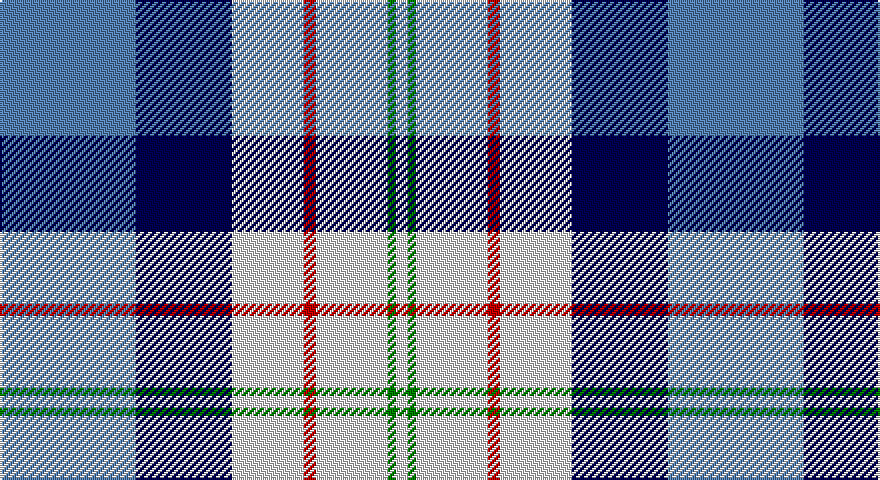

This page is one **sett** — a single exact thread-count. It belongs to the [tartan](/setts/t34db24w18r3w18g2w3/)
(the same proportion at any scale), whose colour order is pattern [BBWRWGW](/stripes/bbwrwgw/).

Part of the [Ferguson Dress](/tartans/ferguson-dress-2/) tartan — the named design grouping this sett with its other cloths.

Sourced from weddslist.  It is a [7 stripe tartan](/stripes/stripes7/).

Original link http://www.weddslist.com/cgi-bin/tartans/pg.pl?source=sts

## Provenance

Earliest known date: 1980 See also 371 where the dark blue is changed to black. These are problably one and the same tartan. Dark blue being the correct colour.

## Also known as

This cloth is also recorded under:

- Ferguson, dress

2 attestations — the source records this cloth was collapsed from (oldest owns this page)

<ul>
<li>undated — Ferguson, dress (weddslist, <a href="http://www.weddslist.com/cgi-bin/tartans/pg.pl?source=sts">record</a>)</li>
<li>undated — Ferguson Dress Clan Tartan (house-of-tartan, <a href="http://www.house-of-tartan.scotland.net/house/TartanViewjs.asp?colr=Def&tnam=92">record</a>)</li>
</ul>

## Thread count
B/68 DB48 LN36 R6 LN36 G4 LN/6

One full sett is **334 threads**.

## Palette

Palette: <strong>Tartan Dictionary</strong> <small style="color:#888">(1 of 5 colours)</small>
<table><thead><tr><th>Colour</th><th>Threads</th><th>Shade</th><th>Base</th><th>OKLCh</th></tr></thead><tbody><tr><td>B/</td><td style="text-align:right;font-variant-numeric:tabular-nums">68</td><td><code style="background-color:#5480B0;">#5480B0</code> <small style="color:#888">#5480B0</small></td><td>B <code style="background-color:#2A418A;">#2A418A</code></td><td><small style="color:#888">oklch(58.8% 0.089 251.5)</small></td></tr><tr><td>DB</td><td style="text-align:right;font-variant-numeric:tabular-nums">48</td><td><code style="background-color:#000050;">#000050</code> <small style="color:#888">#000050</small></td><td>B <code style="background-color:#2A418A;">#2A418A</code></td><td><small style="color:#888">oklch(19.5% 0.135 264.1)</small></td></tr><tr><td>LN</td><td style="text-align:right;font-variant-numeric:tabular-nums">36</td><td><code style="background-color:#E0E0E0;">#E0E0E0</code> <small style="color:#888">#E0E0E0</small></td><td>W <code style="background-color:#F7F7F7;">#F7F7F7</code></td><td><small style="color:#888">oklch(90.7% 0.000 89.9)</small></td></tr><tr><td>R</td><td style="text-align:right;font-variant-numeric:tabular-nums">6</td><td><code style="background-color:#C00000;">#C00000</code> <small style="color:#888">#C00000</small></td><td>R <code style="background-color:#CC0000;">#CC0000</code></td><td><small style="color:#888">oklch(50.7% 0.208 29.2)</small></td></tr><tr><td>LN</td><td style="text-align:right;font-variant-numeric:tabular-nums">36</td><td><code style="background-color:#E0E0E0;">#E0E0E0</code> <small style="color:#888">#E0E0E0</small></td><td>W <code style="background-color:#F7F7F7;">#F7F7F7</code></td><td><small style="color:#888">oklch(90.7% 0.000 89.9)</small></td></tr><tr><td>G</td><td style="text-align:right;font-variant-numeric:tabular-nums">4</td><td><code style="background-color:#008000;">#008000</code> <small style="color:#888">#008000</small></td><td>G <code style="background-color:#006100;">#006100</code></td><td><small style="color:#888">oklch(52.0% 0.177 142.5)</small></td></tr><tr><td>LN/</td><td style="text-align:right;font-variant-numeric:tabular-nums">6</td><td><code style="background-color:#E0E0E0;">#E0E0E0</code> <small style="color:#888">#E0E0E0</small></td><td>W <code style="background-color:#F7F7F7;">#F7F7F7</code></td><td><small style="color:#888">oklch(90.7% 0.000 89.9)</small></td></tr></tbody></table>

# Sample pattern

## Compared to the master

This cloth is one sett of its design; the master sett (the exemplar the design is anchored on) is below for comparison.

<figure style="margin:0"><figcaption style="color:#888;font-size:smaller">this sett</figcaption></figure>
<figure style="margin:0"><figcaption style="color:#888;font-size:smaller"><a href="/setts/t17k12w9m2w9g1w2/">master sett →</a></figcaption></figure>

## Nearest tartans

The nearest existing variants by ΔTartan distance, with this tartan at the top so the swatches line up against it.

ΔTartan

Tartan

Sett

—

<a href="/ttd/edit/#slug=t34db24w18r3w18g2w3~x2">Ferguson, dress</a> <a class="nn-out" href="/variants/s7/t34db24w18r3w18g2w3~x2/" title="open its dictionary page">↗</a>

0.58

<a href="/ttd/edit/#slug=w28t19dbi19w4db2lp2dbi7~x2&amp;base=t34db24w18r3w18g2w3~x2">St Andrews Dress, Earl of.. District Tartan</a> <a class="nn-out" href="/variants/s7/w28t19dbi19w4db2lp2dbi7~x2/" title="open its dictionary page">↗</a>

0.58

<a href="/ttd/edit/#slug=w28t19dbi19w4db2p2dbi7~x2&amp;base=t34db24w18r3w18g2w3~x2">St. Andrews Dress, Earl of (Danc</a> <a class="nn-out" href="/variants/s7/w28t19dbi19w4db2p2dbi7~x2/" title="open its dictionary page">↗</a>

0.69

<a href="/ttd/edit/#slug=w28t19db19w4dbi2lp2db7~x2&amp;base=t34db24w18r3w18g2w3~x2">St Andrews, Earl of, dress</a> <a class="nn-out" href="/variants/s7/w28t19db19w4dbi2lp2db7~x2/" title="open its dictionary page">↗</a>

0.81

<a href="/ttd/edit/#slug=t17k12w9m2w9g1w2~x4&amp;base=t34db24w18r3w18g2w3~x2">Ferguson Dress</a> <a class="nn-out" href="/variants/s7/t17k12w9m2w9g1w2~x4/" title="open its dictionary page">↗</a>

0.82

<a href="/ttd/edit/#slug=db68k42w32r5w32dg4w6&amp;base=t34db24w18r3w18g2w3~x2">Ferguson Dress #2</a> <a class="nn-out" href="/variants/s7/db68k42w32r5w32dg4w6/" title="open its dictionary page">↗</a>

0.87

<a href="/ttd/edit/#slug=w20db14dt14w4dbi2b2dt7~x2&amp;base=t34db24w18r3w18g2w3~x2">Earl of St. Andrews Dress</a> <a class="nn-out" href="/variants/s7/w20db14dt14w4dbi2b2dt7~x2/" title="open its dictionary page">↗</a>

0.92

<a href="/ttd/edit/#slug=t12k1t1k1t1db8w9o2~x4&amp;base=t34db24w18r3w18g2w3~x2">Arran - 1989 (Fashion)</a> <a class="nn-out" href="/variants/s8/t12k1t1k1t1db8w9o2~x4/" title="open its dictionary page">↗</a>

0.93

<a href="/ttd/edit/#slug=r2db14k6g1w12g1w2~x4&amp;base=t34db24w18r3w18g2w3~x2">Davidson (Wedding) (Personal)</a> <a class="nn-out" href="/variants/s7/r2db14k6g1w12g1w2~x4/" title="open its dictionary page">↗</a>

0.96

<a href="/ttd/edit/#slug=g4w28dp8ly2db17g4~x2&amp;base=t34db24w18r3w18g2w3~x2">Manx Dress</a> <a class="nn-out" href="/variants/s6/g4w28dp8ly2db17g4~x2/" title="open its dictionary page">↗</a>

1.03

<a href="/ttd/edit/#slug=w20db14b14w4dt2t2b7~x2&amp;base=t34db24w18r3w18g2w3~x2">Earl of St. Andrews Dress (Dance)</a> <a class="nn-out" href="/variants/s7/w20db14b14w4dt2t2b7~x2/" title="open its dictionary page">↗</a>

## Neighbour map

Every grey dot is one of 14360 variants placed by the first two principal components of the ΔTartan feature space (44% of its variance). Red is this tartan; blue dots are its nearest — click one to open its page.

<svg viewBox="0 0 640 380" role="img" style="max-width:100%;height:auto;border:1px solid #e0e0e0;border-radius:4px;display:block" xmlns="http://www.w3.org/2000/svg"><image href="/nn/cloud.v1.png" width="640" height="380"/><a href="/variants/s7/w28t19dbi19w4db2lp2dbi7~x2/"><circle cx="169.1" cy="156.3" r="4" fill="#3465a4"><title>St Andrews Dress, Earl of.. District Tartan</title></circle></a><a href="/variants/s7/w28t19dbi19w4db2p2dbi7~x2/"><circle cx="169.1" cy="156.4" r="4" fill="#3465a4"><title>St. Andrews Dress, Earl of (Danc</title></circle></a><a href="/variants/s7/w28t19db19w4dbi2lp2db7~x2/"><circle cx="173.4" cy="158.9" r="4" fill="#3465a4"><title>St Andrews, Earl of, dress</title></circle></a><a href="/variants/s7/t17k12w9m2w9g1w2~x4/"><circle cx="155.2" cy="151.5" r="4" fill="#3465a4"><title>Ferguson Dress</title></circle></a><a href="/variants/s7/db68k42w32r5w32dg4w6/"><circle cx="159.6" cy="149.0" r="4" fill="#3465a4"><title>Ferguson Dress #2</title></circle></a><a href="/variants/s7/w20db14dt14w4dbi2b2dt7~x2/"><circle cx="128.5" cy="172.8" r="4" fill="#3465a4"><title>Earl of St. Andrews Dress</title></circle></a><a href="/variants/s8/t12k1t1k1t1db8w9o2~x4/"><circle cx="155.4" cy="143.3" r="4" fill="#3465a4"><title>Arran - 1989 (Fashion)</title></circle></a><a href="/variants/s7/r2db14k6g1w12g1w2~x4/"><circle cx="148.7" cy="139.6" r="4" fill="#3465a4"><title>Davidson (Wedding) (Personal)</title></circle></a><a href="/variants/s6/g4w28dp8ly2db17g4~x2/"><circle cx="180.7" cy="151.3" r="4" fill="#3465a4"><title>Manx Dress</title></circle></a><a href="/variants/s7/w20db14b14w4dt2t2b7~x2/"><circle cx="143.4" cy="182.4" r="4" fill="#3465a4"><title>Earl of St. Andrews Dress (Dance)</title></circle></a><circle cx="158.4" cy="150.7" r="5" fill="#c00000"/></svg>

ID: /variants/s7/t34db24w18r3w18g2w3~x2/
